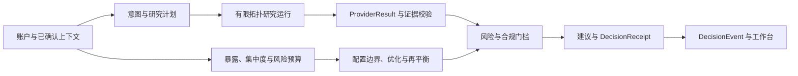

# Prism

> 同一市场，不同约束；每个调整，都能追到底层证据。

Prism 是面向同花顺 A18 赛题的个性化证券研究与决策支持工作台。它不把大语言模型当作金融事实来源，而是把用户画像、可信数据、确定性计算、风险合规和结构化研究组合成一条可审计的决策链。当前默认入口是独立的 Agent 对话首页，画像摘要作为低干扰的辅助上下文，详细研究与审计工具分设独立页面。

## 项目真源

[Prism.md](Prism.md) 是本项目的主项目文档和产品/工程总规范。实现文档用于解释如何落实其中的约束，不另建 `PROJECT.md`，也不替代 `Prism.md`。

## 产品切入点

首次进入必须完成正式的 19 题投资者风险测评，确认后默认进入 Agent 对话首页，后续首页不再展示问卷完成度。用户可以直接描述持仓疑问、研究目标或风险顾虑，也可以在对话中补充投资目标、资金期限、流动性需求和回撤顾虑；对话补充只能收紧正式风险边界，不能提高风险测评等级。组合、标的研究、决策记录和画像管理均保留为独立页面。

核心决策链仍以“科技基金集中持仓体检”为第一条完整纵切：

1. 用户导入持仓并确认风险、期限、流动性和禁投约束；
2. 系统穿透基金/ETF 暴露，识别行业、风格和资产集中；
3. 宏观、行业、个股和基金研究节点并行取得结构化证据；
4. 确定性组合与风险引擎计算调整前后的影响；
5. 系统给出守稳、均衡、进取三种调整区间，并可生成确定性再平衡行动计划；
6. 任意建议都可追溯到 `Recommendation -> Finding -> Fact -> Evidence`，并显示冲突、缺失和失效条件。

用户选择 Prism 的理由不是“Agent 更多”，而是能看见：哪一条个人约束改变了结果、最小需要调整什么、风险改善了多少，以及这项判断何时不再成立。Copilot 的自然语言交互只是入口和解释层，核心金融算术、证据闭环和风险闸门仍由确定性服务执行。

## 当前状态

2026-09-08 的本地执行范围和验收边界如下；不再用历史阶段完成率表示生产就绪程度。

| 范围 | 实现状态 | 当前证据 | 尚待验收 |
|---|---|---|---|
| 持仓与调仓 | 服务端持久化、现金下限、整手与费用、交易后完整风险复核 | 原文五只股票与现金账户已浏览器复测 | 全局最优求解、真实成交与回测 |
| 真实数据 | LIVE 扶摇行情及问财查询，独立能力降级与重新验证 | 扶摇真实请求；问财 OpenAPI smoke test | 问财配额、留存/展示授权与长期 SLA |
| 本地部署 | 可选账户认证、owner 权限、访问审计、SQLite 备份恢复、可选 PostgreSQL | 本地契约、真实 HTTP 与 PG 17.11 隔离回归 | 公网身份服务、防篡改审计、云同步 |
| 画像与记忆 | 原文有据的提取提案、冲突审阅、历史记忆检索 | 离线规则与模型故障注入测试、页面入口 | 真实模型通用语言与相关性质量 |
| P3 进阶 | X6 画布与流水线卡片、版本保存、有界 MOCK 执行；黑板预览确认及结构化事实核验 | 页面及版本/超时/漂移/事实冲突回归 | 任意真实投研节点及自然语言逐句幻觉识别 |

部署说明见 [本地运行与维护](docs/local-deployment.md)，逐项状态见 [剩余缺口执行清单](docs/plans/2026-09-08-gap-closure.md)。正式 PPT、视频和提交版测试报告不在本轮范围内。

## 历史阶段记录

以下描述对应各阶段完成时的能力和限制，测试数保留为历史记录；当前状态以本页上表及执行清单为准。

已实现：

- 独立 Git 仓库与 Python 工程基础；
- Evidence/Fact/Finding/Recommendation 的首版领域契约；
- 决策链闭包、缺失数据语义和可行动建议约束测试；
- 架构 ADR、复用矩阵和分阶段实施计划；
- Provider Protocol、四态结果不变量、确定性语义指纹、脱敏与合成 Fixture Provider。
- Phase 2 用户画像契约、确定性问卷评分、结构化提取冲突确认，以及 owner 隔离的持仓/基金穿透原始导入契约。
- Phase 3 已实现基于 Decimal 的直接/基金穿透暴露与数据覆盖结果。
- Phase 4 已实现基于暴露结果的集中度指标与画像条件风险预算；在该阶段相关性、优化和推荐仍未实现。
- Phase 5 已实现画像条件 allocation envelope、逐约束前后影响和失效条件；在该阶段最终 Recommendation、研究 DAG 编排、相关性和优化仍未实现。
- Phase 6 已实现四态结构化研究节点、lineage-aware Cross-Validation 与冲突/缺失语义；真实 Provider、DAG 执行器和 Evidence/Finding 连接仍未实现。
- Phase 7 已实现 owner 隔离、依赖闭包、预算/deadline、required/optional 降级和可回放的研究 run 状态机；真实异步执行、Provider 与 Evidence/Finding 桥接仍未实现。
- Phase 8 已实现 CrossValidationResult、ResearchObservation 与 Evidence 的确定性闭包校验，并只在完整支持条件下生成稳定 `VERIFIED Fact -> Finding`；Recommendation、独立合规闸门和真实执行仍未实现。
- Phase 9 已实现注入式 Fixture-backed 异步研究执行：ready 节点并行、依赖门控、四态 Provider 映射、预算边界和 Evidence/Observation 输出；真实 SkillHub、CrossValidation 自动接线、风险合规和 Recommendation 仍未实现。
- Phase 10 已实现 run-aware 研究证据流水线：完整 run 才能将两条独立 lineage 的支持结论接入 Phase 8，并生成闭合 DecisionTrace；partial/failed/empty、冲突和缺失均保持待复核/阻断。
- Phase 11 已实现独立风险/合规闸门：画像、研究证据、风险预算与 allocation envelope 必须跨模块闭合；缺披露保持待复核，保证收益/目标收益和篡改输入会阻断。闸门只输出后续建议资格，仍不生成 Recommendation。
- Phase 12 已实现确定性 Recommendation Composer 与 Decision Receipt：双 PASS 后无 breach 只生成当前权重 HOLD，完整 breach 只生成带 breach 闭合的 REDUCE；回执绑定画像、持仓/风险/研究/gate/证据和规则版本并自校验 hash。API、持久化和 UI 在 Phase 13 接入。
- Phase 13 已实现 owner-scoped SQLite 决策事件持久化、FastAPI 健康/写入/列表/详情边界和首个可解释工作台切片；真实认证、PostgreSQL 和真实 Provider 仍未实现。
- Phase 14 已实现 API 触发的 fixture-first Advisor 纵切：结构化风险问卷与持仓进入 Profile→Exposure→Risk Budget→Allocation→Research→Evidence/Finding→双闸门→HOLD/REDUCE→Decision Receipt，并以幂等 DecisionEvent 返回；固定 `generated_at` 支持确定性重放。
- Phase 14 的脱敏 fixture 覆盖 BALANCED/HOLD、CONSERVATIVE/REDUCE 与研究退化 REVIEW_REQUIRED；工作台可读取并展开新事件，不展示原始 Provider 或私有持仓。
- Phase 14 已通过 `238` 项全量回归、打包/边界检查、100 次确定性并发复核和真实浏览器验收；当前 worktree `HEAD` 在本地接受，未推送。
- Phase 15 已把 Advisor Query 接成结构化表单工作台：模板按 owner 重绑定，表单触发既有
  fixture-first 纵切，支持 BALANCED/HOLD、CONSERVATIVE/REDUCE、回执复用和 Evidence
  展开；`243` 项回归与真实浏览器路径已通过，仍明确是离线合成演示。
- Phase 16 已把四类研究职责落成可复用矩阵：Macro、Industry、Stock、ETF/Fund
  各有双 lineage 来源，8 个节点有界并行执行后形成 8 条 Evidence、4 个 Fact 和
  4 个 Finding；`257` 项回归、100 次并发与边界审查通过，真实 Provider 仍未接入。
- Phase 17 已把四轨道矩阵接入 owner-scoped API 与 Research Tracks 工作台：模板锚点、
  READY/REVIEW/BLOCKED 节点状态、独立 lineage 验证和 Finding → Fact → Evidence
  展开均复用既有 pipeline；研究结果不写入 DecisionEvent，也不产生 Recommendation。
  `264` 项回归、100 次 API 重放、真实浏览器 owner 隔离与 Advisor HOLD/REDUCE 回归通过。
- Phase 18 已把同一 owner-scoped Advisor 模板中的 Portfolio 持仓快照和 Risk Profile
  问卷上下文接入旗舰工作台：显示 bundle/snapshot/questionnaire 身份、持仓与基金穿透
  原值，并在 owner 切换或异步失败时清空旧上下文；不新增计算、CRUD、交易或外部
  Provider。`267` 项回归、100 次模板重放、真实浏览器 Portfolio/Risk/Advisor/Research
  路径和静态边界审查通过。
- Phase 19 已加入可重复的本地早期负载测试骨架：`template`、`research`、`advisor`
  三场景通过 `asyncio`/`httpx.ASGITransport` 输出 P50/P95/P99、错误分类、owner
  闭合和 DecisionEvent 副作用；100 并发合成基线已记录，但不外推为真实外部 SLA。
  `276` 项回归、CLI smoke、打包和边界审查通过。
- Phase 20 已加入严格的结构化 Portfolio/Risk Profile 会话确认：粘贴的
  `PortfolioImportBundle` 与 `RiskQuestionnaire` 先经 owner 闭合、敏感/额外字段和
  timezone 校验，再进入既有 Advisor 纵切；确认不写库，实际 Advisor Receipt 绑定
  用户提交的 bundle/snapshot。工作台在 owner 切换或失败时清空确认状态；真实账户
  上传、认证、Provider、LLM 与生产持久化仍未实现。`283` 项回归、真实浏览器路径、
  本地 100 并发基线和打包边界审查已通过。
- Phase 21 已加入 9 个固定 `eval_cases/` 与版本化 `mvp-evaluation-report.v1`：覆盖
  HOLD/REDUCE 个性化差异、集中度/穿透缺失、Provider 降级/冲突和 owner/时间拒绝，
  支持最多 100 次语义回放；`288` 项回归和本地 fixture 评测通过。报告不代表市场
  准确率、投资收益或真实部署 SLA。
- Phase 22 已加入显式 `advisor-intent-request.v1` 与只读
  `advisor-plan-response.v1`：用户可在 Advisor 工作台选择科技暴露复核或组合风险
  复核，预览复用既有 Macro/Industry/Stock/ETF-Fund 四轨道的确定性任务计划，再
  显式运行原有 HOLD/REDUCE 纵切；计划不运行 Provider、不写 DecisionEvent，也不把
  自然语言或 LLM/Gemini 当作问题理解。详见 [Intent/Plan 契约](docs/archive/intent-planning.md)。
  Phase 22 最终 `293` 项回归、100 次固定评测回放、三场景 100 并发本地基线和真实
  浏览器验收均通过；这些 fixture/ASGI 数字不代表真实市场准确率或生产 SLA。
- Phase 23 已把 Phase 2 的结构化 `ProfileExtractionProposal` 接入 Risk Profile 工作台：
  用户先预览问卷与提取值冲突，再逐项选择 `USE_QUESTIONNAIRE` 或 `USE_EXTRACTION`，
  服务端重建 draft 后生成保留冲突审计的确定性 Profile；不解析自然语言、不保存原文、
  不写 DecisionEvent。`299` 项回归、100 次评测回放、三场景 100 并发本地基线和真实
  浏览器路径均通过。详见 [画像提案契约](docs/archive/profile-proposal-confirmation.md)。
- Phase 24 已把 Research Tracks 的不确定性做成可回放工作台：场景目录覆盖基线一致、
  来源分歧、PARTIAL、EMPTY 和 FAILED；分歧显示双方 lineage Evidence，退化结果
  保留节点/run/pipeline 状态但不升级为 Fact/Finding/Recommendation。`314` 项回归、
  100 次固定评测回放、三场景 100 并发本地基线、wheel 和真实浏览器五场景路径均通过；
  这些仍是离线 fixture/ASGI 证据。详见 [研究场景契约](docs/archive/research-scenarios.md)。
- Phase 25 已把 Demo F 个股研究落成独立的 Evidence Card：两条 `COMPANY_DATA`
  lineage 经过同一 bounded run、四态 Provider、Cross-Validation 和 Evidence/Finding
  bridge，基线闭合六个财务 Fact，并以服务端 `Decimal` 规则生成现金流质量、应收占比和
  杠杆 Finding；分歧、PARTIAL、EMPTY、FAILED 保留 Evidence 与具体节点降级原因，拒绝
  Fact/Finding/风险升级。owner-scoped API 与静态工作台支持五场景回放，结果不写
  DecisionEvent、不生成 Recommendation。`325` 项回归、100 次评测回放、三场景 100
  并发本地基线、wheel、静态边界和真实浏览器路径均通过；这些仍是离线 fixture/ASGI
  证据。详见 [个股研究 Evidence Card](docs/archive/stock-research-card.md)。
- Phase 26 已把 Demo G ETF/Fund 资产研究落成独立的 Evidence Card：两条 `FUND_DATA`
  lineage 经过同一 bounded run、四态 Provider、Cross-Validation 和 Evidence/Finding
  bridge，基线闭合科技权重、前十大集中度、费率、波动、最大回撤和跟踪误差六个 Fact，
  并以服务端 `Decimal` 规则生成五类资产风险 Finding。来源分歧、PARTIAL、EMPTY、
  FAILED 保留 Evidence 与节点 reason，但不升级 Fact/Finding/风险；owner-scoped API
  与静态工作台支持五场景回放，结果不写 DecisionEvent、不生成 Recommendation。详见
  [ETF/Fund 资产研究 Evidence Card](docs/archive/fund-research-card.md)。Phase-specific `24`
  项、全量 `349` 项回归、100 次固定评测和本地 100 并发基线均通过；这些仍是离线
  fixture/ASGI 证据，不代表实时市场准确率或生产 SLA。
- Phase 27 已把 Demo H 最低可转债资产研究落成独立的 Evidence Card：两条
  `CONVERTIBLE_BOND_DATA` lineage 经过同一 bounded run、四态 Provider、
  Cross-Validation 和 Evidence/Finding bridge，基线闭合正股、转股价、转债价格、
  债底、到期收益、信用序数和流动性序数七个原始 Fact，并由服务端 deterministic
  `Decimal` 公式生成转股价值与转股溢价率，再生成可审计的风险 Finding。分歧、PARTIAL、
  EMPTY、FAILED 保留 Evidence、validation 和节点原因，不升级 Fact/Finding/风险；
  owner-scoped API 与静态工作台支持五场景回放，结果不写 DecisionEvent、不生成
  Recommendation。阶段 `28` 项、全量 `377` 项回归、100 次固定评测、本地 100 并发
  基线、wheel 与真实浏览器路径均通过；这些仍是离线 fixture/ASGI 证据，不代表实时
  市场准确率或生产 SLA。详见 [可转债资产研究 Evidence Card](docs/archive/convertible-bond-research-card.md)。
- Phase 28 已把 Portfolio Engine 的第一版目标结构提案落成独立的确定性纵切：基于已确认
  Risk Profile、Portfolio Exposure/Concentration 和 Risk Budget，以
  `CAP_AND_REDISTRIBUTE_V1` 生成当前→目标权重、资产/行业/Technology 约束算术和失效
  条件；基线、不同画像、PARTIAL 与 INFEASIBLE 场景均保持 owner 隔离且不写
  DecisionEvent、不生成 Recommendation 或交易指令。阶段 `21` 项、全量 `398` 项回归、
  100 次固定评测、并发、wheel、静态边界和真实浏览器验收通过；这些仍是离线
  fixture/ASGI 证据，不代表相关性/流动性最优、实时市场准确率或生产 SLA。详见
  [Portfolio Optimization 契约](docs/archive/portfolio-optimization.md)。
- Phase 29 已加入 owner-scoped、不可变、可审计的结构化 Context Memory：只保存已确认的
  Risk Questionnaire/Profile、Portfolio bundle/snapshot 与可选 Intent/Plan/研究/优化
  引用，服务端派生 `memory_id`/SHA-256 `content_hash`，SQLite 迁移可跨重启读取，工作台
  支持刷新后读取与显式恢复；恢复会清空旧派生结果并要求重新运行，不保存聊天原文、Prompt、
  Provider/LLM 输出或凭据。阶段 `19` 项、全量 `417` 项回归、100 owner 并发/重启、wheel
  和真实浏览器验收通过；本地 fixture/ASGI 数字不代表生产认证、云同步或外部 SLA。详见
  [Context Memory 契约](docs/archive/context-memory.md)。
- Phase 30 已加入显式 Provider Cache/Fallback 边界：按公开 request fingerprint 做有界
  fresh cache、一次备用 Provider 与 stale grace，保留四态结果、provider/source/lineage
  身份并将 stale Evidence 降级为不可 VERIFIED；私人、敏感、EMPTY、FAILED 结果不进入
  公共缓存。阶段 `14` 项、全量 `431` 项回归、100 次固定评测、resilience 并发、wheel、
  静态边界与真实浏览器回归通过；仍不宣称实时 SkillHub 或生产缓存/SLA。详见
  [Provider Cache/Fallback 契约](docs/archive/provider-cache-fallback.md)。
- Phase 31 已加入并验收 Advanced Evidence UI：只聚合当前 owner 已
  加载的 Advisor、Research Matrix、Stock、Fund 和 Convertible Bond trace，支持按
  Evidence/source/field、质量、serving mode、轨道与闭合状态筛选，并在详情展示
  provider、source、lineage、observed/retrieved、cache age 与 Finding → Fact → Evidence
  路径。stale/fallback/未闭合结果显式保持需复核，不改后端契约、不新增网络或推荐旁路；
  `434` 项回归、固定评测、resilience 回归、wheel、静态边界与真实本地浏览器验收通过。
  详见 [Advanced Evidence UI 契约](docs/archive/advanced-evidence-ui.md) 与
  [Phase 31 计划与验收](docs/plans/2026-09-02-mvp-phase-31-advanced-evidence-ui.md)。
- Phase 32 已加入并验收中文工作台与稳定左侧导航：静态和动态用户文案统一为中文，
  状态/场景/方法说明保留可审计的稳定代码标识；点击导航、`hashchange` 和直接打开
  hash 均同步 `.active` 与 `aria-current="location"`，不改变 API、Provider、Evidence
  或稳定枚举契约。`436` 项回归、固定评测、resilience、wheel、静态边界与真实本地
  浏览器验收通过，外部请求与 console error 均为 `[]`。详见
  [Phase 32 中文 UI 与导航计划](docs/plans/2026-09-02-mvp-phase-32-ui-localization-navigation.md)
  与 [Phase 32 独立审查](docs/reviews/2026-09-02-phase-32-ui-localization-navigation-review.md)。
- Phase 33 Scenario Simulation 已实现并验收：从已确认画像/持仓出发，提供四个固定的
  fixture-first 假设场景（基线、科技上限收紧、头部资产减少 10 个百分点、基金穿透
  部分缺失），输出确定性基线→模拟差异；模拟值与 Fact/Finding/Recommendation/
  DecisionEvent 分离，并保持 `READY/REVIEW_REQUIRED/BLOCKED` 降级语义。详见
  [情景模拟契约](docs/archive/scenario-simulation.md) 与
  [Phase 33 计划与验收](docs/plans/2026-09-02-mvp-phase-33-scenario-simulation.md)。
- Phase 34–37 P2 能力已实现并验收：历史建议支持不可变回溯、同 owner 回执对比和审计
  差分；组合再平衡支持 Decimal 守恒、0.50% deadband、换手上限和先卖后买的流动性
  排序；评测看板执行版本化 `eval_cases/` 并汇总通过率、证据覆盖、幻觉率和延迟分位数；
  高级可解释性生成确定性因果 DAG、关键驱动归因、反事实条件和失效触发器。详见
  [P2 四项里程碑计划](docs/plans/2026-09-02-mvp-phase-34-to-37-p2-milestones.md)。
- Phase 38 已将默认首页收敛为 Copilot 任务中心：支持三层信息架构、三个示例画像、
  组合体检/标的研究/智能调仓三个核心任务、自然语言问题路由、L2 决策卡和一键跳转的
  L3 专家审计；自定义画像、持仓输入、浏览器端会话记录和响应式布局也已接入。
- Agent 首页已完成第二轮信息架构收敛：对话成为唯一主操作面，行为画像与解释偏好降级为
  右侧辅助信息；首次使用由服务端已确认问卷快照实施强制准入，完成后不再显示问卷进度；
  对话内画像补充采用正式测评上限作为确定性边界。
- Phase 39 已加入可选的 OpenAI-compatible 流式 LLM 客户端（可配置 DeepSeek、OpenAI、
  Qwen-compatible endpoint）、ReAct 工具调用、个股/ETF 查询、问财语义 Provider
  适配器和自然语言持仓解析。未配置 API key 时使用本地确定性模拟；该阶段自动化验证主要覆盖合成与故障注入路径。
- P3 已增量实现固定研究 DAG 的画布与流水线卡片、事实黑板、前提预览确认及结构化事实/禁投核验；完整范围仍按 TODO 分项验收。设计目标见 [系统总体技术架构与方案设计规范](docs/architecture.md)。
- 个性化投顾完整纵切已接入：行为证据画像与 C1–C5 适当性、owner 隔离的截图确认链、
  对话展示策略和只返回文本的研发辅助骨架。实现边界、接口和验证矩阵见
  [个性化投顾智能体纵切技术说明](docs/behavior-profile-ocr-and-dev-assist.md)。


## 当前限制与待补齐

- 问财 OpenAPI 已使用服务端凭据完成真实查询 smoke test；适配器仍保留失败降级。配额、留存、展示/再分发授权和长期 SLA 尚未验收。
- 持仓 OCR 的证券简称到交易所代码补全直接核对上交所、深交所官方证券目录，不要求下载端配置供应商密钥；该目录只证明证券身份，不提供或替代真实行情、财务和行业数据。
- LIVE 行情与基金披露走扶摇服务端接口；失败返回具体安全错误码，不以静态价格冒充成功。MOCK 仍使用静态合成底稿。基金披露是报告期持仓，不是实时基金交易账户。
- 远程 LLM 仅在配置后调用。自然语言画像和语义检索包含明确标注的有限规则降级，真实模型质量仍需按实际模型验收。浏览器不缓存或回读明文密钥；Windows 本地认证模式使用 DPAPI 保护的 owner-scoped 持久化，未认证或非 Windows 页面配置仅在当前服务进程内有效。
- 本地账户默认启用，提供注册、登录、退出、修改密码、持久会话及服务端 owner 隔离；管理员仅能通过本地命令创建。旧 HTTP Basic 仅作显式兼容，本地账户仍不替代公网身份服务与生产安全网关，本地审计也不具备独立防篡改保证。
- 已确认风险问卷和持仓可跨刷新、重启恢复；历史上下文可按来源检索，但没有跨设备同步或无限长期对话记忆。券商账户同步不在当前范围内。
- 调仓已计算费用、整手股数、现金下限和调整后风险；仍缺少基于历史数据的协方差、流动性压力、回测和全局约束优化。候选交易未解除全部风险时保留 REVIEW_REQUIRED。所有测算为 ADVISORY_ONLY，不执行真实交易。
- 本地真实 HTTP 100 并发持仓读取已观测，外部数据服务的 100 并发、3 秒响应及长期 99.9% 可用性仍未验证。固定评测、ASGI 或短时 HTTP 样本不代表市场准确率或生产 SLA。
- 工作流目前只开放固定八节点合成研究的依赖与位置，双视图共用图模型；事实黑板检测前提漂移并核对指定结构化字段及明确禁投冲突，不宣称识别所有自然语言幻觉。完整 P3 规划仍有未实现部分。
- 复用许可、评分附录和上游数据使用条款仍按 TODO 核对；当前交付为本地可运行代码，不宣称生产部署条件全部满足。

## 核心不变量

- 金融事实必须可追溯；
- 金融算术必须确定性执行；
- 缺失数据必须保持缺失；
- LLM 推断不得冒充金融事实；
- 用户画像必须实质影响建议；
- 风险与合规独立于建议生成；
- Provider 失败必须显式降级；
- 每项能力必须有新鲜测试证据。
Prism 是面向同花顺 A18 赛题的个性化证券研究与决策支持工作台。系统接收已确认的投资者画像、投资组合和研究意图，组织数据提供方、研究任务、证据校验、确定性组合计算、风险与合规检查，并返回可追踪的研究结果与决策回执。

金融事实保留来源、期间、观察时间和数据状态；金额、权重、暴露、集中度、风险预算、配置边界、情景差异和再平衡数量由 Python 确定性服务计算；LLM 负责意图、槽位和自然语言表达。建议生成前经过独立风险与合规门槛，系统不调用交易接口。

## 文档与依据

| 文档 | 用途 |
| --- | --- |
| [Prism.md](Prism.md) | 项目目标、总体约束和产品工程规范 |
| [项目技术文档](docs/submission/competition-technical-solution.md) | 面向评审的需求、功能展示、核心技术、组合案例与效果验证 |
| [技术设计文档](docs/submission/technical-report.md) | 当前模块、接口、数据规则、部署结构、测试方法和系统边界 |
| [系统总体架构](docs/architecture.md) | 模块分层、运行流程和页面设计资料 |
| [本地部署与数据维护](docs/local-deployment.md) | 账户、凭据、数据库、备份、真实 HTTP 观测和工作流维护 |
| [问财 LIVE 数据接入说明](docs/iwencai-live-provider.md) | 问财 SkillHub 配置、九项能力探测和真实查询边界 |
| [PRD 对接指南](docs/prd-integration-guide.md) | 面向产品联调的模块、接口和数据状态说明 |
| [架构决策 ADR-0001](docs/adr/0001-modular-monolith.md) | 模块化单体的架构决策 |
| [TODO](TODO.md) / [LOG](LOG.md) | 当前执行项、验证记录和技术问题 |

## 处理链路



主投顾查询接口的依赖关系为：

```text
RiskProfile + PortfolioImportBundle
    -> Exposure / Concentration / Risk Budget / Allocation Envelope
    -> ResearchPlan / ResearchRunState
    -> Evidence / Fact / Finding
    -> Risk Gate + Compliance Gate
    -> Recommendation + DecisionReceipt
    -> DecisionEvent
```

## 已提供能力

| 能力域 | 当前实现 |
| --- | --- |
| 投资者上下文 | 19 道风险问卷、确定性风险评分、风险画像、行为事件与行为画像、结构化画像提案确认、持仓文本与图片 OCR 导入、基金和 ETF 穿透快照 |
| 研究协作 | 意图计划、宏观/行业/个股/基金/可转债研究轨道、研究节点依赖、有界 DAG 执行、超时与取消传播、研究场景和 Evidence Card |
| 证据处理 | `ProviderRequest`、`ProviderResult`、请求语义指纹、来源与数据血缘、四态结果、双来源交叉验证、`Evidence → Fact → Finding` 引用链 |
| 组合计算 | 直接与间接暴露、基金/ETF 穿透、HHI 集中度、风险预算、配置边界、目标结构计算、情景模拟、整手数量、费用、现金下限、交易后风险复核 |
| 风险与建议 | 风险门槛、合规文本检查、建议资格判定、`HOLD`/`REDUCE` 组合、确定性 `DecisionReceipt`、内容哈希和 `DecisionEvent` |
| 对话与工作台 | `/api/v1/copilot/chat` 的 SSE 对话、结构化工具调用、组合与市场页面、证据链浏览、历史回执、上下文记忆、AntV X6 工作流画布和 Lightweight Charts 图表 |
| 本地运行 | 本地账户与会话、owner 隔离、SQLite 默认存储、可选 PostgreSQL、SQLite 在线备份恢复、Windows DPAPI 凭据保护、访问审计 |

## 运行状态

Prism 将数据内容状态、送达方式和证据质量分开记录。页面和接口必须依据状态处理结果，不以空值代替缺失数据。

| 范围 | `MOCK` | `LIVE` |
| --- | --- | --- |
| 研究、投顾、场景和固定工作流 | 使用版本化固定数据进行演示、测试和确定性回放 | 当前完整研究矩阵、个股/基金/可转债研究、投顾主流程和固定工作流仍要求真实服务；正式路径拒绝固定演示结果 |
| A 股行情与基金披露 | 可使用固定数据 | 扶摇能力通过真实探测后提供服务端行情和报告期披露数据；缺失字段保留复核状态 |
| 组合刷新、优化与再平衡 | 可使用固定组合回放 | 同时需要已验证报价和公司/行业元数据；任一部分不可用时停止对应操作或返回复核 |
| 对话模型 | 可使用有限规则路径 | 由页面个人模型设置或服务端环境配置兼容 OpenAI API 的模型；金融事实需要结构化工具结果 |
| 海外市场 | 可按配置使用公开数据源 | 默认由 Yahoo Finance 和港股资讯网适配器按配置提供；iFinD 仅支持显式注入。各路径按权限、标的和数据完整性返回结果，无法核验时显示 `UNAVAILABLE` |

数据提供方结果使用以下四态：

| 状态 | 含义 | 后续处理 |
| --- | --- | --- |
| `SUCCESS` | 记录存在且请求必需字段完整 | 可归一化为 `VERIFIED` 证据 |
| `PARTIAL` | 记录存在，但存在字段缺失或结构化问题 | 可展示，保留缺失字段并进入复核 |
| `EMPTY` | 查询范围明确且没有记录 | 保留空结果，不写入推测数值 |
| `FAILED` | 请求、鉴权、额度、网络或解析失败 | 返回结构化问题，进入备用来源、旧缓存、复核或阻断路径 |

提供方送达方式包括 `DIRECT`、`CACHE_FRESH`、`FALLBACK_PROVIDER` 和 `CACHE_STALE_FALLBACK`。旧缓存归一化为 `STALE`，不能形成 `VERIFIED` 事实。风险与合规门槛使用 `PASS`、`REVIEW_REQUIRED` 和 `BLOCKED`。

## 本地运行

运行环境要求 64 位 Python 3.11 或 3.12，当前 `pyproject.toml` 约束为 `>=3.11,<3.13`。

### Windows

双击 `start.bat`，或在 PowerShell 中执行：

```powershell
.\start.bat
```

启动脚本会选择 Python 3.12 或 3.11，创建 `.venv`，检查并安装 Web 运行依赖，然后启动 Uvicorn。手动安装开发依赖：

```powershell
py -3.12 -m venv .venv
.venv\Scripts\python.exe -m pip install -e ".[dev,web]"
.venv\Scripts\python.exe -m uvicorn app.api.main:app --host 127.0.0.1 --port 8000
```

### macOS

```bash
uv sync --extra dev --extra web
./start_mac.sh
```

也可以使用已有的 `uv` 环境：

```bash
uv run uvicorn app.api.main:app --host 127.0.0.1 --port 8000
```

启动后访问：

| 地址 | 用途 |
| --- | --- |
| [http://127.0.0.1:8000/](http://127.0.0.1:8000/) | Prism 工作台 |
| [http://127.0.0.1:8000/api/docs](http://127.0.0.1:8000/api/docs) | OpenAPI 文档 |
| [http://127.0.0.1:8000/api/health](http://127.0.0.1:8000/api/health) | 进程、数据模式和能力摘要 |

### 开发预览

需要独立的无认证演示环境时执行：

```powershell
.venv\Scripts\python.exe tools\dev_preview.py --fresh --port 8874
```

该入口使用独立 SQLite 和显式 `PRISM_DEV_NO_AUTH=true`。仅在本机开发时使用；`X-Owner-ID` 在此模式下只承担对象隔离作用。

## 配置与数据目录

Windows 的 `start.bat` 会读取仓库根目录中被 Git 忽略的 `.env`，并将其中的服务端变量注入当前进程。macOS 和 Linux 请在当前 shell 中设置同名环境变量；`start_mac.sh` 不会读取 `.env`。完整配置和维护命令见[本地部署与数据维护](docs/local-deployment.md)。

| 配置 | 默认或示例 | 用途 |
| --- | --- | --- |
| `PRISM_DB_PATH` | `data/private/prism.sqlite3` | SQLite 数据库路径 |
| `PRISM_DATABASE_URL` | 未设置 | 可选 PostgreSQL 连接；设置后优先使用 PostgreSQL |
| `PRISM_SECRET_STORE_PATH` | `data/private/prism-secrets.json` | Windows DPAPI 保护的本地凭据文件 |
| `PRISM_DEV_NO_AUTH` | `false` | 显式开启无认证开发预览 |
| `HITHINK_FINANCE_API_KEY` | 未设置 | 扶摇服务端凭据 |
| `IWENCAI_API_KEY` / `IWENCAI_BASE_URL` | 未设置 / `https://openapi.iwencai.com` | 问财 OpenAPI 服务端凭据和地址 |
| `WENCAI_SKILLHUB_CONTRACT_VERIFIED` | `false` | 问财响应规则人工确认开关 |
| `PRISM_LLM_API_KEY`、`DEEPSEEK_API_KEY` 等 | 未设置 | 服务端默认模型配置；个人模型可在页面设置 |

供应商密钥不进入前端、业务数据库、日志或 Git。Windows 页面输入的个人模型密钥由当前账户的 DPAPI 保护；其他系统的页面输入仅在当前服务进程内有效。

问财凭据可由维护者使用：

```powershell
.venv\Scripts\python.exe -m tools.wencai_setup
.venv\Scripts\python.exe -m tools.wencai_setup --configure
```

保存后重新启动服务。配置成功仍需通过真实查询和响应规则检查，单项能力失败时保留对应失败状态。

## 主要接口

OpenAPI 文档位于 `/api/docs`。以下路径是当前主要联调入口，完整列表以 `app/api/main.py` 和 OpenAPI 输出为准。

| 接口 | 用途 |
| --- | --- |
| `GET /api/health` | 检查进程、数据模式和运行时能力摘要 |
| `GET/POST /api/v1/auth/*` | 本地账户注册、登录、退出和密码修改 |
| `GET/PUT /api/v1/runtime/data-mode` | 读取或切换 `MOCK` / `LIVE` 数据模式 |
| `GET /api/v1/runtime/capability-gaps` | 查看当前真实能力、缺失字段和验证条件 |
| `GET/PUT/POST /api/v1/runtime/wencai-settings*` | 问财配置、保存和九项技能测试 |
| `GET/POST /api/v1/advisor/profile/*` | 问卷模板、画像预览、确认和摘要 |
| `GET/PUT /api/v1/advisor/portfolio/current` | 读取或保存当前组合 |
| `POST /api/v1/advisor/portfolio/refresh` | 使用已验证提供方刷新组合字段 |
| `POST /api/v1/advisor/queries` | 执行结构化投顾查询并返回研究、门槛和回执 |
| `POST /api/v1/copilot/chat` | 投顾对话、工具进度和 SSE 流式响应 |
| `POST /api/v1/copilot/parse-portfolio`、`/parse-portfolio-ocr` | 解析文本或图片中的持仓草稿 |
| `GET /api/v1/market/catalog`、`/quotes/{market}`、`/analysis/{market}/{index_id}` | 市场指数目录、行情和技术分析 |
| `GET /api/v1/advisor/research-matrix-template`、`POST /api/v1/advisor/research-runs` | 研究矩阵模板和运行 |
| `GET/POST /api/v1/advisor/stock-research-*`、`fund-research-*`、`convertible-bond-research-*` | 个股、基金和可转债研究卡 |
| `GET /api/v1/advisor/portfolio-optimization-template`、`POST /api/v1/advisor/portfolio-optimization-runs` | 目标结构和约束计算 |
| `GET /api/v1/advisor/rebalancing-template`、`POST /api/v1/advisor/rebalancing-runs` | 整手、费用、现金和交易后风险测算 |
| `GET/POST /api/v1/advisor/context-memory*` | 显式上下文记忆保存、读取和检索 |
| `GET/POST /api/v1/decision-events*` | 决策事件列表、详情和幂等写入 |
| `GET/POST /api/v1/advisor/workflow*` | 固定研究工作流读取、保存和运行 |

认证模式下，服务端根据登录账户绑定 `owner_id`；请求体、路径或 `X-Owner-ID` 不能改变账户归属。无认证开发模式只适合本机预览。

## 测试与构建

Windows 使用项目虚拟环境执行：

```powershell
.venv\Scripts\python.exe -m pytest
.venv\Scripts\python.exe -m tools.evaluate_mvp --json --repeat 3
.venv\Scripts\python.exe -m compileall app tools
node --check app/api/static/app.js
npm run build:workflow
npm run build:markdown
git diff --check
```

macOS 先执行 `uv sync --extra dev --extra web`，再使用 `uv run` 执行 Python 模块命令。需要真实 PostgreSQL 验证时，显式设置专用测试 DSN 后执行：

```powershell
.venv\Scripts\python.exe -m pytest tests/integration/test_postgres_store.py
```

macOS 命令为：

```bash
uv run pytest tests/integration/test_postgres_store.py
```

`tools/evaluate_mvp.py` 使用 `eval_cases/` 和固定输入执行确定性回放，不访问网络、不调用模型，也不写入用户决策事件。`httpx.ASGITransport` 负载结果属于进程内测试；`tools/http_load_test.py` 才通过 TCP/HTTP 观测已经运行的服务。两类结果均不能单独证明外部数据准确率、长期可用性或生产服务等级。

浏览器脚本的默认地址与应用启动地址可能不同：`tests/browser/test_agent_home.mjs` 默认使用 `8017`，部分 Playwright 工具默认使用 `8777`，可分别由 `PRISM_TEST_BASE_URL` 和 `PRISM_UI_BASE_URL` 覆盖。Windows 运行 `test_agent_home.mjs` 前需要检查脚本中的浏览器可执行文件配置。

## 当前边界

| 边界 | 当前说明 |
| --- | --- |
| 真实研究覆盖 | 完整投顾、研究矩阵、个股/基金/可转债研究、预设情景和固定工作流仍以固定数据路径为主；实时研究开放前需要真实字段、独立来源和运行时能力证据 |
| 数据服务 | 扶摇、问财、Yahoo Finance 和港股资讯网按当前配置提供数据；iFinD 为可显式注入的兼容适配器。各提供方受凭据、额度、权限、接口稳定性和展示授权影响，运行时按能力项返回状态 |
| 组合计算 | 已提供暴露、集中度、风险预算、目标结构、情景和再平衡计算；协方差、流动性压力、历史回测和全局约束求解仍待补充 |
| 模型质量 | 自然语言画像提取、语义记忆排序和对话表达依赖实际模型配置；金融数值和风险资格不由模型裁决 |
| 外部副作用 | 组合优化和再平衡只返回 `ADVISORY_ONLY` 测算及行动计划，不同步券商账户、不生成订单、不执行交易 |
| 部署安全 | 当前重点是本地账户、owner 隔离、受保护凭据、SQLite/PostgreSQL 和访问审计；公网身份服务、独立防篡改审计、限流、共享缓存和长期监控需要部署方单独建设 |

## 代码目录

| 路径 | 职责 |
| --- | --- |
| `app/api/` | FastAPI 应用工厂、路由、请求响应模型和错误映射 |
| `app/profile/` | 风险问卷、画像评分、行为画像和展示数据 |
| `app/portfolio/`、`app/risk/`、`app/allocation/` | 持仓输入、暴露、集中度、风险预算和配置边界 |
| `app/orchestration/`、`app/research/` | 研究计划、有限 DAG 运行、交叉验证和证据桥接 |
| `app/gates/`、`app/recommendation/` | 风险与合规门槛、建议组合和决策回执 |
| `app/providers/` | 问财、扶摇、行情、行业、海外数据和缓存策略 |
| `app/store/`、`app/security/`、`app/runtime/` | 持久化、迁移、账户安全、密钥保护和运行模式 |
| `app/api/static/` | HTML、CSS、JavaScript、图表和工作流前端资源 |
| `tests/` | 单元、接口、集成、数据规则和安全边界测试 |
| `tools/` | 回放评测、负载观测、备份恢复、凭据测试和前端资源构建 |

Prism 当前用于研究与决策支持。页面展示和组合测算不构成证券投资建议，任何真实交易均需由用户依据适用法律、账户规则和独立审查自行决定。
