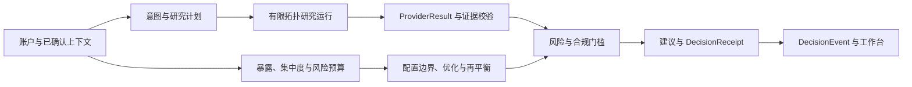

# Prism

Prism 是面向同花顺 A18 赛题的个性化证券研究与决策支持工作台。系统接收已确认的投资者画像、投资组合和研究意图，组织数据提供方、研究任务、证据校验、确定性组合计算、风险与合规检查，并返回可追踪的研究结果与决策回执。

金融事实保留来源、期间、观察时间和数据状态；金额、权重、暴露、集中度、风险预算、配置边界、情景差异和再平衡数量由 Python 确定性服务计算；LLM 负责意图、槽位和自然语言表达。建议生成前经过独立风险与合规门槛，系统不调用交易接口。

## 文档与依据

| 文档 | 用途 |
| --- | --- |
| [Prism.md](Prism.md) | 项目目标、总体约束和产品工程规范 |
| [技术设计文档](docs/submission/technical-report.md) | 当前模块、接口、数据规则、部署结构、测试方法和系统边界 |
| [系统总体架构](docs/architecture.md) | 模块分层、运行流程和页面设计资料 |
| [本地部署与数据维护](docs/local-deployment.md) | 账户、凭据、数据库、备份、真实 HTTP 观测和工作流维护 |
| [问财 LIVE 数据接入说明](docs/iwencai-live-provider.md) | 问财 SkillHub 配置、九项能力探测和真实查询边界 |
| [PRD 对接指南](docs/prd-integration-guide.md) | 面向产品联调的模块、接口和数据状态说明 |
| [架构决策 ADR-0001](docs/adr/0001-modular-monolith.md) | 模块化单体的架构决策 |
| [TODO](TODO.md) / [LOG](LOG.md) | 当前执行项、验证记录和技术问题 |

## 处理链路



主投顾查询接口的依赖关系为：

```text
RiskProfile + PortfolioImportBundle
    -> Exposure / Concentration / Risk Budget / Allocation Envelope
    -> ResearchPlan / ResearchRunState
    -> Evidence / Fact / Finding
    -> Risk Gate + Compliance Gate
    -> Recommendation + DecisionReceipt
    -> DecisionEvent
```

## 已提供能力

| 能力域 | 当前实现 |
| --- | --- |
| 投资者上下文 | 19 道风险问卷、确定性风险评分、风险画像、行为事件与行为画像、结构化画像提案确认、持仓文本与图片 OCR 导入、基金和 ETF 穿透快照 |
| 研究协作 | 意图计划、宏观/行业/个股/基金/可转债研究轨道、研究节点依赖、有界 DAG 执行、超时与取消传播、研究场景和 Evidence Card |
| 证据处理 | `ProviderRequest`、`ProviderResult`、请求语义指纹、来源与数据血缘、四态结果、双来源交叉验证、`Evidence → Fact → Finding` 引用链 |
| 组合计算 | 直接与间接暴露、基金/ETF 穿透、HHI 集中度、风险预算、配置边界、目标结构计算、情景模拟、整手数量、费用、现金下限、交易后风险复核 |
| 风险与建议 | 风险门槛、合规文本检查、建议资格判定、`HOLD`/`REDUCE` 组合、确定性 `DecisionReceipt`、内容哈希和 `DecisionEvent` |
| 对话与工作台 | `/api/v1/copilot/chat` 的 SSE 对话、结构化工具调用、组合与市场页面、证据链浏览、历史回执、上下文记忆、AntV X6 工作流画布和 Lightweight Charts 图表 |
| 本地运行 | 本地账户与会话、owner 隔离、SQLite 默认存储、可选 PostgreSQL、SQLite 在线备份恢复、Windows DPAPI 凭据保护、访问审计 |

## 运行状态

Prism 将数据内容状态、送达方式和证据质量分开记录。页面和接口必须依据状态处理结果，不以空值代替缺失数据。

| 范围 | `MOCK` | `LIVE` |
| --- | --- | --- |
| 研究、投顾、场景和固定工作流 | 使用版本化固定数据进行演示、测试和确定性回放 | 当前完整研究矩阵、个股/基金/可转债研究、投顾主流程和固定工作流仍要求真实服务；正式路径拒绝固定演示结果 |
| A 股行情与基金披露 | 可使用固定数据 | 扶摇能力通过真实探测后提供服务端行情和报告期披露数据；缺失字段保留复核状态 |
| 组合刷新、优化与再平衡 | 可使用固定组合回放 | 同时需要已验证报价和公司/行业元数据；任一部分不可用时停止对应操作或返回复核 |
| 对话模型 | 可使用有限规则路径 | 由页面个人模型设置或服务端环境配置兼容 OpenAI API 的模型；金融事实需要结构化工具结果 |
| 海外市场 | 可按配置使用公开数据源 | 默认由 Yahoo Finance 和港股资讯网适配器按配置提供；iFinD 仅支持显式注入。各路径按权限、标的和数据完整性返回结果，无法核验时显示 `UNAVAILABLE` |

数据提供方结果使用以下四态：

| 状态 | 含义 | 后续处理 |
| --- | --- | --- |
| `SUCCESS` | 记录存在且请求必需字段完整 | 可归一化为 `VERIFIED` 证据 |
| `PARTIAL` | 记录存在，但存在字段缺失或结构化问题 | 可展示，保留缺失字段并进入复核 |
| `EMPTY` | 查询范围明确且没有记录 | 保留空结果，不写入推测数值 |
| `FAILED` | 请求、鉴权、额度、网络或解析失败 | 返回结构化问题，进入备用来源、旧缓存、复核或阻断路径 |

提供方送达方式包括 `DIRECT`、`CACHE_FRESH`、`FALLBACK_PROVIDER` 和 `CACHE_STALE_FALLBACK`。旧缓存归一化为 `STALE`，不能形成 `VERIFIED` 事实。风险与合规门槛使用 `PASS`、`REVIEW_REQUIRED` 和 `BLOCKED`。

## 本地运行

运行环境要求 64 位 Python 3.11 或 3.12，当前 `pyproject.toml` 约束为 `>=3.11,<3.13`。

### Windows

双击 `start.bat`，或在 PowerShell 中执行：

```powershell
.\start.bat
```

启动脚本会选择 Python 3.12 或 3.11，创建 `.venv`，检查并安装 Web 运行依赖，然后启动 Uvicorn。手动安装开发依赖：

```powershell
py -3.12 -m venv .venv
.venv\Scripts\python.exe -m pip install -e ".[dev,web]"
.venv\Scripts\python.exe -m uvicorn app.api.main:app --host 127.0.0.1 --port 8000
```

### macOS

```bash
uv sync --extra dev --extra web
./start_mac.sh
```

也可以使用已有的 `uv` 环境：

```bash
uv run uvicorn app.api.main:app --host 127.0.0.1 --port 8000
```

启动后访问：

| 地址 | 用途 |
| --- | --- |
| [http://127.0.0.1:8000/](http://127.0.0.1:8000/) | Prism 工作台 |
| [http://127.0.0.1:8000/api/docs](http://127.0.0.1:8000/api/docs) | OpenAPI 文档 |
| [http://127.0.0.1:8000/api/health](http://127.0.0.1:8000/api/health) | 进程、数据模式和能力摘要 |

### 开发预览

需要独立的无认证演示环境时执行：

```powershell
.venv\Scripts\python.exe tools\dev_preview.py --fresh --port 8874
```

该入口使用独立 SQLite 和显式 `PRISM_DEV_NO_AUTH=true`。仅在本机开发时使用；`X-Owner-ID` 在此模式下只承担对象隔离作用。

## 配置与数据目录

Windows 的 `start.bat` 会读取仓库根目录中被 Git 忽略的 `.env`，并将其中的服务端变量注入当前进程。macOS 和 Linux 请在当前 shell 中设置同名环境变量；`start_mac.sh` 不会读取 `.env`。完整配置和维护命令见[本地部署与数据维护](docs/local-deployment.md)。

| 配置 | 默认或示例 | 用途 |
| --- | --- | --- |
| `PRISM_DB_PATH` | `data/private/prism.sqlite3` | SQLite 数据库路径 |
| `PRISM_DATABASE_URL` | 未设置 | 可选 PostgreSQL 连接；设置后优先使用 PostgreSQL |
| `PRISM_SECRET_STORE_PATH` | `data/private/prism-secrets.json` | Windows DPAPI 保护的本地凭据文件 |
| `PRISM_DEV_NO_AUTH` | `false` | 显式开启无认证开发预览 |
| `HITHINK_FINANCE_API_KEY` | 未设置 | 扶摇服务端凭据 |
| `IWENCAI_API_KEY` / `IWENCAI_BASE_URL` | 未设置 / `https://openapi.iwencai.com` | 问财 OpenAPI 服务端凭据和地址 |
| `WENCAI_SKILLHUB_CONTRACT_VERIFIED` | `false` | 问财响应规则人工确认开关 |
| `PRISM_LLM_API_KEY`、`DEEPSEEK_API_KEY` 等 | 未设置 | 服务端默认模型配置；个人模型可在页面设置 |

供应商密钥不进入前端、业务数据库、日志或 Git。Windows 页面输入的个人模型密钥由当前账户的 DPAPI 保护；其他系统的页面输入仅在当前服务进程内有效。

问财凭据可由维护者使用：

```powershell
.venv\Scripts\python.exe -m tools.wencai_setup
.venv\Scripts\python.exe -m tools.wencai_setup --configure
```

保存后重新启动服务。配置成功仍需通过真实查询和响应规则检查，单项能力失败时保留对应失败状态。

## 主要接口

OpenAPI 文档位于 `/api/docs`。以下路径是当前主要联调入口，完整列表以 `app/api/main.py` 和 OpenAPI 输出为准。

| 接口 | 用途 |
| --- | --- |
| `GET /api/health` | 检查进程、数据模式和运行时能力摘要 |
| `GET/POST /api/v1/auth/*` | 本地账户注册、登录、退出和密码修改 |
| `GET/PUT /api/v1/runtime/data-mode` | 读取或切换 `MOCK` / `LIVE` 数据模式 |
| `GET /api/v1/runtime/capability-gaps` | 查看当前真实能力、缺失字段和验证条件 |
| `GET/PUT/POST /api/v1/runtime/wencai-settings*` | 问财配置、保存和九项技能测试 |
| `GET/POST /api/v1/advisor/profile/*` | 问卷模板、画像预览、确认和摘要 |
| `GET/PUT /api/v1/advisor/portfolio/current` | 读取或保存当前组合 |
| `POST /api/v1/advisor/portfolio/refresh` | 使用已验证提供方刷新组合字段 |
| `POST /api/v1/advisor/queries` | 执行结构化投顾查询并返回研究、门槛和回执 |
| `POST /api/v1/copilot/chat` | 投顾对话、工具进度和 SSE 流式响应 |
| `POST /api/v1/copilot/parse-portfolio`、`/parse-portfolio-ocr` | 解析文本或图片中的持仓草稿 |
| `GET /api/v1/market/catalog`、`/quotes/{market}`、`/analysis/{market}/{index_id}` | 市场指数目录、行情和技术分析 |
| `GET /api/v1/advisor/research-matrix-template`、`POST /api/v1/advisor/research-runs` | 研究矩阵模板和运行 |
| `GET/POST /api/v1/advisor/stock-research-*`、`fund-research-*`、`convertible-bond-research-*` | 个股、基金和可转债研究卡 |
| `GET /api/v1/advisor/portfolio-optimization-template`、`POST /api/v1/advisor/portfolio-optimization-runs` | 目标结构和约束计算 |
| `GET /api/v1/advisor/rebalancing-template`、`POST /api/v1/advisor/rebalancing-runs` | 整手、费用、现金和交易后风险测算 |
| `GET/POST /api/v1/advisor/context-memory*` | 显式上下文记忆保存、读取和检索 |
| `GET/POST /api/v1/decision-events*` | 决策事件列表、详情和幂等写入 |
| `GET/POST /api/v1/advisor/workflow*` | 固定研究工作流读取、保存和运行 |

认证模式下，服务端根据登录账户绑定 `owner_id`；请求体、路径或 `X-Owner-ID` 不能改变账户归属。无认证开发模式只适合本机预览。

## 测试与构建

Windows 使用项目虚拟环境执行：

```powershell
.venv\Scripts\python.exe -m pytest
.venv\Scripts\python.exe -m tools.evaluate_mvp --json --repeat 3
.venv\Scripts\python.exe -m compileall app tools
node --check app/api/static/app.js
npm run build:workflow
npm run build:markdown
git diff --check
```

macOS 先执行 `uv sync --extra dev --extra web`，再使用 `uv run` 执行 Python 模块命令。需要真实 PostgreSQL 验证时，显式设置专用测试 DSN 后执行：

```powershell
.venv\Scripts\python.exe -m pytest tests/integration/test_postgres_store.py
```

macOS 命令为：

```bash
uv run pytest tests/integration/test_postgres_store.py
```

`tools/evaluate_mvp.py` 使用 `eval_cases/` 和固定输入执行确定性回放，不访问网络、不调用模型，也不写入用户决策事件。`httpx.ASGITransport` 负载结果属于进程内测试；`tools/http_load_test.py` 才通过 TCP/HTTP 观测已经运行的服务。两类结果均不能单独证明外部数据准确率、长期可用性或生产服务等级。

浏览器脚本的默认地址与应用启动地址可能不同：`tests/browser/test_agent_home.mjs` 默认使用 `8017`，部分 Playwright 工具默认使用 `8777`，可分别由 `PRISM_TEST_BASE_URL` 和 `PRISM_UI_BASE_URL` 覆盖。Windows 运行 `test_agent_home.mjs` 前需要检查脚本中的浏览器可执行文件配置。

## 当前边界

| 边界 | 当前说明 |
| --- | --- |
| 真实研究覆盖 | 完整投顾、研究矩阵、个股/基金/可转债研究、预设情景和固定工作流仍以固定数据路径为主；实时研究开放前需要真实字段、独立来源和运行时能力证据 |
| 数据服务 | 扶摇、问财、Yahoo Finance 和港股资讯网按当前配置提供数据；iFinD 为可显式注入的兼容适配器。各提供方受凭据、额度、权限、接口稳定性和展示授权影响，运行时按能力项返回状态 |
| 组合计算 | 已提供暴露、集中度、风险预算、目标结构、情景和再平衡计算；协方差、流动性压力、历史回测和全局约束求解仍待补充 |
| 模型质量 | 自然语言画像提取、语义记忆排序和对话表达依赖实际模型配置；金融数值和风险资格不由模型裁决 |
| 外部副作用 | 组合优化和再平衡只返回 `ADVISORY_ONLY` 测算及行动计划，不同步券商账户、不生成订单、不执行交易 |
| 部署安全 | 当前重点是本地账户、owner 隔离、受保护凭据、SQLite/PostgreSQL 和访问审计；公网身份服务、独立防篡改审计、限流、共享缓存和长期监控需要部署方单独建设 |

## 代码目录

| 路径 | 职责 |
| --- | --- |
| `app/api/` | FastAPI 应用工厂、路由、请求响应模型和错误映射 |
| `app/profile/` | 风险问卷、画像评分、行为画像和展示数据 |
| `app/portfolio/`、`app/risk/`、`app/allocation/` | 持仓输入、暴露、集中度、风险预算和配置边界 |
| `app/orchestration/`、`app/research/` | 研究计划、有限 DAG 运行、交叉验证和证据桥接 |
| `app/gates/`、`app/recommendation/` | 风险与合规门槛、建议组合和决策回执 |
| `app/providers/` | 问财、扶摇、行情、行业、海外数据和缓存策略 |
| `app/store/`、`app/security/`、`app/runtime/` | 持久化、迁移、账户安全、密钥保护和运行模式 |
| `app/api/static/` | HTML、CSS、JavaScript、图表和工作流前端资源 |
| `tests/` | 单元、接口、集成、数据规则和安全边界测试 |
| `tools/` | 回放评测、负载观测、备份恢复、凭据测试和前端资源构建 |

Prism 当前用于研究与决策支持。页面展示和组合测算不构成证券投资建议，任何真实交易均需由用户依据适用法律、账户规则和独立审查自行决定。
