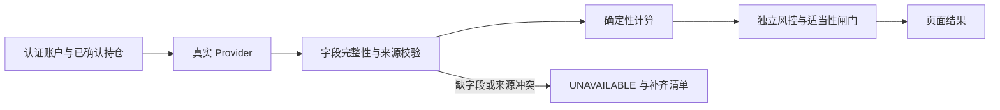

# 真实数据能力补齐清单

## 第1章 盘点结论

本清单基于 2026-09-15 的代码路径审计、运行配置存在性检查和自动化回归。当前进程环境未配置扶摇、问财、DeepSeek/OpenAI-compatible 或 PostgreSQL 凭据，因此未执行需要真实密钥的外部调用，也不将历史日志视为本次可用性证据。

正式账户已经对 Fixture、静态行情补位和 Mock AI 回答执行失败关闭。`GET /api/v1/runtime/capability-gaps` 按当前服务实例返回能力状态；状态为 `UNAVAILABLE` 的模块不得标记为真实化完成。显式开发预览仍可使用 Fixture，但必须显示 MOCK 标识。

## 第2章 外部能力缺口

| 能力 | 当前核验状态 | 缺失字段或证据 | 影响范围 | 所需接口、权限与补齐验证 |
|---|---|---|---|---|
| 证券身份识别 | `UNAVAILABLE`；仅保留用户样图涉及的两个可追溯身份快照，不构成完整目录 | 代码、名称、历史简称、市场、上市状态、目录版本和观察时间 | 未知或重名证券只能保留 OCR 草稿，不能生成正式持仓 | 接入交易所或问财证券目录权限；使用现名、历史简称、重名和退市样本验证唯一代码及来源 |
| 股票研究 | `UNAVAILABLE`；正式路由拒绝 Fixture | 同期间财报、估值历史序列、复权口径、行业基准、至少两个独立来源及观察时间 | 个股研究、研究矩阵和投顾结论不能完成 | 接入财报与历史估值接口；校验期间、单位、复权规则、来源指纹及完整字段，无缺项后再开放 |
| 基金研究 | `UNAVAILABLE`；报价或披露接口不等于完整研究服务 | 净值与基准历史、费率、报告期持仓、行业分类、披露日期、覆盖率 | ETF/基金研究、穿透暴露和组合建议不能完成 | 取得净值、基准、费率及披露持仓权限；验证时间序列长度、披露期和持仓覆盖率 |
| 可转债研究 | `UNAVAILABLE`；正式路由拒绝 Fixture | 转股价及调整条款原文、债券与正股行情、评级、到期现金流、赎回/回售条款、流动性 | 转债研究和相关组合约束不能完成 | 接入条款、行情和评级接口；逐项保存原文引用、公式输入和计算容差 |
| 研究矩阵 | `UNAVAILABLE`；默认执行器为 Fixture | 宏观、行业、股票、基金节点的完整真实结果及相互独立的来源 | 多节点交叉验证不能完成，两个同源接口不得计作双证据 | 为每个节点注入真实服务；以来源主体与数据谱系指纹验证独立性，所有必需节点完成后开放 |
| 投顾查询 | `UNAVAILABLE`；正式路由拒绝 Fixture | 完整真实研究输出、已确认画像与持仓、适当性输入及证据闭合 | 不能输出正式个性化建议 | 接入真实研究服务后运行适当性硬闸门；验证跨账户隔离、禁投冲突和证据缺失拒绝 |
| 情景分析 | `UNAVAILABLE`；当前默认服务使用 Fixture 模板 | 已确认真实持仓基线、假设参数、基准时间、冲击口径 | 不能将样例情景当作账户测算 | 注入只对真实持仓做确定性变换的服务；验证输入守恒、公式、容差并标记“假设测算” |
| 组合刷新 | `UNAVAILABLE`；当前环境无扶摇和问财凭据 | 逐项报价、币种、观察时间、证券身份、行业元数据和失败明细 | 持仓价格及暴露不能刷新 | 配置扶摇与问财权限并通过能力探测；验证超时、401、限流、空结果及部分缺字段均不回退静态数据 |
| 大盘与宏观 | `PARTIAL`；公开指数源可独立调用，但不构成完整宏观数据集或 SLA | 指数历史范围、宏观序列、单位、基准、稳定授权和观测时间一致性 | 大盘卡片可按单接口成败展示，完整大盘研究与矩阵仍不可验收 | 明确指数及宏观接口授权；以固定日期区间核验代码、时区、单位、复权和缺口处理 |
| DeepSeek 对话 | `CONFIGURATION_REQUIRED`；代码已解除与金融数据全局模式的错误绑定 | 用户或服务端 API Key、地址、模型名称、流式与工具调用契约验证 | 未配置时不能进行真实模型对话；金融工具缺失时仅能明确报告不可用 | 在个人模型设置保存密钥并执行连接测试；验证普通追问成功、工具请求强制 LIVE 且 Fixture 调用次数为零 |

## 第3章 验收规则

| 校验层 | 通过条件 | 失败处理 | 禁止行为 |
|---|---|---|---|
| 配置 | 凭据存在且能力探测通过 | 返回 `UNAVAILABLE` 和失败原因 | 以“已保存”替代“连接通过” |
| 数据 | 必需字段完整，单位与观察时间明确 | 返回缺失字段及所需接口 | 默认价格、默认行业或零值补齐 |
| 证据 | 来源可追溯且独立性契约满足 | 标记来源冲突或独立证据不足 | 同一上游的不同接口冒充双来源 |
| 计算 | 确定性公式、输入及容差可复核 | 拒绝生成正式结果 | 由 LLM 完成金融算术 |
| 账户 | owner 由服务端身份绑定，跨账户请求拒绝 | 返回 401/403/404 且不泄露资源存在性 | 信任请求体、路径或缓存中的 owner |

完成外部补齐后，应在隔离测试账户执行真实 HTTP 验证，并保存接口版本、请求时间、字段覆盖率和来源指纹。任何一项仍为 `UNAVAILABLE` 或 `PARTIAL` 时，交付结论必须继续列为未完成。
