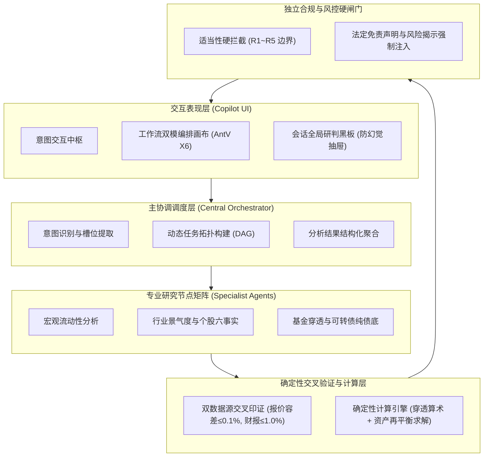
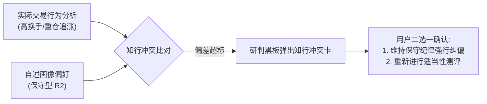
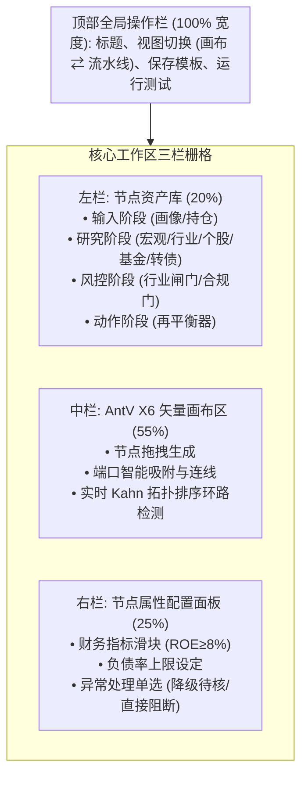
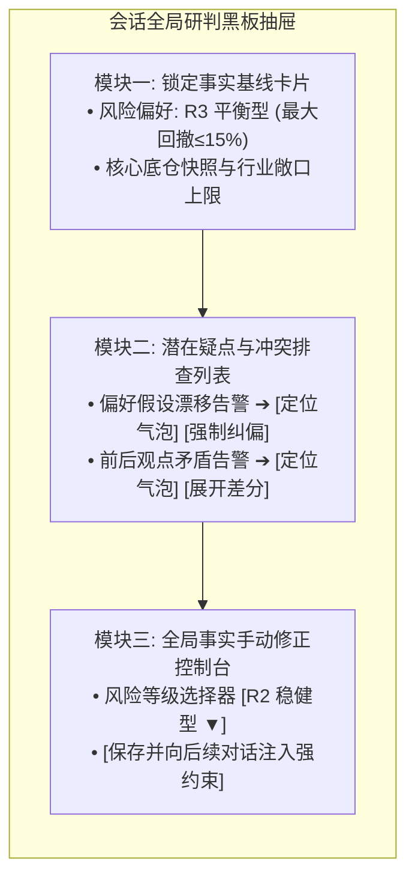

# 个性化证券投顾智能体系统技术方案与实施架构规范（PRD 对接基准）

> **文档属性**：系统总体技术架构与方案设计规范（产品经理编制 PRD 与研发落地的技术基准文档）  
> **命题来源**：全国高校计算机大赛【A18】《基于同花顺问财 SkillHub 的个性化证券投顾智能体系统设计》  
> **专项文档**：[持仓分析智能体专项技术规范](file:///Users/b./prism/docs/portfolio-analysis-agent.md)

---

## 第一章 系统定位、业务价值与用户角色

### 一、 核心痛点与系统破局

传统投顾与纯大语言模型在证券投资应用中存在固有局限：

| 维度 | 传统证券投顾软件 | 纯大语言模型 (如通用 GPT) | 本系统解决方案 |
| :--- | :--- | :--- | :--- |
| **个性化深度** | 问答模板固定，无法按个人框架组装指标。 | 无法精准调用金融数据，易生成空泛建议。 | 基于问财 SkillHub，支持自定义编排投研链路。 |
| **数据准确性** | 数据准确但缺乏交互灵活性。 | 存在计算幻觉、数字虚构与陈旧数据问题。 | 确定性算法计算财务指标，双数据源背靠背校验。 |
| **多轮一致性** | 无上下文连续推演能力。 | 轮次增加后遗忘初始设定，发生观点前后矛盾。 | 部署会话全局研判黑板，事实基线锁定，支持一键纠偏。 |
| **合规与风控** | 静态问卷测评，与实际交易脱节。 | 无适当性边界，易给出激进全仓等违规指令。 | 独立合规风控闸门硬拦截，双轨核验知行冲突。 |

### 二、 用户角色与体验分层

系统区分**业务角色（Persona）**与**投资者画像（Profile）**：业务角色决定界面入口与功能分流，投资者画像决定底层计算与风控约束。

| 业务角色 | 核心诉求 | 业务痛点 | 产品承载方案 |
| :--- | :--- | :--- | :--- |
| **新手学习型** | 寻求概念引导与通俗解释。 | 金融门槛高，容易盲目跟风。 | 开启教育模式，依序输出概念解析、风险说明与基础指标。 |
| **长期配置型** | 追求稳健收益与清晰的资产配置。 | 担心被推荐超出承受力的高风险标的。 | 执行法定适当性硬约束，输出带数据依据的配置报告。 |
| **主动交易型** | 拥有选股逻辑，关注个股与转债机会。 | 传统工具链路固化，缺乏定制排查能力。 | 支持在编排面板自主勾选分析节点与指标阈值。 |
| **专业量化型** | 自定义因子、多条件选股与组合约束。 | 工具不开放底层参数，无法实现复杂过滤。 | 开放全量 SkillHub 编排，支持多因子排序与情景回测。 |
| **高频对话型** | 针对多标的多轮推演、持续追问。 | 交流深入后 AI 容易遗忘先前提设或自我推翻。 | 常驻研判黑板，标出逻辑疑点并支持双向跳转核对。 |

---

## 第二章 系统全局架构与业务流转

### 一、 系统总体架构

系统采用分层解耦的架构模式，将自然语言理解、确定性金融计算与合规风控清晰分离：

### 二、 投顾全生命周期状态转移矩阵

业务流程由确定性状态机管控，各状态具备明确的转移守卫条件与降级规则：

| 状态阶段 | 触发动作 | 目标状态 | 转移守卫条件与前置检验 | 异常降级策略 |
| :--- | :--- | :--- | :--- | :--- |
| `IDLE` | 用户提交投顾咨询 | `PARSING` | 鉴权有效且租户会话正常。 | 抛出 401 阻断。 |
| `PARSING` | 意图与标的识别完毕 | `PLANNING` | 识别置信度 $\ge 0.75$ 且锁定核心标的。 | 置信度不足触发反问澄清浮层。 |
| `PLANNING` | 拓扑规划完成 | `EXECUTING` | 任务拓扑经 Kahn 算法校验无环路。 | 降级为单标的基础查询。 |
| `EXECUTING` | 并行数据节点返回 | `VALIDATING` | 必需数据节点取得有效响应。 | 超时标的按残缺数据标记。 |
| `VALIDATING` | 交叉比对完成 | `CALCULATING` | 双独立源指标偏差处于容差范围内。 | 分歧超标标记待人工复核。 |
| `CALCULATING`| 组合求解完成 | `AUDITING` | 调仓权重满足 100% 守恒且现金留存达标。 | 求解不可行则维持现状（`HOLD`）。 |
| `AUDITING` | 风控核验通过 | `DELIVERED` | 无夸大承诺，行业敞口合规，风险提示完备。 | 违规指令强制拦截并警示替换。 |

---

## 第三章 任务一：多维投资者画像与风控建模

### 一、 七维投资者画像模型 (7-Dimensional Profile)

系统摒弃单一的单轴分类，构建七维量化画像：

$$
InvestorProfile = F + K + B + T + I + P + S
$$

| 维度代码 | 维度名称 | 核心考察字段 | 对系统行为的控制作用 |
| :--- | :--- | :--- | :--- |
| **F** | 财务适当性 | 最大亏损容忍度、未来 12 月资金需求、投资期限、收入稳定性。 | **法定硬约束**，决定资产准入与杠杆上限。 |
| **K** | 投资知识与经验 | 股/债/基/衍生品交易年限、财报理解能力、量化知识。 | 控制产品复杂度上限与解释深度。 |
| **B** | 行为金融特征 | 损失厌恶、处置效应、过度自信、羊群效应、注意力偏差。 | 触发反偏差干预与情景模拟提示。 |
| **T** | 交易风格权重 | 平均持仓天数、换手率、集中度、12 类风格连续权重。 | 决定调用哪些分析工具与选股模型。 |
| **I** | 信息获取偏好 | 财报面、技术面、新闻舆情、社区情绪的偏好权重。 | 决定证据卡片的呈现排序与信息密度。 |
| **P** | 交互偏好 | 解释详略（教育/标准/专业）、推送频率、图表偏好。 | 控制界面呈现结构与提示节奏。 |
| **S** | 动态实时状态 | 当前组合回撤、市场情绪指数、资金压力、FOMO 状态。 | 驱动多轮对话中动态更新预警级别。 |

#### 风险承受能力与容忍度的双轨区分 (Capacity vs Tolerance)
* **客观承受能力 ($F_{\text{capacity}}$)**：由资产规模、负债率、收入稳定性与现金流需求决定，反映客观上能亏多少；
* **主观容忍度 ($F_{\text{tolerance}}$)**：由问卷自述与历史止损行为决定，反映心理上愿意亏多少；
* **从严判定准则**：两者出现分歧时（如客观资产大但心理极度厌恶亏损），系统取两者中更为保守的一方作为约束上限。

### 二、 法定适当性 R1~R5 风险底线标准

问卷综合分值 $S = \sum w_i s_i$ 映射为五级法定风控底线：

| 法定评级 | 分值区间 | 最大回撤容忍上限 | 资产配置范围与敞口上限 |
| :--- | :--- | :--- | :--- |
| **保守型 (R1)** | $[0, 20)$ | $5.0\%$ | 仅限货币基金、国债，禁止配置权益类资产。 |
| **相对保守型 (R2)**| $[20, 40)$ | $10.0\%$ | 权益资产暴露 $\le 20.0\%$，行业上限 $\le 20.0\%$。 |
| **平衡型 (R3)** | $[40, 60)$ | $15.0\%$ | 单一行业暴露 $\le 30.0\%$，单一股票 $\le 20.0\%$。 |
| **相对积极型 (R4)**| $[60, 80)$ | $25.0\%$ | 单一股票 $\le 20.0\%$，允许跨赛道积极轮动。 |
| **进取型 (R5)** | $[80, 100]$ | $35.0\%$ | 允许全行业进取配置，严格监控财务暴雷个股。 |

### 三、 十二类投资风格与行为偏差干预

系统支持复合标签并存（如长期积累型 0.7 + 质量成长型 0.6 + 损失厌恶 0.7）：

| 分类大项 | 标签与特征代码 | 核心行为特征 | 系统干预与产品调度策略 |
| :--- | :--- | :--- | :--- |
| **投资风格 (12 类)** | 新手、防守、长期、股息、价值、成长、动量、逆向、事件驱动、羊群、高频、量化。 | 涵盖从低频复利到短线高频，从基本面价值到热点驱动的投资模式。 | 动态联动问财 Skill 组合，为不同风格调配合适的研究模型与指标权重。 |
| **行为偏差 (10 项)** | 损失厌恶、处置效应、过度自信、注意力偏差、羊群跟风、近期偏差、趋势外推、盲目逆向、极端集中、追高恐惧 (FOMO)。 | 个人投资者常见的非理性心理与操作偏差。 | 触发针对性干预，包括启动决策冷静期、展示历史均值回归概率、开展估值压力测试、补充反方论据等。 |

### 四、 知行冲突检测与黑板协同仲裁

当系统观察到投资者实际交易行为与自述画像发生严重背离（例如自述为保守型 R2，但实际持仓换手率超过 400% 且追涨高波动标的）时，触发冲突仲裁机制：

> **持仓分析专项规范**：关于持仓多通道导入、公募基金底层穿透算法、HHI 集中度量化及确定性再平衡规则，详见专项文档 [docs/portfolio-analysis-agent.md](file:///Users/b./prism/docs/portfolio-analysis-agent.md)。

---

## 第四章 任务二：六大场景投顾分析与确定性规则

系统针对赛题要求的六大投顾业务场景，设立明确的量化模型与反事实翻转条件：

| 业务场景 | 分析维度与核心指标 | 确定性模型与算法公式 | 阈值规则与翻转条件 | 前端输出形式 |
| :--- | :--- | :--- | :--- | :--- |
| **大盘研判** | 沪深300 PE-TTM、十年期国债收益率 $r_f$。 | 股债利差模型计算风险溢价： $ERP = \frac{1}{PE} - r_f$ | $ERP$ 历史分位数 $\ge 80\%$ 为积极配置区；$< 20\%$ 为防御预警区。 | 全市场估值温度计与红绿指示灯。 |
| **行业配置** | 中信一级行业景气度、资金流向、动量。 | 景气度偏离度模型与画像预算上限。 | 单一行业持仓占比超 $30\%$ 触发减仓；景气度增速降至 0 以下超配转标配。 | 行业超配/标配/低配矩阵与超限警示。 |
| **个股分析** | 净资产收益率 ROE、资产负债率、现金流。 | 财务六事实硬约束网络。 | ROE $\ge 8.0\%$，负债率 $\le 60.0\%$，现金流 $>0$；指标不合规禁止激进推荐。 | 个股财务质量评分卡与脆弱标签。 |
| **基金筛选** | 跟踪误差、年化波动、最大回撤、费率。 | 底层穿透算法（Look-Through）。 | 跟踪误差 $\le 2.0\%$，近三年回撤 $\le 15.0\%$；重仓股重叠超 $60\%$ 告警。 | 重复配置交叉警示表与替代标的推荐。 |
| **可转债投资**| 转债现价 $P_b$、纯债底 $DF$、转股溢价率 $PR$。 | 转股溢价率计算： $PR = \frac{P_b - CV}{CV} \times 100\%$ | 偏离度 $P_b - DF \le 5\%$ 且 $PR \le 15\%$ 归入纯债防御型；$PR > 40\%$ 提示高溢价风险。 | 低溢价高债底安全评分卡与期权价值分析。 |
| **资产再平衡**| 组合方差贡献率、换手率约束、现金储备。 | `CAP_AND_REDISTRIBUTE` 算法。 | 偏差死区 $\pm 0.5\%$ 内保持现状；调仓严格先卖后买，现金底线 $\ge 5.0\%$。 | 调仓操作清单与前后权重对比表。 |

---

## 第五章 任务三：1+N 多智能体协作与交叉验证体系

### 一、 集中调度与专业副手矩阵

系统采用主协调智能体统筹调度专业子智能体，禁止智能体之间使用非受控的自然语言自由群聊：
* **主协调智能体 (Central Orchestrator)**：负责意图解析、任务有向无环图（DAG）规划与参数派发，最终汇总形成因果解释；
* **专业副手智能体矩阵 (Specialists)**：宏观、行业、个股、基金、转债五大副手分别挂载专属工具集，仅向总线返回结构化事实对象。

### 二、 双数据源交叉验证规则 (Cross-Validation)

对关键金融指标调度两个具备独立数据血缘的来源进行背靠背比对：

| 数据类别 | 核验指标 | 允许相对误差 | 比对通过系统动作 | 误差超限系统动作 |
| :--- | :--- | :--- | :--- | :--- |
| **行情数据** | 最新成交价、涨跌幅、成交额。 | $\le 0.1\%$ | 指标晋升为受检验事实（VERIFIED）。 | 阻断自动化流程，标红提示人工复核。 |
| **财报指标** | 净利润、营业收入、ROE、负债率。| $\le 1.0\%$ | 指标锁定并记录数据源指纹。 | 标记冲突并输出双源差分卡片。 |
| **通用数据** | 单源超时或网络异常。 | 允许 1 次重试 | 局部有效按 `PARTIAL` 降级。 | 维持缺失标记，禁止模型自行推断补齐。 |

---

## 第六章 任务四：投资建议可视化与数据溯源

### 一、 四级严密数据溯源链

系统输出的每一项结论必须具备逐级可回溯的数据凭据：

$$
\text{Recommendation (操作建议)} \longrightarrow \text{Finding (分析发现)} \longrightarrow \text{Fact (检验事实)} \longrightarrow \text{Evidence (底层证据)}
$$

用户在界面点击任何结论标签，侧边栏均可展开对应的财报报告期数、数据提供商名称与请求时间戳。

### 二、 因果驱动归因与反事实边界
* **归因展示**：明确标注建议是由行业超标、个股财务恶化还是风险等级变化驱动；
* **反事实边界提示**：系统为结论标注反转临界点。例如提示用户：“当科技板块整体占比从当前的 45% 下降至 30% 以下时，该板块的建议动作将由减仓（`REDUCE`）调整为维持现状（`HOLD`）”。

---

## 第七章 任务五：工作流可视化编排面板 (Workflow Builder)

### 一、 编排工作区布局架构与栅格规范

### 二、 双模视图切换
* **拓扑画布视图**：面向进阶用户，支持自由拖拽连线与端口吸附，连线时前端实时执行有向环路检测，发现死锁节点立即拦截；
* **阶段流水线视图**：面向大众用户，自动将有向图扁平化映射为横向四阶段卡片（输入 ➔ 研究 ➔ 风控 ➔ 调仓），支持勾选开闭与排序。

---

## 第八章 任务六：会话全局研判黑板 (Anti-Hallucination)

### 一、 研判黑板架构与三大功能卡片

研判黑板以抽屉（Drawer）形式常驻于对话界面右侧，包含三大垂直功能模块：

### 二、 核心疑点识别规则

后台规则引擎持续监听对话输出，与基线进行确定性校验：

| 疑点类型 | 触发场景 | 告警级别 | 前端提示标签 | 推荐处理动作 |
| :--- | :--- | :--- | :--- | :--- |
| **偏好假设漂移** | 模型输出超出锁定画像的激进建议。 | 警告 (Warning) | ⚠️ 偏好假设漂移 | 点击平滑滚动至该轮对话；提供一键纠偏按钮。 |
| **前后观点矛盾** | 会话内对同标的前后结论冲突且无新事实输入。 | 严重 (Error) | ❌ 观点前后矛盾 | 点击跳转定位冲突轮次，自动展开证据差异。 |
| **持仓数据篡改** | 模型引用的持仓股数或成本与初始快照不符。 | 严重 (Error) | 🚫 持仓数据不符 | 强制自动修正为用户初始快照原值。 |
| **未知数据来源** | 回复中提及未经底层数据库登记的财务数据。 | 警告 (Warning) | ❓ 来源未核验 | 标记该数字未经验证，禁止作为调仓依据。 |

---

## 第九章 基础设施：高并发、低延迟与分层记忆

### 一、 3 秒响应延迟预算分解

为保障 100 用户并发在线、单次响应小于 3 秒及可用性达到 99.9%，系统设立 P95 延迟预算分配：

| 处理环节 | 延迟上限 | 性能保障工程措施 |
| :--- | :--- | :--- |
| **请求鉴权与画像读取** | 200 ms | 本地 SQLite WAL 模式与进程内高速缓存。 |
| **意图分类与拓扑构建** | 250 ms | 轻量级槽位分类器，规避大模型长文本调度。 |
| **并行数据获取与研究计算** | 1,200 ms | 多级自适应缓存（Redis + 内存），协程全异步并发调度。 |
| **交叉校验、优化与合规** | 450 ms | 纯 Python 高性能 Decimal 运算，无外部 I/O 阻塞。 |
| **流式首字输出 (SSE)** | 600 ms | 服务端事件流式传输，首字生成控制在 300~500 ms。 |
| **网络冗余余量** | 300 ms | 动态超时重试与自适应熔断机制。 |

### 二、 三级分层记忆架构

| 记忆层级 | 物理载体 | 记录内容 | 业务作用 |
| :--- | :--- | :--- | :--- |
| **工作记忆 (Working Memory)** | Transformer 上下文窗口 | 最近 6 至 8 轮即时对话序列。 | 维持当前会话的语义连贯，会话结束自动清空。 |
| **情景事实账本 (Episodic Ledger)** | 关系型数据库 (SQLite/PG) | 带哈希签名的画像、持仓快照与决策回执。 | 只追加写入，支持状态回溯与法律合规审计。 |
| **长期语义记忆 (Semantic Space)** | 向量数据库 (Qdrant/Milvus) | 用户长期偏好与历史关注主题切片。 | 跨会话召回长期投资习惯与行为特征。 |

---

## 第十章 核心接口服务与决策回执规范

### 一、 PRD 对接核心接口清单

| 接口路径 | 请求方式 | 传输形式 | 业务功能描述 |
| :--- | :--- | :--- | :--- |
| `/api/v1/copilot/chat` | POST | SSE 流式传输 | 投顾多轮对话交互与思考推理过程实时输出。 |
| `/api/v1/copilot/parse-portfolio` | POST | JSON | 解析文本或交割单并生成标准化持仓集合。 |
| `/api/v1/advisor/recommendation-runs` | POST | JSON | 触发全链路研究、交叉核验并生成调仓建议。 |
| `/api/v1/workflow/custom-runs` | POST | JSON | 执行由图引擎画布导出的自定义 DAG 投研工作流。 |
| `/api/v1/copilot/session-blackboard` | GET | JSON | 获取当前会话锁定的事实基线与疑点排查列表。 |
| `/api/v1/copilot/session-override` | POST | JSON | 用户在黑板手动覆写参数并更新上下文账本。 |

### 二、 决策回执核心字段结构 (Receipt Schema)

系统生成的每项建议均输出规范的决策回执结构：包含唯一回执 ID、内容防篡改哈希值、明确建议动作（`action_type`）、目标权重变化、对应的证据链追踪项（`evidence_trace`），以及风控与合规闸门的通过状态与法定风险揭示文本。

---

## 第十一章 验收准则 (Definition of Done)

1. **场景功能全覆盖**：大盘、行业、个股、基金、转债与再平衡六大业务场景均具备端到端可运行的演示页面；
2. **并发与响应时效达标**：在 100 虚拟用户并发压测下，响应中位数低于 2.0 秒，P95 低于 3.0 秒，服务可用性达 99.9%；
3. **风控合规零违规**：在恶意诱导输入测试中，合规风控闸门实现 100% 拦截率，所有建议均附带法定风险揭示；
4. **自动化回归套件**：代码库全量测试用例（契约测试、状态机校验、组合求解算法）100% 测试通过。
