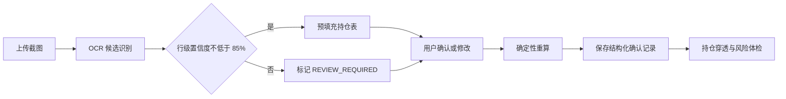

# Prism 个性化投顾智能体纵切技术说明

## 第1章 实施边界

本纵切在既有 FastAPI、SQLite、确定性风险引擎、OCR 解析器和静态工作台上增量实现，不替换现有 `RiskQuestionnaire`、`RiskProfile`、三段式 `RiskLevel` 和决策回执契约。大模型仅承担意图识别、槽位解析和语言表达；金额、比例、风险等级、持仓穿透和越界裁决均由确定性代码执行。

| 模块 | 输入 | 输出 | 强制边界 |
|---|---|---|---|
| 行为画像 | 交易事件、持仓快照、已确认问卷 | C1–C5、三段式有效等级、八维画像、证据 | 行为证据只能维持或下调问卷风险等级 |
| 持仓 OCR | PNG、JPEG、WebP 截图 | 行级候选、置信度、复核原因 | 确认前不入库，不保存原始图片 |
| 展示控制 | owner 级 AI 信任分 | 三档展示策略 | 告警、数据缺失和合规揭示不可隐藏 |
| 研发辅助 | PRD、技术方案文本或文档 | 缺口、接口、模型、测试、代码骨架 | 骨架只返回文本，不写仓库、不执行 |

## 第2章 行为画像与适当性

### 一、证据输入

`BehaviorEvent` 为 owner 隔离的追加事件，支持交易和聚合持仓快照。交易用于计算 90 日交易次数、换手率、观察跨度、资产类型覆盖和已完成持有期；持仓快照用于最大单标的集中度、行业集中度、权益仓位和历史回撤证据。缺少必要字段或样本不足时，状态保持 `INSUFFICIENT_DATA`，不得用零值替代未知值。

### 二、确定性裁决

风险有效分数采用以下硬规则：

```text
effective_risk_score = min(questionnaire_risk_score, behavior_risk_score)
```

行为风险分由最大回撤、权益仓位、单标的集中度和 90 日换手率按版本化权重计算。行为经验分由观察跨度和交易资产类型数量计算。`risk`、`exp`、`act` 在存在相应行为证据时标记为 `CALCULATED`；`res`、`inf`、`per`、`aid` 无证据时保持 `INSUFFICIENT_DATA`；`ai` 仅接受问卷或显式偏好来源。

| 风险分区间 | 适当性等级 | 现有三段式兼容结果 |
|---|---|---|
| 0–24 | C1 | 由既有 `risk_level_for_score` 映射 |
| 25–44 | C2 | 由既有 `risk_level_for_score` 映射 |
| 45–64 | C3 | 由既有 `risk_level_for_score` 映射 |
| 65–81 | C4 | 由既有 `risk_level_for_score` 映射 |
| 82–100 | C5 | 由既有 `risk_level_for_score` 映射 |

规则版本为 `behavior-profile-rules.v1`，区间和展示阈值同时登记在 SQLite `behavior_rule_versions` 表中。前端只展示结果，不复制计算逻辑。

### 三、接口

| 方法 | 路径 | 用途 | Owner 约束 |
|---|---|---|---|
| POST | `/api/v1/advisor/behavior/events` | 幂等追加行为事件 | Header、请求体和事件 owner 必须一致 |
| GET | `/api/v1/advisor/behavior/profile` | 读取最新画像 | 无画像时返回 `INSUFFICIENT_DATA` |
| POST | `/api/v1/advisor/behavior/recompute` | 以问卷和已存事件重算 | 保存递增版本画像快照 |
| PATCH | `/api/v1/advisor/display-policy` | 保存 AI 信任分和展示模式 | 由服务端按阈值裁决模式 |

## 第3章 持仓截图确认链



上传接口限制为 5 MiB，并只接受 PNG、JPEG 和 WebP。解析响应包含图片 SHA-256 摘要、行级证券代码、数量、价格、市值、置信度和复核原因。正式确认按 `owner_id + image_digest` 幂等保存；同一图片在不同 owner 下相互隔离，同一 owner 对相同图片提交不同确认内容时拒绝冲突写入。

数据库只保存确认后的 `PortfolioImportBundle`、图片摘要、确认内容摘要和时间，不保存截图字节、Base64 或数据 URI。确认完成后复用既有基金穿透、HHI、集中度、现金安全线和风险预算服务，状态统一为 `PASS`、`OVERBOUND`、`CALCULATED`、`REVIEW_REQUIRED`。

## 第4章 对话展示控制

| AI 信任分 | 模式 | 默认页面行为 |
|---|---|---|
| 0–34 | `AUDIT_EXPANDED` | 展开事实、规则、阈值、来源、冲突和结论 |
| 35–64 | `STANDARD` | 展示结论和主要依据，其他内容可展开 |
| 65–100 | `CONCLUSION_FIRST` | 结论优先，审计依据默认折叠 |

`/api/v1/copilot/chat` 的首个 SSE 事件为 `analysis_context`，携带画像版本、行为画像版本、持仓快照引用、展示策略以及结构化 `analysis_steps`、`facts`、`thresholds`、`evidence`、`warnings`。该结构是可审计的事实—规则—证据链，不包含模型私有思维链。任意风险越界、数据不足和合规揭示均强制显示。

## 第5章 研发辅助

`POST /api/v1/dev-assist/runs` 接受已抽取文本，`POST /api/v1/dev-assist/runs/upload` 接受 `.docx`、`.md` 和 `.txt`。文档解析设置压缩包、解压内容和文本长度上限，不解析宏，也不执行文档内容。

响应包含需求冲突、缺口、完善后的技术方案、API 草案、数据模型、状态流、测试用例、验收标准、代码骨架和人工决策项。`execution_performed` 固定为 `false`；生成内容不自动写入仓库，不生成订单或交易动作。

## 第6章 验证矩阵

| 层级 | 覆盖范围 | 验收重点 |
|---|---|---|
| 单元测试 | 画像公式、C1–C5 边界、展示阈值、文档解析 | Decimal 稳定、缺失语义、边界值 |
| 集成测试 | 行为事件、画像重算、OCR 确认、研发辅助、对话 SSE | owner 隔离、幂等、禁止执行、无私有思维链 |
| 静态检查 | Python、JavaScript、Git diff | 可编译、语法有效、无空白错误 |
| 浏览器验收 | 画像卡、信任切换、审计链、OCR 三步流、研发辅助 | 风险状态可见、操作闭环、控制台无错误 |

真实券商同步、真实交易、完整 19 题问卷迁移、向量数据库和生产认证不在本纵切范围内。
