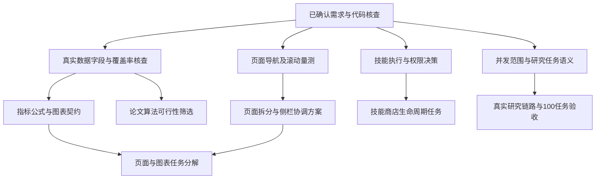
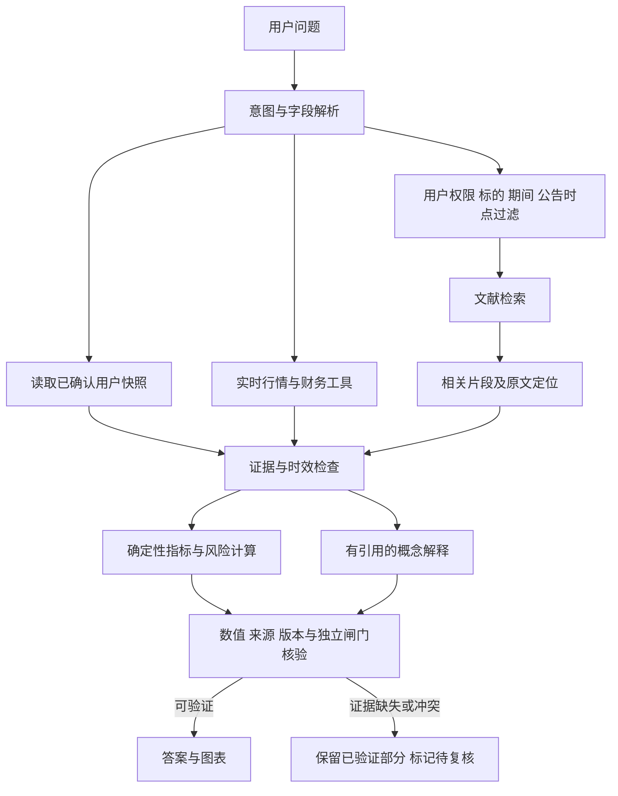

# Prism 研究平台研发任务技术文档

本文供研发团队分解任务与制定验收标准，覆盖页面与侧边栏、A 股指标图表、同花顺指标技能商店、研究任务并发、论文算法及降低模型幻觉的存储与检索方案。当前已确认需求与代码基线；设计问题尚在澄清，本文不表示任何新增功能已实现或性能已达标。

## 第1章 需求范围与实施约束

### 一、 已确认需求

| 编号 | 需求事项 | 已确认内容 | 尚待明确 | 研发影响 |
| --- | --- | --- | --- | --- |
| R01 | 文档用途 | 仅用于研发任务分解 | 无 | 按任务、依赖、产物与验收组织 |
| R02 | 并发对象 | 至少 100 个研究 Agent 任务同时执行 | 全局或单请求；是否逐任务包含模型分析 | 排队、HTTP 请求与模型调用分别计数 |
| R03 | 市场范围 | A 股 | 整个市场模块或仅行业／概念板块 | 决定标的集合与聚合口径 |
| R04 | 实施优先级 | 页面与图表展示优先 | 核心图表与页面拆分规则 | 先定义界面和真实数据展示契约 |
| R05 | 数据条件 | 根据现有可获得数据实现，未知内容查公开资料 | 数据覆盖、历史长度、供应商配额 | 以字段可得性决定算法范围 |
| R06 | 技能商店 | 真实管理同花顺指标 Skill | 执行方式、管理权限与个人能力组合 | 需要目录与实际调用能力一致 |
| R07 | 内容参考 | 土豆看财报的内容思路及 Codex 商店截图 | 作者指标原始计算定义尚未取得 | 参考主题与本项目公式分别记录 |
| R08 | 降低模型幻觉 | 用户要求评估本地数据库、RAG 等提升空间 | 知识库范围与检索方案尚未选型 | 补充可信事实、时效、检索与输出核验任务 |

目前未取得明确的实施期限、团队人数和服务器配置。文档不虚构日程、人力或性能容量。

### 二、 不变约束

1. LLM 仅承担意图识别、槽位解析与自然语言说明；金额、比例、敞口、指标与调仓由确定性程序计算。
2. 新增指标和技能调用继续经过来源、时点、单位与质量检查，不能绕过独立风险及合规闸门。
3. 图表需同时保留统计口径、数据来源、更新时间及缺失状态；数据缺失不能显示为零或正常。
4. 研究任务及并发度的领域定义见 [GLOSSARY.md](../../GLOSSARY.md)。实际执行计数不得以排队量、累计执行量或 HTTP 请求数替代。

## 第2章 当前实现与证据边界

### 一、 代码基线

| 范围 | 已验证实现 | 关键依据 | 尚未证明 | 对应工作 |
| --- | --- | --- | --- | --- |
| 研究调度 | DAG 活动节点使用异步并行及调用预算 | `app/orchestration/executor.py`、`app/providers/runtime.py` | 服务全局 100 任务能力 | 真实运行链路与负载验收 |
| 真实研究矩阵 | 默认矩阵服务使用 Fixture，LIVE 拒绝执行该矩阵 | `app/api/main.py`、`app/service/specialist_matrix.py` | 矩阵已接入真实数据提供方 | 真实 Provider 与矩阵接入 |
| 工作流规模 | 可编辑工作流最多 32 节点；现有矩阵模板为 8 节点 | `app/service/workflow.py`、`app/service/specialist_matrix.py` | 单 DAG 100 节点 | 根据并发范围决定是否改契约 |
| 执行状态 | 根节点先登记 RUNNING，整批完成后落结果 | `app/orchestration/state_machine.py`、`app/orchestration/executor.py` | RUNNING 数量等于真实活动数量 | 在真实执行进入与退出处统计 |
| 同花顺能力 | 项目清单包含固定 9 项 API 能力；加载器限定数量 | `app/providers/iwencai_skills.json`、`app/providers/skillhub.py` | 动态安装、更新与卸载 | 版本化能力注册与生命周期 |
| 下载包边界 | 当前通过 API 适配器调用，未直接执行下载包脚本 | `docs/iwencai-live-provider.md` | 九项元数据等于九个可执行包 | 明确安装及执行语义 |
| 导航 | 五个普通入口及开发者治理入口，采用 hash 切换面板 | `app/api/static/index.html`、`app/api/static/app.js` | 某页确实过长或存在滚动冲突 | 浏览器量测后制定拆分规则 |
| 既有算法 | HHI、基金穿透、约束权重重分配及独立闸门 | `app/risk/concentration.py`、`app/portfolio/exposure.py`、`app/service/portfolio_optimization.py` | 均值方差、CVaR 或风险平价求解器已实现 | 新算法与既有规则明确区分 |

以上结论来自代码及历史资料核查。本轮未执行新的压测或真实行情调用，文件长度不能作为用户界面过长的证据。

### 二、 历史性能证据

2026 年 9 月 18 日的测试在单个登录账户下，对问卷读取接口发起 100 并发任务及 1,000 次真实 TCP HTTP 请求，全部成功，P95 为 6.019 秒。测试不包含模型或金融查询，不能证明 100 个研究任务同时执行，也不能证明完整投顾响应符合原文档中的 3 秒要求。

依据：[系统测试报告](../submission/system-test-report.md)、[HTTP 原始结果](../submission/test-evidence/http-results.json)。原有 100 用户并发要求与本次 100 研究任务需求应分别维护，不能互相替代。

## 第3章 界面与技能商店设计基线

### 一、 截图可提取的交互要求

| 界面区域 | 参考特征 | 本项目待设计内容 | 数据关联 | 验证方式 |
| --- | --- | --- | --- | --- |
| 左侧区域 | 能力分类与已安装列表 | 同花顺技能分组及安装状态 | 能力注册记录 | 导航与状态一致性 |
| 顶部工具栏 | 搜索、刷新、设置与添加 | 搜索和导入管理入口 | 目录与生命周期接口 | 空结果、失败及权限路径 |
| 主区目录 | 公开／个人切换与分组条目 | 公共能力与个人选择范围 | 权限与个人能力配置 | 账户隔离 |
| 能力条目 | 图标、名称、说明与添加／更多操作 | 详情、安装和管理入口 | 包版本及可调用状态 | 界面操作确实改变能力 |

公开／个人目录的权限、安装单位与执行方式尚未确认。本章仅提取截图中的交互结构。

### 二、 历史页面布局证据

未取得可用的本地 Prism 浏览器会话，本轮没有实时页面量测。以下为 2026 年 9 月 17 日保存的全页截图，宽度均为 1440 像素；高度反映当时内容长度，不等于当前页面状态，也不证明 1024×768 下的响应式效果。

| 页面 | 快照高度 | 可观察的内容组织 | 拆分候选 | 证据 |
| --- | --- | --- | --- | --- |
| 个人中心 | 4115 像素 | 画像摘要、八维图、资产参考、19 题问卷及偏好设置纵向排列 | 画像结果、问卷填写、偏好设置 | [个人中心快照](../showcase/current-pages-snapshot-profile-20260917.png) |
| 持仓分析 | 3432 像素 | 报告、风险对照与多处行业预算及集中度展示 | 持仓管理、组合报告；合并重复风险展示 | [持仓快照](../showcase/current-pages-snapshot-portfolio-20260917.png) |
| 大盘鉴别 | 2016 像素 | 行情、宏观与行业观察纵向排列 | 行情、情绪与活跃度、板块与风格 | [大盘快照](../showcase/current-pages-snapshot-market-20260917.png) |
| 交易风格 | 1405 像素 | 历史交易与风格分析 | 优先整理信息层级 | [交易风格快照](../showcase/current-pages-snapshot-trading-style-20260917.png) |
| AI 对话 | 1165 像素 | 对话与任务工作台 | 保留对话入口，详细报告跳转对应页面 | [工作台快照](../showcase/current-pages-snapshot-workbench-20260917.png) |

快照启用了开发者模式，个人中心底部兼容表单不代表普通用户页面的全部必需内容；交易风格截图为空状态，不能据此推断有交易记录时的页面长度。

当前侧栏采用固定视口高度及 `overflow:hidden`，新增技能商店入口后需检查导航项是否被裁切；对话区存在独立滚动容器，需联合验证页面滚动和内部滚动。1024 像素宽度会触发布局降列，但实际溢出及操作可达性仍待验证。依据：`app/api/static/prism-v2.css`、`app/api/static/pages-snapshot.js`。

表中拆分方向为候选方案。最终布局需结合真实内容、不同视口、滚动位置恢复及侧栏选中态验证后确定。

### 三、 页面与指标的依赖关系

## 第4章 指标参考与算法候选

### 一、 现有数据的可行性

| 数据类型 | 已有路径 | 当前限制 | 可支持的首期展示 | 数据补齐要求 |
| --- | --- | --- | --- | --- |
| 指数日线 | 四项 A 股指数 OHLC；成交量及成交额可选 | 非完整风格指数集合，量额可能缺失 | 收益、动量、实现波动、回撤与状态概率 | 日期对齐、历史长度与量额单位 |
| 股票快照 | 单股与批量价格、涨跌幅、量额及时间 | 没有现成换手率、涨跌停状态契约 | 指定观察集的价量分布 | 固定观察集、覆盖率及字段探测 |
| 全市场目录 | 部分交易所查询及候选证券搜索 | 没有统一全市场枚举与历史成分 | 仅展示已知观察集 | 沪深北目录、历史成分与退市样本 |
| 行业数据 | 行业归属及 12 项行业指数观察集 | 目录截取不是全行业排行；无概念多对多关系 | 明示观察集的行业强弱热力图 | 完整行业目录、历史日线与概念归属 |
| 新闻文本 | 公告、新闻、研报标题与摘要 | 每类最多 5 条；无社区关注与散户账户数据 | 新闻线索及文本标签 | 去重、分页、历史覆盖与抽样偏差 |
| 资金与参与者 | 未证实逐笔、大小单及参与者身份路径 | 不能识别真实散户参与度或主力流向 | 不作为当前直接观测指标 | 明确字段、产品权限与真实响应 |

上述“已有路径”仅表示代码存在契约与调用过程，本轮未调用接口验证当前账户权限或覆盖完整性。普通价量数据可形成市场行为与活跃度代理，不能直接命名为真实散户人数或主力资金流。

`app/providers/skillhub.py` 中 `sentiment` 缺失时默认 `NEUTRAL`，`confidence` 缺失时默认 `1.0`；这些默认值不能作为有效情绪观测或置信度参与聚合。情绪图表任务需要显式区分缺失与真实中性。

公开产品资料可用于寻找补齐路径，但不能替代项目权限验证。例如 [同花顺 SuperMind 文档](https://quant.10jqka.com.cn/view/help/4?from=ifind)的历史行情能力不等于当前 SkillHub 已接入；[iFinD 官方 FAQ](https://quantapi.10jqka.com.cn/gwstatic/static/ds_web/quantapi-web/help-center/faq.html)所述数据产品和逐笔能力也需单独核查账号权限。

### 二、 作者内容核查

搜索公开页面已找到署名“土豆看财报”的韭菜指数系列，与用户提供的账号关联。当前依据为公开标题、简介、标签与合集文字，未取得完整字幕或计算公式。不得将本项目自行定义的指标归因于该作者。

| 参考内容 | 可核实主题 | 对研发的启发 | 未取得内容 | 原始入口 |
| --- | --- | --- | --- | --- |
| 9.7 韭菜指数 | 韭菜指数系列 | 研究情绪图表的表达 | 指标公式及训练数据 | [B站视频](https://www.bilibili.com/video/BV1o6bN6HEnS/) |
| 9.18 韭菜指数 | 踏空情绪与红利／科技切换 | 区分情绪与风格变化 | 样本、权重与阈值 | [B站视频](https://www.bilibili.com/video/BV1vcem62EtB/) |
| 9月第三周韭菜指数 | 半导体及光模块热度 | 板块热度与分布展示 | 热度的原始观测方法 | [B站视频](https://www.bilibili.com/video/BV1nGeq6bE6R/) |

散户身份与情绪不能直接从普通行情认定。后续需要区分真实参与者数据、关注度数据与价量代理指标，并采用与数据含义一致的名称。

### 三、 外国论文算法候选

| 候选 | 原始资料 | 数据要求 | 可视化方向 | 待验证事项 |
| --- | --- | --- | --- | --- |
| 市场状态切换 | Ang 与 Bekaert，2002，International Asset Allocation With Regime Shifts | 连续收益序列；本项目日频方案属于改编 | 状态概率、波动区间及状态变化 | 样本长度、拟合稳定性与样本外表现 |
| 五因子模型 | Fama 与 French，2015，A five-factor asset pricing model | 收益、市值、账面权益、利润相关字段、总资产及公告时点 | SMB、HML、RMW、CMA 风格曲线 | 财务时点完整性；不能等同科技／红利风格 |
| 协方差收缩 | Ledoit 与 Wolf，2004，Honey, I Shrunk the Sample Covariance Matrix | 对齐的多资产历史收益 | 稳健相关热力图与风险集中展示 | 常相关目标与其他实现差异；缺失值及正定性 |

原始资料：[Ang 与 Bekaert 作者论文](https://www0.gsb.columbia.edu/faculty/gbekaert/papers/international%20assel%20allocation.pdf)、[Fama 与 French 作者论文](https://faculty.chicagobooth.edu/-/media/faculty/eugene-fama/teaching/private/readings/afive-factorassetpricingmodel.pdf)、[Ledoit 与 Wolf 工作论文](https://bse.eu/sites/default/files/working_paper_pdfs/92.pdf)。

以上为候选，尚未选型。算法任务需给出确定性公式、数据时点约束、数值容差、基准比较和失败状态，不能仅以论文名称作为交付物。

## 第5章 事实存储与检索增强

### 一、 问题边界及现有实现

数据库提供持久化、版本及可追溯性；RAG 为回答提供检索材料。两者的有效性取决于入库来源、时点、权限与输出校验。已保存的错误结论、已过期的报价或错误召回的财报仍可能造成幻觉，不能以“已有数据库”或“接入向量库”作为真实性验收。

| 能力 | 已验证实现 | 关键依据 | 当前边界 | 提升方向 |
| --- | --- | --- | --- | --- |
| 本地数据库 | SQLite 已保存画像、持仓、会话、记忆及决策事件 | `app/store/sqlite.py`、`app/store/migrations` | 数据库存在不代表资料已形成完整可信检索库 | 扩展事实与文献的来源、版本及索引 |
| PostgreSQL | 可通过数据库配置切换，已有适配器 | `app/store/postgres.py`、`app/api/main.py` | 现有适配器仍单连接及串行写锁，不是连接池方案 | 先评测读写争用，再决定连接池与部署 |
| 历史记忆 | 显式保存结构化问卷、画像、持仓及内容哈希 | `app/store/context.py`、`app/service/semantic_memory.py` | 标记 HISTORICAL_ONLY，不能自动恢复为当前事实 | 保留历史与当前事实分离，按版本核对 |
| 语义检索 | 最近 100 条本用户记录的关键词匹配或模型重排 | `app/service/semantic_memory.py` | 不是 embedding 向量文献 RAG；聊天未自动调用它 | 单独建立文献检索链路与有限检索工具 |
| 会话事实 | 服务端锁定画像与持仓版本；流中检查漂移 | `app/service/session_truth.py`、`app/api/main.py` | 覆盖当前画像及持仓；非全类型外部市场事实登记 | 扩展市场数据、指标和规则版本快照 |
| 结构化断言 | 核对明确字段与部分 BUY 排除条件 | `app/service/session_truth.py` | 不读取自由文本，未自动核验每项输出声明 | 声明结构化、引用核验及输出门控 |
| 工具事实输出 | 工具执行后由确定性模板汇总结果 | `app/llm/agent.py` | 不等于所有概念回答或未来 RAG 输出均已校验 | 保留数值模板，检索说明也须附有效依据 |

### 二、 存储与检索的职责分离

| 数据类别 | 推荐承载 | 允许用途 | 时点及版本要求 | 禁止的替代关系 |
| --- | --- | --- | --- | --- |
| 当前确认画像与持仓 | 用户隔离的结构化数据库 | 个性化计算输入 | owner、revision、snapshot_id | 历史聊天不能覆盖当前确认值 |
| 行情与财务观察值 | 结构化事实及证据记录 | 查询、交叉验证和确定性计算 | 标的、字段、单位、期间、观察及抓取时间、来源 | 相似文段不能代替最新报价 |
| 公告、财报与研报 | 原始文档与可重建检索索引 | 按问题检索并解释 | 公告时间、版本、页码／段落及内容哈希 | 同源转载不能充当独立证据 |
| 指标说明与论文 | 版本化文献知识库 | 解释定义、输入条件与算法依据 | 作者、出处、方法版本与适用范围 | 论文结论不能替代本项目样本外验证 |
| 历史对话及模型输出 | 独立历史记录 | 理解指代、回看过程 | 用户、会话与生成时间 | 不能自动进入已验证事实库 |
| 衍生指标与报告 | 确定性计算结果及输入引用 | 图表、报告和输出数值 | 输入快照、算法版本及规则版本 | RAG 或 LLM 不负责重新算术 |

所有新字段需作为显式契约扩展，不能将其描述为现有 API 已提供。外部文档内容作为资料处理，不执行其中的指令；私有记录在检索和排序前按用户隔离。删除或更正原始资料后，关联索引和缓存也需失效。

### 三、 两条可行实施路径

| 路径 | 组成 | 优点 | 成本与限制 | 推荐条件 |
| --- | --- | --- | --- | --- |
| A 结构化事实与全文检索 | 复用现有数据库，补资料元数据、全文索引与输出核验 | 改动较少，标的、期间与精确字段容易核查 | 同义表达召回有限；中文检索需实测分词 | 首期先建立可信输入与核验基线 |
| B 事实库与混合 RAG | 在 A 上加入向量召回、关键词召回及有限重排 | 改善概念、规则和长文语义召回 | 增加 embedding、索引同步与召回评测成本 | 基线证明全文检索不足后扩展 |

推荐先采用 A 建立来源和数值核验，再以冻结问题集比较 B 是否增加有效召回。这样保留页面与图表优先顺序，同时避免先承担未经证明的检索复杂度。此为待确认建议，尚未决定数据库迁移或 RAG 实现。

SQLite 全文检索可评估 [FTS5 官方文档](https://www.sqlite.org/fts5.html)所述能力；若实际部署选用 PostgreSQL，向量能力可评估 [pgvector 官方项目](https://github.com/pgvector/pgvector)。本轮未安装扩展或验证当前运行环境支持，数据库迁移本身不保证消除写入争用。

### 四、 运行流程与输出核验

1. 行情、财务数值从结构化工具和事实记录获取；历史财报使用问题时点之前已公开的版本，防止未来信息进入历史判断。
2. 检索命中只表示资料相关，不表示其声明已验证。每项金融事实需能回到原始观察值或原文，引用地址存在不等于引用内容支持该声明。
3. 表格切片保留表头、单位、期间与原文位置；同公司不同报告期不得因语义相近而合并。
4. 每项输出声明关联 evidence_id、输入快照及方法版本；数值由后端按既有精度规则渲染，不交给模型重新计算。
5. 缺失、过期和冲突分别处理。可以保留已验证内容，但不得生成无依据的数字或将未解决的冲突改写成确定结论。
6. 会话版本漂移时停止当前个性化输出。现有逐 chunk 查询事实的实现与高并发有性能耦合，需评测后优化版本通知，不能以减少检查为由放松漂移拦截。

RAG 原始论文展示了检索对知识问答及事实性生成的改善，但不能据此保证金融答案正确。ALCE 将答案正确性与引用质量分别评价，适合借鉴其核验维度。[RAG 原始论文](https://arxiv.org/abs/2005.11401)、[ALCE 原始论文](https://arxiv.org/abs/2305.14627)。Self-RAG 可作为按需检索及支持性检查的研究参考，其论文方法包含专门训练，不能将普通提示词自检标为已经复现该算法。[Self-RAG 原始论文](https://arxiv.org/abs/2310.11511)。

### 五、 拟议研发任务及验收指标

下表为新增范围的建议任务，不表示已确认实施顺序。事实与数值核验可直接服务现有图表，文献检索增强可在数据基线稳定后安排。

| 任务 | 主要模块与边界 | 前置依赖 | 交付物 | 建议验收 |
| --- | --- | --- | --- | --- |
| AH01 来源与事实版本 | 扩展现有 Evidence 与快照契约 | 标的、期间及字段定义 | 原始观察值、版本及输入引用 | 抽样可复核；缺来源不升级为已验证 |
| AH02 文献入库与索引 | 公告、财报、研报、指标说明及论文 | 知识库来源范围 | 原文、片段、页码、公告时点及哈希 | 更正／删除后索引一致；同源转载去重 |
| AH03 检索路由与隔离 | 结构化查询和文献检索分别路由 | AH01、AH02 | 有限检索接口及关键词基线 | 跨用户泄漏为 0；历史问题不召回未来公告 |
| AH04 混合召回比较 | 向量与关键词组合及有限重排 | AH03 的冻结评测集 | 可重建索引与对照结果 | 证据召回达标且优于全文检索基线才扩展 |
| AH05 声明及引用核验 | 扩展结构化断言与输出管道 | AH01；文本路径依赖 AH03 | 声明与证据关联、数值模板及阻断原因 | 关键数值一致；无效引用不能输出已验证结论 |
| AH06 时效及版本门控 | 市场事实、画像、持仓与计算版本 | AH01、AH05 | 数据失效、冲突及漂移处理 | 过期值不冒充当前值；变更立即失效关联结果 |
| AH07 反幻觉评测 | 覆盖正常、缺失、过期、冲突、隔离与注入 | AH03、AH05、AH06 | 冻结问题集及逐声明人工依据 | 同时报告事实正确、引用支持、检索召回与延迟 |
| AH08 存储与检索负载 | 复用现有存储，按证据评估池化及索引 | 并发范围与数据量明确 | 数据库等待、检索时延及资源报告 | 100 研究任务下核验不被跳过；延迟预算另行确认 |

拟议发布门槛如下，需在完整设计确认时冻结。所有比例须同时报告样本量；分母为 0 时返回 N/A，不能计为通过。

| 指标 | 确定性统计定义 | 建议门槛 | 评测依据 | 限制 |
| --- | --- | --- | --- | --- |
| 关键数值一致率 | 满足对应字段精度及容差的关键数值数／全部关键数值数 | 100% | 已验证观察值与确定性结果 | 不能掩盖原始数据真实性问题 |
| 无依据事实率 | 人工判为缺乏支持的原子事实数／全部原子事实数 | ≤1% | 冻结问题集与原始依据 | 人工标注；不代表开放世界零幻觉 |
| 引用支持率 | 引用确实支持声明的声明数／全部带引用声明数 | ≥95% | 原文逐项核对 | 引用存在性不能代替支持性 |
| 证据召回 Recall@10 | 每题前 10 项召回的相关证据数／该题标注相关证据数，取题目平均 | ≥90% | 每题相关证据不超过 10 项的冻结集合 | 无相关证据题单测拒答；单列标的及报告期 |
| 错误拒答率 | 依据充分却无正当理由拒答的问题数／依据充分的问题数 | ≤5% | 人工标注资料完整性及可回答范围 | 防止用普遍拒答虚增事实正确率 |
| 隔离及时点错误 | 跨用户召回、未来公告泄漏、过期值作为当前值的事件数 | 0 | 对抗与时点测试 | 需持续回归，不能仅凭一次测试保证 |

## 第6章 待决策事项与后续交付

### 一、 当前设计问题

| 问题 | 决策内容 | 推荐方向 | 影响范围 | 状态 |
| --- | --- | --- | --- | --- |
| Q8 | A 股市场模块或仅行业／概念板块 | 市场、板块与个股联动 | 数据集合与页面 | 待回答 |
| Q9 | 全局 100 任务或单请求 100 任务 | 服务全局统计 | 调度及工作流契约 | 待回答 |
| Q10 | 每任务是否必须调用模型 | 结构化研究任务，模型并发单列 | Agent 契约与验收成本 | 待回答 |
| Q11 | Skill 受控适配或直接运行脚本 | 受控适配器 | 安装语义及运行边界 | 待回答 |
| Q12 | 安装、升级与启用权限 | 管理员安装；用户选择个人能力 | 权限及账户隔离 | 待回答 |

### 二、 后续任务文档要求

共同确认设计后，在本文件继续补齐研发任务表。每项任务应列明优先级、前置依赖、涉及模块、接口与数据契约、交付物、验收方法及失败状态。页面拆分依据实际浏览器量测；算法范围依据已验证字段；并发结论依据真实执行期间的活动计数与负载记录。

本文件目前是需求基线与设计问题记录，完整研发任务分解尚未完成。
