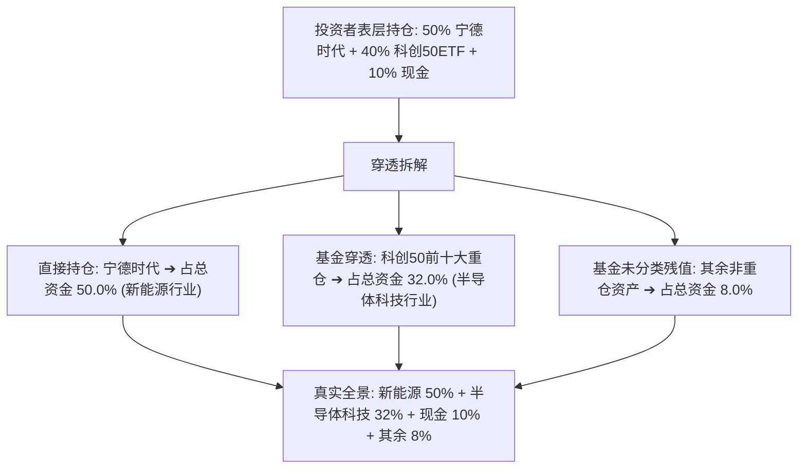
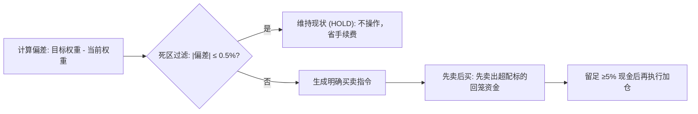

# 持仓分析智能体技术规范（PRD 对接版）

> **功能定位**：用户输入持仓后，系统自动完成底仓穿透、风险体检与调仓方案生成，输出结构化事实给前端渲染。  
> **文档目标**：为产品经理提供清晰的功能逻辑、规则阈值与前端呈现定义。

---

## 一、 业务全景与核心价值

持仓分析智能体通过算法完成三项核心任务：
1. **穿透看清真实底仓**：把基金和 ETF 拆解为底层股票，识别表面分散但实际重仓同一行业的隐性风险；
2. **多维排雷与合规检查**：查个股财务雷、查转债溢价雷、查持仓是否超出用户的风险承受能力；
3. **输出落地调仓清单**：计算具体该买多少、卖多少，执行先卖后买并保留安全现金。

---

## 二、 功能一：持仓录入与核验规则

| 录入方式 | 系统处理逻辑 | 产品交互与前端展示规则 |
| :--- | :--- | :--- |
| **持仓截图 (OCR)** | 识别股票代码、名称、股数、成本、现价、市值。 | 单元格置信度 $\ge 85\%$ 直接采纳；低于 $85\%$ 在表格中标黄高亮，弹出确认浮层由用户手动核对。 |
| **文本粘贴 (NER)** | 正则配合实体识别，自动提取代码和股数。 | 标的代码必须命中证券字典；若存在同名歧义，弹出单选框让用户选定代码。 |
| **接口同步** | 读取账户持仓流水。 | 自动折算为人民币基准值，校验通过后直接进入分析。 |

---

## 三、 功能二：基金底层穿透（Look-Through）

很多投资者以为买了多只基金就是分散风险，系统通过穿透算法还原真实敞口：

* **直接暴露**：股票、债券直接归入所属行业；
* **穿透暴露**：从基金最新季报提取前十大重仓股，按持有市值等比折算到底层股票和行业；
* **守恒约束**：直接资产 + 穿透资产 + 未分类残值严格等于账户总市值，禁止模型虚构未披露的持仓。

---

## 四、 功能三：持仓集中度与健康度体检

系统对穿透后的持仓运行量化体检，输出量化评分与红黄牌告警：

| 体检项目 | 计算规则与指标 | 警戒阈值 | 触发后的产品动作 |
| :--- | :--- | :--- | :--- |
| **单一股票集中度** | 单个个股市值 $\div$ 总市值 | $> 20.0\%$ 提示黄牌告警 | 提示个股黑天鹅风险，禁止继续推荐买入该个股。 |
| **单一行业集中度** | 单个行业穿透总市值 $\div$ 总市值 | $> 30.0\%$ 触发超标告警 | 提示赛道集中风险，后续方案优先推荐互补行业标的。 |
| **组合分散度 (HHI)** | 各标的权重平方和 $\times 10000$ | $> 2500$ 判定为高度集中 | 前端以仪表盘展示分散度得分，低于 60 分标红。 |
| **财务暴雷排查** | 调取问财数据排查个股财务六事实 | ROE $< 8\%$ 或负债率 $> 60\%$ | 持仓列表个股旁打上财务脆弱标签，建议调仓卖出。 |
| **转债双杀排查** | 计算转股溢价率 $PR$ 与纯债底 | 溢价率 $> 40\%$ 且偏离债底大 | 标记高溢价风险，提示正股下跌时的转债补跌隐患。 |
| **现金安全缓冲** | 可用现金 $\div$ 总资产 | 硬性要求 $\ge 5.0\%$ | 确保账户具备基本流动性，调仓后现金不足 5% 强制拦截。 |

---

## 五、 功能四：用户画像风控预算核验

体检结果自动对齐用户的风险评级（R1 至 R5），执行拦截：

| 投资者类型 | 单一标的上限 | 单一行业上限 | 科技板块上限 | 超标时的产品表现 |
| :--- | :--- | :--- | :--- | :--- |
| **保守型 (R1)** | 禁止配置个股 | 禁止配置行业股 | $0\%$ | 仅允许配置国债与货币基金，违规资产标红提示退出。 |
| **相对保守型 (R2)**| $\le 10.0\%$ | $\le 20.0\%$ | $\le 10.0\%$ | 弹出提示：当前持仓超出保守偏好，建议降低权益暴露。 |
| **平衡型 (R3)** | $\le 20.0\%$ | $\le 30.0\%$ | $\le 30.0\%$ | 行业超限时在研判黑板推送预警，阻断同行业买入建议。 |
| **相对积极型 (R4)**| $\le 25.0\%$ | $\le 40.0\%$ | $\le 50.0\%$ | 允许全行业轮动，重点监控流动性风险。 |
| **进取型 (R5)** | $\le 35.0\%$ | 不限 | 不限 | 允许集中进攻，仅监控财务实质暴雷个股。 |

#### 知行冲突检测
若用户在风险问卷中选择保守型，但实际持仓中高风险赛道占比超 60%，系统触发知行冲突告警。在界面中展示自述偏好与实际行为对比卡，提示用户选择按既定纪律减仓纠偏或重新评测风险等级。

---

## 六、 功能五：确定性再平衡调仓建议

完成诊断后，系统输出清晰、可执行的调仓操作清单：

| 建议类型 | 触发条件 | 前端呈现文案示例 |
| :--- | :--- | :--- |
| **维持现状 (`HOLD`)** | 权重偏差在 $\pm 0.5\%$ 范围内 | 波动处于容差死区内，暂无调仓必要，避免交易手续费损耗。 |
| **清仓卖出 (`SELL`)** | 目标权重为 0（因违规或财务恶化） | 建议全部卖出（如建议清仓某暴雷标的，预计释放资金 5.2 万元）。 |
| **减仓止盈 (`REDUCE`)** | 当前仓位超出目标权重 $0.5\%$ 以上 | 建议减仓（如建议卖出 2 万元，将行业占比压降至安全线内）。 |
| **补足加仓 (`BUY`)** | 当前仓位低于目标权重 $0.5\%$ 以上 | 建议加仓（如建议买入某防御标的 3 万元，补齐组合防御短板）。 |

---

## 七、 前端交付产品清单（PRD 落地项）

产品界面需实现以下三张核心卡片：

1. **持仓真实行业透视卡**：以环形饼图呈现穿透后的真实行业分布，标注直接持仓与穿透持仓占比；
2. **风险体检红黄牌清单**：以列表展示超标项（个股集中度超标、行业超标、财务脆弱标的），附带一键查看原因按钮；
3. **调仓执行向导表**：按先卖后买顺序呈现操作步骤，包含标的代码、操作动作、建议金额及调仓后预计仓位占比。
