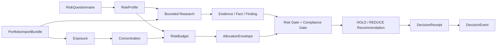

# Prism 技术实现与 PRD 对接边界

> 文档类型：技术交付文档（不是产品需求文档）  
> 核对基线：当前工作区代码，2026-09-03  
> 代码入口：`app/api/main.py`、`app/service/`、`app/*/contracts.py`

本文把当前仓库已经实现的模块、数据契约、接口、状态语义和计算边界压缩成一份可交付给产品团队的技术摘要。产品可以据此拆分页面、任务、接口联调和验收条件，但不能把本文中的 fixture、内存存储或本地回退实现写成生产能力。

本文不定义用户画像、商业目标、产品优先级、运营指标、页面文案或最终合规口径。凡是写作“待决策”“未实现/限制”的内容，均不应直接写入“已支持”的产品能力。

## 1. 结论先行

- Prism 当前是一个以 FastAPI 提供 HTTP/SSE 接口的、fixture-first 的证券研究与组合决策支持原型。
- 目前最完整的技术纵切是 `POST /api/v1/advisor/queries`：结构化画像与持仓输入，经过暴露、集中度、风险预算、分配边界、研究证据、风险/合规门禁后，生成确定性的建议组合结果，并写入 `DecisionEvent`。
- 研究卡、组合优化、情景模拟、再平衡、历史回执、评测和可解释性是可独立调用的技术服务；它们不是都能生成最终建议，也不是都写入决策事件。
- 默认服务使用 fixture、本地字典或进程内模拟。`LiveMarketProvider`、`LiveWencaiProvider` 的命名不等于已经接入真实行情、同花顺问财、SkillHub 或生产级数据授权。
- 当前没有生产认证/多租户身份系统、云端持久化、券商下单、真实账户导入、真实外部数据 SLA 或经过实测的并发/延迟承诺。

仓库中的 A18 `.docx` 是需求/竞赛背景材料，不是当前实现契约。材料中关于真实数据源、远程 SkillHub、并发、可用性或业务效果的描述，必须经过工程接入和验收后才能进入产品承诺。

## 2. 当前实现基线

| 项目 | 当前实现 | 对 PRD 的含义 |
| --- | --- | --- |
| 运行时 | Python 3.11+；FastAPI；Pydantic v2 风格的严格领域模型 | 前后端字段和枚举应以代码契约及 `/api/docs` 为准 |
| 应用工厂 | `app.api.main.create_app()` | 测试和部署可以注入服务、时钟、存储；不要把默认 fixture 当成唯一部署形态 |
| 默认服务 | `FixtureAdvisorQueryService`、fixture 研究服务、确定性优化/模拟/再平衡服务 | 当前可稳定演示和回放；不代表实时市场计算 |
| 默认存储 | `SQLiteDecisionEventStore(":memory:")` | 默认重启丢失；跨进程/重启持久化需要显式传入文件路径或替换存储实现 |
| API 文档 | `GET /api/docs` | OpenAPI 是联调入口；接口响应仍需按状态语义处理 |
| 工作台 | `GET /` 返回静态工作台；静态资源挂载在 `/static` | 页面是当前实现的一部分，但不等于产品最终信息架构 |
| 健康检查 | `GET /api/health` 返回 `status=ok` 和 `schema_version` | 仅表示应用可响应，不表示数据源、模型或数据库健康 |
| 身份边界 | Advisor/Decision Event 路由使用 `X-Owner-ID`；Copilot 路由当前不使用该头 | 这是当前协议隔离，不是认证和授权系统 |
| 数值类型 | 领域计算和主要契约使用 `Decimal`；Copilot/部分 API 边界仍有普通 JSON/Pydantic 模型 | 不要在 PRD 中笼统写成“全链路无浮点数” |

## 3. 架构和调用边界

### 3.1 模块职责

| 目录 | 技术职责 | 不应推导出的能力 |
| --- | --- | --- |
| `app/api/` | FastAPI 路由、依赖、异常映射、SSE 封装 | 不负责认证、交易执行或数据源真实性证明 |
| `app/service/` | Advisor、研究卡、优化、模拟、再平衡、历史、评测等编排服务 | 服务输出不自动成为最终 Recommendation |
| `app/profile/` | 风险问卷、画像确认、画像提案冲突处理 | 当前不提供通用自然语言画像抽取 |
| `app/portfolio/` | 原始持仓快照、基金穿透快照、组合导入包、暴露计算 | 不负责 FX 换算、账户连接或交易 |
| `app/risk/` | 集中度、HHI、风险预算及超限评估 | 不直接产生买卖指令 |
| `app/allocation/` | 按预算构造目标分配区间（Allocation Envelope） | 不是全局最优组合求解器 |
| `app/research/`、`app/orchestration/` | 研究节点、有限拓扑执行、交叉验证和证据流水线 | 不保证外部研究数据真实、完整或实时 |
| `app/providers/` | Provider 请求/结果协议、fixture provider、缓存/回退 | 回退结果不能被标为实时直连结果 |
| `app/contracts/` | Evidence、Fact、Finding、Recommendation、Trace 等跨模块契约 | 契约通过不等于业务结论正确或适合所有生产场景 |
| `app/gates/`、`app/recommendation/` | 风险门禁、合规门禁、建议组合和 Decision Receipt | 不替代法律/合规审批流程 |
| `app/store/` | SQLite 决策事件和结构化上下文记忆 | 当前不是生产级用户数据库或审计平台 |
| `app/llm/` | OpenAI-compatible 客户端、ReAct 工具调用、Copilot 流式对话 | LLM 文本不是 Evidence/Fact/Finding/Recommendation |

### 3.2 完整决策纵切



只有 Advisor 主链路在 `RecommendationCompositionResult` 层组合建议，并由 API 层构造和保存事件。研究卡、优化、模拟、再平衡、评测和可解释性接口的响应应分别处理，不应直接拼接成“最终投顾建议”。

## 4. 跨模块数据契约

### 4.1 共通规则

- 领域模型继承 `ContractModel`，默认要求字段明确、禁止未声明字段、不可变，并在模型层做关联校验。
- 每个公共对象带 `schema_version`；PRD 对接时应把它视为协议版本，而不是展示文案。
- `owner_id`、`profile_id`、`bundle_id`、`request_id`、`run_id`、`evidence_id` 等标识用于闭合链路，不能在前端随意重写或复用到不同对象。
- 时间字段要求带时区；`generated_at`、`answered_at`、`as_of`、`retrieved_at`、`observed_at` 等不能按本地无时区字符串传递。
- 关键金额、权重、分数和指标使用 `Decimal` 计算。当前 JSON 序列化的 Decimal 字段通常表现为字符串或可被 Pydantic 接受的数字/字符串，联调时应避免二进制浮点误差。
- 主要领域输入、诊断、上下文记忆和证据链会拒绝或限制 `api_key`、`authorization`、`token`、`password`、`cookie` 等敏感字段；Copilot 配置接口是当前明确接受 `api_key` 的例外边界，见第 6.5 节和第 8.2 节。

### 4.2 风险画像

`RiskQuestionnaire`（`risk-questionnaire.v1`）至少包含：

- `questionnaire_id`、`owner_id`、带时区的 `answered_at`；
- `loss_tolerance_score`：1–5；
- `investment_horizon`：`SHORT` / `MEDIUM` / `LONG`；
- `liquidity_need`：`LOW` / `MEDIUM` / `HIGH`；
- `experience_level`：`NOVICE` / `INTERMEDIATE` / `EXPERIENCED`；
- `return_expectation`：`LOW` / `MODERATE` / `HIGH`；
- `max_drawdown_tolerance_pct`：0–100；
- 可选 `expected_return_range`。

画像是确定性确认结果 `RiskProfile`（`risk-profile.v1`），包含 `profile_id`、`profile_version`、`risk_score`、`risk_level` 以及偏好、排除项和冲突记录。当前评分规则为：

```text
每个维度先映射为 1/3/5，再按 (x - 1) / 4 归一化。
risk_score = 100 * (
    0.30 * loss_tolerance
  + 0.25 * investment_horizon
  + 0.20 * liquidity_need
  + 0.10 * experience_level
  + 0.15 * return_expectation
)
```

其中流动性需求的映射是 `LOW=5`、`MEDIUM=3`、`HIGH=1`；其余五档方向按风险承受能力递增。风险等级阈值为：`risk_score <= 33` 为 `CONSERVATIVE`，`<= 66` 为 `BALANCED`，否则为 `GROWTH`。

画像提案接口接收类型化的 `ProfileExtractionProposal`，不是原始自然语言。若问卷和提案冲突，必须明确使用问卷或提案的值；存在未解决冲突时不能形成最终 `RiskProfile`。

### 4.3 持仓和基金穿透

组合输入是三层结构：

1. `Position`：标的、资产类型、数量、市值、币种、观察时间和来源。
2. `PositionSnapshot`（`position-snapshot.v1`）：某一时点、某一 owner 的非空持仓快照。
3. `FundHoldingSnapshot` + `PortfolioImportBundle`（`portfolio-import-bundle.v1`）：可选基金/ETF 穿透持仓及其覆盖率。

穿透计算的实际语义：

```text
间接市值 = 基金持仓市值 * 穿透成分 weight_pct / 100
实际暴露 = 直接持仓市值 + 所有基金产生的间接市值
暴露权重 = 实际暴露 / 组合总市值 * 100
```

当前实现不做 FX 换算；非基准币种会形成问题并被跳过。穿透缺失或覆盖不完整会保留为 `UNLOOKED_THROUGH`/部分状态，不能按 0 暴露处理，也不会外推缺失部分。

### 4.4 证据链

公共证据链按以下职责分层：

| 对象 | 作用 | 关键约束 |
| --- | --- | --- |
| `Evidence` | 一条带来源、期间、lineage 和质量状态的证据 | `VERIFIED`、`STALE`、`PARTIAL`、`CONFLICTING`、`INVALID` |
| `Fact` | 从证据归一化出的可引用事实 | 非验证事实不能带数值冒充事实 |
| `Finding` | 基于 Fact 的方法化判断 | 要引用 `fact_ids`、置信度和方法 |
| `Recommendation` | 最终建议对象 | 需要引用 Finding、目标权重区间、合规状态和失效条件 |
| `DecisionTrace` | 证据、事实、判断、建议之间的引用闭包 | 引用必须可解析，不能出现悬空 ID |

研究流水线只有在交叉验证和 trace 闭合时才提供可用的 Fact/Finding。非 `READY` 结果按契约不暴露可被误用的事实/判断；最终建议还必须通过独立风险门禁和合规门禁。

### 4.5 Decision Receipt 与 Decision Event

`DecisionReceipt`（`decision-receipt.v1`）是通过建议组合后生成的内容寻址回执，除 `content_hash` 外还绑定：画像及版本、组合和持仓快照、暴露/集中度/风险评估/分配边界、研究 run、候选、两类门禁、Decision Gate、证据/事实/判断/建议 ID、规则版本和 `decision_trace_hash`。

回执的 `generation_mode` 当前固定为 `DETERMINISTIC`，`model_versions` 必须为空。它不复制原始私人持仓内容，只保存可回放所需的标识和哈希关系。

`DecisionEvent`（`decision-event.v1`）是可持久化的不可变事件，包含 `event_id`、owner、composition、状态、回执 ID、内容哈希和序列化结果。相同事件内容可幂等写入；同一事件 ID 对应不同内容会返回冲突。

## 5. 计算服务与状态语义

### 5.1 状态不是一个全系统通用枚举

原草稿中的“所有模块统一用 `max(BLOCKED, REVIEW_REQUIRED, READY)`”不应作为实现事实。当前各层使用不同状态集合，PRD 应按接口分别定义显示和交互：

| 层级 | 状态 | 含义 |
| --- | --- | --- |
| Provider | `SUCCESS` / `PARTIAL` / `EMPTY` / `FAILED` | 数据响应本身的可用性；不能把 EMPTY 当成 FAILED，也不能把缺失当成零 |
| Exposure / Concentration | `COMPLETE` / `PARTIAL` / `FAILED` | 暴露或集中度计算是否闭合 |
| Research node | `COMPLETE` / `PARTIAL` / `EMPTY` / `FAILED` | 单节点的观察、缺失和失败语义 |
| Research pipeline | `READY` / `REVIEW_REQUIRED` / `BLOCKED` | 证据能否继续进入决策链 |
| Optimization / Simulation | `READY` / `REVIEW_REQUIRED` / `BLOCKED` | 目标结构或假设模拟是否可安全解释 |
| Risk/Compliance/Decision gate | `PASS` / `REVIEW_REQUIRED` / `BLOCKED` | 是否通过对应门禁 |
| Recommendation composition / Event | `PASS` / `REVIEW_REQUIRED` / `BLOCKED` | 最终结果或安全拒绝结果 |

产品层应同时保留 `status`、`issues`、`missing_fields`、`scope_description` 和 `serving_mode` 等解释字段。只有 `PASS`/`READY` 的接口才可按其契约使用完整输出；非通过状态不能靠前端补文案、补 0 或补目标权重来“修复”。

### 5.2 集中度和风险预算

集中度按资产和行业分别聚合，HHI 为：

```text
HHI = Σ(分组市值 / 组合总市值)^2 * 10000
```

缺少行业归属的部分进入 `UNCLASSIFIED`，并保留其市值和权重。风险预算 `risk-budget.v1` 固定按风险等级取值：

| 风险等级 | 单资产上限 | 行业上限 | 科技暴露上限 | 未分类上限 |
| --- | ---: | ---: | ---: | ---: |
| `CONSERVATIVE` | 20% | 30% | 25% | 10% |
| `BALANCED` | 35% | 45% | 40% | 20% |
| `GROWTH` | 50% | 60% | 60% | 35% |

`RiskBudgetAssessment` 只判断是否存在超限、上游部分/失败和对应问题，不直接产生交易动作。`PASS` 要求暴露和集中度报告身份闭合且无 breach/issue；`REVIEW_REQUIRED` 保留报告并要求复核；`BLOCKED` 不提供可用报告身份。

### 5.3 Allocation Envelope 和建议生成

Allocation Envelope 为资产、行业、科技、未分类维度生成当前权重、允许上限、目标区间、超限和失效条件。一般语义是：

- 未超限的资产保持当前权重区间；
- 超限资产的目标区间上限不超过允许上限，最低值可降到 0；
- 上游数据不完整时，分配结果进入未决/复核或阻断状态；
- 该对象是约束边界，不是全局收益最大化、风险最小化或订单。

当前 Recommendation Composer 只在风险门禁与合规门禁均 `PASS` 后生成 `HOLD` 或 `REDUCE` 建议；其余状态只返回问题/门禁结果，不返回建议正文、可执行 trace 或 receipt。合规门禁要求四个机器可读披露码：`NO_GUARANTEE`、`LOSS_RISK`、`EVIDENCE_SCOPE`、`INVALIDATION_CONDITIONS`；检测到保证收益或目标收益率话术时会阻断。

### 5.4 研究矩阵和研究卡

研究矩阵包含四类专员角色：`MACRO`、`INDUSTRY`、`STOCK`、`ETF_FUND`。节点绑定研究类型、Provider operation、来源、record、lineage、指标和 claim；执行是有界的，不是无限制的多智能体调度。

矩阵和个股/基金/可转债研究卡均提供固定的离线场景回放：

```text
BASELINE_READY
SOURCE_DISAGREEMENT
SOURCE_PARTIAL
SOURCE_EMPTY
SOURCE_FAILED
```

研究卡的 `facts`、`findings` 和 `validations` 必须和 subject、period、scenario、owner 对齐。可转债卡还包含服务 manifest 定义的原始/派生指标和风险摘要；派生指标必须带公式/输入事实关系，不能被描述成未经条件限制的市场估值结论。

### 5.5 组合优化

组合优化使用 `CAP_AND_REDISTRIBUTE_V1`，其定位是确定性的目标结构提案，不是收益率预测或“最优组合”证明。支持三种固定场景：

- `BASELINE_READY`：完整输入；
- `SOURCE_PARTIAL`：基金穿透覆盖降级；
- `INFEASIBLE`：构造不可同时满足约束的场景。

`READY` 响应要求目标权重合计为 `100.00%`，并同时闭合资产、行业、科技、未分类约束；非 `READY` 响应不暴露 targets/constraints，只保留问题。产品可把它作为“目标结构/约束分析”接口，不应直接标为自动调仓或收益优化。

### 5.6 情景模拟

情景模拟使用 `SCENARIO_SIMULATION_V1`，在已观测组合上构造服务端拥有的假设覆盖，比较 baseline 和 simulated：

- `BASELINE_READY`：不改变输入，仅建立基线；
- `LOOKTHROUGH_PARTIAL`：把基金穿透覆盖设为 80%；
- `TIGHTER_TECH_CAP`：科技上限收紧 10 个百分点，但不修改确认画像和 RiskBudget；
- `TOP_ASSET_TRIM_10PP`：从确定性头部资产移出组合总市值的 10 个百分点并重新分配。

所有差异都标记为 hypothetical；模拟不生成 Evidence、Recommendation 或 DecisionEvent。非 `READY` 不能输出伪造的指标差异/目标差异。

### 5.7 再平衡行动规划

`PortfolioRebalancingService` 根据目标权重计算当前权重、目标金额、现金差额、动作和执行步骤：

- 默认 `deadband_pct=0.50`、`max_turnover_pct=50.00`；目标权重总和允许 ±0.05 个百分点校验误差；
- 动作类型为 `BUY`、`SELL`、`REDUCE`、`HOLD`；执行步骤先卖出/减持，再买入，分别按金额降序；
- 换手率按 `Σ|delta_weight_pct| / 2` 计算，超过上限时响应降为 `REVIEW_REQUIRED`；
- 现有持仓未出现在目标字典时会得到 0 目标权重并分类为 `SELL`；新目标标的当前按 ETF 类型构造，产品不能据此推断已完成资产主数据校验。

一个需要产品和工程共同确认的实现事实：当前死区只影响 `action_type` 和 rationale；代码没有把死区内的 `delta_weight_pct`、`cash_delta_cny` 清零，也没有从换手率累加中排除 `HOLD` 行。若 PRD 需要“死区内完全不产生换手”，应先单独修正和回归测试，不能按原草稿中的描述验收。

再平衡响应带有 `ADVISORY_ONLY` disclaimer，不连接券商、交易所或账户委托接口。

### 5.8 历史、评测和可解释性

- 历史接口读取 owner-scoped 的 `DecisionEvent`，支持按动作过滤和两份回执对比；它是本地决策记录，不是完整交易流水。
- 评测接口运行固定 case 集，返回 case 通过数、通过率、证据覆盖、幻觉/风险/合规等汇总和 p50/p95 延迟；这些是测试套指标，不是市场收益或线上 SLA。
- 高级可解释性接口接收已计算的风险分数、科技暴露、头部资产等摘要字段，返回因果节点/边、关键驱动、反事实和失效触发器；它是独立解释服务，当前请求并不携带完整 DecisionReceipt 关联。

## 6. HTTP / SSE 接口清单

### 6.1 头部和响应约定

| 路由范围 | `X-Owner-ID` | 当前是否持久化 |
| --- | --- | --- |
| `/api/health`、`/` | 不需要 | 否 |
| `/api/v1/advisor/*` | 需要；请求体中的 owner 必须与其一致 | 只有 Advisor Query 写 `DecisionEvent`，Context Memory 写结构化记忆 |
| `/api/v1/decision-events*` | 需要；事件 owner 必须与其一致 | 是，事件存储 |
| `/api/v1/copilot/*` | 当前不需要 | 否；模型配置只在进程内更新 |

核心错误响应统一为 `api-error.v1`：`error_code` + `message`。当前常见映射：请求模型错误 `422/INVALID_INPUT`，owner 越权或缺失 `403/OWNER_SCOPE`，同一事件不同内容 `409/CONFLICT`，领域拒绝多为 `400/*_ERROR`，存储完整性失败为 `500/CORRUPT_RECORD` 或 `500/STORE_CORRUPT`，未知事件为 `404/NOT_FOUND`。

### 6.2 Advisor、事件和上下文

| 方法 | 路径 | 请求/响应技术对象 | 说明 |
| --- | --- | --- | --- |
| `GET` | `/api/health` | JSON | 应用存活检查 |
| `POST` | `/api/v1/advisor/queries` | `AdvisorQueryRequest` → `AdvisorQueryResponse` | 主纵切；成功或安全拒绝结果都会构造事件并尝试幂等写入 |
| `GET` | `/api/v1/advisor/query-template` | `AdvisorQueryTemplateResponse` | 返回可回放的画像/组合 fixture |
| `POST` | `/api/v1/advisor/context/profile` | `AdvisorProfileContextRequest` → `AdvisorProfileContextResponse` | 只确认问卷并生成画像，不持久化、不生成建议 |
| `POST` | `/api/v1/advisor/context/portfolio` | `AdvisorPortfolioContextRequest` → `AdvisorPortfolioContextResponse` | 只校验组合并返回计数，不持久化 |
| `POST` | `/api/v1/advisor/profile-proposals` | `AdvisorProfileProposalRequest` → `AdvisorProfileProposalResponse` | 类型化提案和冲突列表 |
| `POST` | `/api/v1/advisor/profile-proposals/confirm` | `AdvisorProfileConfirmationRequest` → `AdvisorProfileConfirmationResponse` | 显式解决冲突后生成画像 |
| `POST` | `/api/v1/advisor/plans` | `AdvisorIntentRequest` → `AdvisorPlanResponse` | 结构化投资意图/计划预览，不是建议回执 |
| `POST` | `/api/v1/advisor/context-memory` | `ContextMemoryWriteRequest` → `ContextMemoryWriteResponse` | 显式保存画像、组合和可选意图/计划/引用 |
| `GET` | `/api/v1/advisor/context-memory?limit=20` | `ContextMemoryListResponse` | owner-scoped，limit 1–100，按最新优先 |
| `POST` | `/api/v1/decision-events` | `RecommendationCompositionResult` → `DecisionEventWriteResponse` | 直接写入已构造的决策组合结果 |
| `GET` | `/api/v1/decision-events?limit=20` | `DecisionEventListResponse` | owner-scoped 事件列表 |
| `GET` | `/api/v1/decision-events/{event_id}` | `DecisionEvent` | owner-scoped 单事件读取 |

`AdvisorQueryRequest` 顶层字段是 `query_id`、`fixture_id`、`generated_at`、`questionnaire`、`portfolio`。它不是自然语言聊天请求；画像和组合必须在一个 owner 范围内闭合。

### 6.3 研究和组合分析

| 方法 | 路径 | 请求/响应技术对象 | 说明 |
| --- | --- | --- | --- |
| `GET` | `/api/v1/advisor/research-matrix-template` | `ResearchMatrixTemplateResponse` | 四角色、节点数和五种研究场景目录 |
| `POST` | `/api/v1/advisor/research-runs` | `ResearchSpecialistMatrixRequest` → `ResearchMatrixResponse` | 有界矩阵执行；响应不包含 Recommendation |
| `GET` | `/api/v1/advisor/stock-research-template` | `StockResearchTemplateResponse` | 个股指标、规则和场景目录 |
| `POST` | `/api/v1/advisor/stock-research-runs` | `StockResearchRequest` → `StockResearchResponse` | 五场景个股研究卡 |
| `GET` | `/api/v1/advisor/fund-research-template` | `FundResearchTemplateResponse` | ETF/基金指标、规则和场景目录 |
| `POST` | `/api/v1/advisor/fund-research-runs` | `FundResearchRequest` → `FundResearchResponse` | 五场景基金研究卡 |
| `GET` | `/api/v1/advisor/convertible-bond-research-template` | `ConvertibleBondResearchTemplateResponse` | 可转债 manifest、指标、规则和场景 |
| `POST` | `/api/v1/advisor/convertible-bond-research-runs` | `ConvertibleBondResearchRequest` → `ConvertibleBondResearchResponse` | 五场景可转债研究卡 |
| `GET` | `/api/v1/advisor/portfolio-optimization-template` | `PortfolioOptimizationTemplateResponse` | 规则、场景和 fixture 输入 |
| `POST` | `/api/v1/advisor/portfolio-optimization-runs` | `PortfolioOptimizationRequest` → `PortfolioOptimizationResponse` | 目标结构提案，不是订单 |
| `GET` | `/api/v1/advisor/scenario-simulation-template` | `ScenarioSimulationTemplateResponse` | 四种服务端情景目录 |
| `POST` | `/api/v1/advisor/scenario-simulation-runs` | `ScenarioSimulationRequest` → `ScenarioSimulationResponse` | baseline/scenario 对比，结果带 hypothetical 语义 |
| `GET` | `/api/v1/advisor/rebalancing-template` | `rebalancing-template.v1` JSON | 返回再平衡请求示例/默认值 |
| `POST` | `/api/v1/advisor/rebalancing-runs` | `PortfolioRebalancingRequest` → `PortfolioRebalancingResponse` | 生成建议行动和执行步骤，不执行交易 |

### 6.4 历史、评测和解释

| 方法 | 路径 | 请求/响应技术对象 | 说明 |
| --- | --- | --- | --- |
| `GET` | `/api/v1/advisor/recommendation-history` | 查询参数 `limit`、`action_filter` → `RecommendationHistoryResponse` | 从决策事件投影历史建议 |
| `POST` | `/api/v1/advisor/recommendation-history/compare` | `RecommendationComparisonRequest` → `RecommendationComparisonResponse` | 对比同 owner 的两份回执 |
| `GET` | `/api/v1/advisor/evaluation-dashboard-summary` | `EvaluationDashboardResponse` | 返回当前评测汇总 |
| `POST` | `/api/v1/advisor/evaluation-dashboard-runs` | `EvaluationDashboardRequest` → `EvaluationDashboardResponse` | 运行固定评测 case，可设 `repeat_count` 1–10 |
| `GET` | `/api/v1/advisor/explainability-template` | `explainability-template.v1` JSON | 返回解释服务的示例输入 |
| `POST` | `/api/v1/advisor/explainability-runs` | `AdvancedExplainabilityRequest` → `AdvancedExplainabilityResponse` | 返回因果图、驱动、反事实和失效触发器 |

### 6.5 Copilot、LLM 和本地数据演示接口

| 方法 | 路径 | 请求/响应技术对象 | 说明 |
| --- | --- | --- | --- |
| `POST` | `/api/v1/copilot/chat` | `CopilotChatApiRequest` → `text/event-stream` | 流式聊天和工具调用；当前无 owner header |
| `POST` | `/api/v1/copilot/parse-portfolio` | `{text}` → 普通 JSON | 正则/规则式文本提取；不是严格的 `PortfolioImportBundle` 写入接口 |
| `POST` | `/api/v1/copilot/config` | `{api_key, base_url, model}` → JSON | 更新当前进程的 LLM 配置 |
| `GET` | `/api/v1/copilot/config` | JSON | 返回是否配置、掩码 key、base URL 和 model |
| `GET` | `/api/v1/copilot/live-quote?symbol=300750` | `{status, data}` | 当前来自进程内 A 股字典；未知代码也会生成 fallback 成功数据 |
| `GET` | `/api/v1/copilot/live-fund?fund_code=588000` | `{status, data}` | 当前来自进程内 ETF 穿透字典；未知代码回退到内置样例 |

Copilot SSE 每条消息包装为 `data: <JSON>\n\n`，最后发送 `data: [DONE]\n\n`。当前事件类型包括：

```text
start       开始
thinking    模型/本地模拟的思考片段
tool_start  工具调用开始，含 tool/args/title
tool_done   工具调用完成，含 result/title
token       文本增量，字段为 delta
error       错误，含 message
done        本轮结束
```

当前路由无论请求体中的 `stream` 值如何都返回 SSE；`stream` 不是普通 JSON/SSE 的切换开关。Copilot 工具结果也没有自动进入 Advisor 的 Evidence→Gate→Receipt 链路，产品不能把聊天 token 或工具结果直接渲染成已审核建议。

## 7. Provider、缓存、LLM 和真实性边界

### 7.1 Provider 协议

`ProviderRequest` 携带 request ID、操作类型、subject、`as_of`、必需字段、参数和默认 3000ms timeout。`ProviderResult` 以四态表示数据本身：

- `SUCCESS`：有记录、没有 issue；
- `PARTIAL`：有可用记录，同时有缺失或 issue；
- `EMPTY`：没有记录，但有明确 scope；
- `FAILED`：没有记录，带结构化 issue。

`serving_mode` 是另一个正交维度：`DIRECT`、`CACHE_FRESH`、`FALLBACK_PROVIDER`、`CACHE_STALE_FALLBACK`。PRD 应同时显示/记录数据状态和服务方式，不能把 stale/fallback 静默改写成“实时直连”。

### 7.2 当前数据源实现

- Advisor 主链路默认使用 `FixtureFinancialProvider`，fixture 的来源标识是离线测试用途。
- `LiveMarketProvider` 的股票和 ETF 数据目前是进程内字典加未知标的 fallback；没有在当前方法中完成真实行情网络请求。
- `LiveWencaiProvider` 是本地适配器/模拟边界；当前仓库没有证明真实 SkillHub 鉴权、配额、数据留存、输出权利或线上可用性。
- Provider 缓存是内存有界缓存，默认 TTL 约 30 秒、最大 256 条；它不是跨重启缓存，也不是行情数据存储。

### 7.3 LLM 实现

配置 API 支持 OpenAI-compatible `/chat/completions` 风格的远程客户端；环境变量可提供 key。无 key 时走本地模拟；有 key 时才尝试远程请求。当前没有生产 secret manager、密钥轮换、租户级配额、审计留存或远程模型 SLA。

Copilot 是对话/工具调用层，不改变确定性 Advisor 的证据和门禁契约。若产品要把 LLM 生成的内容写入研究或建议，应另行设计：结构化抽取、来源绑定、独立校验、门禁、审计和拒答路径。

## 8. 存储、隔离与安全边界

### 8.1 当前 SQLite 表

`decision_events` 保存事件主键、owner、composition、状态、receipt ID、content hash、payload JSON 和 recorded_at，并按 owner/时间建立索引。`context_memory` 保存 owner、`EXPLICIT_SAVE` 来源、content hash、结构化 payload 和 saved_at。

SQLite 文件存储启用 WAL 和 busy timeout；但默认 `:memory:` 存储仍是进程级临时数据。当前没有迁移到 PostgreSQL、对象存储、分布式锁或跨服务审计的实现。

### 8.2 Owner scope 不是认证

`X-Owner-ID` 只是当前 API 的 owner-scoped 协议边界。代码会检查请求体、画像、组合、研究结果和事件的 owner 一致性，但没有验证该 header 是否属于真实登录用户，也没有 OAuth2/SSO、RBAC、租户生命周期或服务端会话。

Context Memory 只允许保存结构化问卷、确认画像、持仓组合以及可选意图/计划/稳定引用，不保存聊天 transcript、原始 prompt 或通用 JSON。Copilot 配置的 API key 只在当前实现的客户端/进程状态中处理，但浏览器传输和本地保存策略仍需产品/工程另行收敛。

### 8.3 交易边界

仓库没有券商账户绑定、订单创建、撤单、成交回报或自动执行接口。再平衡的 `execution_steps` 是排序后的建议步骤，不是交易所或券商订单；所有产品文案都应保留 advisory-only 语义。

## 9. PRD 对接清单

以下问题是产品 PRD 需要和工程共同定下来的技术验收项，不是本文替产品做的需求决定：

### 9.1 字段和生命周期

- 每个页面/任务使用哪个 `request_id`、`run_id`、`profile_version`、`snapshot_id` 和 `receipt_id`？哪些 ID 需要在 URL、日志或历史页可见？
- owner 身份来自登录用户、租户还是设备？最终认证头是否仍沿用 `X-Owner-ID`，还是由网关注入并禁止客户端自填？
- `generated_at`、`as_of`、`answered_at` 使用哪个时区；组合币种是否只允许 CNY，还是要补 FX 能力？
- 对 `PARTIAL`、`EMPTY`、`FAILED`、`REVIEW_REQUIRED`、`BLOCKED` 的页面状态、按钮和重试策略分别是什么？
- 画像提取是否允许？如果允许，输入来源、脱敏、人工确认、冲突字段和失败回退如何定义？

### 9.2 数据和外部接入

- 真实行情、基金持仓、问财/SkillHub 的 provider、字段字典、授权、限流、缓存 TTL、source/lineage 和数据质量验收标准是什么？
- fallback 是否允许出现在用户页面；若允许，必须怎样显示“非实时/非直连/样例”并阻止建议生成？
- 持仓导入来自手填、文件、OCR、券商 API 还是其他系统？导入结果如何映射到严格的 `PositionImportResult` 和 `PortfolioImportBundle`，以及如何人工确认？
- 历史事件和上下文记忆的留存期、删除权、导出格式、加密、备份和审计访问范围是什么？

### 9.3 计算和治理

- 是否接受当前固定风险预算、目标结构算法、研究场景和再平衡规则？规则升级时如何迁移 `schema_version`、`rule_versions` 和回执？
- 是否要扩大 Recommendation 动作类型。当前 Advisor Composer 是 HOLD/REDUCE；再平衡服务另有 BUY/SELL/REDUCE/HOLD，二者不是同一个契约。
- 是否要把再平衡死区修正为真正不计入 delta/换手；如要修正，应补规则、回归测试和历史兼容说明。
- Copilot 是否只作为解释层，还是允许进入建议生成链路？若进入，必须定义证据来源、事实校验、敏感信息处理、模型版本和拒答/门禁策略。
- 目标并发、P50/P95、超时、重试、熔断、数据新鲜度和可用性指标是否需要生产验收；当前仓库的 fixture/ASGI 测试不能证明这些 SLA。
- 合规、法律、数据许可和投资咨询业务边界由谁审批；机器可读披露码如何映射成最终文案？

## 10. 当前未实现或不能承诺的能力

下面这些内容不能从当前代码推导为“已支持”：

- 真实同花顺问财/SkillHub 网络调用、登录鉴权、配额、数据权利和线上稳定性；
- 实时行情、实时基金重仓、全市场证券主数据和外部数据质量保证；
- OAuth2/SSO、真正的多租户隔离、RBAC、生产 secret 管理和服务端会话；
- PostgreSQL/云端长期存储、跨实例事件一致性、完整账户级审计和删除/导出流程；
- OCR/文件/券商账户自动导入及通用自然语言画像抽取；
- 相关性/协方差、流动性约束、交易成本、资产上下限扩展、回测、收益预测或全局最优解；
- 任何自动下单、账户操作、成交回报或交易执行闭环；
- 100 并发、3 秒响应、99.9% 可用性等外部环境 SLA；
- 将聊天文本、live fallback、fixture 或本地模拟结果直接当作生产级事实、研究结论或投资建议。

## 11. 代码与详细技术文档索引

本摘要只作为 PRD 对接入口。字段级契约和设计细节应继续查阅：

- [架构与数据流](architecture.md)
- [画像/组合契约](profile-portfolio-contracts.md)、[画像确认](profile-proposal-confirmation.md)
- [组合暴露](portfolio-exposure.md)、[集中度与风险预算](risk-budget.md)、[分配边界](allocation-envelope.md)
- [研究交叉验证](research-cross-validation.md)、[证据流水线](research-evidence-pipeline.md)、[研究矩阵](research-specialist-matrix.md)
- [个股研究卡](stock-research-card.md)、[基金研究卡](fund-research-card.md)、[可转债研究卡](convertible-bond-research-card.md)
- [组合优化](portfolio-optimization.md)、[情景模拟](scenario-simulation.md)、[再平衡](portfolio-rebalancing.md)
- [风险与合规门禁](risk-compliance-gates.md)、[建议与回执](recommendation-decision-receipt.md)、[事件 API](decision-events-api.md)
- [Provider 协议](provider-protocol.md)、[缓存与回退](provider-cache-fallback.md)、[上下文记忆](context-memory.md)
- [历史建议](recommendation-history.md)、[评测仪表盘](evaluation-dashboard.md)、[高级可解释性](advanced-explainability.md)

接口联调以运行中的 `/api/docs` 和 `app/api/main.py` 为准；当代码契约、旧文档和页面显示冲突时，应先回到代码和测试确认，不应沿用旧文档中的假字段、假状态或假数据源。
