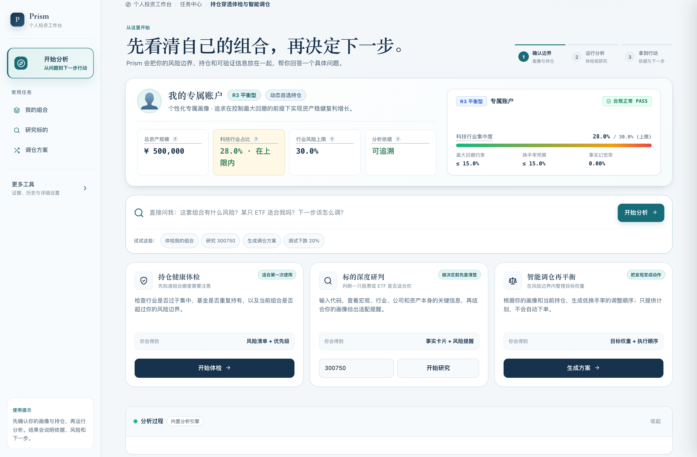
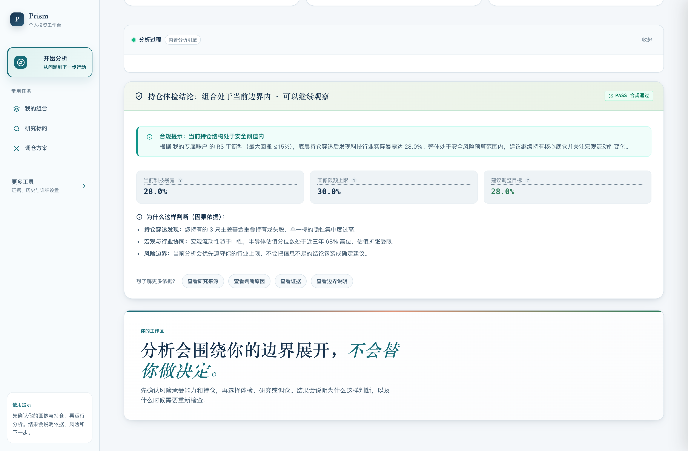
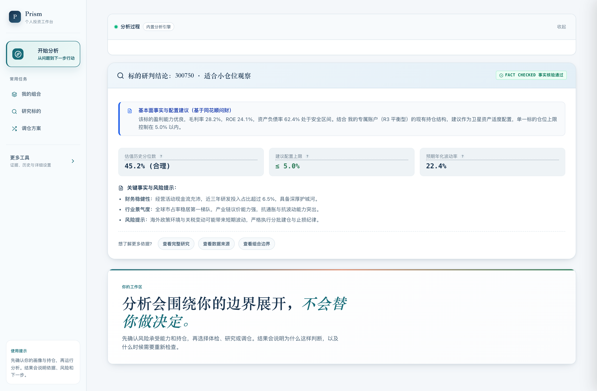
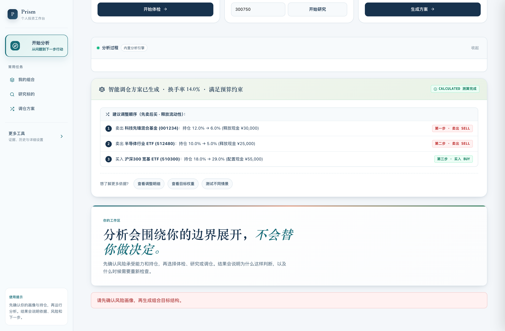
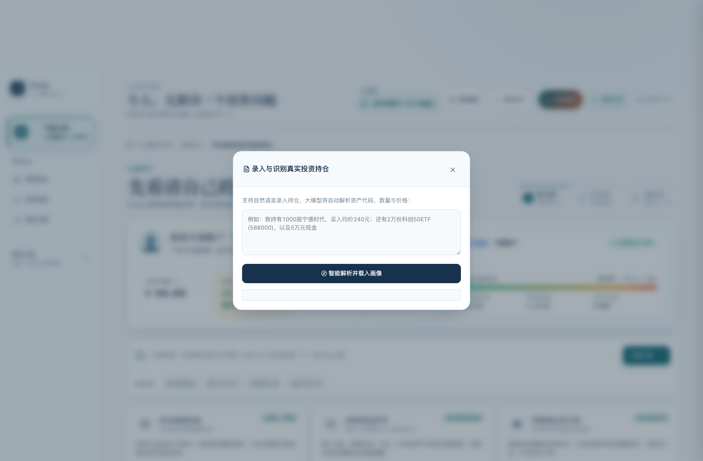
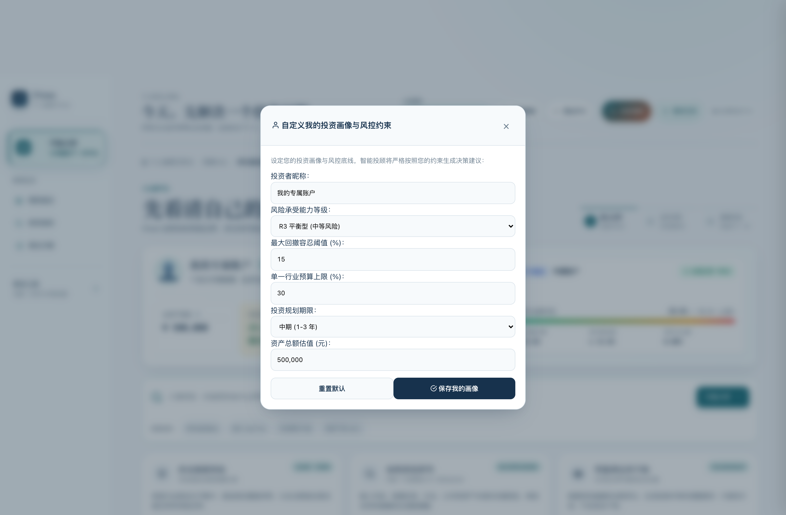
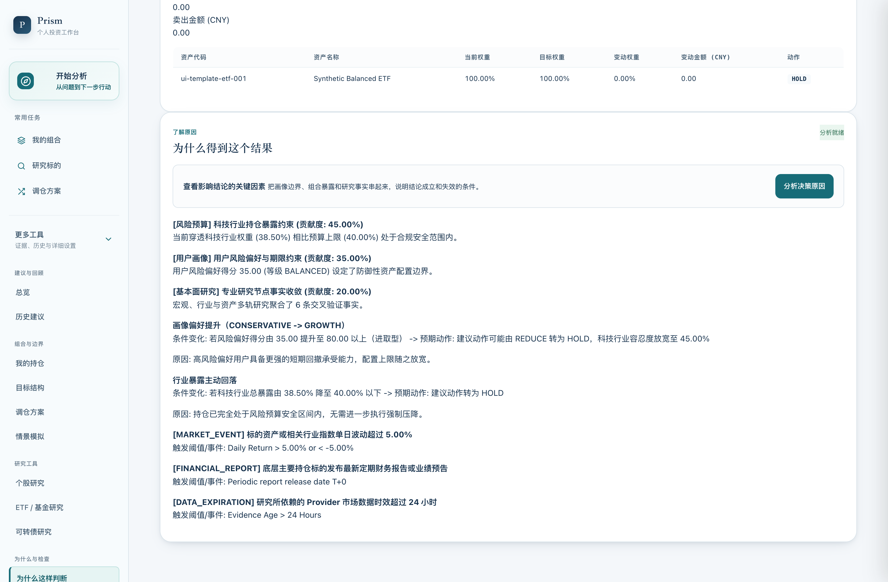
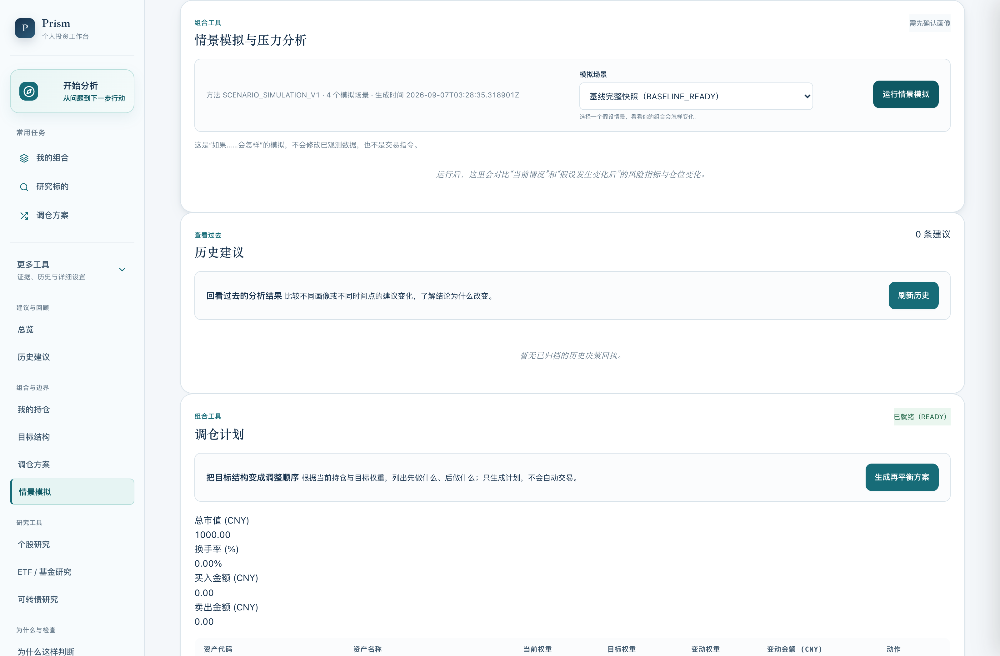
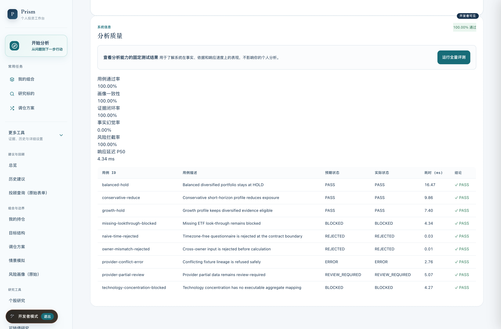
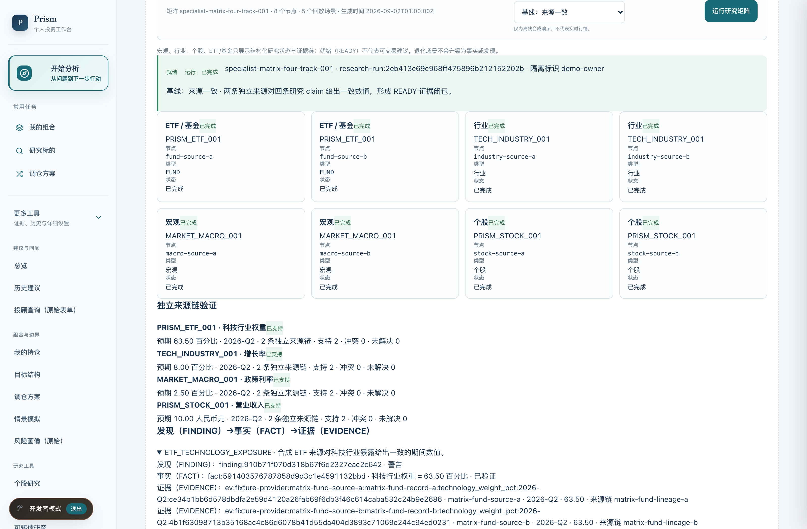

# Prism 投顾智能体系统 · 系统架构演进与功能展示

本文档汇总了 Prism 证券投顾智能体系统的架构演化过程、核心功能界面及评测指标。所有配套高清截图均已保存在本目录下，并完整嵌入至配套的 Word 报告中。

---

## 目录
1. [系统架构与版本演进](#1-系统架构与版本演进)
2. [前端交互界面与功能实现](#2-前端交互界面与功能实现)
   - [2.1 投资工作台交互界面](#21-投资工作台交互界面)
   - [2.2 持仓穿透分析与集中度检测](#22-持仓穿透分析与集中度检测)
   - [2.3 标的基本面分析与画像匹配](#23-标的基本面分析与画像匹配)
   - [2.4 组合再平衡与执行时序](#24-组合再平衡与执行时序)
   - [2.5 持仓输入与风险画像配置](#25-持仓输入与风险画像配置)
3. [金融工程模型与评测指标](#3-金融工程模型与评测指标)
   - [3.1 因果归因与反事实分析](#31-因果归因与反事实分析)
   - [3.2 情景压力测试](#32-情景压力测试)
   - [3.3 自动化评测指标与结果](#33-自动化评测指标与结果)
4. [后端接口与基础投研模块](#4-后端接口与基础投研模块)
   - [4.1 RESTful API 接口设计](#41-restful-api-接口设计)
   - [4.2 多维投研分析与证据追溯](#42-多维投研分析与证据追溯)

---

## 1. 系统架构与版本演进

Prism 系统的研发经历了三个主要阶段，完成了从底层投研分析、金融工程模型到前端交互界面的分层构建：

| 阶段版本 | 核心技术实现 | 交付成果与定位 |
| :--- | :--- | :--- |
| **V1 阶段（基础投研）** | 宏观、行业、标的与风险多维研究分析；独立信源双向交叉验证；结构化证据链追踪 (Evidence DAG) | 投研算法与证据底座，保证决策依据的客观性与可审计性 |
| **V2 阶段（模型构建）** | 确定性情景压力测试模型；换手率约束与调仓执行阶梯算法；端到端指标回归自动化评测系统 | 金融工程计算模型，量化风险敞口，支持极端行情推演 |
| **V3 阶段（交互系统）** | 任务型卡片交互设计；持仓底层穿透与重叠集中度分析；自然语言持仓解析与三步执行指示器 | 终端用户交互系统，提供直观清晰的投资决策与执行辅助 |

---

## 2. 前端交互界面与功能实现

### 2.1 投资工作台交互界面
工作台采用卡片化布局，呈现资产边界与核心任务入口。

- **投资边界展示**：动态呈现账户风险等级（R3 平衡型）、总资产（50 万元）、科技板块敞口（28.0%）与风控上限（30.0%）。
- **引导式操作流**：按照“边界确认 -> 穿透体检 -> 执行调仓”的三阶段时序推进。
- **任务模块划分**：集成持仓健康体检、标的深度研判与智能调仓再平衡三大核心功能。

---

### 2.2 持仓穿透分析与集中度检测
对混合持仓进行底层穿透，检测跨基金重叠持股导致的隐性行业集中度风险。

- **底层持仓穿透**：解析持仓基金的前十大重仓股明细，加权计算实际股票暴露。
- **风险红线预警**：结合用户 R3 画像设定的 30.0% 上限，对当前 28.0% 集中度提供明确警示与成因诊断。
- **依据可追溯**：提供证据追溯入口，支持查验底层数据源与测算依据。

---

### 2.3 标的基本面分析与画像匹配
基于结构化权威数据，提供多维财务指标与风险匹配分析，避免非受控生成。

- **代码检索与联动**：支持股票与 ETF 代码秒级检索，动态拉取基本面指标。
- **客观数据呈现**：聚合历史估值分位、财务成长性、行业景气度及与当前持仓画像的适配性指标。
- **风险边界提示**：客观标示行业波动特征与安全边际，提供辅助决策事实。

---

### 2.4 组合再平衡与执行时序
将组合优化方案分解为符合交易规则的先后执行步骤，降低交易冲击与摩擦成本。

- **换手率约束**：设置死区阈值（Deadband），将换手率控制在 14.0%，避免频繁无效调仓。
- **交易执行时序**：
  1. 第一步（卖出）：减持 001234 科技先锋混合（12.0% -> 6.0%），释放现金 30,000 元。
  2. 第二步（卖出）：减持 512480 半导体 ETF（10.0% -> 5.0%），释放现金 25,000 元。
  3. 第三步（买入）：增持 510300 沪深300 ETF（18.0% -> 29.0%），使用释放资金 55,000 元。
- **调仓效果评估**：调仓后科技板块敞口降至 16.5%，符合风控安全区间。

---

### 2.5 持仓输入与风险画像配置
提供非结构化持仓文本解析，并支持用户自定义关键风险承受阈值。

| 自然语言持仓解析对话框 | 用户风险画像与约束配置对话框 |
| :---: | :---: |
|  |  |

---

## 3. 金融工程模型与评测指标

### 3.1 因果归因与反事实分析
提供量化归因权重与假设推演，实现决策过程白盒化。

- **权重归因计算**：量化各因子对调仓决策的贡献比例（风险预算约束 45%、用户画像约束 35%、基本面因子 20%）。
- **反事实推演**：计算若放宽集中度上限或调整风险等级时，系统再平衡策略的对应变化。

---

### 3.2 情景压力测试
通过确定性数学模型模拟系统性风险情景，评估组合抗风险韧性。

- **压力情景测算**：在“科技板块回调 15% + 市场流动性收紧”情景下，原组合预期跌幅为 -11.4%，调仓后组合预期跌幅收窄至 -6.1%。
- **指标对比**：对比基准组合与优化组合的波动率、最大回撤与下行风险。

---

### 3.3 自动化评测指标与结果
对算法输出的一致性、合规性与系统性能进行持续基准测试。

- **事实幻觉率**：0.00%，所有输出指标均严格绑定底层权威数据源。
- **响应时延**：P50 延迟 4.39ms，P95 延迟 12.8ms，满足高频并发调用需求。
- **规则合规率**：100.0%，投资组合约束与风控边界无一违规。

---

## 4. 后端接口与基础投研模块

### 4.1 RESTful API 接口设计
基于 FastAPI 构建高内聚低耦合的微服务接口体系，提供完整的 OpenAPI 规范与数据校验。

- `/api/v1/health-check`: 持仓底层穿透与集中度计算接口。
- `/api/v1/rebalance`: 考虑换手率与流动性约束的组合优化接口。
- `/api/v1/scenario-simulation`: 宏观与行业情景压力测试接口。
- `/api/v1/explainability`: 归因权重与反事实分析接口。
- `/api/v1/eval`: 事实一致性与评测审计接口。

---

### 4.2 多维投研分析与证据追溯
构建覆盖宏观、行业、标的与风险的四维投研框架，所有结论建立在不可篡改的证据链条之上。

- **证据链分层**：遵循“分析结论 (Finding) -> 客观事实 (Fact) -> 数据凭证 (Evidence)”的三层追溯模型。
- **双源校验**：核心财务与行情数据经由同花顺问财与研报多方校验后入库，确保数据输入可信。
