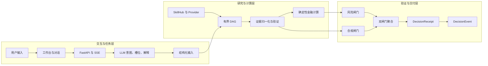
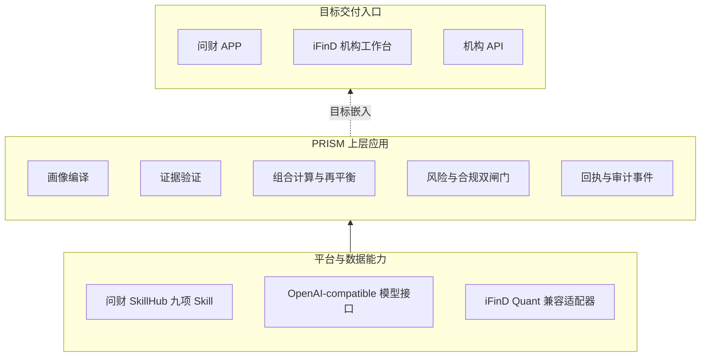
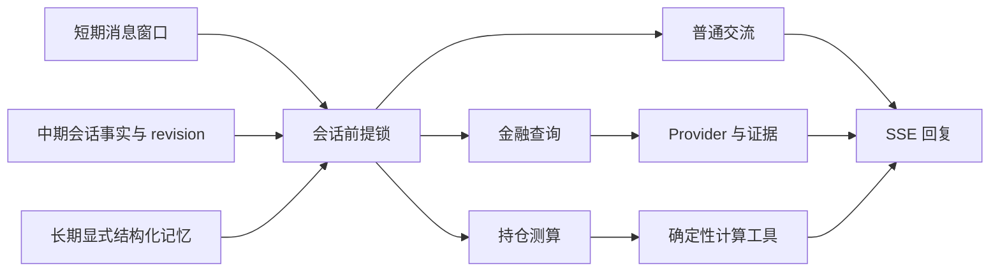

# PRISM 技术模块 10 页答辩 PPT 高质量提纲

> 用途：交付专业 PPT 制作 Skill 直接生成 16:9 答辩页面。本文件只定义内容、视觉关系、工程证据与表述边界，不包含成品 PPT。

## 第一章 总体要求

### 一、技术章节的核心结论

PRISM 复用问财 SkillHub 的金融查询能力，在上层增加画像约束、证据验证、确定性组合计算、风险与合规双闸门以及版本化决策回执，形成可核验、可复算、可阻断的个性化投顾流程。

全章围绕一个问题展开：

> 系统如何证明一条个性化投顾建议使用了正确的用户前提、可靠的数据和可复核的计算，并在不满足条件时停止输出。

### 二、十页叙事顺序


| 板块 | 页码 | 回答的问题 | 评委应形成的判断 |
|---|---:|---|---|
| 整体架构 | P1-P2 | 系统如何分工，采用什么技术实现 | 大模型不承担金融计算，工程结构真实可运行 |
| 平台集成 | P3-P4 | 如何使用同花顺能力，如何部署交付 | 复用底座并新增决策控制，不夸大平台上线状态 |
| 工作链路 | P5-P7 | 一次建议如何产生，如何变成可执行数量 | 画像、证据、组合计算和闸门使用同一版本关系 |
| 自研机制 | P8-P10 | 可信性、可复算性和状态隔离如何实现 | 八项机制共同控制建议资格，而非依赖模型自律 |

### 三、视觉与信息密度规范

| 项目 | 制作要求 |
|---|---|
| 画布 | 16:9 白底，四周保留约 5% 安全区，不增加封面或章节页 |
| 视觉比例 | 每页约 70% 图形，30% 文字；每页只设置一个主视觉 |
| 配色语义 | 深蓝表示输入、接口和状态；橙色表示核心计算；绿色表示已验证或通过；灰色表示外部系统与辅助信息；褐色表示复核、历史或生产建设项 |
| 字体层级 | 页面标题不低于 30 pt；结论或副标题不低于 20 pt；图内标签不低于 16 pt |
| 状态标签 | 只使用 `PASS`、`CALCULATED`、`REVIEW_REQUIRED`、`BLOCKED`、`HISTORICAL_ONLY`、`DRIFT_DETECTED` 等真实状态 |
| 图形风格 | 使用扁平技术图、流程线、矩阵、漏斗和 DAG；不使用机器人、K 线大屏、金币等装饰性金融图片 |
| 截图原则 | 只截取能证明功能的局部；截图占页面 20% 至 35%，不得让小字承担主要叙事 |
| 线型语义 | 实线表示当前实现；虚线表示目标嵌入；点划线或褐色表示生产建设项 |
| 页脚 | `PRISM 技术模块`、页码、`ADVISORY_ONLY` |

### 四、全章统一创新锚点

专业 PPT Skill 应在十页中反复强化以下四点，但不要每页重复完整句子：

1. **画像进入计算**：C1-C5 是展示层，内部将有效画像编译为确定性风险预算和规则档位。
2. **事实依赖独立来源**：多个智能体重复同一来源不会提高证据等级，系统按 lineage 去重并验证。
3. **金融数值由确定性模块计算**：金额、权重、穿透暴露、HHI、费用和股数使用 Decimal 与显式规则。
4. **建议资格先于建议生成**：风险与合规双闸门均为 `PASS` 后，系统才生成 Recommendation 和 DecisionReceipt。

### 五、可直接使用的项目视觉资产

| 资产 | 建议用途 | 使用方式 |
|---|---|---|
| `E:\prism\docs\submission\figures\prism-figure-02-architecture.png` | P1 架构关系参考 | 重新构图，不直接压缩整张长图 |
| `E:\prism\docs\submission\figures\prism-figure-03-dependencies.png` | P3 平台依赖参考 | 提取 SkillHub、模型、存储与 PRISM 的依赖关系 |
| `E:\prism\docs\submission\figures\prism-figure-04-research-dag.png` | P9 DAG 结构参考 | 重绘为少节点拓扑图 |
| `E:\prism\docs\submission\figures\prism-figure-05-personalization-chain.png` | P5 个性化链路参考 | 提取画像到建议的主链路 |
| `E:\prism\docs\submission\figures\prism-figure-06-decision-gates.png` | P1、P10 双闸门参考 | 保留独立输入与聚合关系 |
| `E:\prism\docs\showcase\10_backend_api_architecture_swagger.png` | P2 工程证据 | 裁切接口分组和 OpenAPI 路由区域 |
| `E:\prism\docs\showcase\01_v3_investor_workbench_overview.png` | P5 产品闭环证据 | 裁切画像、持仓和分析入口 |
| `E:\prism\docs\showcase\full_workbench.png` | P6 多轮对话入口 | 裁切对话区和画像、持仓侧栏 |
| `E:\prism\docs\showcase\04_v3_rebalancing_plan_stepper.png` | P7 再平衡证据 | 裁切 SELL、SELL、BUY 步骤与状态 |
| `E:\prism\docs\showcase\06_v3_user_profile_modal.png` | P8 画像证据 | 裁切问卷维度或画像约束区域 |
| `E:\prism\docs\showcase\07_v2_advanced_explainability_dag.png` | P9 研究调度证据 | 裁切 DAG 节点、依赖和状态 |

本章节无需生成式插画。现有技术图和真实页面截图能够提供更强的工程真实性。

## 第二章 逐页内容与视觉蓝图

## P1 系统总体分层架构

### 页面任务

建立全章最重要的责任边界：语言模型负责理解与表达，金融事实和数值进入确定性模块，建议输出受证据验证和双闸门控制。

### 页面标题与核心结论

- 标题：`系统总体分层架构`
- 副标题：`语言模型负责理解与表达，金融数值与建议资格由确定性模块裁决`
- 页面右上角：`当前实现`

### 主视觉

采用三条横向泳道，占页面约 75%。数据流从左向右，禁止连接线穿过文字。



### 页面可见文字

只保留三组短句：

- `LLM：意图识别、槽位解析、通俗解释`
- `确定性引擎：金额、权重、暴露、HHI、费用、交易数量`
- `双 PASS 后生成正式建议与决策回执`

在 LLM 与确定性计算之间加入一条明显隔离线，标注：

`模型文本不能直接成为金融事实或调仓数量`

### 项目证据

| 证据 | 位置 | 证明内容 |
|---|---|---|
| 总体架构 | `E:\prism\docs\submission\competition-technical-solution.md` 第五章 | 模块化单体、分层与数据流 |
| 主服务链路 | `E:\prism\app\service\advisor_query.py` | 画像、组合、研究、证据和闸门的端到端组合 |
| 双闸门 | `E:\prism\app\gates\`、`E:\prism\app\recommendation\` | 建议资格与 DecisionReceipt |
| 决策事件 | `E:\prism\app\api\main.py`、`E:\prism\app\store\` | DecisionEvent 保存与回放 |

### 答辩讲法

从用户输入开始顺着箭头讲到 DecisionEvent。重点停留在隔离线和双闸门，不逐个念模块名称。

### 禁止表述

- 不说“大模型自动完成金融分析”。
- 不把 DecisionReceipt 表述为数字签名或法律凭证。
- 不说系统自动执行交易。

## P2 前后端技术栈与工程环境

### 页面任务

证明项目已经形成可运行工程，同时说明模块化单体适合竞赛交付并保留后续拆分条件。

### 页面标题与核心结论

- 标题：`前后端技术栈与工程环境`
- 副标题：`模块化单体降低演示与部署成本，领域契约保留拆分边界`
- 页面右上角：`当前实现`

### 主视觉

使用一条横向技术链，不使用五张同尺寸卡片：

`浏览器工作台`、`FastAPI 接口`、`领域服务与 Decimal 计算`、`SQLite / PostgreSQL`、`外部金融能力`

在主链下方嵌入一张约占页面 25% 的 Swagger 局部截图，作为真实工程证据。

### 页面可见文字

| 区域 | 只保留的关键词 |
|---|---|
| 前端 | `HTML / CSS / JavaScript`、`Hash 路由`、`SSE`、`AntV X6`、`Lightweight Charts` |
| 后端 | `Python 3.11-3.12`、`FastAPI`、`Pydantic 2`、`Uvicorn` |
| 计算 | `Decimal`、`Pydantic 契约`、`SHA-256 指纹` |
| 存储 | `SQLite 默认`、`PostgreSQL 可选` |
| 外部能力 | `问财 SkillHub 九项 Skill`、`OpenAI-compatible 模型`、`RapidOCR` |

底部用一行小字说明：

`iFinD Quant 为显式配置的数据适配器，不作为默认启用能力表述`

### 工程截图

- 文件：`E:\prism\docs\showcase\10_backend_api_architecture_swagger.png`
- 裁切重点：接口分组、投顾对话、组合决策、记忆与审计路由。
- 不展示浏览器地址栏和无关接口细节。

### 项目证据

| 证据 | 位置 |
|---|---|
| Python、FastAPI、Pydantic 版本 | `E:\prism\pyproject.toml` |
| 前端静态应用与 Hash 路由 | `E:\prism\app\api\static\` |
| 工作流编辑器 | `E:\prism\tools\build_workflow.mjs`、`E:\prism\app\api\static\workflow-editor.src.js` |
| SSE 对话 | `POST /api/v1/copilot/chat` |
| OCR 持仓解析 | `E:\prism\app\llm\ocr_portfolio_parser.py` |

### 答辩讲法

说明选择模块化单体的原因是交付和本地部署，不把它描述为架构能力不足。强调外部 Provider、研究编排和存储均可通过依赖注入替换。

## P3 与同花顺 SkillHub 平台集成方案

### 页面任务

说明 PRISM 是基于 SkillHub 能力构建的上层智能体应用，复用数据与模型底座，同时新增个性化决策控制。

### 页面标题与核心结论

- 标题：`与同花顺 SkillHub 的集成方案`
- 副标题：`复用平台金融能力，在上层增加画像、证据、组合计算和建议审查`

### 主视觉

采用三层嵌入结构。必须用线型区分当前实现与目标入口。



### SkillHub 能力清单

不要在页面上展示九行表格。将九项能力压缩为三组标签：

- `公告、新闻、研报`
- `行情、财务、行业、宏观`
- `基金、可转债`

角落保留两个接口标签：

- `/v1/comprehensive/search`
- `/v1/query2data`

### 页面可见文字

- `当前实现：版本化 Skill 清单、服务端 Bearer 鉴权、四态 ProviderResult`
- `PRISM 新增：画像约束、来源验证、确定性组合计算、双闸门、DecisionReceipt`
- `目标形态：嵌入问财 APP、机构工作台或外部 API`

### 项目证据

| 证据 | 位置 | 说明 |
|---|---|---|
| 九项 Skill 清单 | `E:\prism\app\providers\iwencai_skills.json` | 清单版本、技能标识、版本、路径和摘要 |
| 官方适配器 | `E:\prism\app\providers\skillhub.py` | 请求路由、鉴权与结果映射 |
| 四态协议 | `E:\prism\app\providers\contracts.py` | `SUCCESS / PARTIAL / EMPTY / FAILED` |
| 默认注册 | `E:\prism\app\api\main.py` 中 `WencaiSkillHubProvider` | 当前应用默认提供方 |

### 答辩讲法

先讲复用，再讲新增。明确“上层应用和 API 已实现”，问财 APP 或机构工作台内部上线属于目标嵌入，不使用实线或“已经上线”字样。

## P4 部署与交付形态

### 页面任务

说明同一套业务规则如何支持竞赛演示和生产化部署，并明确 Advisory-Only 安全边界。

### 页面标题与核心结论

- 标题：`部署与交付形态`
- 副标题：`演示环境可独立运行，生产环境复用相同领域契约`

### 主视觉

左右双轨部署图。左侧占 45%，右侧占 45%，底部共用一条安全边界。

| 左侧：当前演示环境 | 右侧：生产落地目标 |
|---|---|
| 浏览器与 FastAPI 同源运行 | 反向代理与独立身份服务 |
| SQLite、WAL、在线备份 | PostgreSQL、备份恢复、独立监控 |
| Windows DPAPI 保护本地凭据 | 机构密钥管理与审计体系 |
| 固定数据支持离线回放 | 正式授权 Provider 与容量规划 |

两侧底部共同连接：

`ADVISORY_ONLY：不接管券商账户，不生成订单，不执行交易`

### 交付物

在页面右下方使用四个扁平图标加短标签，不使用清单卡片：

- `前端工作台`
- `API 服务`
- `技术文档`
- `测试用例`

### 项目证据

| 证据 | 位置 |
|---|---|
| SQLite 默认路径与 PostgreSQL 切换 | `E:\prism\app\api\main.py`、`E:\prism\app\store\` |
| SQLite WAL 与写入控制 | `E:\prism\app\store\sqlite.py` |
| 本地凭据保护 | `E:\prism\app\security\`、相关 DPAPI 测试 |
| 启动入口 | `E:\prism\start.bat`、`E:\prism\start_mac.sh` |

### 答辩讲法

演示环境讲“当前可运行”，生产环境讲“已预留适配，仍需部署方建设身份、监控和长期 SLA”。不得把 PostgreSQL 适配等同于完整生产化交付。

## P5 完整业务工作总链路

### 页面任务

用一个具体问题串联画像、持仓、研究、证据、闸门和回执，证明各模块形成闭环。

### 页面标题与核心结论

- 标题：`完整业务工作总链路`
- 副标题：`每项建议绑定画像版本、持仓快照、证据引用与闸门状态`

### 主视觉

采用九步横向主链。前三步深蓝，中间三步橙色，后三步绿色。

1. `注册与 owner 归属`
2. `19 题风险问卷`
3. `八维画像与 C1-C5`
4. `持仓导入与确认`
5. `意图与研究计划`
6. `有界 DAG 研究`
7. `证据一致性验证`
8. `风险与合规双闸门`
9. `报告、回执与事件`

主链下方只放三个强化标签：

- `VERSIONED PROFILE`
- `VERIFIED EVIDENCE`
- `DECISION RECEIPT`

### 贯穿案例

页面左下角只保留一句用户问题：

> 我想控制回撤，这套持仓需要怎么调整？

紧邻案例放一句说明：

`持仓支持文本和截图 OCR，低置信字段必须由用户确认`

### 真实产品截图

- 文件：`E:\prism\docs\showcase\01_v3_investor_workbench_overview.png`
- 裁切重点：画像概览、持仓信息、分析任务入口和状态。
- 截图放右下角，占页面约 28%，不得遮挡九步主链。

### 项目证据

| 环节 | 代码或接口 |
|---|---|
| 画像 | `E:\prism\app\profile\`、`/api/v1/advisor/profile/*` |
| 持仓 | `E:\prism\app\portfolio\`、`/api/v1/advisor/portfolio/*` |
| 工作流 | `POST /api/v1/advisor/workflow-runs` |
| 投顾服务 | `E:\prism\app\service\advisor_query.py` |
| 回执与事件 | `E:\prism\app\recommendation\`、`/api/v1/decision-events*` |

### 答辩讲法

不要逐步念九个节点。使用贯穿案例说明：用户前提先被确认，研究和计算在同一版本上运行，建议最后绑定回执和事件。

## P6 AI 对话多轮交互链路

### 页面任务

解释多轮对话如何维持连续性，同时避免旧画像、旧持仓和历史回答进入当前金融计算。

### 页面标题与核心结论

- 标题：`AI 对话多轮交互链路`
- 副标题：`系统先锁定分析前提，再允许模型调用金融工具`

### 主视觉

中央设置“会话前提锁”，左侧为三层记忆，右侧为三条工具路径。所有路径最终合流到 SSE 输出。



### 会话前提锁内的字段

只展示四项：

- `画像版本`
- `持仓版本`
- `数据模式`
- `SHA-256 fingerprint`

前提锁下方显示两种接口状态：

- `expected_revision`
- `DRIFT_DETECTED`

### 记忆边界

| 层次 | 用途 | 金融事实资格 |
|---|---|---|
| 短期消息 | 当前对话的指代消解 | 无，仍需工具重新读取 |
| 中期会话事实 | 锁定 owner、画像、持仓和数据模式 | 有版本约束，漂移即停止 |
| 长期显式记忆 | 用户主动保存的结构化记录 | `HISTORICAL_ONLY`，确认恢复后重新计算 |

表格只供制作理解，成品页应画成三层结构，不直接贴完整表格。

### 真实产品截图

- 文件：`E:\prism\docs\showcase\full_workbench.png`
- 裁切重点：对话入口、画像与持仓速览、任务入口。
- 截图旁标注：`对话入口共享同一画像与持仓上下文`

### 项目证据

| 机制 | 位置 |
|---|---|
| 流式对话 | `POST /api/v1/copilot/chat` |
| 会话事实与指纹 | `E:\prism\app\service\session_truth.py` |
| 结构化记忆 | `GET/POST /api/v1/advisor/context-memory` |
| 历史只读检索 | `E:\prism\app\service\semantic_memory.py` |
| 同作用域最近消息 | `copilot_conversations`、`copilot_messages` 相关服务与测试 |

### 答辩讲法

指出历史对话只帮助理解追问，不是金融事实来源。普通交流、金融查询和持仓测算使用不同工具路径，模型文本不能反向写成报价、画像或持仓事实。

## P7 持仓分析与再平衡工作链路

### 页面任务

说明系统如何从持仓诊断走到可交易数量，并在交易后重新检查风险。

### 页面标题与核心结论

- 标题：`持仓分析与再平衡工作链路`
- 副标题：`目标权重转换为受整手、费用与现金约束的交易数量`

### 主视觉

左侧使用诊断漏斗，中央使用执行阶梯，右侧放真实调仓步骤截图。

#### 诊断漏斗

1. `持仓导入与用户确认`
2. `基金与 ETF 穿透暴露`
3. `HHI 与画像风险预算`
4. `识别超限项与目标权重`

#### 执行阶梯

1. `0.50% 默认权重死区`
2. `先卖后买`
3. `股票与 ETF 按 100 股整手`
4. `印花税、过户费、佣金`
5. `换手上限与现金下限`
6. `交易后完整体检`

阶梯旁使用两个技术标签：

- `Decimal 算术`
- `二分法求可承受买入手数`

### 真实产品截图

- 文件：`E:\prism\docs\showcase\04_v3_rebalancing_plan_stepper.png`
- 裁切重点：交易步骤、SELL / BUY 顺序、状态标签。
- 截图下方写：`真实执行步骤示例：SELL、SELL、BUY`

### 输入与输出

| 输入 | 输出 |
|---|---|
| 已确认持仓、价格、目标权重、费用参数、现金约束 | HOLD / SELL / BUY 动作、金额、股数、费用、交易后组合与复核状态 |

### 项目证据

| 证据 | 位置 |
|---|---|
| 再平衡服务 | `E:\prism\app\service\portfolio_rebalancing.py` |
| 约束接口 | `E:\prism\app\rebalancing\contracts.py` |
| 接口 | `POST /api/v1/advisor/rebalancing-runs` |
| 回归测试 | `E:\prism\tests\unit\test_portfolio_rebalancing.py` |

### 答辩讲法

强调结果属于“序贯确定性求解”。项目当前不包含基于协方差、流动性压力和长期回测的全局最优求解，不使用“最优交易方案”表述。

## P8 自研算法① 画像、风险与证据验证

### 页面任务

展示自研机制 01 和 02：画像如何转换为硬约束，金融事实如何通过独立来源验证。

### 页面标题与核心结论

- 标题：`自研算法① 画像、风险与证据验证`
- 副标题：`画像进入约束计算，事实升级依赖独立来源`

### 左半页：01 画像条件化风险预算映射

#### 图形结构

`19 题问卷`连接八维画像，再连接`C1-C5 适当性展示`，随后进入内部三档规则和风险预算。

八个维度：

- 风险承受
- 投资经验
- 交易活跃
- 自主研究
- 信息投入
- AI 信任
- 个性需求
- 辅助需求

内部规则层必须与 C1-C5 分开绘制：

- 展示层：`C1-C5`
- 内部确定性规则：`CONSERVATIVE / BALANCED / GROWTH`
- 输出约束：`资产、行业、科技行业、未分类暴露上限`

#### 输入、输出与价值

| 输入 | 输出 | 解决的问题 |
|---|---|---|
| 19 题问卷与确认画像 | 八维分数、C1-C5、内部规则档位、风险预算 | 避免画像只停留在用户标签或提示词 |

### 右半页：02 来源等价类证据验证

#### 图形结构

画三条记录：

- `记录 A1，lineage-A`
- `记录 A2，lineage-A`
- `记录 B1，lineage-B`

A1 与 A2 先按 lineage 合并，再与 B1 进行独立来源一致性验证。

输出状态只展示：

- `SUPPORTED`
- `CONTRADICTED`
- `UNRESOLVED`
- `INSUFFICIENT`

底部结论：

`同一来源的重复记录只计一次；清晰支持至少需要两个独立 lineage`

#### 输入、输出与价值

| 输入 | 输出 | 解决的问题 |
|---|---|---|
| 带来源、时间、单位和 lineage 的 Evidence | 事实状态、支持血缘、冲突与缺项 | 防止重复来源被误认为多源验证，降低模型幻觉影响 |

### 真实产品截图

- 文件：`E:\prism\docs\showcase\06_v3_user_profile_modal.png`
- 作为左侧小型工程证据，裁切问卷或画像约束部分。

### 项目证据

- `E:\prism\app\profile\`
- `E:\prism\app\risk\budget.py`
- `E:\prism\app\research\cross_validation.py`
- `E:\prism\app\providers\contracts.py`

### 答辩讲法

先说“画像不是标签”，再说“多智能体一致不等于多源证据”。两个机制分别控制个性化前提和事实可靠性。

## P9 自研算法② 组合计算与任务调度

### 页面任务

展示自研机制 03 和 04：组合计算保持价值守恒，研究执行具有固定拓扑和时间边界。

### 页面标题与核心结论

- 标题：`自研算法② 组合计算与任务调度`
- 副标题：`穿透计算保持守恒，研究调度记录依赖、超时和失败`

### 左半页：03 穿透暴露矩阵与 HHI

使用简化桑基图或流向图：

- 股票持仓直接归属行业。
- 基金与 ETF 按披露成分拆分。
- 未披露残值进入 `UNCLASSIFIED`。
- 直接暴露、穿透暴露和未分类暴露合计等于组合总值。

页面只允许两条简式公式：

```text
E_g = Σ v_i w_i,g
HHI = 10000 Σ(E_g / V)²
```

底部状态：`CALCULATED`、`CONSERVATION PASS`

#### 输入、输出与价值

| 输入 | 输出 | 解决的问题 |
|---|---|---|
| 股票、基金、ETF 市值与披露成分 | 资产和行业暴露、未分类残值、HHI | 识别基金表面分散但底层集中的风险 |

### 右半页：04 时间预算约束 DAG

使用 6 至 8 个节点的拓扑图：

- 根节点：研究计划与总 deadline。
- 并行节点：宏观、行业、个股、基金或转债研究。
- 汇合节点：证据归一化与验证。
- 每个节点显示 `READY / RUNNING / COMPLETE / PARTIAL / BLOCKED` 中的一种状态。

下方只保留三个约束：

- `节点 timeout`
- `总 deadline`
- `取消与失败向下游传播`

#### 输入、输出与价值

| 输入 | 输出 | 解决的问题 |
|---|---|---|
| 结构化意图、任务模板、依赖和时间预算 | 节点结果、终态、超时和未执行原因 | 防止无限自治执行，保留可观察的失败路径 |

### 真实产品截图

- 文件：`E:\prism\docs\showcase\07_v2_advanced_explainability_dag.png`
- 只截取 DAG 节点与状态，作为右半页背景证据或局部放大。

### 项目证据

- `E:\prism\app\portfolio\exposure.py`
- `E:\prism\app\risk\concentration.py`
- `E:\prism\app\orchestration\contracts.py`
- `E:\prism\app\orchestration\executor.py`
- `POST /api/v1/advisor/workflow-runs`

### 答辩讲法

左侧回答“怎么算得对”，右侧回答“任务怎么有边界地运行”。强调部分结果、失败和超时不会被静默改写为成功。

## P10 自研算法③ 决策控制与会话记忆

### 页面任务

用一页汇总自研机制 05 至 08，并回扣整套系统的建议资格控制。

### 页面标题与核心结论

- 标题：`自研算法③ 决策控制与会话记忆`
- 副标题：`四项控制共同决定建议是否具备输出资格`

### 主视觉

采用 2×2 大区块，每块是一张微型流程图。四块共同连接中央圆形节点：

`建议资格：仅 PASS 输出`

#### 05 离散交易约束下的序贯再平衡

微流程：

`目标金额`、`整手股数`、`费用与现金`、`交易后复核`

一句价值：`把目标权重转换为可执行数量，并保留约束与失败原因`

#### 06 双闸门状态聚合

微流程必须画成两个独立输入：

`风险闸门`与`合规闸门`共同进入`建议资格聚合`

状态优先级：

`BLOCKED > REVIEW_REQUIRED > PASS`

一句价值：`只有双 PASS 才允许生成 Recommendation`

#### 07 分层记忆与版本化会话状态

微流程：

`短期消息`、`会话事实`、`显式记忆`共同进入`revision + fingerprint 校验`

一句价值：`阻止旧画像或旧持仓静默进入新计算`

#### 08 历史记忆检索与受控恢复

微流程：

`检索最近 100 条显式记录`、`HISTORICAL_ONLY`、`用户确认恢复`、`清空旧派生结果并重新计算`

一句价值：`历史可以检索，但不能自动成为当前决策前提`

### 页面底部收束

只保留四个词，形成技术章节结论：

- `可复算`
- `可追踪`
- `可阻断`
- `可恢复`

### 项目证据

| 机制 | 位置 |
|---|---|
| 05 再平衡 | `E:\prism\app\service\portfolio_rebalancing.py`、`E:\prism\app\rebalancing\` |
| 06 双闸门 | `E:\prism\app\gates\pipeline.py`、`E:\prism\app\recommendation\` |
| 07 版本状态 | `E:\prism\app\service\session_truth.py`、前端上下文版本逻辑 |
| 08 历史检索 | `E:\prism\app\service\semantic_memory.py`、`E:\prism\app\store\context.py` |

### 答辩讲法

不逐项展开实现细节。用中央“建议资格”解释四类控制的关系：再平衡保证数量可执行，双闸门控制是否放行，版本状态阻止前提漂移，受控恢复防止历史污染当前决策。

## 第三章 页面状态、接口与事实边界

### 一、重要接口标签

| 场景 | 页面可展示接口 | 使用页面 | 表述边界 |
|---|---|---:|---|
| 流式对话 | `POST /api/v1/copilot/chat` | P2、P6 | SSE 输出不代表金融事实已经验证 |
| 工作流运行 | `POST /api/v1/advisor/workflow-runs` | P5、P9 | 有界 DAG，不表述为无限自治 Agent |
| 再平衡 | `POST /api/v1/advisor/rebalancing-runs` | P7、P10 | 只输出 `ADVISORY_ONLY` 方案 |
| 上下文记忆 | `GET/POST /api/v1/advisor/context-memory` | P6、P10 | 历史记录必须显式恢复并重新计算 |
| SkillHub 搜索 | `/v1/comprehensive/search` | P3 | 公告、新闻和研报能力 |
| SkillHub 结构化查询 | `/v1/query2data` | P3 | 行情、财务、行业、宏观、基金和转债能力 |

### 二、状态语言

| 状态 | 含义 | 页面颜色 | 禁止误解 |
|---|---|---|---|
| `PASS` | 当前检查条件满足 | 绿色 | 不代表收益保证 |
| `CALCULATED` | 已完成确定性计算 | 深蓝或橙色 | 不代表建议已经放行 |
| `REVIEW_REQUIRED` | 数据、来源或适当性仍需复核 | 褐色 | 不应生成完整建议 |
| `BLOCKED` | 输入、归属、引用或禁止表述触发阻断 | 红褐色 | 不可通过补充免责声明绕过 |
| `HISTORICAL_ONLY` | 仅供历史检索 | 褐色 | 不可直接参与当前计算 |
| `DRIFT_DETECTED` | 当前版本与请求前提不一致 | 红色 | 不可继续沿用旧结论 |

### 三、必须保留的事实边界

1. SkillHub 九项 Skill 已完成项目级适配，但配额、长期可用性和 SLA 受外部条件约束。
2. iFinD Quant 属于可配置适配器，不表述为默认启用或已具备完整机构授权。
3. C1-C5 是用户展示与适当性层级，内部确定性闸门使用 `CONSERVATIVE / BALANCED / GROWTH` 规则档位。
4. 再平衡属于序贯确定性求解，不宣称全局最优。
5. DecisionReceipt 用于内容追踪和复核，不表述为法律凭证或数字签名。
6. 全部输出保持 `ADVISORY_ONLY`，不连接券商交易账户，不生成订单，不执行交易，不承诺收益。
7. “当前实现”“目标嵌入”“生产建设项”必须通过实线、虚线和角标区分。

## 第四章 交付给专业 PPT Skill 的制作指令

### 一、页面硬约束

- 总页数严格为 10 页，不增加封面、目录、章节过渡页或结束页。
- 每页只保留一个核心结论和一个主视觉。
- 页面正文不超过 4 组重点文字；算法页最多出现 2 条简式公式。
- 八项自研机制必须按 `01` 至 `08` 完整编号。
- 主流程图、DAG、漏斗、部署图和双闸门保持可编辑。
- 产品截图只作为工程证据，不承担主要信息表达。
- 所有连接线保持单向、清晰，不穿过节点文字。
- 每页备注区记录对应代码、文档或截图路径。

### 二、建议的页面节奏

| 板块 | 页码 | 建议讲述时间 |
|---|---:|---:|
| 架构与技术栈 | P1-P2 | 约 1 分 25 秒 |
| 集成与部署 | P3-P4 | 约 1 分 10 秒 |
| 工作链路 | P5-P7 | 约 2 分 20 秒 |
| 自研机制 | P8-P10 | 约 2 分 35 秒 |
| 切页与停顿 | 全程 | 约 30 秒 |

合计约 8 分钟。

### 三、最终验收清单

- 缩略图视图下，每页仍能识别唯一主视觉和核心结论。
- P1 清楚表现 LLM 与确定性金融计算的隔离。
- P3 的当前实现和目标嵌入使用不同线型。
- P5 的画像、持仓、证据、闸门与回执形成连续链路。
- P6 清楚区分会话历史、结构化记忆与当前金融事实。
- P7 显示 0.50% 死区、整手、费用、现金和交易后复核。
- P8 清楚区分 C1-C5 展示层与内部三档规则。
- P9 的暴露图满足守恒关系，DAG 显示超时和失败状态。
- P10 的风险闸门与合规闸门为独立输入，不画成单一串行检查。
- 全套不出现自动下单、收益保证、全局最优、已达长期 SLA 或完整 iFinD 授权等未经工程证据支持的表述。

## 第五章 主要依据

- `E:\prism\docs\submission\competition-technical-solution.md`
- `E:\prism\docs\submission\technical-report.md`
- `E:\prism\docs\submission\figures\`
- `E:\prism\docs\showcase\`
- `E:\prism\app\api\main.py`
- `E:\prism\app\profile\`
- `E:\prism\app\providers\`
- `E:\prism\app\orchestration\`
- `E:\prism\app\portfolio\`
- `E:\prism\app\risk\`
- `E:\prism\app\rebalancing\`
- `E:\prism\app\service\`
- `E:\prism\app\gates\`
- `E:\prism\app\recommendation\`
- `E:\prism\app\store\`
- `E:\prism\tests\unit\`
- `E:\prism\tests\integration\`
