# S2C 技术路线及实现方案

## 3.1 项目总体设计

### 3.1.1 项目架构设计

Prism 面向证券研究与个性化投资决策支持，围绕用户确认的投资者画像、持仓和分析目的，组织金融数据查询、专业研究、确定性计算、风险审查与结果展示。浏览器工作台承担资料输入和交互，FastAPI 服务承担请求校验和任务协调，领域模块承担金融计算与规则检查，存储模块保存资料版本、研究事实和决策记录。

系统采用模块化单体架构，各模块在同一应用中通过结构化对象协作。前端使用 HTTP 提交请求和读取结果，使用 SSE 接收对话内容及工具执行事件。外部金融服务和语言模型通过独立适配模块接入，应用内部保留提供方、来源、数据时间、缺失字段和处理状态。

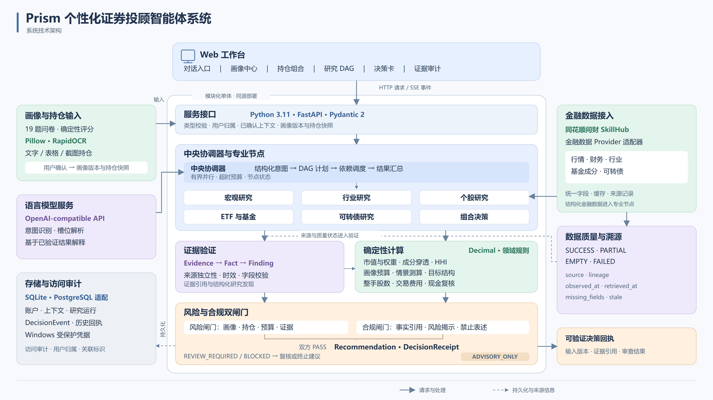

图 3-1 系统技术架构

在图 3-1 中，用户交互层接收问题、问卷、持仓和研究资料；FastAPI、Pydantic 与应用服务检查用户归属、参数及上下文。画像、组合、研究、风险和合规模块完成评分、预算、暴露、证据及交易约束检查。LLM client 与金融 Provider 保留外部请求的处理结果和质量状态，SQLite 或 PostgreSQL 保存当前资料、历史资料、研究事实和回执。

系统包含三类处理流程。对话流程根据问题选择一般解释、金融资料查询或持仓体检；研究流程按节点依赖执行查询并记录资料状态；结构化建议流程使用研究结果、画像预算和组合计算结果，经过风险与合规审查后生成建议及决策回执。各流程使用与其任务相适应的校验条件。

### 3.1.2 大模型设计

#### 使用模型介绍

语言模型负责理解用户意图、解析输入字段、选择查询工具及解释已有结果。金额、比例、成分穿透、集中度和交易数量由 Python 领域模块计算。系统提示词对上述职责作出明确规定，涉及行情、财务指标和基金披露持仓的问题需要调用对应金融工具。

系统通过 `AsyncLLMClient` 调用 OpenAI-compatible 的 `/chat/completions` 接口，采用 HTTPX 异步请求处理流式内容及工具调用参数。`LLMConfig` 管理服务地址、模型名称、温度和请求时间。代码中的默认模型名称为 `deepseek-v4-flash`，服务端配置可以指定其他兼容模型；实际可用性取决于配置的服务、凭据和接口能力。

| 配置字段 | 代码默认值 | 配置作用 | 使用条件 |
| --- | --- | --- | --- |
| `model` | `deepseek-v4-flash` | 指定模型名称 | 按接入服务支持的型号配置 |
| `base_url` | `https://api.deepseek.com/v1` | 指定兼容接口地址 | 服务需支持对应请求与流式协议 |
| `temperature` | 0.2 | 控制生成采样参数 | 属于客户端配置值 |
| `timeout_seconds` | 15.0 秒 | 限制 HTTP 请求等待 | 属于请求配置，不表示实测响应时间 |

表 3-1 模型客户端配置

模型配置与金融数据模式分别管理。正式模型对话使用 LIVE 金融工具，并保留查询失败、部分可用和缺少资料等状态。完整模型调用需要有效服务配置；界面展示或本地处理结果分别保留其实际来源。

研究资料语义检索使用独立的 `intfloat/multilingual-e5-small` embedding 模型。实现固定模型 revision，以 Sentence Transformers 在 CPU 上读取本地模型文件，分别添加 `query: ` 和 `passage: ` 前缀并归一化向量。该模型用于资料检索，混合检索在满足运行与发布条件时启用。

#### 提示词工程介绍

提示词由系统规则、当前已确认上下文、最近消息、用户问题和工具结果共同组成。`COPILOT_SYSTEM_PROMPT` 规定金融事实查询、资料引用、工具分工和风险揭示；`COPILOT_TOOLS` 以 JSON Schema 声明工具名称、输入类型和必需字段。消息构建保留最近六条历史消息，以支持指代和连续追问。

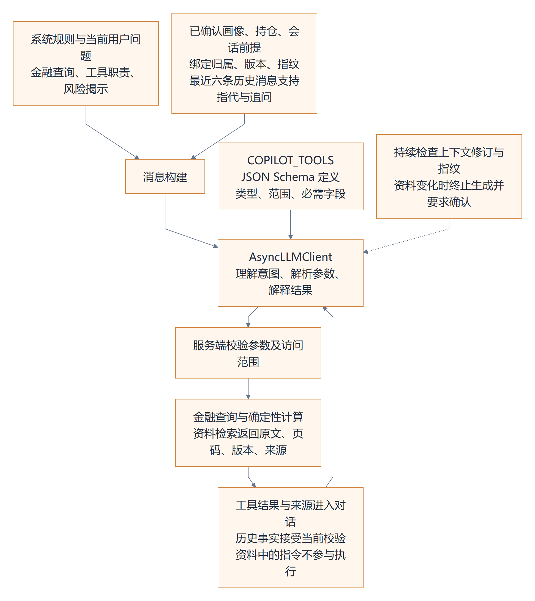

图 3-2 提示词组织与工具处理

主要工具覆盖研究资料检索、结构化金融查询、个股行情、基金披露持仓、问财语义查询、持仓体检和调仓入口。服务端检查工具参数后执行相应请求，将结果与来源信息返回对话流程。已绑定个人前提的对话在生成期间持续校验修订和指纹；资料变化时终止当前生成并提示重新确认。

### 3.1.3 软件结构设计

前端由 `index.html` 提供页面结构，`app.js` 组织账户范围内的状态、事件和 Hash 路由，研究页面脚本管理资料查询、任务运行和算法输入。工作流画布基于 AntV X6，文本展示使用 marked 和 DOMPurify，行情图表使用 Lightweight Charts。

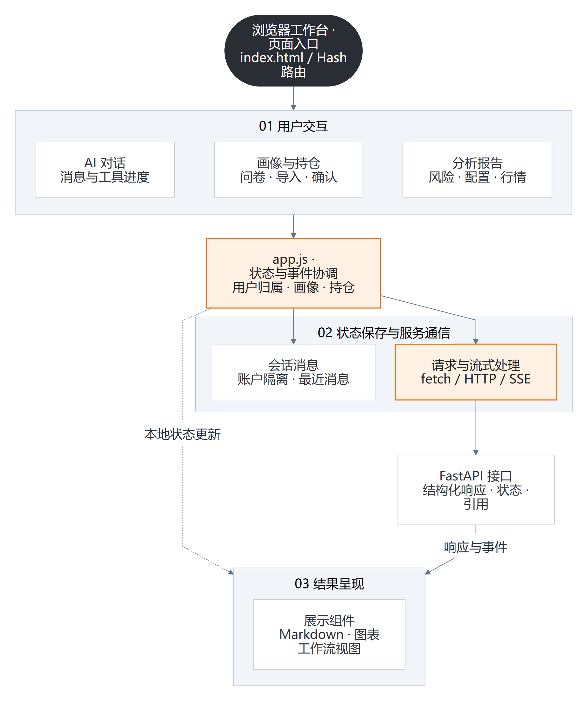

图 3-3 前端交互与状态框架

后端按 `app/api`、`app/service`、领域模块、`app/providers`、`app/llm` 和 `app/store` 组织。接口层完成参数与访问校验，应用服务协调资料与执行过程，领域模块返回结构化计算和审查结果，提供方模块封装外部请求，存储模块处理事务与版本。

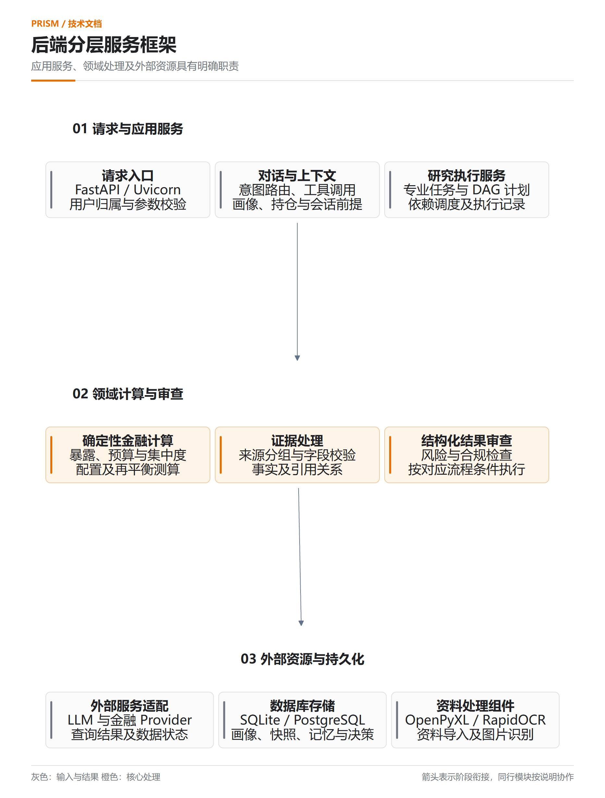

图 3-4 后端分层服务框架

研究工作台在此结构上接入知识资料、LIVE 研究任务与论文算法接口。知识资料服务管理文档、片段和引用；研究执行服务管理节点依赖、排队和时间预算；算法服务对用户提交的时间序列与财务数据进行独立计算。

## 3.2 界面设计

界面以用户任务、所需输入和分析结果为主要内容，使用原生 HTML、CSS 和 JavaScript 构建响应式工作台。顶部导航连接主要页面，历史对话和指数切换由对应侧栏承载；参数、来源、完整结果和低频操作通过折叠区域、菜单或对话框按需显示。

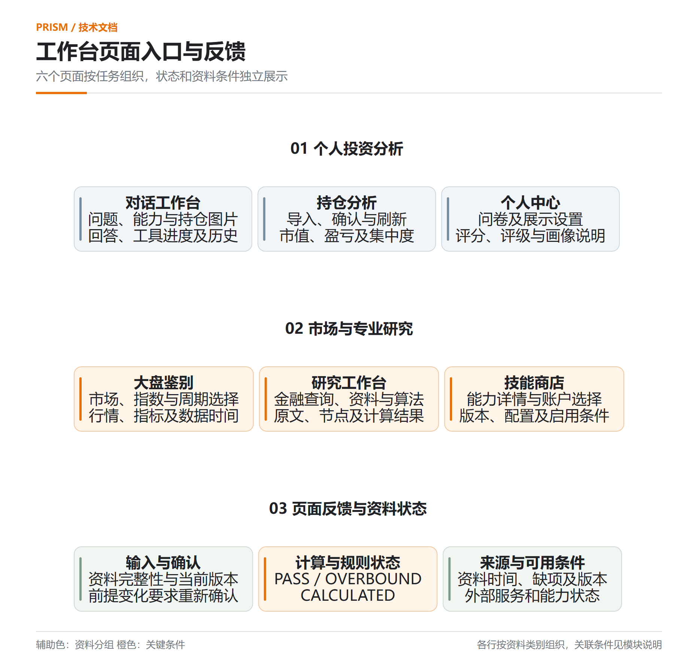

图 3-5 工作台页面入口与反馈

持仓分析将主要金额和风险提示放入默认区域，详细持仓、风险参考和其他分析由用户展开。研究工作台分别提供“查询金融数据”“查找资料”“算法计算”，各入口说明用途、输入和结果；工具区域集中管理参数、资料和完整记录。移动端调整栏目宽度和排列方式，保留相同的业务操作。

前端接收服务端已计算的金融指标，显示具体数值、规则和来源。画像、持仓或数据模式变化后，相关分析需要更新当前上下文；异步请求使用上下文修订检查，保证返回结果对应用户当前选择。

## 3.3 数据库设计

系统默认使用 SQLite 保存应用记录，配置 PostgreSQL 时通过 psycopg 适配相同存储操作。数据结构由 SQL migrations 管理。高频查询字段、归属、版本和时间独立存储，完整业务对象使用 JSON 字段保存，并以内容摘要检查记录完整性。

#### 核心数据表结构

| 数据表 | 主要字段 | 主键或约束 | 保存内容 |
| --- | --- | --- | --- |
| `questionnaire_snapshots` | `owner_id`、`snapshot_version`、`ruleset_version` | `snapshot_id` 主键；用户与版本唯一 | 已确认问卷与画像 |
| `current_portfolios` | `owner_id`、`data_mode`、`content_hash` | 用户与数据模式联合主键 | 当前持仓对象 |
| `portfolio_reports` | `report_id`、`created_at`、`content_hash` | 用户、数据模式与报告联合主键 | 历史组合报告 |
| `session_truth` | `session_id`、`revision`、`observed_at` | 用户、会话与修订联合主键 | 已确认分析前提 |
| `context_memory` | `owner_id`、`source`、`saved_at` | `memory_id` 主键 | 用户显式保存的历史上下文 |
| `copilot_conversations` | `owner_id`、`title`、`updated_at` | `conversation_id` 主键 | 对话元数据 |
| `copilot_messages` | `conversation_id`、`ordinal`、`role` | `message_id` 主键；会话内序号唯一 | 已完成用户消息与助手消息 |
| `knowledge_documents` | `visibility`、`revision`、`published_at` | `document_id` 主键 | 资料元数据与当前版本 |
| `knowledge_document_versions` | `revision`、`payload_json`、`content_hash` | 文档与版本联合主键 | 文档历史版本 |
| `knowledge_chunks` | `page`、`paragraph`、`text`、`embedding_json` | `chunk_id` 主键 | 可检索原文片段与向量 |
| `research_fact_snapshots` | `run_id`、`node_id`、`input_versions_json` | 用户与快照联合主键 | 请求、响应及输入版本摘要 |
| `research_facts` | `snapshot_id`、`fact_json`、`content_hash` | 用户与事实联合主键 | 结构化金融观测 |
| `research_fact_payloads` | `request_json`、`response_json` | 用户与快照联合主键 | 研究原始请求与响应 |
| `decision_events` | `composition_id`、`status`、`receipt_id` | `event_id` 主键 | 建议审查与决策回执记录 |

表 3-2 核心业务数据表

账户和会话认证由 `local_accounts`、`auth_sessions` 保存；交易导入、成交修订及交易风格由 `trade_import_batches`、`trade_record_revisions`、`trading_style_profiles` 保存；能力版本与用户选择由 `skill_versions`、`skill_selections` 保存。上述记录分别使用归属、版本和时间字段支持访问检查与历史查询。

#### 数据库关系设计

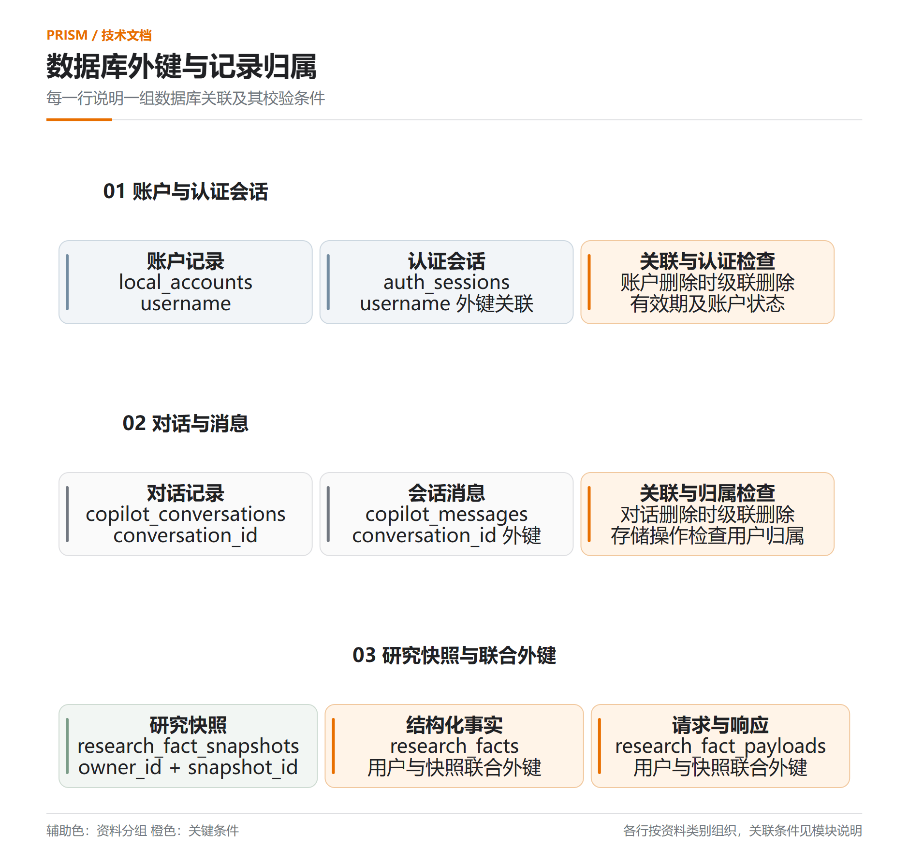

图 3-6 账户、对话和研究数据的数据库外键

对话与消息通过 `conversation_id` 关联，账户与认证会话通过 `username` 关联，删除父记录时级联删除对应记录。研究事实及原始请求、响应通过 `owner_id` 与 `snapshot_id` 联合外键关联研究快照，保证用户与快照共同限定资料归属。

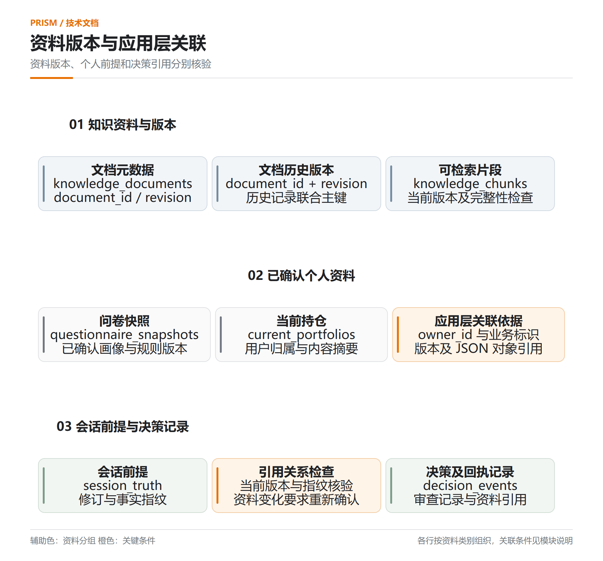

图 3-7 资料版本与会话前提的应用层关联

知识资料通过 `document_id` 与 `revision` 关联版本和片段，检索核对当前版本及内容完整性。问卷、持仓、会话前提与回执使用用户归属、业务标识、版本和 JSON 对象引用，由服务层检查指纹及引用关系。图 3-6 按账户、对话及研究数据列明数据库外键；图 3-7 按资料类别列明应用层关联及其核验条件。

系统为用户历史记录建立归属与时间索引，为消息建立会话序号索引，为研究事实建立用户、运行与节点索引，为资料片段建立文档与版本索引。SQLite 资料全文检索使用 FTS5；PostgreSQL 路径使用全文检索索引。每次检索同时检查用户可见范围、资料发布时间及当前 revision。

数据库写入采用事务和预期版本检查，内容摘要用于读取完整性校验。PostgreSQL 适配器通过事务级 advisory lock 协调写入。资料、持仓和会话前提保留各自的版本与时间，历史恢复由用户显式选择，恢复后重新执行派生计算。

## 3.4 系统关键技术实现

### 3.4.1 金融数据接入与质量状态管理

金融查询通过 Provider 接口统一输入和输出。`ProviderRequest` 描述请求标识、操作、查询主体和必需字段；`ProviderResult` 保留记录、缺项、错误、来源和数据质量。问财 SkillHub 适配器按能力清单调用行情、公司财务、行业、宏观、基金及可转债查询，其他提供方依照配置和授权参与相应业务。

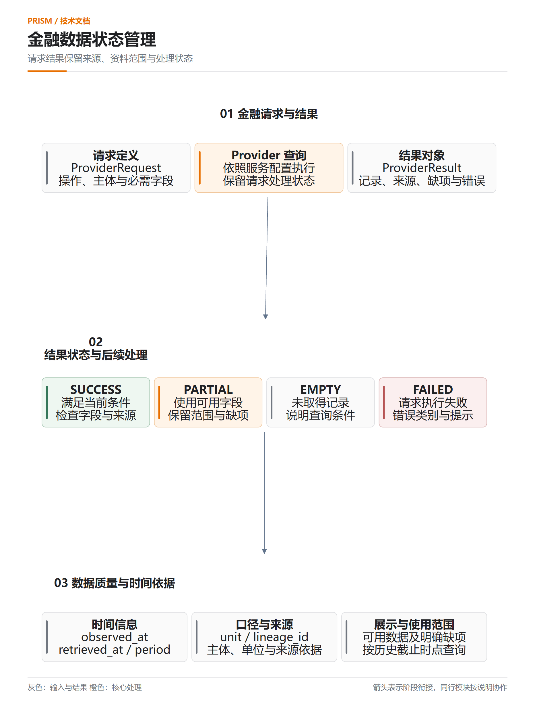

图 3-8 金融提供方结果状态与后续处理

数据整理保留 `observed_at`、`retrieved_at`、`unit`、`period`、`lineage_id` 等信息。历史问题使用明确的截止时点，资料发布时间、指标期间和数据取得时间各自记录。LIVE 研究服务只从返回的结构化记录中提取所需数值，缺少单位、主体或时间依据时保留相应状态。

### 3.4.2 投资者画像与风险预算映射

正式测评包含 19 个问题，覆盖 `risk`、`exp`、`act`、`res`、`inf`、`ai`、`per`、`aid` 八个维度。服务端校验答案是否完整、选项是否合法以及互斥选项是否同时出现。评分题将 1—5 的回答归一化，选择题按模板权重累计贡献，随后按各维度参与题目数量归一化至 0—100 分，并保留两位小数。

`risk` 维度形成画像风险分数；分数不超过 33 时采用保守型预算，大于 33 且不超过 66 时采用均衡型预算，大于 66 时采用成长型预算。适当性等级 C1—C5 由独立映射生成。自然语言提案和交易行为结果保留其来源，经对应确认与转换程序进入有效画像。

| 风险等级 | 单一资产上限 | 已识别行业上限 | 科技行业合计上限 | 未分类合计上限 |
| --- | --- | --- | --- | --- |
| 保守型 | 20% | 30% | 25% | 10% |
| 均衡型 | 35% | 45% | 40% | 20% |
| 成长型 | 50% | 60% | 60% | 35% |

表 3-3 画像对应的现有风险预算规则

预算绑定 `owner_id`、`profile_id` 和 `profile_version`。评估将观察比例与所属预算比较，按 `max(0, observed − limit)` 生成超限幅度，单位为百分点。数据不完整或存在超限项时，评估结果进入 REVIEW_REQUIRED，并保留具体对象、观察值和预算值。

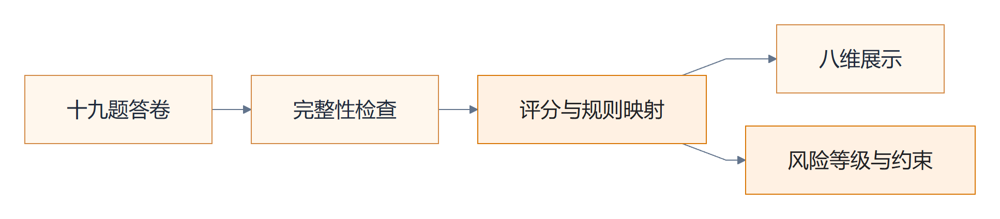

图 3-9 画像与预算参与组合计算

### 3.4.3 持仓穿透与集中度计算

组合计算使用 Decimal 管理金额和比例。直接持仓按证券归属计入资产及行业；基金和 ETF 按已披露成分比例形成穿透贡献，同时保留原始持仓、基金快照和成分记录引用。未覆盖的基金成分形成独立的未穿透金额，以保持金额守恒。

基本市值按 `quantity × price` 计算；组合权重按 `market_value ÷ total_market_value × 100` 计算。基金某项成分的穿透金额由基金持仓市值与该成分比例相乘取得。所有贡献金额的合计需要与原组合金额一致，Pydantic 模型核对贡献、分类合计及引用关系。

集中度先按资产或行业聚合金额，再使用 `HHI = 10000 × Σ(value_i ÷ total_value)²` 计算。HHI 和展示比例按 ROUND_HALF_UP 保留两位小数。报告分别说明证券持仓与含现金总资产的分母，风险检查读取其规定口径下的观察值和上限。

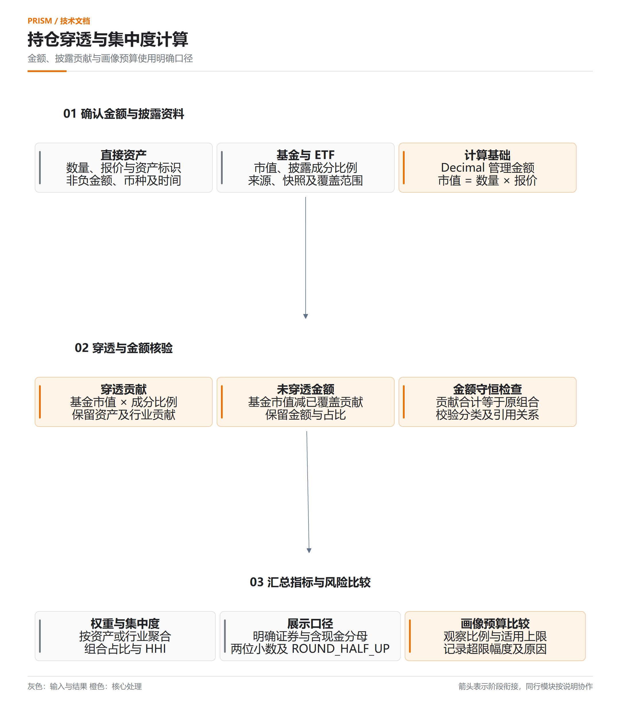

图 3-10 持仓穿透、金额守恒与集中度计算

### 3.4.4 交易约束下的再平衡测算

再平衡服务接收当前持仓、目标权重、报价和用户约束，将目标金额与当前金额的差额转换为买卖数量。开启交易单位约束时，股票及 ETF 按 100 股或份处理；卖出数量受当前持仓限制，买入数量受可用现金、最低现金比例和交易费用共同约束。

卖出操作更新现金并扣除费用。买入操作通过二分查找确定包含费用后仍可负担的最大交易单位数量，再更新持仓与现金。执行步骤按卖出与买入顺序组织，结果保留数量、金额、佣金、税费及现金变化。目标尚未满足时，输出具体未满足条件。

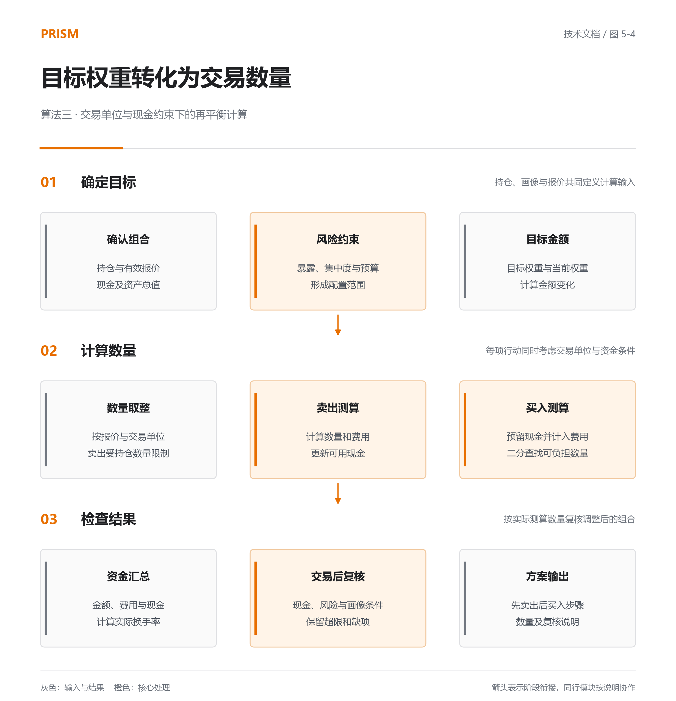

图 3-11 再平衡数量与现金计算

测算完成后，服务使用交易后的数量、金额和现金重新构建组合，计算实际换手率、暴露及风险预算。结果同时呈现目标结构和实际可执行数量对应的结构。报价、规则、画像或持仓版本改变后，相关测算需要重新执行。测算结果供用户审阅，系统保留 ADVISORY_ONLY 使用范围。

### 3.4.5 专业研究依赖执行与时间预算

研究计划以 DAG 表达节点及前置关系。提交时校验节点标识唯一性、未知依赖、自依赖和有向环；前置条件满足后启动相应节点，独立节点可以并行执行。专业研究模块覆盖宏观、行业、个股、基金、可转债和组合任务，具体运行路径由提交计划与已配置能力决定。

LIVE 研究提供 A 股基础研究模板，包含行情和财务查询节点；用户也可以提交经校验的节点集合。`ResearchRuntime` 在单进程内按用户组组织排队，使用独立 semaphore 管理 Provider 和模型调用名额，记录等待、执行、部分完成、失败、取消和超时等状态。节点依赖未完成时，下游节点保留取消及原因。

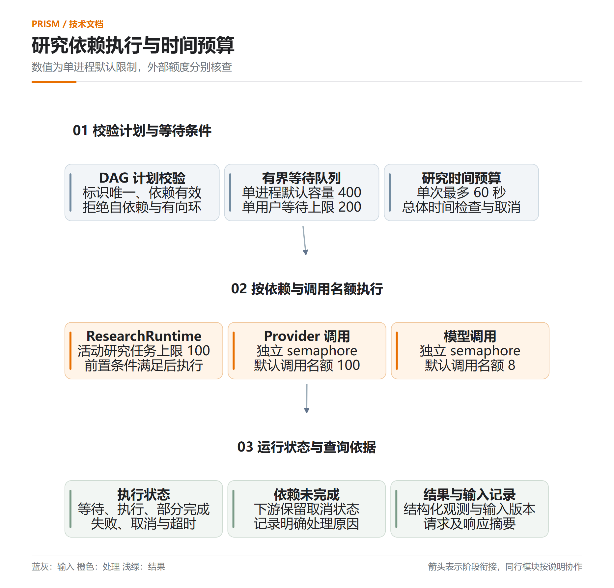

图 3-12 研究依赖执行、排队容量与时间预算

上述数值表示程序限制，外部服务授权、额度及实际响应能力另行检查。LIVE 任务结果关联输入版本、请求与响应摘要、节点状态和结构化观测，单一来源资料继续保留 SINGLE_SOURCE_UNVERIFIED。

### 3.4.6 来源验证与风险合规审查

研究资料通过 Evidence、Fact、Finding 和 Recommendation 对象表达来源、可验证事实、研究发现及建议关系。交叉验证首先检查主体、指标、单位、期间和数据质量，随后按 `lineage_id` 分组。同组重复记录计作一个来源，组内数值冲突进入复核。

标量声明采用 Decimal 相等检查。至少两个有效独立来源支持且不存在反对或不明确输入时，状态为 SUPPORTED；独立来源形成明确反对时进入 CONTRADICTED；口径、来源或数值存在未解决问题时保留 UNRESOLVED；有效独立依据不足时保留 INSUFFICIENT。状态和引用继续传递至研究结果。

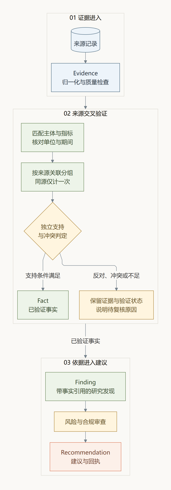

图 3-13 来源分组与证据验证

结构化建议分别接受风险和合规审查。风险审查检查画像、组合、预算及证据条件；合规审查检查事实引用、风险揭示和禁止表述。整体状态按 BLOCKED、REVIEW_REQUIRED、PASS 的优先顺序聚合，双方 PASS 才具备建议资格。建议组合器再次检查输入版本及引用，生成 Recommendation 和 DecisionReceipt。

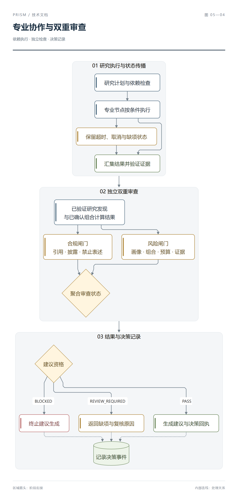

图 3-14 风险与合规审查

### 3.4.7 PDF 内容提取与研究资料检索

资料服务支持 UTF-8 的 TXT、Markdown 和可提取文本的 PDF 上传，文件大小上限为 8 MiB。PDF 路径使用 pypdf 读取页面文本，保留页码并与文档标题、来源、发布时间、主体和期间共同存储。加密 PDF、超过 1000 页的 PDF 和无法提取文本的文件返回相应错误；扫描 PDF 需要预先完成 OCR。

文本按自然段和长度组织为检索片段，单个长自然段以最多 1200 个字符形成片段。SQLite 路径使用中文相邻字符索引与 FTS5/BM25；可用向量满足模型和 revision 条件、且混合检索已启用时，使用 cosine 排序，再按 `Σ 1/(60 + rank)` 的 RRF 规则融合关键词与向量结果。

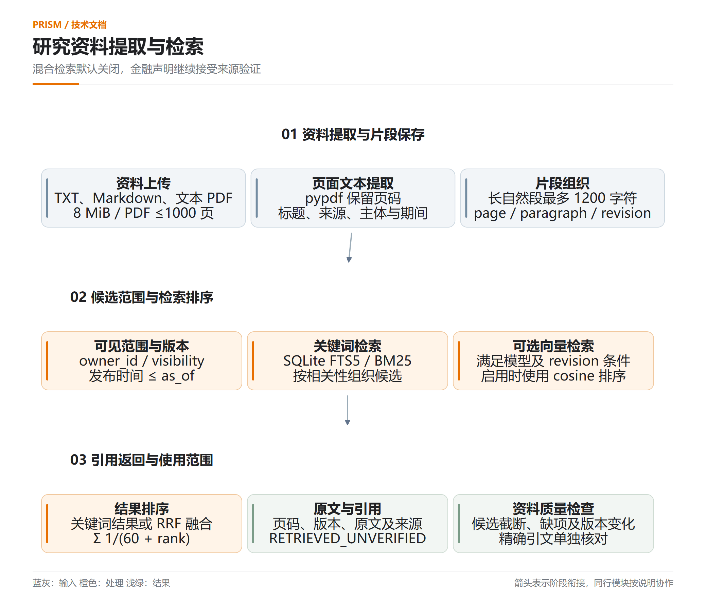

图 3-15 研究资料提取、候选范围检查与引用返回

混合检索默认关闭。检索相关性与精确引文匹配分别保留其结果，金融声明继续接受结构化来源验证。资料更新后，旧版本引用返回版本变化状态；候选集合受限制时，响应保留候选截断与质量状态。

### 3.4.8 会话前提与历史记录管理

会话前提由服务端读取已确认问卷、有效画像、当前持仓和数据模式，按规范化 JSON 生成 SHA-256 指纹。确认请求使用预期 revision，保存后形成 LOCKED 状态。后续请求核对用户归属、revision 和当前事实指纹，变化时返回 DRIFT_DETECTED，提示用户重新确认。

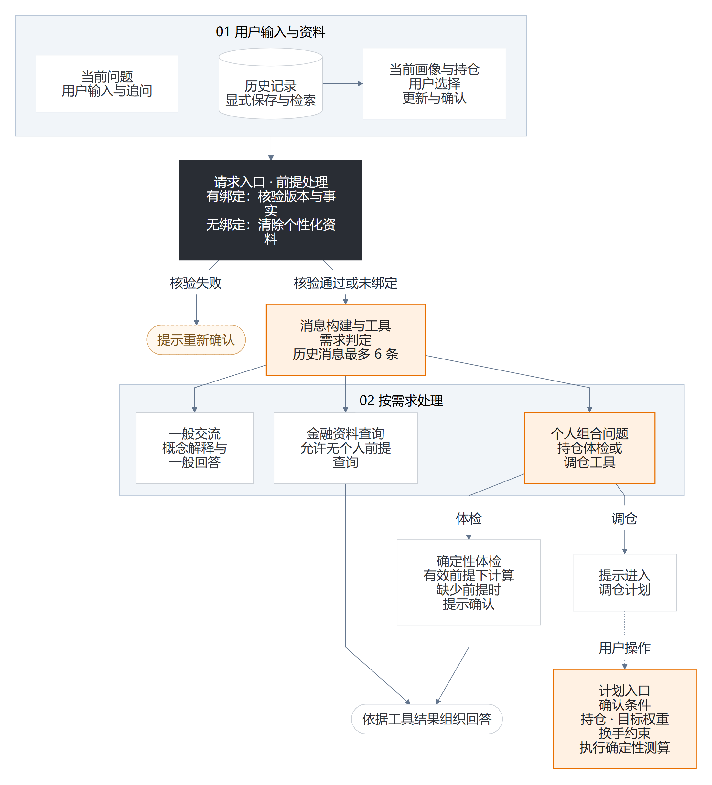

图 3-16 会话上下文与工具处理

会话历史与当前金融事实分别管理。历史消息支持理解问题；`context_memory` 保存用户显式选择的资料，按归属检索并显式恢复。恢复后的资料经过确认进入当前上下文，组合结果重新计算。对话消息仅在生成完成且无流式错误时保存为已完成助手消息。

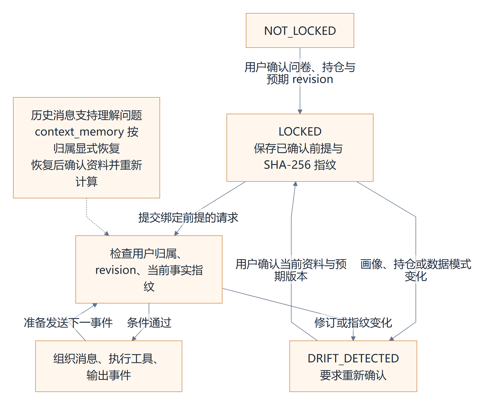

图 3-17 会话前提确认、持续检查与资料变化处理

### 3.4.9 确定性研究算法

研究工作台提供独立的算法计算接口，由用户提交历史收益、财务数据、来源及截止时点。Pydantic 校验数据类型、样本数量、时间顺序和有限数值，NumPy 执行数值运算。接口将计算任务交由工作线程执行，并通过容量限制控制活动任务。

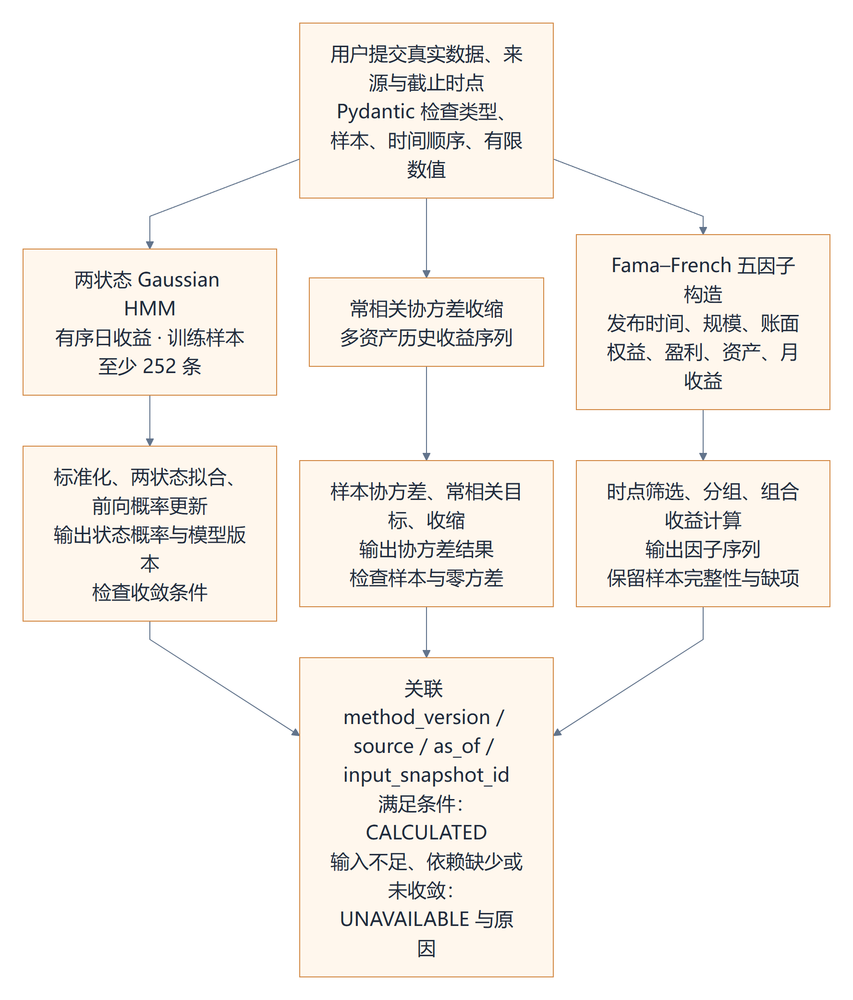

图 3-18 确定性研究算法的输入、计算与结果条件

算法结果关联 `method_version`、`source`、`as_of` 和 `input_snapshot_id`。输入不足、依赖缺少或模型未收敛时返回 UNAVAILABLE 及原因；满足条件时返回 CALCULATED。HMM 和因子构造采用现有 A 股适配规则，结果作为研究指标使用。假设情景测算使用明确的场景参数，保留基准与场景差异及假设性质。

## 3.5 系统主要界面

### 3.5.1 对话工作台

对话工作台提供问题输入、研究能力选择、持仓图片上传和历史对话。SSE 事件驱动执行进度与回答展示，用户可以查看工具处理结果并继续追问。个人组合分析使用已确认的画像与持仓前提，一般概念解释使用相应的通用问答路径。

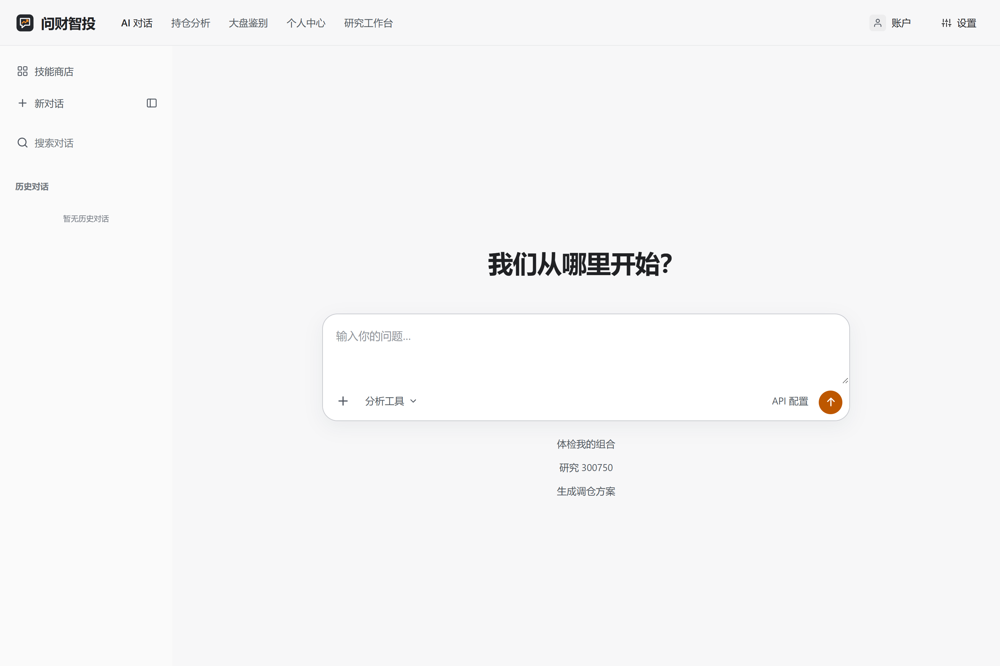

图 3-19 对话工作台界面（2026 年 10 月 5 日采集）

### 3.5.2 持仓分析与交易风格

持仓分析支持资料导入、确认、行情刷新和报告查看。主要区域显示证券市值、现金、总资产、配置与风险提示；展开区域提供持仓明细、盈亏分布、其他风险指标及方案入口。交易风格读取已确认成交记录，展示行为分析、历史记录管理和与当前持仓相关的结果。

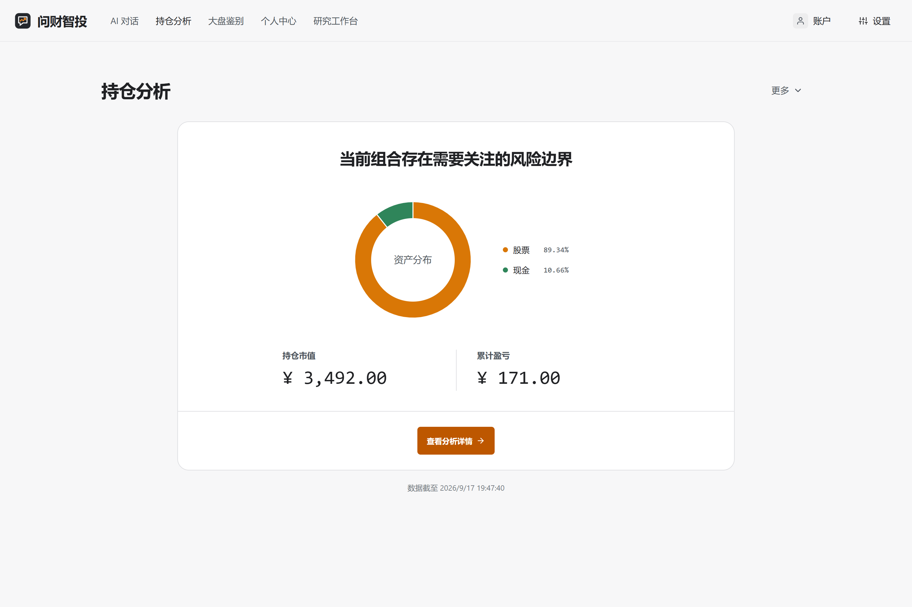

图 3-20 持仓分析界面（2026 年 10 月 5 日采集）

### 3.5.3 个人中心

个人中心组织风险测评、评分解释和展示设置。正式问卷包含 19 个问题，确认后保存问卷版本、规则版本和画像。页面提供再次测评、分析资料查看和展示设置，画像结果与组合风险预算关联。

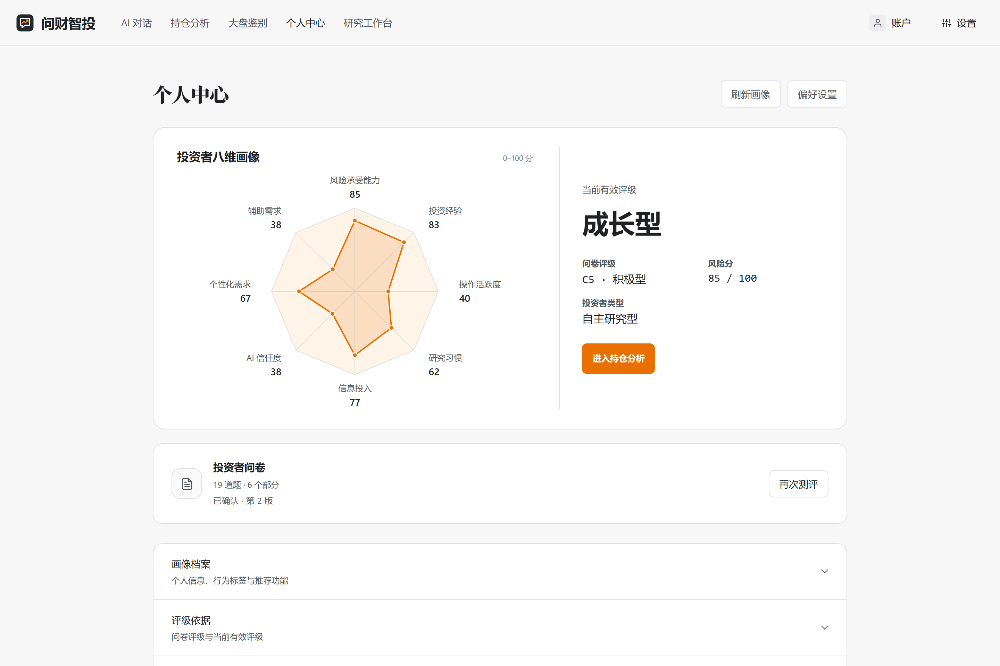

图 3-21 个人中心界面（2026 年 10 月 5 日采集）

### 3.5.4 市场观察

市场观察页面提供市场和指数切换、行情图表、技术指标与相关说明。页面按所选周期请求服务端数据，展示返回的数据时间和可用状态。指数切换侧栏与行情主区域配合，支持继续进入相应市场研究。

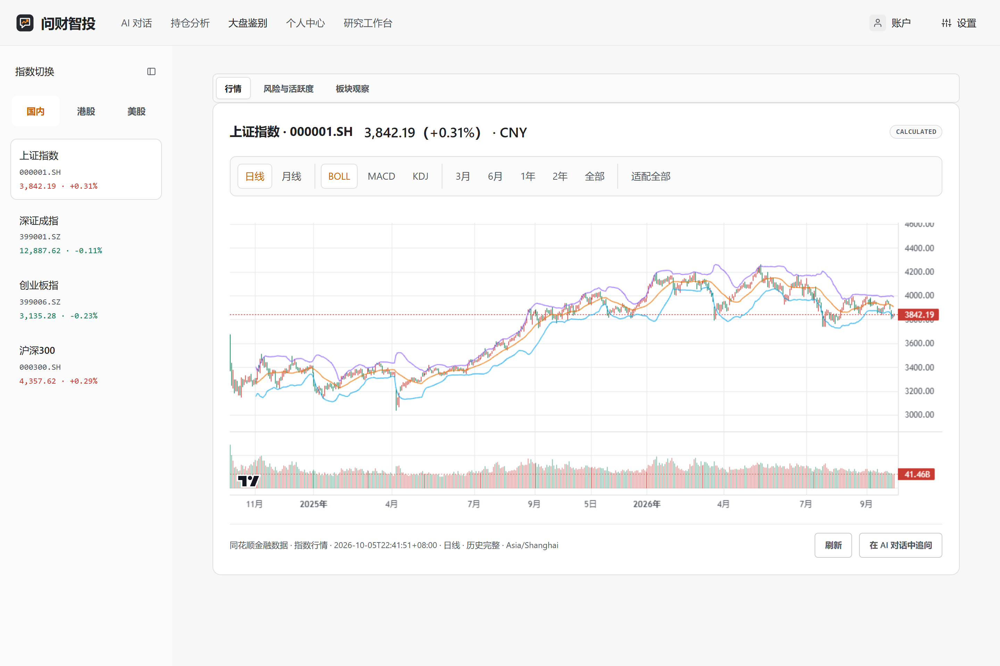

图 3-22 市场观察界面（2026 年 10 月 5 日采集）

### 3.5.5 研究工作台与技能商店

研究工作台将金融数据查询、资料检索和算法计算放入同一入口。金融查询支持基础模板和自定义节点，资料查询返回原文、来源及引用位置，算法计算支持填写或导入 JSON 输入。参数、资料管理、任务读取、运行信息和完整结果由工具区域按需显示。

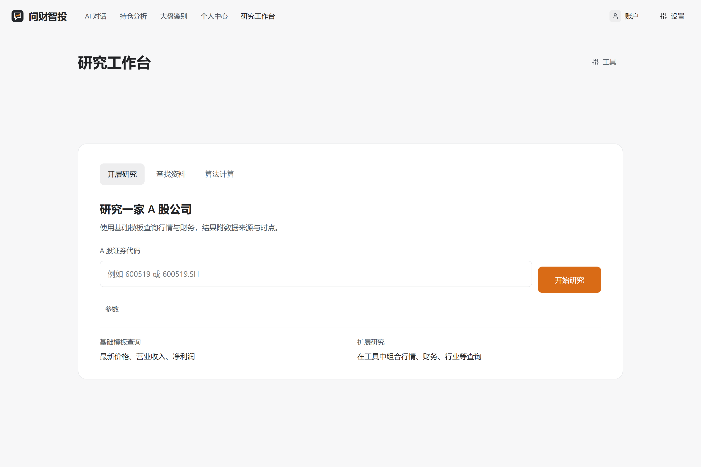

图 3-23 研究工作台界面（2026 年 10 月 5 日采集）

技能商店展示能力用途、版本、启用状态和运行条件。管理员管理能力元数据及验证，用户选择账户范围内启用的能力；调用前检查当前版本和可用条件，研究与对话继续使用受控 Provider 适配器执行请求。

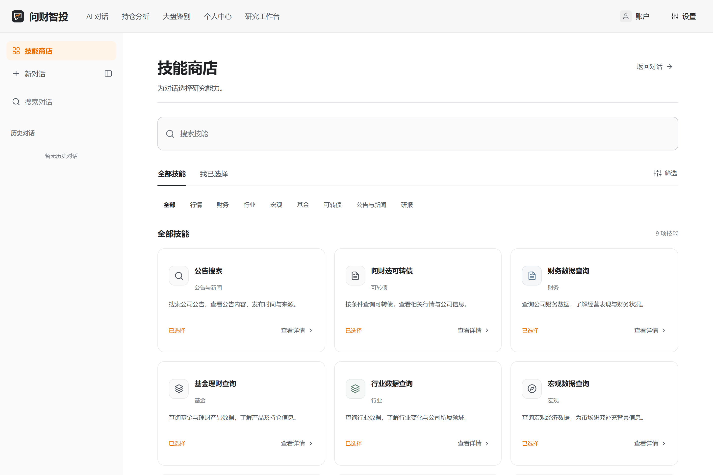

图 3-24 技能商店界面（2026 年 10 月 5 日采集）

本节截图于 2026 年 10 月 5 日从当前项目服务采集，服务使用现有数据库的独立副本，读取已确认的问卷、持仓和相关记录。截图中的资料时间以页面显示为准；页面结构、操作与接口响应对应采集时的运行状态。
