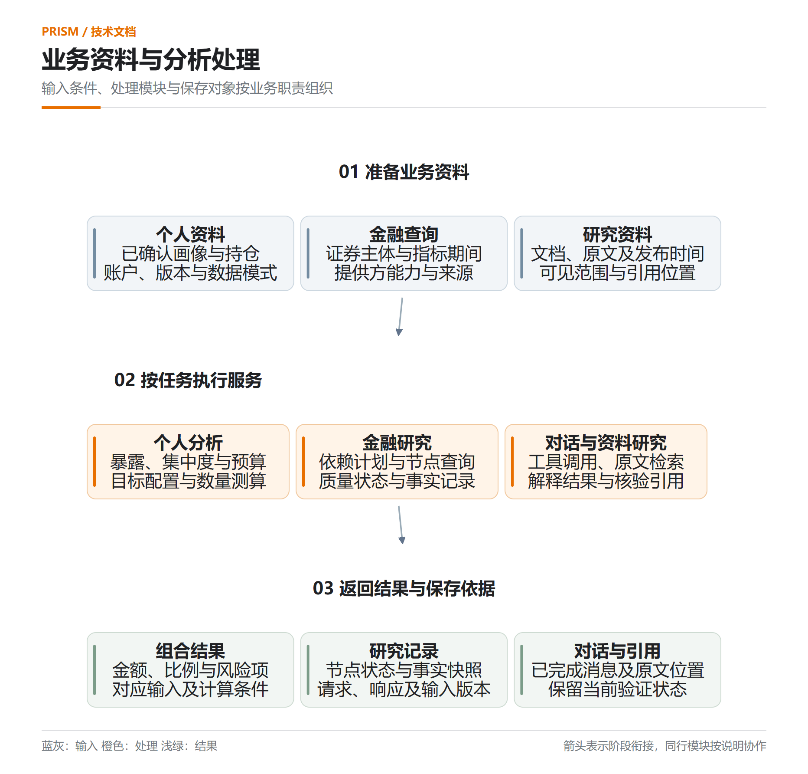
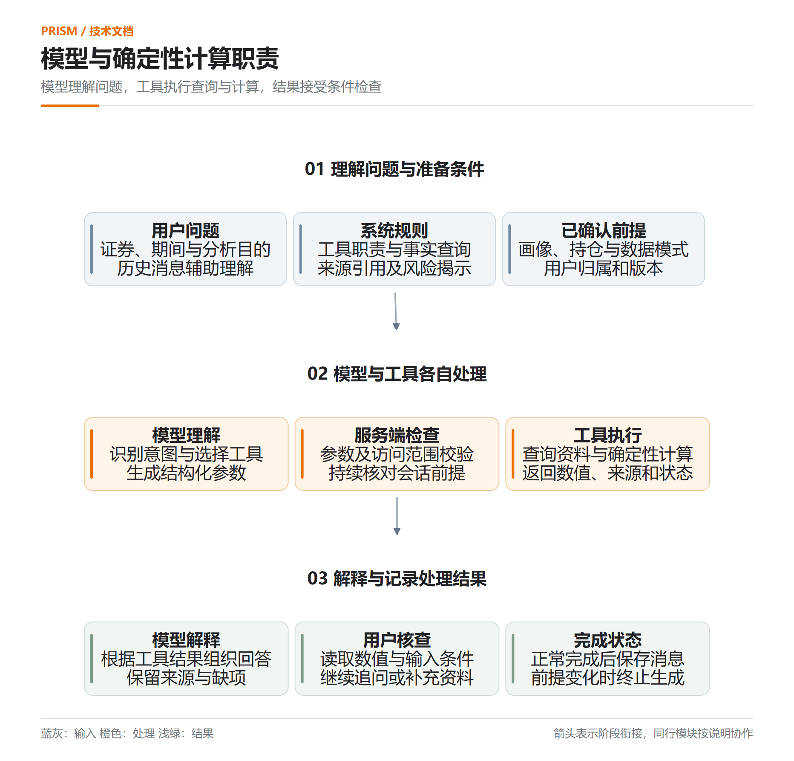
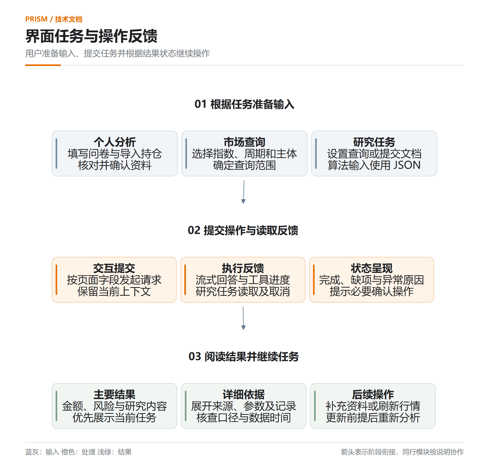
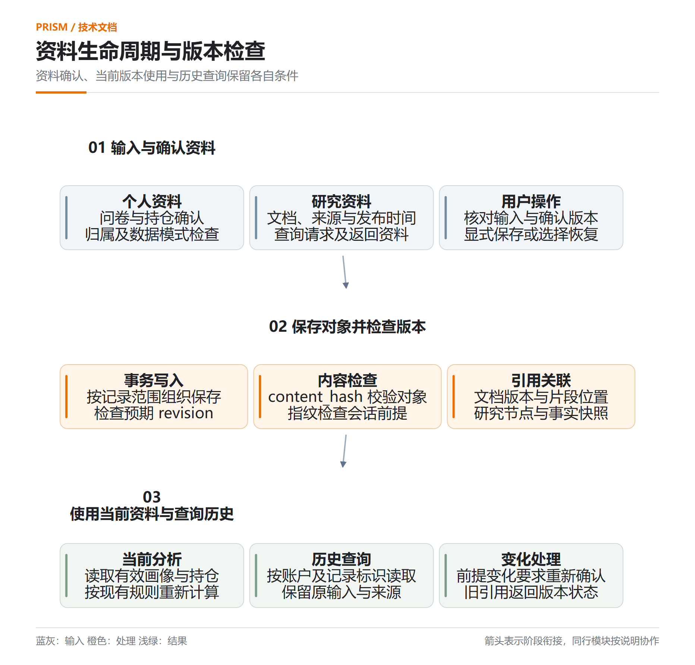
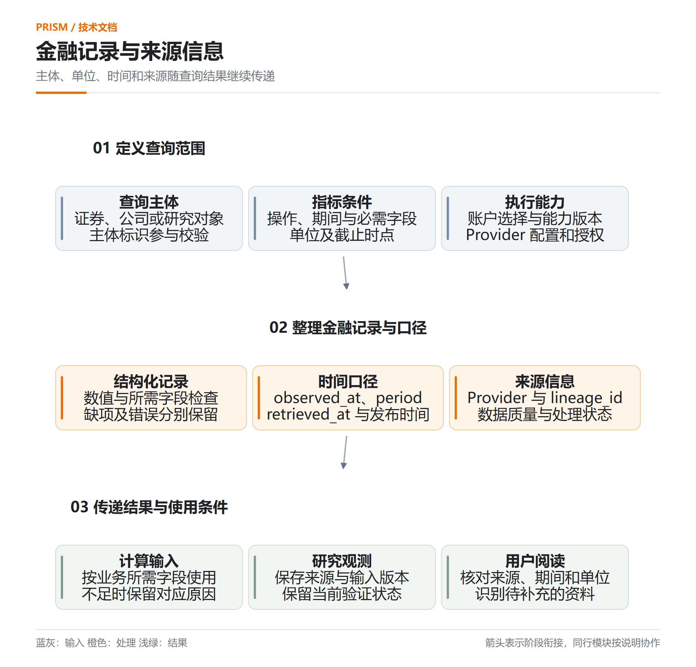
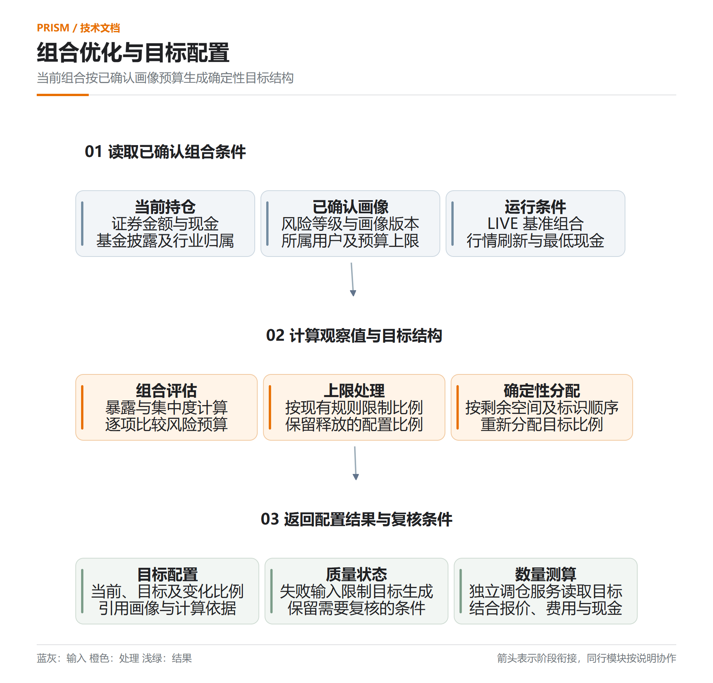
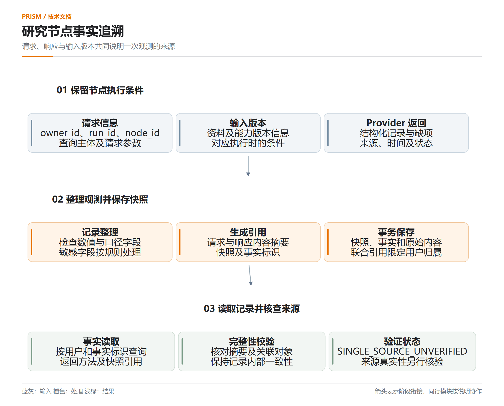
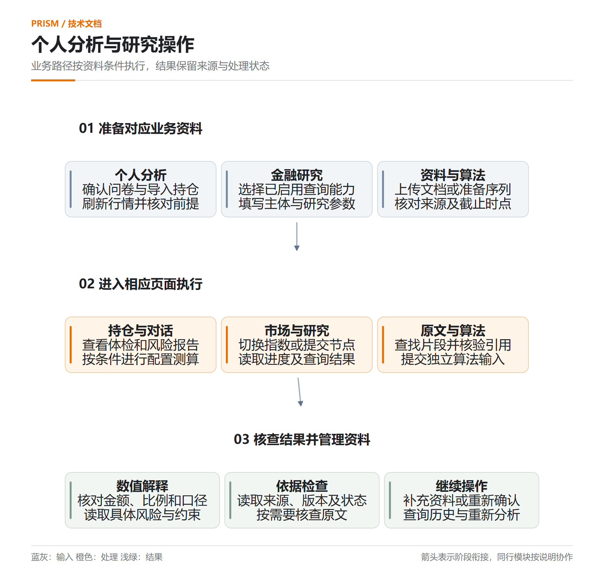

# S2C 技术路线及实现方案

## 3.1 项目总体设计

### 3.1.1 项目架构设计

Prism 面向证券研究与个性化投资决策支持，围绕用户确认的投资者画像、持仓和分析目的，组织金融数据查询、专业研究、确定性计算、风险审查与结果展示。浏览器工作台承担资料输入和交互，FastAPI 服务承担请求校验和任务协调，领域模块承担金融计算与规则检查，存储模块保存资料版本、研究事实和决策记录。

系统采用模块化单体架构，各模块在同一应用中通过结构化对象协作。前端使用 HTTP 提交请求和读取结果，使用 SSE 接收对话内容及工具执行事件。外部金融服务和语言模型通过独立适配模块接入，应用内部保留提供方、来源、数据时间、缺失字段和处理状态。

图 3-1 系统技术架构

在图 3-1 中，用户交互层接收问题、问卷、持仓和研究资料；FastAPI、Pydantic 与应用服务检查用户归属、参数及上下文。画像、组合、研究、风险和合规模块完成评分、预算、暴露、证据及交易约束检查。LLM client 与金融 Provider 保留外部请求的处理结果和质量状态，SQLite 或 PostgreSQL 保存当前资料、历史资料、研究事实和回执。

系统包含三类处理流程。对话流程根据问题选择一般解释、金融资料查询或持仓体检；研究流程按节点依赖执行查询并记录资料状态；结构化建议流程使用研究结果、画像预算和组合计算结果，经过风险与合规审查后生成建议及决策回执。各流程使用与其任务相适应的校验条件。

证券研究需要同时处理公开金融资料与用户个人资料。行情和财务查询关注证券主体、指标期间、单位及来源，个人持仓分析还需要确认账户归属、持仓数量、现金和风险画像。项目将这些条件组织为可检查的输入，使同一个证券问题能够根据任务目的选择相应服务。一般知识问答、当前行情查询和个人组合分析分别具有明确的资料要求。

模块化单体将接口、计算和存储集中在一个应用内，服务层可以直接调用领域模块并传递结构化结果。问卷确认、持仓读取和报告保存使用统一的账户范围，跨模块处理保留相同的业务标识。该结构适合当前本地运行方式，读者可以根据请求入口追踪服务调用和资料记录，同时通过独立的 Provider 与模型适配模块管理外部连接。

图 3-2 业务资料输入、分析处理与结果保存

在图 3-2 中，输入、处理和结果分别展示个人分析及研究任务使用的资料。画像和持仓在用户确认后进入相应计算，金融查询结果保留质量状态，研究资料保留原文位置。计算结果、研究观测与对话记录具有各自的保存规则，完整请求中的业务对象可以通过标识和版本继续追溯。图中同行模块代表不同任务使用的能力，具体组合由接口和输入条件决定。

系统运行范围同时由账户、数据模式和服务能力限定。LIVE 对话与基础研究调用正式金融接口，结构化投顾和专家研究矩阵的默认辅助服务在正式/LIVE 路径受限。当前主页面的组合优化、自定义压力测算和独立调仓具有相应处理入口。架构说明保留各类模块之间的职责关系，具体执行条件由对应业务章节说明。

### 3.1.2 大模型设计

#### 使用模型介绍

语言模型负责理解用户意图、解析输入字段、选择查询工具及解释已有结果。金额、比例、成分穿透、集中度和交易数量由 Python 领域模块计算。系统提示词对上述职责作出明确规定，涉及行情、财务指标和基金披露持仓的问题需要调用对应金融工具。

系统通过 `AsyncLLMClient` 调用 OpenAI-compatible 的 `/chat/completions` 接口，采用 HTTPX 异步请求处理流式内容及工具调用参数。`LLMConfig` 管理服务地址、模型名称、温度和请求时间。代码中的默认模型名称为 `deepseek-v4-flash`，服务端配置可以指定其他兼容模型；实际可用性取决于配置的服务、凭据和接口能力。

| 配置字段 | 代码默认值 | 配置作用 | 使用条件 |
| --- | --- | --- | --- |
| `model` | `deepseek-v4-flash` | 指定模型名称 | 按接入服务支持的型号配置 |
| `base_url` | `https://api.deepseek.com/v1` | 指定兼容接口地址 | 服务需支持对应请求与流式协议 |
| `temperature` | 0.2 | 控制生成采样参数 | 属于客户端配置值 |
| `timeout_seconds` | 15.0 秒 | 限制 HTTP 请求等待 | 属于请求配置，不表示实测响应时间 |

表 3-1 模型客户端配置

模型配置与金融数据模式分别管理。正式模型对话使用 LIVE 金融工具，并保留查询失败、部分可用和缺少资料等状态。完整模型调用需要有效服务配置；界面展示或本地处理结果分别保留其实际来源。

研究资料语义检索使用独立的 `intfloat/multilingual-e5-small` embedding 模型。实现固定模型 revision，以 Sentence Transformers 在 CPU 上读取本地模型文件，分别添加 `query: ` 和 `passage: ` 前缀并归一化向量。该模型用于资料检索，混合检索在满足运行与发布条件时启用。

#### 提示词工程介绍

提示词由系统规则、当前已确认上下文、最近消息、用户问题和工具结果共同组成。`COPILOT_SYSTEM_PROMPT` 规定金融事实查询、资料引用、工具分工和风险揭示；`COPILOT_TOOLS` 以 JSON Schema 声明工具名称、输入类型和必需字段。消息构建保留最近六条历史消息，以支持指代和连续追问。

图 3-3 提示词组织与工具处理

主要工具覆盖研究资料检索、结构化金融查询、个股行情、基金披露持仓、问财语义查询、持仓体检和调仓入口。服务端检查工具参数后执行相应请求，将结果与来源信息返回对话流程。已绑定个人前提的对话在生成期间持续校验修订和指纹；资料变化时终止当前生成并提示重新确认。

模型请求与金融工具调用分别保留处理职责。用户使用自然语言描述证券、期间和分析目的，模型生成工具名称及参数；服务端根据工具声明检查必需字段，再由工具读取金融资料或调用计算模块。工具结果包含可用资料、来源和错误信息，模型据此组织回答。数值计算需要的字段不足时，工具返回相应条件，用户可以根据提示补充输入。

个人组合解释使用账户范围内已确认的资料。提示词中的持仓和画像用于理解当前问题，确定性计算读取相应结构化对象。服务端的用户归属、参数检查和前提版本校验共同约束工具执行范围。上传研究资料中的文本作为检索内容使用，原文中的指令性表述保留资料属性，系统规则和工具定义独立管理。

图 3-4 模型理解、工具执行与结果解释的职责

职责划分使金融指标具备明确的计算入口。金额、比例和风险检查可以依据输入及方法复核，回答可以同时展示解释和来源。当模型服务发生连接错误或流式生成出现异常时，页面收到相应事件；已绑定会话前提的资料发生变化时，生成停止。完成且没有流式错误的回答才保存为完整助手消息。

模型接入采用兼容接口，服务地址和模型名称由配置管理。不同兼容服务需要分别检查工具调用、流式输出和参数支持情况，客户端的超时、温度及模型名称属于运行配置。embedding 模型具有独立的模型标识与 revision，资料向量只有在版本满足要求时参与对应检索，以保持检索方法与索引内容的一致性。

### 3.1.3 软件结构设计

前端由 `index.html` 提供页面结构，`app.js` 组织账户范围内的状态、事件和 Hash 路由，研究页面脚本管理资料查询、任务运行和算法输入。专家研究矩阵的高级工作流画布基于 AntV X6，当前 LIVE 研究工作台采用模板与自定义节点接口；文本展示使用 marked 和 DOMPurify，行情图表使用 Lightweight Charts。

图 3-5 前端交互与状态框架

后端按 `app/api`、`app/service`、领域模块、`app/providers`、`app/llm` 和 `app/store` 组织。接口层完成参数与访问校验，应用服务协调资料与执行过程，领域模块返回结构化计算和审查结果，提供方模块封装外部请求，存储模块处理事务与版本。

图 3-6 后端分层服务框架

研究工作台在此结构上接入知识资料、LIVE 研究任务与论文算法接口。知识资料服务管理文档、片段和引用；研究执行服务管理节点依赖、排队和时间预算；算法服务对用户提交的时间序列与财务数据进行独立计算。

前端负责输入组织、操作响应和结果展示。问卷、持仓与研究参数以接口规定的字段提交，服务端返回结构化状态后，页面显示相应数值、原因和后续操作。前端使用服务端计算结果解释风险和比例，界面中的格式化与图表绘制服务于阅读。异步请求需要关联当前用户选择，资料或页面上下文改变后，返回内容接受对应修订检查。

应用服务负责一个业务请求中的处理顺序。例如，组合分析读取持仓和画像，调用暴露及集中度模块，再组织报告；研究执行服务检查计划、调用 Provider 并保存节点事实。领域模块集中处理计算规则和输入一致性，存储模块集中管理归属、版本及事务。这样的结构使同一种计算可以被报告、体检和调仓复核共同使用。

外部服务通过适配模块进入应用。Provider 将不同来源的返回字段组织为统一结果，模型客户端管理兼容接口的内容与工具参数。应用层读取这些结果中的状态及质量字段，决定当前任务能够继续完成哪些步骤。用户可以从业务结果看到缺少的条件，维护人员可以根据模块职责定位接口、计算或外部连接问题。

## 3.2 界面设计

界面以用户任务、所需输入和分析结果为主要内容，使用原生 HTML、CSS 和 JavaScript 构建响应式工作台。顶部导航连接主要页面，历史对话和指数切换由对应侧栏承载；参数、来源、完整结果和低频操作通过折叠区域、菜单或对话框按需显示。

图 3-7 工作台页面入口与反馈

持仓分析将主要金额和风险提示放入默认区域，详细持仓、风险参考和其他分析由用户展开。研究工作台分别提供“查询金融数据”“查找资料”“算法计算”，各入口说明用途、输入和结果；工具区域集中管理参数、资料和完整记录。移动端调整栏目宽度和排列方式，保留相同的业务操作。

前端接收服务端已计算的金融指标，显示具体数值、规则和来源。画像、持仓或数据模式变化后，相关分析需要更新当前上下文；异步请求使用上下文修订检查，保证返回结果对应用户当前选择。

界面入口按业务对象组织。对话工作台接收自然语言问题，持仓分析围绕账户中的资产和风险展开，大盘鉴别围绕所选指数和周期展开，研究工作台围绕查询、资料与算法展开。个人中心提供画像确认及展示设置，技能商店说明可选能力与运行条件。用户进入页面后，可以根据当前任务确定需要准备的资料。

主要结果优先展示任务相关信息。持仓页面集中呈现资产金额、配置和风险提示，完整持仓与其他指标通过展开区域读取；研究页面将查询内容和结果放在主要区域，参数及完整记录进入工具区域。账户菜单展示当前风险和画像信息，低频操作由设置菜单及对话框承载。各入口保留对应业务操作，用户能够根据需要逐步读取详细资料。

图 3-8 界面输入准备、操作反馈与结果阅读

操作反馈覆盖资料准备、请求执行和结果查看。问卷及导入记录需要用户核对并确认，任务运行期间展示查询或工具进度，返回内容显示数据状态和缺少条件。SSE 按事件更新对话内容和工具信息，研究任务接口提供读取与取消操作。界面将处理状态与金融结论分别显示，用户可以识别任务是否完成以及结果是否仍有待核查资料。

页面中的数值需要结合时间和口径阅读。证券市值与含现金总资产采用各自规定的分母，基金穿透显示披露覆盖范围，市场指标使用所选周期的数据。资料不足时，页面保留缺项和原因，用户可以通过刷新行情、补充持仓或确认画像继续处理。来源、输入条件和详细结果与主要结论保持关联，便于进一步核验。

响应式布局根据可用宽度调整栏目排列、侧栏和操作区域。移动端保留任务输入、结果读取及必要的确认操作，较长参数通过工具区域按需查看。原生菜单、折叠区域与对话框承担相应交互，减少主要内容中的低频设置。页面的业务入口和资料要求保持一致，屏幕尺寸变化由展示布局处理。

## 3.3 数据库设计

系统默认使用 SQLite 保存应用记录，配置 PostgreSQL 时通过 psycopg 适配相同存储操作。数据结构由 SQL migrations 管理。高频查询字段、归属、版本和时间独立存储，完整业务对象使用 JSON 字段保存，并以内容摘要检查记录完整性。

#### 核心数据表结构

| 数据表 | 主要字段 | 主键或约束 | 保存内容 |
| --- | --- | --- | --- |
| `questionnaire_snapshots` | `owner_id`、`snapshot_version`、`ruleset_version` | `snapshot_id` 主键；用户与版本唯一 | 已确认问卷与画像 |
| `current_portfolios` | `owner_id`、`data_mode`、`content_hash` | 用户与数据模式联合主键 | 当前持仓对象 |
| `portfolio_reports` | `report_id`、`created_at`、`content_hash` | 用户、数据模式与报告联合主键 | 历史组合报告 |
| `session_truth` | `session_id`、`revision`、`observed_at` | 用户、会话与修订联合主键 | 已确认分析前提 |
| `context_memory` | `owner_id`、`source`、`saved_at` | `memory_id` 主键 | 用户显式保存的历史上下文 |
| `copilot_conversations` | `owner_id`、`title`、`updated_at` | `conversation_id` 主键 | 对话元数据 |
| `copilot_messages` | `conversation_id`、`ordinal`、`role` | `message_id` 主键；会话内序号唯一 | 已完成用户消息与助手消息 |
| `knowledge_documents` | `visibility`、`revision`、`published_at` | `document_id` 主键 | 资料元数据与当前版本 |
| `knowledge_document_versions` | `revision`、`payload_json`、`content_hash` | 文档与版本联合主键 | 文档历史版本 |
| `knowledge_chunks` | `page`、`paragraph`、`text`、`embedding_json` | `chunk_id` 主键 | 可检索原文片段与向量 |
| `research_fact_snapshots` | `run_id`、`node_id`、`input_versions_json` | 用户与快照联合主键 | 请求、响应及输入版本摘要 |
| `research_facts` | `snapshot_id`、`fact_json`、`content_hash` | 用户与事实联合主键 | 结构化金融观测 |
| `research_fact_payloads` | `request_json`、`response_json` | 用户与快照联合主键 | 研究原始请求与响应 |
| `decision_events` | `composition_id`、`status`、`receipt_id` | `event_id` 主键 | 建议审查与决策回执记录 |

表 3-2 核心业务数据表

账户和会话认证由 `local_accounts`、`auth_sessions` 保存；交易导入、成交修订及交易风格由 `trade_import_batches`、`trade_record_revisions`、`trading_style_profiles` 保存；能力版本与用户选择由 `skill_versions`、`skill_selections` 保存。上述记录分别使用归属、版本和时间字段支持访问检查与历史查询。

#### 数据库关系设计

图 3-9 账户、对话和研究数据的数据库外键

对话与消息通过 `conversation_id` 关联，账户与认证会话通过 `username` 关联，删除父记录时级联删除对应记录。研究事实及原始请求、响应通过 `owner_id` 与 `snapshot_id` 联合外键关联研究快照，保证用户与快照共同限定资料归属。

图 3-10 资料版本与会话前提的应用层关联

知识资料通过 `document_id` 与 `revision` 关联版本和片段，检索核对当前版本及内容完整性。问卷、持仓、会话前提与回执使用用户归属、业务标识、版本和 JSON 对象引用，由服务层检查指纹及引用关系。图 3-9 按账户、对话及研究数据列明数据库外键；图 3-10 按资料类别列明应用层关联及其核验条件。

系统为用户历史记录建立归属与时间索引，为消息建立会话序号索引，为研究事实建立用户、运行与节点索引，为资料片段建立文档与版本索引。SQLite 资料全文检索使用 FTS5；PostgreSQL 路径使用全文检索索引。每次检索同时检查用户可见范围、资料发布时间及当前 revision。

数据库写入采用事务和预期版本检查，内容摘要用于读取完整性校验。PostgreSQL 适配器通过事务级 advisory lock 协调写入。资料、持仓和会话前提保留各自的版本与时间，历史恢复由用户显式选择，恢复后重新执行派生计算。

#### 数据生命周期与版本检查

资料从用户输入进入确认与保存流程。问卷确认生成快照和画像版本，当前持仓按用户与数据模式保存，研究查询生成事实快照及原始响应，对话生成完成后保存完整消息。不同记录具有各自的业务标识，更新时通过版本或内容摘要识别变化。历史对象保存当时使用的资料条件，当前对象用于后续分析请求。

图 3-11 资料确认、版本使用与历史查询

`owner_id` 参与账户范围内的读取和写入。研究事实通过用户与快照联合关联，当前持仓通过用户与数据模式共同定位，历史对话通过会话及所属账户读取。公开研究资料使用相应可见范围，私人资料由用户归属限定。服务层在组织计算输入时继续检查对象归属，防止不同账户或不同数据模式的资料参与同一个个人分析。

版本检查处理用户同时操作或资料更新产生的状态变化。确认和修订请求提交预期版本，服务读取当前版本并判断该请求是否仍适用；内容摘要用于检查保存对象的完整性。会话前提的指纹包含当前画像、持仓和数据模式，业务资料变化后需要重新确认。版本字段与摘要各自服务于并发修改检查和内容校验。

研究事实保存包含快照、观测和原始请求响应。节点记录关联运行标识和节点标识，输入版本、请求摘要及响应摘要共同说明一次查询的处理条件。读取时核对内容摘要和引用对象，保持记录内部的一致性。事实持久保存用于追溯查询过程，金融观测继续保留来源验证状态，记录保存本身不赋予来源真实性保证。

历史恢复由用户选择具体资料并提交相应操作。恢复后的资料重新参与当前上下文确认，组合暴露、风险预算和报告按当前条件重新计算。数据库保存研究事实与对话资料，运行中的研究任务对象由单进程内的执行服务管理。服务重启后可以读取已经保存的记录，原运行任务对象的恢复能力具有独立限制。

## 3.4 系统关键技术实现

### 3.4.1 金融数据接入与质量状态管理

金融查询通过 Provider 接口统一输入和输出。`ProviderRequest` 描述请求标识、操作、查询主体和必需字段；`ProviderResult` 保留记录、缺项、错误、来源和数据质量。问财 SkillHub 适配器按能力清单调用行情、公司财务、行业、宏观、基金及可转债查询，其他提供方依照配置和授权参与相应业务。

图 3-12 金融提供方结果状态与后续处理

数据整理保留 `observed_at`、`retrieved_at`、`unit`、`period`、`lineage_id` 等信息。历史问题使用明确的截止时点，资料发布时间、指标期间和数据取得时间各自记录。LIVE 研究服务只从返回的结构化记录中提取所需数值，缺少单位、主体或时间依据时保留相应状态。

查询请求需要表达业务主体和指标范围。证券代码、公司名称、期间及必需字段共同限定 Provider 的处理内容，能力清单规定当前提供方能够执行的操作。接口结果可以包含记录、缺项及错误，后续服务根据所需字段判断任务能够完成哪些处理。SUCCESS、PARTIAL、EMPTY 和 FAILED 分别传递相应状态，页面保留其原因和来源。

时间字段用于解释资料适用性。`observed_at` 说明金融记录对应的观察时点，`retrieved_at` 说明取得资料的时间，`period` 说明财务或研究指标的统计期间。历史研究还需要检查截止时点与发布时间，防止将之后发布的资料用于当时的研究输入。金额和比例需要保留单位，能够参与比较的记录还需要满足主体及指标口径要求。

图 3-13 金融查询记录、时间口径与来源信息

来源信息随记录传递到研究观测和报告。接口整理保留 Provider、来源标识和质量说明，结构化数值提取检查所需主体、单位及时间条件。缺项记录能够说明当前查询已取得哪些资料，后续计算根据相应输入要求决定是否继续。这样的处理使用户可以根据结果追踪金融数据的取得过程，并识别尚需补充或核查的条件。

### 3.4.2 投资者画像与风险预算映射

正式测评包含 19 个问题，覆盖 `risk`、`exp`、`act`、`res`、`inf`、`ai`、`per`、`aid` 八个维度。服务端校验答案是否完整、选项是否合法以及互斥选项是否同时出现。评分题将 1—5 的回答归一化，选择题按模板权重累计贡献，随后按各维度参与题目数量归一化至 0—100 分，并保留两位小数。

`risk` 维度形成画像风险分数；分数不超过 33 时采用保守型预算，大于 33 且不超过 66 时采用均衡型预算，大于 66 时采用成长型预算。适当性等级 C1—C5 由独立映射生成。自然语言提案和交易行为结果保留其来源，经对应确认与转换程序进入有效画像。

| 风险等级 | 单一资产上限 | 已识别行业上限 | 科技行业合计上限 | 未分类合计上限 |
| --- | --- | --- | --- | --- |
| 保守型 | 20% | 30% | 25% | 10% |
| 均衡型 | 35% | 45% | 40% | 20% |
| 成长型 | 50% | 60% | 60% | 35% |

表 3-3 画像对应的现有风险预算规则

预算绑定 `owner_id`、`profile_id` 和 `profile_version`。评估将观察比例与所属预算比较，按 `max(0, observed − limit)` 生成超限幅度，单位为百分点。数据不完整或存在超限项时，评估结果进入 REVIEW_REQUIRED，并保留具体对象、观察值和预算值。

图 3-14 画像与预算参与组合计算

画像评分从已确认问卷形成，题目和选项由规则模板管理。服务端检查完整性及合法性后计算各维度分数，预览用于核对，确认后保存快照。风险等级参与资产、行业和未分类比例上限的选择，其他维度说明用户经验、参与方式及相关特征。画像版本与规则版本同时保留，后续报告能够说明所使用的测评依据。

预算评估需要组合观察值与画像属于同一用户。单一资产、行业、科技行业合计及未分类比例分别与规定上限比较，输出对象、观察比例、预算比例和超限幅度。对于资料不完整的组合，风险检查继续保留其质量条件。用户可以查看具体风险项，判断需要补充披露资料、更新分类还是重新考虑当前配置。

这种设计将个性化分析连接到明确规则。相同持仓在不同已确认画像下使用对应预算，结果中的风险解释可以引用具体上限和版本。问卷再次确认或有效画像变化后，相关前提及派生结果需要更新。预算说明对应当前程序规则，测评结果的业务用途和适当性等级由各自映射管理。

### 3.4.3 持仓穿透与集中度计算

组合计算使用 Decimal 管理金额和比例。直接持仓按证券归属计入资产及行业；基金和 ETF 按已披露成分比例形成穿透贡献，同时保留原始持仓、基金快照和成分记录引用。未覆盖的基金成分形成独立的未穿透金额，以保持金额守恒。

基本市值按 `quantity × price` 计算；组合权重按 `market_value ÷ total_market_value × 100` 计算。基金某项成分的穿透金额由基金持仓市值与该成分比例相乘取得。所有贡献金额的合计需要与原组合金额一致，Pydantic 模型核对贡献、分类合计及引用关系。

集中度先按资产或行业聚合金额，再使用 `HHI = 10000 × Σ(value_i ÷ total_value)²` 计算。HHI 和展示比例按 ROUND_HALF_UP 保留两位小数。报告分别说明证券持仓与含现金总资产的分母，风险检查读取其规定口径下的观察值和上限。

图 3-15 持仓穿透、金额守恒与集中度计算

基金穿透以披露记录为依据。一个基金持仓可以贡献多个证券或行业金额，直接持仓与基金披露的同一证券在资产集中度中共同聚合。未披露部分进入相应未穿透或未分类范围，报告保留披露时点和覆盖条件。用户能够识别组合中已经解释的资产构成，以及仍需进一步核查的金额。

HHI 使用完整金额及规定分母计算，展示比例用于阅读，资产和行业集中度各自按对应聚合对象生成。金额守恒检查要求原持仓总额与贡献合计一致，分类结果和引用对象接受结构化校验。该过程使基金穿透、行业暴露和集中度报告能够共同引用相同资料，减少不同页面采用不同输入造成的解释差异。

当前主页面组合优化读取已确认画像与持仓，先计算暴露、集中度及预算评估，再使用 `CAP_AND_REDISTRIBUTE_V1` 形成目标权重。处理过程应用相应比例上限，按剩余空间及稳定标识顺序重新分配释放比例，并考虑最低现金要求。目标结果保留当前比例、目标比例和变化幅度，供用户检查配置调整的依据。

图 3-16 当前持仓评估与目标配置生成

组合优化输出目标结构，交易数量由独立调仓服务结合报价及执行条件测算。LIVE 优化使用用户提交的基准组合，并接受对应资料和行情检查。暴露或集中度计算失败时，目标生成受限；部分资料和预算问题继续传递为需要复核的条件。常相关协方差收缩具有独立算法接口，其结果按该接口的研究用途解释。

### 3.4.4 交易约束下的再平衡测算

再平衡服务接收当前持仓、目标权重、报价和用户约束，将目标金额与当前金额的差额转换为买卖数量。开启交易单位约束时，股票及 ETF 按 100 股或份处理；卖出数量受当前持仓限制，买入数量受可用现金、最低现金比例和交易费用共同约束。

卖出操作更新现金并扣除费用。买入操作通过二分查找确定包含费用后仍可负担的最大交易单位数量，再更新持仓与现金。执行步骤按卖出与买入顺序组织，结果保留数量、金额、佣金、税费及现金变化。目标尚未满足时，输出具体未满足条件。

图 3-17 再平衡数量与现金计算

测算完成后，服务使用交易后的数量、金额和现金重新构建组合，计算实际换手率、暴露及风险预算。结果同时呈现目标结构和实际可执行数量对应的结构。报价、规则、画像或持仓版本改变后，相关测算需要重新执行。测算结果供用户审阅，系统保留 ADVISORY_ONLY 使用范围。

目标权重转换为交易数量时需要处理离散交易单位。目标金额差额除以报价形成数量，再按所选单位处理取整；卖出数量还要受当前可持有数量限定。完全退出、调整比例和保留持仓具有各自的处理条件。数量取整后，目标权重与实际交易后比例可能存在差异，结果分别记录目标结构和执行测算结构。

费用计算使用程序配置的佣金、税费和其他费用规则。卖出资金在扣费后计入可用现金，买入操作检查数量对应金额与费用之和是否能够承担，并保留最低现金约束。二分查找在允许的交易单位数量范围内寻找可承担数量，步骤记录交易金额和现金变化。用户可以据此复核资金是否足够，以及哪些目标受交易条件限制。

交易后复核重新使用组合计算模块，读取更新后的数量、证券金额和现金，检查行业、集中度及画像预算。需要复核的结果保留现金缺口、换手率超限或资料不足等具体原因。独立调仓路径执行交易后体检与预算检查；完整合规审查由结构化投顾的对应流程管理。LIVE 数量测算需要满足真实行情刷新及输入匹配条件。

### 3.4.5 专业研究依赖执行与时间预算

研究计划以 DAG 表达节点及前置关系。提交时校验节点标识唯一性、未知依赖、自依赖和有向环；前置条件满足后启动相应节点，独立节点可以并行执行。专业研究模块覆盖宏观、行业、个股、基金、可转债和组合任务，具体运行路径由提交计划与已配置能力决定。

LIVE 研究提供 A 股基础研究模板，包含行情和财务查询节点；用户也可以提交经校验的节点集合。`ResearchRuntime` 在单进程内按用户组组织排队，使用独立 semaphore 管理 Provider 和模型调用名额，记录等待、执行、部分完成、失败、取消和超时等状态。节点依赖未完成时，下游节点保留取消及原因。

图 3-18 研究依赖执行、排队容量与时间预算

上述数值表示程序限制，外部服务授权、额度及实际响应能力另行检查。LIVE 任务结果关联输入版本、请求与响应摘要、节点状态和结构化观测，单一来源资料继续保留 SINGLE_SOURCE_UNVERIFIED。

计划校验在执行前检查节点标识和依赖关系。节点只能引用计划中存在的前置节点，依赖图需要满足无环条件。执行服务等待前置节点完成，独立节点可以共同进入运行；前置节点未成功时，下游节点返回 DEPENDENCY_INCOMPLETE。任务结果同时记录各节点状态，使部分完成的研究保留已经取得的资料和未完成原因。

运行服务按账户分组安排等待任务，通过单进程全局容量和队列容量控制提交范围，Provider 与模型使用独立调用名额。读取任务时可以查看等待、活动及完成状态，用户可以取消任务。时间预算到达时，未完成节点进入对应状态。程序容量说明当前控制规则，实际吞吐量还需要结合外部授权、响应时间及运行环境测量。

图 3-19 研究请求、节点观测与事实快照追溯

节点执行后，事实仓库保存经过相应敏感字段处理的请求与响应，并根据运行、节点和输入版本生成快照关联。结构化观测保留方法版本、来源、主体及缺项，记录内容摘要支持读取检查。事实查询能够返回观测及快照引用，便于核验一次结果来自哪次请求。单一来源状态随记录保存，金融真实性需要相应验证依据。

### 3.4.6 来源验证与风险合规审查

研究资料通过 Evidence、Fact、Finding 和 Recommendation 对象表达来源、可验证事实、研究发现及建议关系。交叉验证首先检查主体、指标、单位、期间和数据质量，随后按 `lineage_id` 分组。同组重复记录计作一个来源，组内数值冲突进入复核。

标量声明采用 Decimal 相等检查。至少两个有效独立来源支持且不存在反对或不明确输入时，状态为 SUPPORTED；独立来源形成明确反对时进入 CONTRADICTED；口径、来源或数值存在未解决问题时保留 UNRESOLVED；有效独立依据不足时保留 INSUFFICIENT。状态和引用继续传递至研究结果。

图 3-20 来源分组与证据验证

结构化建议分别接受风险和合规审查。风险审查检查画像、组合、预算及证据条件；合规审查检查事实引用、风险揭示和禁止表述。整体状态按 BLOCKED、REVIEW_REQUIRED、PASS 的优先顺序聚合，双方 PASS 才具备建议资格。建议组合器再次检查输入版本及引用，生成 Recommendation 和 DecisionReceipt。

图 3-21 风险与合规审查

来源独立性依据 `lineage_id` 检查。多个记录具有相同来源归属时，验证按一组处理，重复返回的资料继续保留同一来源属性。主体、指标、单位和期间共同限定可比较的声明，缺少口径或存在组内冲突时，状态保留复核条件。验证结果包含支持、反对及未解决情况，研究发现根据其引用继续使用这些状态。

风险与合规审查分别记录检查结果及原因，再按状态优先顺序形成整体结果。需要阻断的输入优先进入 BLOCKED，有待复核的条件进入 REVIEW_REQUIRED，双方满足条件后形成 PASS。建议组合器检查版本和引用关系，DecisionReceipt 保存相应审查与资料关联。该机制使结构化建议能够说明其使用依据和审查条件。

当前跨来源验证和双重审查模块具有对应实现及调用路径。默认结构化投顾和专家研究矩阵使用辅助服务，正式/LIVE 入口受服务范围检查限制。当前 LIVE 基础研究保留单一来源状态，普通对话按照自身工具和前提检查执行。各业务结果根据实际处理路径显示验证状态，完整审查能力按照对应服务条件使用。

### 3.4.7 PDF 内容提取与研究资料检索

资料服务支持 UTF-8 的 TXT、Markdown 和可提取文本的 PDF 上传，文件大小上限为 8 MiB。PDF 路径使用 pypdf 读取页面文本，保留页码并与文档标题、来源、发布时间、主体和期间共同存储。加密 PDF、超过 1000 页的 PDF 和无法提取文本的文件返回相应错误；扫描 PDF 需要预先完成 OCR。

文本按自然段和长度组织为检索片段，单个长自然段以最多 1200 个字符形成片段。SQLite 路径使用中文相邻字符索引与 FTS5/BM25；可用向量满足模型和 revision 条件、且混合检索已启用时，使用 cosine 排序，再按 `Σ 1/(60 + rank)` 的 RRF 规则融合关键词与向量结果。

图 3-22 研究资料提取、候选范围检查与引用返回

混合检索默认关闭。检索相关性与精确引文匹配分别保留其结果，金融声明继续接受结构化来源验证。资料更新后，旧版本引用返回版本变化状态；候选集合受限制时，响应保留候选截断与质量状态。

上传元数据说明资料标题、来源、发布时间、主体和期间。PDF 提取按页面处理，片段继续保留页码和原文位置；文本资料按其自然段组织引用。用户提交检索问题后，服务首先限定可见资料、截止时点和当前版本，再对候选片段排序。这样的范围检查使历史查询和账户资料检索使用对应的资料集合。

关键词检索利用原文词项寻找相关片段，中文文本使用相邻字符索引支持匹配。混合检索启用时，向量参与前需要核对 embedding 模型及 revision，关键词和向量排序通过 RRF 形成融合结果。响应说明候选数量、截断情况和检索质量，用户可以据此判断检索覆盖条件，继续调整问题或补充资料。

引用核验读取当前文档及片段，检查 revision、内容摘要、发布时间和原文中的精确引文。结果可以说明某段文字是否存在于指定位置，金融声明仍需要结构化事实验证。用户能够从研究结果返回原文核查上下文，资料修订后也可以识别引用版本变化。原文位置和版本检查为资料使用提供明确依据。

### 3.4.8 会话前提与历史记录管理

会话前提由服务端读取已确认问卷、有效画像、当前持仓和数据模式，按规范化 JSON 生成 SHA-256 指纹。确认请求使用预期 revision，保存后形成 LOCKED 状态。后续请求核对用户归属、revision 和当前事实指纹，变化时返回 DRIFT_DETECTED，提示用户重新确认。

图 3-23 会话上下文与工具处理

会话历史与当前金融事实分别管理。历史消息支持理解问题；`context_memory` 保存用户显式选择的资料，按归属检索并显式恢复。恢复后的资料经过确认进入当前上下文，组合结果重新计算。对话消息仅在生成完成且无流式错误时保存为已完成助手消息。

图 3-24 会话前提确认、持续检查与资料变化处理

会话确认使用服务端当前事实，包含问卷快照、有效画像、持仓和数据模式。规范化 JSON 固定字段顺序及序列化方式，SHA-256 指纹用于判断资料内容是否变化。确认请求提交预期 revision，并可以携带预期指纹，服务端按当前资料执行检查。用户核对后的前提形成明确记录，后续个人分析能够引用该记录。

持续检查发生在绑定前提的流式生成过程中。服务重新读取当前事实及前提版本，资料变化或版本不一致时终止生成并发送提示。用户重新确认后，新的问题使用当前资料执行。该机制适用于持仓、画像或数据模式调整期间的个人分析，帮助用户识别回答使用的资料条件，并减少旧前提继续参与后续处理的情况。

历史对话保存已经完成的消息，支持连续追问和历史读取；显式上下文记忆保存用户选择的资料并提供恢复操作。恢复后的资料需要接受当前确认和派生计算。保存过程依据账户及会话范围执行，异常结束的流式回答保留相应错误状态，完整助手消息只在成功完成后写入。用户能够分别管理历史内容和当前分析前提。

### 3.4.9 确定性研究算法

研究工作台提供独立的算法计算接口，由用户提交历史收益、财务数据、来源及截止时点。Pydantic 校验数据类型、样本数量、时间顺序和有限数值，NumPy 执行数值运算。接口将计算任务交由工作线程执行，并通过容量限制控制活动任务。

图 3-25 确定性研究算法的输入、计算与结果条件

算法结果关联 `method_version`、`source`、`as_of` 和 `input_snapshot_id`。输入不足、依赖缺少或模型未收敛时返回 UNAVAILABLE 及原因；满足条件时返回 CALCULATED。HMM 和因子构造采用现有 A 股适配规则，结果作为研究指标使用。假设情景测算使用明确的场景参数，保留基准与场景差异及假设性质。

两状态 Gaussian HMM 接收日期有序的收益序列和训练窗口，使用固定种子集合拟合模型，检查收敛及数值条件后选择有效结果。状态按条件方差排序，输出低方差和高方差概率及转移矩阵。概率使用前向过滤，训练窗口结束后开始提供相应结果，保留训练期间和样本数量。状态解释对应波动特征，研究结论需要结合具体业务问题形成。

常相关协方差收缩先匹配各资产共同日期并对收益中心化，计算样本协方差及常相关目标矩阵，再根据估计的收缩强度形成结果。返回内容包括资产顺序、样本数量、协方差、相关矩阵及数值检查结果。样本、资产方差或矩阵条件不足时，响应返回对应原因。用户可以根据输入和方法版本复核其研究用途。

Fama–French 五因子接口使用月度收益与年度财务输入，检查财务发布时间、形成期间和必需字段，按现有 A 股适配方法构造因子序列。财务时点检查限定形成时可使用的资料，结果保留方法版本和来源。HMM、协方差收缩及五因子在研究工作台独立执行；大盘鉴别的当前接口使用技术指标与研究指标模块。

自定义行业压力测算读取完整行业暴露和用户提交的冲击参数，计算假设条件下的组合影响。波动率、相关系数及行业冲击按情景参数解释，结果展示基准与场景变化。主页面的自定义压力测算具有对应正式入口，辅助预设情景使用独立服务条件。用户需要根据输入假设理解结果，情景影响用于研究和审阅。

## 3.5 系统主要界面

### 3.5.1 对话工作台

对话工作台提供问题输入、研究能力选择、持仓图片上传和历史对话。SSE 事件驱动执行进度与回答展示，用户可以查看工具处理结果并继续追问。个人组合分析使用已确认的画像与持仓前提，一般概念解释使用相应的通用问答路径。

图 3-26 对话工作台界面（2026 年 10 月 5 日采集）

用户可以直接输入一般证券问题，也可以选择对应能力组织研究请求。涉及个人持仓时，需要核对当前分析资料；上传持仓图片后，OCR 提取结果进入用户确认过程，数量、资产名称和金额需要检查。持仓截图识别具有独立上传入口，确认记录进入后续资料管理，真实价格及报价时间条件由对应流程继续检查。

执行过程中，页面通过流式事件显示回答和工具进度。用户可以展开工具结果查看来源、数据状态及缺项，再根据返回内容追问。历史侧栏支持创建、读取、重命名和删除会话，已完成消息按账户保存。模型连接和查询能力需要满足当前配置条件，异常信息通过页面反馈，绑定旧前提的生成在资料变化后终止。

### 3.5.2 持仓分析与交易风格

持仓分析支持资料导入、确认、行情刷新和报告查看。主要区域显示证券市值、现金、总资产、配置与风险提示；展开区域提供持仓明细、盈亏分布、其他风险指标及方案入口。交易风格读取已确认成交记录，展示行为分析、历史记录管理和与当前持仓相关的结果。

图 3-27 持仓分析界面（2026 年 10 月 5 日采集）

持仓分析的输入包括已确认持仓、现金和相应画像。用户导入资料并核对后，可以刷新证券行情，读取金额、配置和风险结果。报告需要结合行情时间、基金披露及数据完整性阅读，行业暴露和集中度详情用于解释具体风险项。组合优化生成目标配置，独立调仓测算进一步处理报价、数量和现金条件。

交易风格使用用户确认的成交记录。导入预览说明待确认内容，成交修订和历史管理保留相应版本，风格分析展示行为特征及其资料依据。成交行为结果和问卷画像具有各自来源，当前有效画像由对应规则生成。用户可以结合持仓风险与交易行为阅读分析结果，确认资料更新后再执行相关计算。

### 3.5.3 个人中心

个人中心组织风险测评、评分解释和展示设置。正式问卷包含 19 个问题，确认后保存问卷版本、规则版本和画像。页面提供再次测评、分析资料查看和展示设置，画像结果与组合风险预算关联。

图 3-28 个人中心界面（2026 年 10 月 5 日采集）

用户按照问卷填写各项回答，预览评分并确认后形成正式测评记录。个人中心展示当前画像及相关解释，用户可以查看分析资料或再次测评。新的确认结果具有对应快照和版本，持仓风险检查使用当前有效画像。展示设置管理回答详细度和主题等阅读选项，与风险评分及预算计算分别管理。

### 3.5.4 市场观察

市场观察页面提供市场和指数切换、行情图表、技术指标与相关说明。页面按所选周期请求服务端数据，展示返回的数据时间和可用状态。指数切换侧栏与行情主区域配合，支持继续进入相应市场研究。

图 3-29 大盘鉴别界面（2026 年 10 月 5 日采集）

项目导航中的“大盘鉴别”对应本节市场观察功能，对话能力入口使用“大盘分析”名称。用户选择指数和周期后，页面请求行情及服务端分析，图表展示价格和成交资料，指标区域展示 BOLL、MACD、KDJ 等技术指标，以及动量、波动和回撤等研究指标。读取结果时需要结合所选周期、样本及数据时间。

市场指标用于解释当前输入序列的统计和技术特征。指数或周期切换后，结果按照新选择重新读取，资料不足时保留可用状态及原因。HMM、协方差收缩和五因子通过研究工作台的算法入口计算，其输入和方法具有独立要求。用户可以根据研究目的选择市场观察或独立算法，并分别读取对应结果。

### 3.5.5 研究工作台与技能商店

研究工作台将金融数据查询、资料检索和算法计算放入同一入口。金融查询支持基础模板和自定义节点，资料查询返回原文、来源及引用位置，算法计算支持填写或导入 JSON 输入。参数、资料管理、任务读取、运行信息和完整结果由工具区域按需显示。

图 3-30 研究工作台界面（2026 年 10 月 5 日采集）

开展金融研究时，用户可以提交基础模板或自定义节点，读取运行状态和节点结果，也可以取消当前任务。资料查询需要上传或选择可见文档，检索后返回片段、来源及位置，用户可以继续核验原文引用。算法计算接受填写或导入的结构化 JSON，输出方法版本、输入条件、计算结果及不可用原因。

技能商店展示能力用途、版本、启用状态和运行条件。管理员管理能力元数据及验证，用户选择账户范围内启用的能力；调用前检查当前版本和可用条件，研究与对话继续使用受控 Provider 适配器执行请求。

图 3-31 技能商店界面（2026 年 10 月 5 日采集）

技能选择在账户范围内保存。用户根据能力用途、当前版本和运行条件选择需要的查询能力，执行服务检查该选择与 Provider 的可用条件。管理员管理能力元数据及验证结果，研究执行保留对应能力快照及版本信息。能力目录为用户说明可以提交哪些任务，实际查询结果继续保留外部服务和资料质量状态。

图 3-32 个人资料准备、业务操作与结果核查

在图 3-32 中，主要页面通过各自使用的资料形成业务联系。个人分析使用已确认画像与持仓，金融研究使用对应查询能力，原文与算法研究使用各自输入。用户可以在结果中读取数值、来源、版本和状态，按照缺少条件继续补充资料或重新确认。每条业务路径使用其对应服务和校验规则，页面之间的联系由当前资料及任务目的确定。

本节截图于 2026 年 10 月 5 日从当前项目服务采集，服务使用现有数据库的独立副本，读取已确认的问卷、持仓和相关记录。截图中的资料时间以页面显示为准；页面结构、操作与接口响应对应采集时的运行状态。
