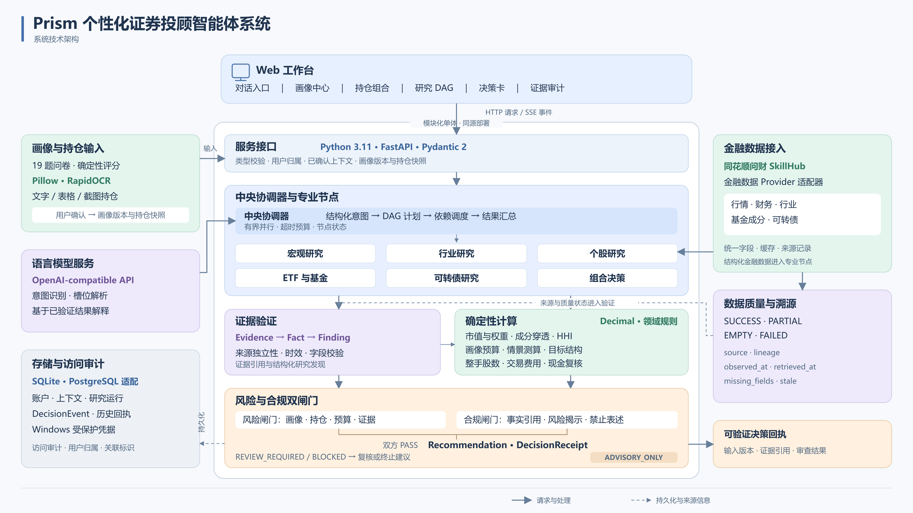

# Prism 系统技术架构图介绍

架构图展示 Prism 从用户输入到建议回执的处理关系。Web 工作台通过 HTTP 和 SSE 与 FastAPI 服务交换请求及状态；已确认画像与持仓进入中央协调器，专业节点组织宏观、行业、个股、基金、可转债和组合分析。右侧数据接入模块提供金融记录及来源状态，证据模块检查引用、来源与时效。Decimal 计算模块完成金额、比例、穿透、集中度、情景及再平衡测算。风险与合规两个闸门共同决定建议资格，SQLite 或 PostgreSQL 保存上下文、研究记录与历史回执。

图片适合用于介绍各模块职责和主要处理方向。具体输入、算法、字段及使用条件分别由演示文稿中的技术页面说明。
