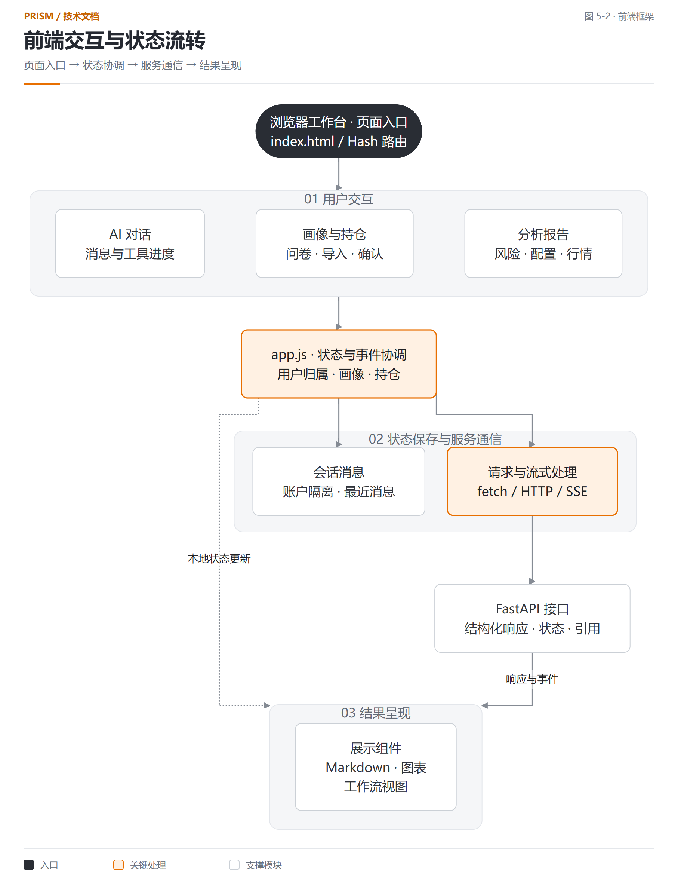
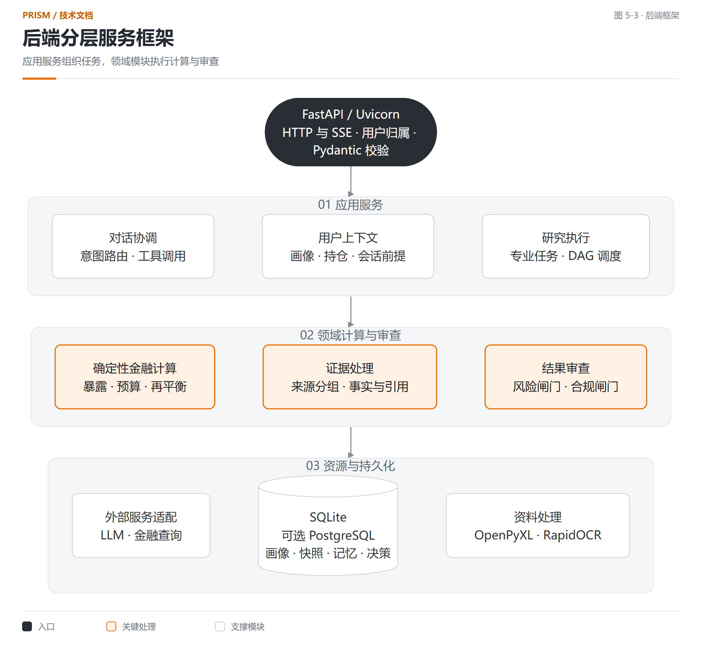
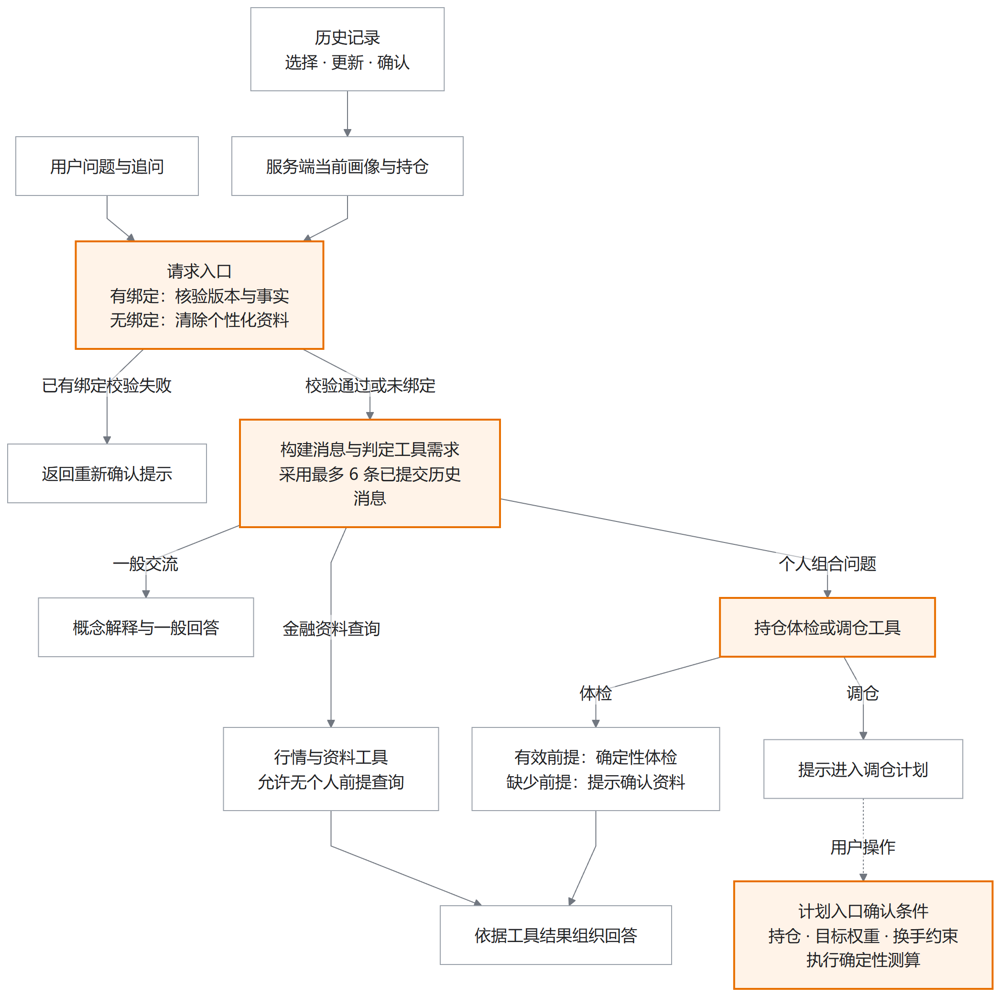

# Prism 个性化证券投顾智能体系统技术文档

## 第一章 项目概述

### 1.1 项目背景

证券投资分析需要同时考虑投资者的风险承受能力、账户持仓和市场信息。用户通常需要在行情工具、研究资料和账户记录之间切换，人工汇总比例、核对数据并判断结论是否适用于自己的组合。自然语言交互能够降低信息获取门槛，金融计算、数据依据和风险规则则决定分析结果能否被复核。

Prism 面向同花顺 A18 个性化证券投顾智能体赛题，基于同花顺问财 SkillHub 等数据能力，提供画像建立、证券研究、持仓分析和方案复核。用户通过问卷、持仓导入和自然语言表达需求，系统将已确认的个人条件、结构化金融数据及确定性计算结果组织成可追踪的分析报告。

### 1.2 项目目标

项目围绕四项能力展开：个人条件参与风险预算和配置范围计算；研究结论关联可验证的数据来源；组合比例和调整数量由程序计算；完整建议经过独立风险与合规审查。评审者可以通过页面、计算公式、正式报告和工程索引逐项检查这些能力。

### 1.3 相关研究与技术选择

Takayanagi 等关于个性化金融顾问的研究将用户条件获取和建议适配作为重要问题，提示自然语言交互需要准确识别投资者需求[1]。Prism 将问卷评分、用户确认和画像版本纳入计算输入，形成可以检查的个人风险约束。

VeriCite 将声明验证、支持证据选择和答案完善组织成引用校验过程[2]。2026 年的 LineageRAG 将证据需求与检索材料、原始来源片段联系起来[3]。这些研究为检查结论与依据之间的关系提供了参考。Prism 的当前实现采用结构化金融声明、来源关联标识及状态规则，处理单位、期间、同源重复和来源冲突。

金融智能体编排研究将规划、研究、风险和审计划分为不同职责[4]。FrontierFinance 则采用带来源的逐项评价标准考察金融研究工作[5]。Prism 将这种任务与依据的组织思路用于解释自身工程设计，结合真实报告复算说明已经实现的能力。文献[3][5]于 2026 年 8 月公开，本文按预印本引用；研究中的评测结果属于各自实验。

## 第二章 需求分析

### 2.1 用户需求

| 用户需求 | 输入资料 | 系统处理 | 用户结果 |
| --- | --- | --- | --- |
| 了解个人风险条件 | 正式问卷、自然语言补充 | 评分、字段确认、版本保存 | 风险等级及配置参考 |
| 理解持仓中的风险 | 持仓、报价、现金及行业 | 暴露汇总、集中度与预算比较 | 风险位置、占比与阈值 |
| 查询证券研究依据 | 证券、主题、时间范围 | 专业查询、证据验证 | 研究发现及引用 |
| 比较组合调整方案 | 当前组合、目标权重、报价 | 交易单位、费用和现金测算 | 数量、现金变化及复核结果 |
| 检查建议能否使用 | 画像、研究、配置与披露 | 独立风险和合规审查 | 通过、复核或阻断原因 |

表 2-1 用户需求与系统输出

### 2.2 技术需求

金融数据必须保留来源、观察时间、单位和统计期间，引用关系需要能够从建议追踪到事实与证据。金额与比例采用确定性程序计算，风险条件进入结构化字段。用户确认前的候选画像、缺失的数据和超时节点均保留对应状态，后续处理依据状态决定是否继续。

### 2.3 质量要求

计算验证关注金额守恒、分母一致、数量取整、费用和现金约束；研究验证关注来源独立性、引用完整性及冲突；交互验证关注用户归属、版本与错误说明。并发、完整咨询时延和长期可用性分别记录测试环境和请求范围，具体结果见第七章。

## 第三章 整体解决方案

### 3.1 服务过程

用户提出投资问题后，系统读取已确认画像和持仓快照，识别分析目的，组织研究与组合计算。研究结果经过证据验证，组合计算输出风险与配置结果。具备相应输入的建议进入风险与合规审查，工作台展示结果及具体原因。

图 3-1 从投资问题到分析结果

### 3.2 系统职责

| 组成部分 | 输入 | 处理职责 | 输出 |
| --- | --- | --- | --- |
| 用户工作台 | 对话、问卷、持仓 | 输入确认、过程展示与结果回看 | 版本化用户上下文 |
| 任务协调 | 问题与可用能力 | 研究计划、依赖和状态管理 | 专业任务及执行记录 |
| 专业研究 | 数据主题与来源 | 查询、整理与证据引用 | 研究发现 |
| 金融程序 | 持仓、报价和画像 | 暴露、预算、配置及调整计算 | 结构化计算报告 |
| 独立审查 | 研究、计算与建议候选 | 风险、归属、引用与披露检查 | 建议资格及回执 |

表 3-1 系统组成与职责

### 3.3 使用过程

用户完成正式问卷并确认画像，导入持仓后核对证券、数量和现金，再选择组合分析或提出证券研究问题。报告展示计算依据和风险位置。需要调整时，用户在有效数据条件下查看目标结构与再平衡测算，并根据复核原因补充输入。

## 第四章 产品方案

### 4.1 投资任务工作台

用户需要在一个入口表达分析目的，并知道系统采用了哪些个人条件。

图 4-1 投资任务工作台

* 分析入口关联已确认画像与当前持仓。
* 页面组织任务、结果及数据状态，支持继续追问。
* 结果说明与用户输入保持关联，便于检查分析前提。

### 4.2 投资者画像

用户需要了解自己的风险条件，以及这些条件如何影响配置参考。

图 4-2 个人中心与投资者画像

* 正式问卷包含 19 个问题，页面提供八个维度的解释。
* 风险等级和画像版本参与后续分析。
* 自然语言形成的字段提案经过用户确认后成为有效输入。

### 4.3 持仓分析与组合报告

用户需要从持仓明细中找到主要风险，检查计算值与个人阈值的关系。

图 4-3 持仓分析与风险报告

* 报告汇总证券、现金、配置比例和集中度。
* 每项检查同时展示观察值、适用阈值及状态。
* 分析结果连接方案测算和后续复核。

### 4.4 市场观察

用户需要结合行情、指标和市场条件理解趋势，并明确数据时点。

图 4-4 市场观察页面

* 页面集中展示指数行情与技术指标。
* 分析内容保留数据时间和服务状态。
* 市场信息为进一步研究提供上下文。

### 4.5 行为画像与持续复核

用户需要了解历史交易行为与问卷画像的关系，并判断资料是否足以支持分析。

图 4-5 交易风格与历史分析

* 历史记录提供独立的行为分析入口。
* 数据不足时保留缺项及解释。
* 行为结果转换为有效风险画像需要明确确认过程。

本章截图采集于 2026 年 9 月 17 日的 Pages 展示页面，页面使用已保存的服务响应。截图反映对应时点的界面与结果，实时交互通过本地服务执行。

## 第五章 技术方案

### 5.1 开发环境

#### 5.1.1 前端

开发语言：HTML、CSS、JavaScript。

页面组织：原生 JavaScript 与 Hash 路由；index.html 提供页面结构，app.js 管理交互状态和请求，styles.css 与 prism-v2.css 管理界面样式。

交互组件：Markdown 内容展示、Lightweight Charts 行情图表及独立工作流编辑器。

通信方式：fetch 发起 HTTP 请求；对话接口通过 SSE 返回分析上下文、工具执行状态和回答内容。

运行方式：浏览器访问 FastAPI 提供的静态工作台。页面采用灰白背景与橙色强调色，组织对话、画像、持仓和市场分析入口。

#### 5.1.2 后端

开发语言：Python 3.11 至 3.12。

服务框架：FastAPI 提供 HTTP 与 SSE 接口，Uvicorn 承担服务运行，Pydantic 负责字段、类型和对象关系校验。

金融计算：Decimal 执行金额、费用和比例运算；独立领域模块负责画像评分、暴露聚合、风险预算及再平衡。

数据存储：SQLite 保存用户上下文、历史记忆和决策记录；配置 PostgreSQL 时使用 psycopg 驱动。

资料处理：OpenPyXL 读取表格，Pillow 与 RapidOCR 处理图片及文字识别，python-multipart 支持文件上传。

外部能力与开发工具：服务端配置 LLM 和金融查询提供方；Git 管理版本，pytest 验证规则与接口。依赖及版本范围由 pyproject.toml 管理。

### 5.2 前后端 AI 系统

系统以用户确认的画像与持仓为共同上下文，连接交互、专业研究、金融计算、审查和结果存储。总体框架如下。

图 5-1 系统总体架构

#### 5.2.1 前端系统

前端采用事件驱动的交互组织方式，将自然语言、问卷、文件与图片输入转换为待确认的结构化资料。HTTP 承担请求提交与结果读取，SSE 承担执行过程的增量传输；界面根据成功、部分可用、空结果和失败状态更新组件。风险结果保留观察值、约束阈值与关联对象，形成从报告结论到持仓及画像条件的可追踪交互。

页面进入时由 Hash 路由选择功能入口，操作事件更新账户范围内的状态，再提交相应接口。对话页根据 SSE 事件展示查询进度；报告页接收服务端已计算的指标；画像或持仓变化后，关联页面更新当前上下文。展示组件共用这些状态，金融运算统一由服务端提供。

图 5-2 前端页面状态与接口框架

#### 5.2.2 后端系统

后端采用模块化单体架构，按接口层、应用服务层与领域计算层组织职责。Pydantic 模型执行输入校验，用户归属、画像版本和持仓快照共同构成计算上下文。组合模块完成暴露聚合、预算评估、配置约束与再平衡；研究模块完成依赖执行和证据验证；建议模块以独立审查结果控制输出资格。跨模块传递结构化结果及其引用标识，使计算状态与业务状态保持一致。

应用服务层协调用户资料与研究请求，领域处理层执行金融规则，外部适配模块负责模型和金融服务调用，存储层保留可追踪记录。一次持仓报告请求由接入层完成归属与字段校验，再读取确认资料，计算暴露及风险，最后返回带状态和来源的结构化报告。

图 5-3 后端分层服务框架

#### 5.2.3 AI 服务开发系统

##### 5.2.3.1 运行环境与依赖

LLM 接口通过服务端配置选择模型及服务地址。金融数据查询由提供方适配模块调用，返回结果经过字段校验和状态整理。网络失败、缺少授权、空结果和部分数据分别记录，分析过程根据可用能力组织任务。

##### 5.2.3.2 服务框架

AI 服务采用语言推理与确定性计算协同的执行框架。大模型将用户诉求转换为意图、字段和研究任务，Python 领域模块以 Decimal 执行金额、比例、穿透暴露及调整数量计算。研究任务通过有向无环图表达前置关系，结果携带数据状态和证据引用；建议生成受到证据验证、风险预算与合规审查的联合约束。以下公式为现有计算规则与状态逻辑的形式化表达。

### 5.3 核心技术

#### 5.3.1 画像条件化的风险预算映射模型

应用环节：用户确认问卷后生成风险画像；持仓报告与配置检查读取该画像对应的预算。式 5-1 至式 5-3 分别用于评分、预算选择和超限差额计算，输出进入报告中的风险提示及配置约束。

模型将已确认的投资者画像映射为组合风险预算。设五维评分向量为 x，依次表示损失承受、投资期限、流动性需求、投资经验和收益预期，各维取值为 1 至 5。采用仿射归一化与加权聚合计算风险分数：

$$z_j=\frac{x_j-1}{4},\qquad s=\operatorname{round}_2(100\boldsymbol{\alpha}^{\mathsf T}\mathbf z)\qquad (5-1)$$

式 5-1 中，α 的五项权重依次为 0.30、0.25、0.20、0.10、0.15，round₂ 表示保留两位小数。评分结果通过分段映射选择风险等级，再读取对应预算向量 b。正式问卷展示维度与底层评分字段分别管理。

$$r(s)=\begin{cases}\mathrm{C},&s\leq33\\\mathrm{B},&33<s\leq66\\\mathrm{G},&s>66\end{cases},\qquad \mathbf b(s)=\mathbf b_{r(s)}\qquad (5-2)$$

式 5-2 中，C、B、G 分别表示保守型、均衡型、成长型；预算向量的四个分量对应表 5-1 的四类比例上限。

| 风险等级 | 单一资产上限 | 已识别行业上限 | 科技行业合计上限 | 未分类合计上限 |
| --- | --- | --- | --- | --- |
| 保守型 | 20% | 30% | 25% | 10% |
| 均衡型 | 35% | 45% | 40% | 20% |
| 成长型 | 50% | 60% | 60% | 35% |

表 5-1 画像对应的风险预算规则

设 o_d 为某项资产或行业的观察比例，b_d 为其所属维度的预算上限，超限残差定义为：

$$e_d=\max(0,o_d-b_d),\qquad \mathcal B=\{d:e_d>0\}\qquad (5-3)$$

式 5-3 中，比例统一使用百分比数值，残差单位为百分点。系统仅对集合 B 中的对象生成超限记录。预算同时绑定用户归属、画像标识及版本，保证约束计算与当前确认画像一致。行为信息单独生成复核结果，经显式转换后参与有效画像计算。

图 5-4 画像参与风险计算

#### 5.3.2 来源等价类约束的证据一致性验证

应用环节：专业研究获得多个来源的指标后，在生成事实与研究发现之前调用交叉验证。式 5-4 至式 5-6 决定某项数值声明能否形成已验证事实，未解决的冲突会影响后续研究结果和建议资格。

系统以 Evidence、Fact、Finding、Recommendation 构建证据、事实、研究发现与建议之间的引用关系。对待验证声明 c，定义口径向量 κ，包含主体、指标、单位及期间；y_c 为待验证数值。观测进入比较集合需要同时满足口径一致与质量验证条件：

$$\mathcal O_c=\{o:\kappa(o)=\kappa(c)\land q(o)=\mathrm{VERIFIED}\}\qquad (5-4)$$

式 5-4 中，q 为质量状态。未满足条件的记录仍进入问题清单。对 O_c 中具有来源关联标识的观测，按 lineage_id 建立等价类 L_g；同组多个一致记录只计一次独立支持。设 Y_g 为该组数值集合，则支持与反对计数为：

$$N_c^+=\sum_g\mathbf1[Y_g=\{y_c\}],\qquad N_c^-=\sum_g\mathbf1[|Y_g|=1\land Y_g\ne\{y_c\}]\qquad (5-5)$$

式 5-5 中，指示函数在条件成立时取 1，否则取 0。组内存在多个数值时，该组退出支持与反对计数，并产生冲突记录。缺少来源关联标识的观测不增加独立来源数量。

设 A_c 表示待处理输入问题，包括口径不一致、未验证记录、组内冲突、无来源关联的反对观测及节点部分完成。支持与反对同时存在也使 A_c 成立。声明获得支持状态的条件为：

$$\operatorname{Supported}(c)\iff(N_c^+\geq2)\land(N_c^-=0)\land\neg A_c\qquad (5-6)$$

至少两个独立来源反对、没有支持且 A_c 不成立时返回 CONTRADICTED；存在待处理问题时返回 UNRESOLVED；其余独立依据不足的情况返回 INSUFFICIENT。判定保留全部相关证据标识，供后续事实构建及建议审查使用。

图 5-5 证据验证与建议依据

这一过程支持对金融数据进行确定性核对。语义声明需要相应的结构化表达与验证规则；不同单位、期间或主体的资料需要完成口径统一后再参与比较。

#### 5.3.3 穿透暴露矩阵与集中度度量

应用环节：用户在持仓分析页生成报告时，系统将直接证券及基金成分映射到资产与行业，形成暴露贡献记录。式 5-7 的结果用于资产、行业占比和集中度计算；式 5-8 的结果展示为集中度指标，并提供风险检查依据。

设 v 为持仓市值向量，A 为持仓到目标类别的暴露映射矩阵，元素 a_ik 表示第 i 项持仓对类别 k 的归属权重。直接证券通过分类关系映射，基金通过可用成分信息形成穿透贡献。类别暴露可以表示为矩阵聚合：

$$\mathbf E=A^{\mathsf T}\mathbf v,\qquad E_k=\sum_i v_i a_{ik},\qquad w_k=100\frac{E_k}{V}\qquad (5-7)$$

式 5-7 中，V 为当前计算口径下的总市值，w_k 使用百分比数值。实现按贡献记录逐项聚合，与矩阵表达等价。成分数据不完整时保留未分类暴露和质量状态，防止缺失信息在聚合时被默认为零。

$$HHI=\sum_k w_k^2,\qquad C_{\max}=\max_k w_k\qquad (5-8)$$

式 5-8 分别描述整体集中度与最大类别占比。两项指标使用同一组已计算比例；含现金总资产和证券市值口径分别记录，各类 HHI 的分类、分母及舍入规则随报告保存。第七章给出正式报告的数值复算。

正式报告中，贵州茅台市值 763,650 元，总资产 1,445,545 元，对应总资产占比 52.83%。这一比例继续与成长型单一资产上限 50% 比较，生成 2.83 个百分点的超限提示。证券持仓口径的 HHI 为 3,692.96，行业与现金分组口径的 HHI 为 3,555.39，分别用于对应的集中度展示。暴露计算、画像预算和报告提示通过同一项持仓数据连接起来。

#### 5.3.4 离散交易约束下的序贯再平衡求解

应用环节：用户提出目标配置后，再平衡服务将目标比例转换为买卖数量，并返回调整顺序、费用、现金余额和复核结果。式 5-9 用于生成候选手数，式 5-10 限定资金能够支持的买入数量，式 5-11 在每项行动后更新资金状态。

再平衡将连续目标权重转换为离散交易数量。设 V 为调整前总资产，w_i* 与 w_i 分别为目标和当前权重，p_i 为有效报价，l_i 为交易单位。金额差额及一般候选手数定义为：

$$\Delta V_i=V(w_i^*-w_i),\qquad \bar n_i=\left\lfloor\frac{|\Delta V_i|}{p_i l_i}\right\rfloor\qquad (5-9)$$

式 5-9 的权重使用 0 至 1 的比例。金额先按分舍入，启用整手约束时股票与 ETF 的交易单位取 100。卖出数量受实际持仓限制；清仓和已确认画像约束下的卖出按对应规则取整。对买入行动，设 C_t 为当前现金，ρ 为最低现金比例，F_i 为包含各项费用的测算函数，可负担手数满足：

$$\begin{array}{l}n_i^*=\max(\{0\}\cup\mathcal N_i),\\\mathcal N_i=\{n\in\{1,\ldots,\bar n_i\}:p_i l_i n+F_i(p_i l_i n)\leq C_t-\rho V\}\end{array}\qquad (5-10)$$

式 5-10 将零手作为未买入的输出。当前费用模型的支出随手数单调不减，程序通过二分查找获得单项行动的最大可负担手数，判定次数为 O(log(1 + n̄_i))。这一求解范围限定于当前行动，多资产整体条件由后续复核检查。

$$C_{t+1}=C_t+S_t-B_t-F_t\qquad (5-11)$$

式 5-11 中，S_t、B_t 为当前行动的卖出、买入金额，F_t 为费用；金额和各项费用按分处理。程序按卖出优先顺序更新现金状态，再计算买入数量。最终以实际测算结果复核现金预留、换手率和组合风险。

规则演算：总资产为 100,000 元、现金为 10,000 元、最低现金比例为 5%，则本项可支出 5,000 元。若目标买入 1,000 股、报价 10 元，500 股加当前程序费用为 5,005.05 元，超过可支出金额；400 股加费用为 4,005.04 元，满足条件。服务输出 400 股、费用 5.04 元、剩余现金 5,994.96 元，并注明目标数量因资金条件缩减。该示例用于说明计算规则，输出供方案测算使用。

图 5-6 目标权重与交易数量计算

计算结束后，程序按实际测算数量复核现金、换手率、组合暴露与画像条件。报告明确区分目标结构和计算得到的调整结果，用户能够检查取整及资金条件带来的差异。

#### 5.3.5 时间预算约束的 DAG 研究调度

应用环节：专业研究工作台将任务分配给宏观、行业、股票与 ETF／基金四类处理角色。每类节点声明允许调用的数据操作、必需字段、依赖节点及时间预算。角色通过类型化输入输出协作，任务间关系由计划声明；一个节点的输出只有满足后续条件时才能继续使用。

研究计划建模为有向无环图 G = (N, E)，节点表示专业研究任务，边表示前置依赖。系统在执行前校验未知依赖与有向环，并生成确定性的拓扑顺序。设 P(v) 为节点 v 的前驱集合，可启动节点集合为：

$$\mathcal R_t=\{v\in N:s_v=\mathrm{PENDING}\land\forall u\in P(v),\ s_u=\mathrm{COMPLETE}\}\qquad (5-12)$$

式 5-12 中，s 表示执行状态；结果层的 SUCCESS 映射为执行层 COMPLETE。只有全部前驱完成，节点才进入就绪过程。前驱部分完成、空结果、失败或取消时，尚未启动的依赖节点被取消，问题沿依赖关系传递。

$$\tau_v^{\mathrm{eff}}=\min(\tau_v^{\mathrm{request}},\tau_v^{\mathrm{node}},T_{\mathrm{remain}})\qquad (5-13)$$

式 5-13 表示外部请求受到请求预算、节点预算与整体剩余时间的共同限制；执行时使用毫秒整数，剩余时间不足时按超时流程处理。满足条件的独立任务可以并行执行，节点结果保存数据、状态及引用。

研究组织参考金融智能体职责分工的研究方向[4]，在本系统中形成任务计划、依赖校验、状态传播、证据汇集和结果记录等工程环节。系统针对市场、行业、证券等主题提供专业处理入口。

对于证券研究任务，调度器先检查前驱是否全部完成，再向对应提供方提交允许的查询操作，随后将返回数据整理为观测与证据。若某个必需前驱只完成部分字段，依赖它的待执行节点被取消，并保留原因；其他独立节点按自身状态处理。式 5-12 用于启动条件判定，式 5-13 用于限制单次请求时长，最终研究状态继续进入证据处理。

对话入口还提供直接工具调用路径：协调器根据当前意图选择工具，校验名称及参数，执行查询并转述工具结果。专业 DAG 研究路径通过研究计划组织多个节点；两条路径在文档中分别描述其调度与结果处理条件。

#### 5.3.6 双闸门状态聚合与建议资格判定

应用环节：结构化建议生成前，系统对候选内容及其依据执行风险和合规检查。式 5-14 控制完整建议资格；若风险通过但缺少必要披露，结果仍要求复核，界面显示相应原因。

风险闸门检查画像、组合、风险预算、证据和配置一致性；合规闸门检查用户归属、引用、披露及禁止表述。将 PASS、REVIEW_REQUIRED、BLOCKED 分别编码为 0、1、2，两项独立审查的整体状态可表示为有序集合上的最大值聚合：

$$g=\max(g_{\mathrm{risk}},g_{\mathrm{compliance}}),\qquad \eta=\mathbf1[g=0]\qquad (5-14)$$

式 5-14 中，η 为完整建议资格。任一闸门提升审查等级，整体结果均保留该等级；两项均通过时 η 才为 1。输出包含独立结果、问题代码和关联输入，建议组合器在组织最终内容时再次检查输入及审查条件。

图 5-7 专业研究协作与双重审查

| 状态 | 触发条件 | 系统动作 | 保留内容 |
| --- | --- | --- | --- |
| PASS | 风险和合规检查均通过 | 进入建议组合 | 依据、披露与决策回执 |
| REVIEW_REQUIRED | 必要资料不完整或需要复核 | 暂缓完整建议 | 缺项、影响及复核原因 |
| BLOCKED | 归属、引用或禁止表述等检查失败 | 终止建议组合 | 阻断原因与关联记录 |

表 5-2 建议资格状态及处理

#### 5.3.7 分层记忆与版本化会话状态架构

系统采用应用层分层记忆架构，由消息窗口管理、会话事实管理和历史记录管理三个部分组成。前端维护近期交流与页面状态，服务端管理确认前提及修订号，持久化模块保存用户显式提交的历史资料。三类上下文分别承担语义连续性、当前事实约束及历史复用，保存方式如下。

| 上下文层次 | 保存内容 | 保存位置与范围 | 使用方式 |
| --- | --- | --- | --- |
| 短期消息 | 用户与助手的近期文本 | 前端按账户组织；展示保存最近 20 条消息 | 已确认前提的对话提交最近 6 条历史消息，服务端再次限制为 6 条 |
| 中期会话前提 | 当前画像、持仓、数据模式及版本 | 服务端 session_truth 记录 | 请求开始和输出期间检查版本与事实指纹 |
| 长期显式记录 | 确认问卷、画像、组合及关联标识 | SQLite 或配置的 PostgreSQL 中的 context_memory | 用户显式保存、检索和恢复，恢复后重新计算派生结果 |

表 5-3 三类上下文的存储与使用方式

短期消息用于理解“它”“刚才的组合”等连续表达。前端的显示历史与模型输入窗口分别管理；认证账户使用会话内存保存页面历史，其他工作区使用带用户范围的浏览器存储。服务端模型输入由系统说明、有效画像与持仓上下文、最多六条历史消息及当前问题组成。

为描述这套架构，设 u 为当前用户，t 为请求时点，D_t 为提交给服务端的历史消息序列，H_t 为本轮实际采用的消息窗口。F_t 表示从服务端读取的当前事实，包含数据模式 d_t、问卷快照标识 q_t、有效画像 P_t 和持仓组合 B_t。会话状态可形式化为：

$$H_t=\operatorname{Tail}_{6}(D_t),\quad F_t=(d_t,q_t,P_t,B_t),\quad S_t^{(u)}=(H_t,F_t,r_t,h_t)\qquad (5-15)$$

式 5-15 中，r_t 与 h_t 分别为确认记录的修订号与内容指纹，S_t 为这些现有对象的联合表示。Tail 表示保留序列末尾最多六条消息，保留原有角色与顺序。该窗口按消息条数控制输入范围；用户的一条问题与助手的一条回答分别计数。问卷与组合另行保存，使早期聊天文本移出窗口后，当前确认的投资条件仍有独立来源。

模型请求通过消息编排形成。设 I 为系统指令，Γ 为服务端将已核验事实转换为画像与持仓上下文的过程，x_t 为当前用户问题，符号 ⊕ 表示有序连接，则已绑定有效前提的请求为：

$$C_t=[I\oplus\Gamma(F_t,r_t)]\oplus H_t\oplus[\operatorname{User}(x_t)]\qquad (5-16)$$

式 5-16 对应聊天服务构建 messages 的过程：系统消息包含规则及已核验条件，随后加入历史消息，最后加入当前问题。金融数值仍由工具计算，Γ 只整理输入资料。历史检索结果不会自动加入该序列；用户恢复和确认后的资料通过当前事实路径进入。由此，架构分别控制语言上下文、计算前提和历史复用三个入口。

指纹使用 SHA-256 计算。CanonicalJSON 对字段顺序及分隔形式作确定性处理，再编码为 UTF-8；因此，相同字段内容在该序列化规则下形成相同输入字节。对于一个已确认版本 r，其记录满足：

$$h_r=\operatorname{SHA256}(\operatorname{UTF8}(\operatorname{CanonicalJSON}(F_r)))\qquad (5-17)$$

式 5-17 用于比较确认时事实与当前事实是否一致，哈希值承担内容一致性检查。确认写入同时检查 expected_revision；只有请求修订与当前存储修订一致，才能保存新记录并将修订号增加一。内容检查覆盖资料变化，修订检查覆盖确认记录变化，二者共同确定本轮是否可以继续使用指定前提。

历史记录采用追加保存方式，保存内容包括问卷、画像、组合以及允许的意图、计划和关联标识。研究结果通过标识关联，相同内容的重复保存由内容身份识别，读取时检查用户归属与内容完整性。长期保存的单位是一次显式确认的结构化上下文。输出期间的版本检查见 6.1 节，历史检索与恢复条件见 6.4 节。

#### 5.3.8 多轮追问与工具需求路由

请求入口根据是否携带会话前提标识处理上下文。已绑定的请求先检查用户归属、修订及当前事实，检查通过后从服务端构建画像与持仓上下文；未绑定的请求清除客户端提交的个性化资料，继续进入聊天流程。已有绑定但检查不通过的请求返回重新确认提示。

进入聊天流程后，每轮问题重新判定是否依赖外部金融事实或个人持仓计算。分类器结合当前问题及近期消息，返回工具需求标记。一般闲聊、自我介绍、写作翻译、概念或公式解释允许进入一般回答；具体证券行情、财务新闻、个人持仓分析以及金额和调仓测算要求使用对应工具或业务入口。无法确定时按需要工具处理。一般行情查询可以在未绑定个人前提时调用查询工具；持仓体检需要有效的确认上下文。

例如，用户先询问某只股票的持仓风险，随后追问“如果减持一部分，现金会增加多少”，系统借助近期消息理解讨论对象，聊天调仓工具返回进入调仓计划的提示。用户在该入口确认已刷新持仓、目标权重与换手约束后执行确定性测算。聊天中的持仓体检工具可以在有效前提下直接计算组合健康指标；用户追问“为什么这个比例超限”时，回答可结合体检结果解释预算规则。若投资条件变化，则需要更新资料并重新确认。

对于非金融问题，当前产品采用一般回答与金融工具调用的分流策略。对话并未设置全面禁止非金融内容的规则；涉及金融事实的请求要求核验，用户要求跳过工具不能改变这一条件。没有有效确认前提时，工作台按一般交流提交，不附带个性化画像、持仓和此前的金融消息上下文。

图 5-8 画像记忆与聊天工具的数据流

在图 5-8 中，入口校验先于模型的工具需求判定。聊天分别提供一般回答、金融资料查询和持仓体检；调仓需求引导用户进入专用计划入口。绑定前提的请求在后续输出期间继续检查版本。历史资料需要经用户选择、更新和确认进入当前上下文。专业研究与结构化建议使用图 5-7 所示的任务执行及双重审查流程。

## 第六章 创新亮点

### 6.1 面向多轮咨询的版本化事实约束

#### 6.1.1 问题背景

投资咨询经常连续经历“查看持仓—解释风险—修改条件—询问调整方案”。在这个过程中，对话文本、实际持仓和用户意图可能同时变化。若继续使用上一轮的数量或风险条件，即使语言回答保持连贯，结论也可能建立在已经失效的输入上。个性化顾问研究关注用户条件与建议适配[1]，Prism 将这一问题进一步转化为当前事实的版本一致性约束。

#### 6.1.2 消息语境与事实前提协同

系统为消息语境和事实前提设置不同职责。近期消息用于理解省略表达和追问对象；画像、持仓数量与数据模式由服务端的确认前提提供。两类输入在本轮请求中组合，使模型能够理解“刚才那只股票”，同时让数量与风险预算始终来自可校验的结构化记录。

这一机制将多轮咨询中的两个变化过程分别管理：消息在每轮交流后延长，事实在用户修改资料并确认后产生新版本。消息窗口可以继续提供主题线索，但计算输入必须通过当前版本检查。例如，“继续分析刚才那只股票”可以继承讨论对象；“我现在增加了一倍持仓”属于需要核对的条件变化，文本中的新数量不能自动替换服务端组合。系统通过资料更新与确认入口建立新的计算前提。

确认前提保存内容指纹和修订号。设 F_t 为服务端当前事实，H 为规范化内容的哈希函数，h_r 为已确认修订对应的指纹，r_req 与 r_store 为请求及存储修订号，当前前提有效需要满足：

$$\operatorname{Valid}_t=(r_{\mathrm{req}}=r_{\mathrm{store}})\land(H(F_t)=h_r)\qquad (6-1)$$

式 6-1 应用于已有确认记录且用户归属匹配的请求。修订号用于识别确认版本，内容指纹用于识别画像、持仓或数据模式变化。请求开始时校验一次，输出期间继续检查，使计算输入与回答使用的前提保持联系。

例如，用户完成某项持仓分析后修改了数量，再追问“现在还需要减持吗”。近期消息能够说明追问对象，但服务端检查会发现持仓事实已经变化，要求重新确认并计算。这样，旧回答可以继续作为交流背景，当前建议则具有新的计算依据。

#### 6.1.3 输出期间的连续版本校验

一次模型与工具调用可能持续多个输出片段，期间用户仍可能修改资料。系统在聊天入口完成检查后，还在转发各个后续输出片段前重新读取确认记录和当前事实。设 τ_k 为第 k 个片段的检查时点，Valid 使用式 6-1 的版本及指纹条件，本轮继续转发的必要条件为：

$$\operatorname{Continue}(k)=\bigwedge_{j=1}^{k}\operatorname{Valid}_{\tau_j},\quad \operatorname{Continue}(k)=0\Rightarrow\operatorname{StopStream}\qquad (6-2)$$

式 6-2 描述输出控制规则。任一次检查发现版本变化、事实变化或必要资料无法读取，服务端返回错误事件并结束本轮输出；已经显示的内容仍需按原有前提理解。检查发生在片段转发前的离散时点，适用范围是本轮后续输出的放行控制。该机制让请求开始后的条件变化也能影响服务结果。

| 当前状态 | 触发事件 | 检查条件 | 后续处理 |
| --- | --- | --- | --- |
| NOT_LOCKED | 用户请求确认 | 问卷与持仓齐备，修订符合要求 | 保存确认记录，进入 LOCKED |
| LOCKED | 发起绑定前提的追问 | 用户归属、请求修订与当前事实一致 | 组织上下文并调用模型及工具 |
| LOCKED | 画像、持仓或数据模式变化 | 当前指纹与确认内容不一致 | 返回 DRIFT_DETECTED，要求重新确认 |
| 输出进行中 | 后续片段准备转发 | 再次检查修订与事实状态 | 通过后继续；不通过则结束输出 |
| DRIFT_DETECTED | 用户重新确认 | 当前资料有效，预期修订一致 | 保存新前提，下一次请求使用新修订 |

表 6-1 会话前提状态与输出处理

表中 NOT_LOCKED、LOCKED 和 DRIFT_DETECTED 为会话前提状态，“输出进行中”为请求执行阶段。两者共同描述一次咨询从确认、调用到条件变化后的处理过程。

系统按数据模式、问卷标识、画像和组合四类内容记录变化位置，返回需要确认的具体原因。对显式提交的结构化事实声明，还可按照字段规则核对数值与引用对象，例如数量要求精确一致，市值采用明确的绝对容差。该检查作用于结构化声明，不对自由文本自动给出全面事实认证。

#### 6.1.4 工程价值

这一设计将多轮对话的连续性与金融输入的一致性共同纳入服务流程。发生变化时能够定位到具体资料，用户确认后继续研究；每轮分析也能够回答“使用的是哪一版画像与持仓”。技术贡献集中于对话、版本记录和确定性复核之间的联合控制。

具体到连续使用场景，用户以修订一完成持仓分析，随后修改数量。旧修订的追问在进入分析时被要求重新确认；若修改发生在回答期间，后续片段的版本检查终止该次输出。用户确认后形成修订二，再次请求时保留相关交流语境并采用新事实。该过程使同一讨论主题能够持续，而每次金融测算均有明确的事实版本。

### 6.2 从来源独立性到建议资格的证据状态传递

#### 6.2.1 问题背景

金融研究中的多篇材料可能转载同一公告，相同指标也可能采用不同单位或报告期间。资料数量增加，并不直接代表结论获得了更多独立依据。VeriCite 关注声明与证据之间的校验[2]，LineageRAG 关注证据需求到原始来源的追踪[3]。Prism 结合金融数据特点，将口径检查、来源去重和冲突处置纳入同一个证据验证过程。

#### 6.2.2 跨研究阶段的证据使用条件

Prism 将证据质量作为后续对象能否生成的条件。原始观测先完成口径和来源检查，声明获得支持后才能形成验证事实；研究发现引用这些事实，候选建议再引用研究发现。引用关系随对象保存，使最终结果能够回查到原始依据和验证状态。

这一组织方式同时处理来源数量与来源关系。假设研究得到三条内容一致的记录，其中两条转载同一公告，第三条来自另一个已标识来源，独立支持数为二。继续增加同一公告的转载，引用记录可以增加，支持数量保持不变。若其中一个来源出现两个矛盾数值，该来源组进入冲突处理，后续流程保留需要复核的原因。

研究执行状态也参与判断。节点只取得部分数据时，验证过程携带部分完成标记；空结果与查询失败分别记录。这样，数据来源不足、数值相互矛盾和请求未成功能够对应不同原因，用户可以据此决定补充来源、核对口径或重新查询。

#### 6.2.3 同源重复不变性

定义 D 为独立支持数、独立反对数与判定状态组成的结果。当新增观测 o′ 具有新的记录标识，但与已有有效观测具有相同口径、来源关联和数值时，聚合满足：

$$D(\mathcal O\cup\{o'\})=D(\mathcal O)\qquad (6-3)$$

式 6-3 表示同源重复记录不改变独立计数及判定状态；引用清单与重复提示仍会更新。来源标识由上游提供，组内矛盾和未验证输入保留异常状态，使冲突信息持续参与后续判断。

#### 6.2.4 工程价值

在结构化建议审查阶段，系统继续检查证据、事实、研究发现之间的引用完整性及状态。一个研究任务执行结束，仅说明任务进入终态；其结论能否支撑建议，还取决于上述条件。项目由此将来源去重、冲突保留和建议资格连接起来，提供可以逐级追踪的研究依据。来源独立性以提供方给出的关联标识为基础，识别质量仍需要数据接入环节保证。

### 6.3 画像约束与实际交易结果的联合复核

#### 6.3.1 设计目标

用户希望得到适用于自身条件的调整方案，但目标比例、可交易数量与调整后的风险并不总是一致。单一资产需要降低几个百分点时，换算的数量可能不足一个交易单位；现金看似足够买入时，费用和预留资金又可能改变实际数量。金融智能体编排研究区分组合、风险和执行职责[4]，Prism 重点解决这些环节在同一方案中的连续校验问题。

#### 6.3.2 从画像预算到调整后持仓

系统首先从确认画像读取预算，计算当前持仓超限对象及差额，再将配置目标转换为数量候选。卖出与买入采用相应交易单位规则，买入数量同时受到可用现金与费用约束。程序记录数量调整原因，使用户能够区分希望达到的配置和实际能够测算的结果。

数量确定后，系统根据这些数量形成调整后的持仓及现金，再次计算组合状态。现金、换手率和画像约束共同参与复核，结果依据实际测算形成。由此，一项方案需要在目标生成与交易后检查两个阶段保持一致，才能说明它是否满足当前条件。

例如，某项超限对应的卖出量不足一手时，按一般取整规则可能产生零交易。程序保留“目标尚未达到”的问题记录；采用确认画像约束的卖出路径时，数量按相应规则调整，并继续接受组合级检查。交易单位因此成为方案结果的一部分，用户能够看到限制来自哪里。

#### 6.3.3 费用与剩余风险的共同解释

第五章的买入示例中，目标数量经过费用与现金条件检查后缩减为 400 股。这个结果只说明该项资金条件允许的数量，方案还需要检查其他持仓及整体风险。系统同时提供目标比例、测算数量、费用和复核问题，使用户能够判断剩余问题是否来自资金、交易单位或画像预算。

该处理方式在服务实现中将数值计算与语言解释分开。金额、数量和费用由确定性模块产生，解释引用这些结果及其原因，避免在文字总结阶段重新计算或修改金融数值。

#### 6.3.4 工程价值

项目的特色是将画像预算、数量约束、资金状态和调整后风险组成连续验证过程。用户可以明确了解方案实现了哪些调整、仍存在哪些限制，以及这些限制如何影响下一步决策。输出用于调整方案评估，保留完整的复算依据。

### 6.4 历史记忆检索与当前决策输入的受控衔接

#### 6.4.1 问题背景

投资者再次访问系统时，往往希望找回之前讨论过的配置、资产或投资目标。历史资料能够帮助连续交流，但其中的持仓、画像与市场条件可能已经变化。直接沿用旧记录会使当前分析混入过时条件。Prism 将历史相关性检索与当前计算输入的确认过程分别管理，使记忆复用具备明确的进入条件。

#### 6.4.2 描述字段检索与显式恢复

长期记忆按用户显式操作保存完整结构化资料。检索时先限制在当前用户最近 100 条记录，再提取风险等级、期限、流动性需求、资产名称及研究意图等描述字段作为候选摘要。配置模型时，模型仅返回候选标识和匹配字段，用于相关性排序；数量、金额等资料不进入该排序摘要。

设 M_u 为用户 u 的显式保存记录，π_desc 为描述字段提取操作，R_t 为排序返回的历史记录标识序列，L 为本次返回数量上限，则检索阶段表达为：

$$\mathcal K_u=\operatorname{Latest}_{100}(M_u),\quad R_t=\operatorname{Rank}(x_t,\pi_{\mathrm{desc}}(\mathcal K_u),L),\quad R_t\subseteq\operatorname{IDs}(\mathcal K_u)\qquad (6-4)$$

式 6-4 中，子集关系约束返回序列中的全部标识，要求每项来自授权候选集合；结果还需满足数量不超过 L 且标识不重复。L 默认为 10，可在 1 至 20 之间设置。排序器接收限定字段并返回记录标识与匹配字段名，完整持仓通过授权读取入口获取。模型排序的作用是发现相关记录，记录归属与内容身份由程序校验。

系统校验模型输出的记录标识必须属于候选集合，匹配字段必须真实存在，并检查返回数量及重复标识。若模型不可用或输出不符合要求，检索返回有限关键词匹配及对应原因，界面能够识别实际使用的检索方式。

检索结果显示为历史记录，用户选择恢复后，工作台载入对应问卷、画像和持仓，同时清空由旧输入生成的分析结果。用户核对当前资料后重新确认，风险计算与研究任务再根据本次有效条件执行。相关性排序因此只决定展示顺序，不决定当前风险预算。

恢复与确认具有不同的数据作用。设 W 为工作台资料状态，A 为页面中的派生分析状态，m 为用户选中的历史记录，Load 表示载入问卷、画像与持仓，则恢复操作可表达为：

$$\operatorname{Restore}_m(W,A)=(\operatorname{Load}(m),\varnothing),\quad m\in M_u\qquad (6-5)$$

式 6-5 中的空集表示清除相应派生分析状态，历史记录本身继续保留。恢复操作更新工作台资料，服务端确认前提仍经独立入口读取、核对并确认。只有用户将需要复用的资料更新为当前有效输入后，才能采用新的确认版本开展个性化计算。这一顺序把“找到相关历史”与“允许参与当前决策”连接为可检查的处理过程。

#### 6.4.3 跨会话使用场景

用户提出“找回之前讨论过的基金组合”时，系统可以依据资产类型和意图字段检索相关保存记录。用户能够查看保存时间及匹配依据，选择需要复用的资料。若当前已经调整持仓，仍需更新和确认新的数量；历史报告只承担回看作用，新的测算重新读取当前有效输入。

例如，历史记录保存了某只基金及当时的投资目标，本次用户希望继续讨论该资产。检索首先依据基金名称与目标找回记录，展示匹配字段；用户选择后载入历史组合，旧分析结果同时清空。如果数量已经变化，用户更新数量并确认当前资料；随后提出“这次增加配置后风险如何”，系统使用新确认版本进行测算。历史记录提供持续交流的入口，当前数量、预算及研究数据在各自的核验环节重新确定。

#### 6.4.4 工程价值

这一设计连接了历史检索、用户确认、会话前提和金融计算。用户能够跨会话找回有用资料，系统同时保留当前输入的版本及归属要求。其技术价值体现为历史信息可复用、检索依据可解释、当前计算前提可确认，为持续投顾交流提供明确的数据管理方式。

### 6.5 应用价值与未来展望

Prism 将用户条件、研究依据、组合计算和建议审查连接为可追踪的服务过程。后续结合引用验证研究[2][3]扩展句子级证据检查，并参考 FrontierFinance[5]，在不同画像与持仓条件下分别评价计算正确性、证据支持和建议适配情况。

## 第七章 系统验证与运行保障

### 7.1 正式组合报告案例

案例采用仓库保存的正式组合报告，生成于 2026 年 9 月 15 日 07:42:36 UTC，于 9 月 17 日收录到 Pages 快照。报告标记为 LIVE，采用成长型画像，风险分数为 85，适当性等级为 C5。金额单位为人民币元，价格对应报告时点。

| 证券 | 数量 | 报告价格 | 市值 | 占证券持仓比例 |
| --- | --- | --- | --- | --- |
| 宁德时代 | 1,000 | 316.36 | 316,360.00 | 22.32% |
| 贵州茅台 | 600 | 1,272.75 | 763,650.00 | 53.87% |
| 中芯国际 | 2,000 | 114.86 | 229,720.00 | 16.21% |
| 中国平安 | 800 | 53.90 | 43,120.00 | 3.04% |
| 恒瑞医药 | 1,500 | 43.13 | 64,695.00 | 4.56% |

表 7-1 报告持仓与市值

证券市值为 1,417,545.00 元，现金为 28,000.00 元，总资产为 1,445,545.00 元。贵州茅台占证券市值 53.87%，占含现金总资产 52.83%。权益类资产占总资产 98.06%，现金占比为 1.94%。

证券资产 HHI 按报告展示的两位小数百分比平方求和，结果为 3,692.96。行业风险 HHI 为 3,555.39，采用含现金总资产口径下的行业与现金分组比例。两项指标的分母与分组不同，分别保留计算定义。

| 检查项 | 观察值 | 适用规则 | 结果 |
| --- | --- | --- | --- |
| 最大资产占比 | 52.83% | 成长型单一资产上限 50% | OVERBOUND |
| 权益类比例 | 98.06% | 报告画像参考区间 70% 至 90% | OVERBOUND |
| 现金比例 | 1.94% | 报告检查下限 5% | OVERBOUND |
| 行业风险 HHI | 3,555.39 | 报告检查上限 2,500.00 | OVERBOUND |
| 最大行业占比 | 52.83% | 成长型已识别行业上限 60% | PASS |

表 7-2 报告风险检查结果

报告返回 REVIEW_REQUIRED，并保留单一资产、权益比例、现金和行业集中度问题。各项检查独立计算，最大行业占比通过可以与其他检查超限同时出现。

### 7.2 验证方法

| 验证对象 | 检查方法 | 判定依据 | 证据范围 |
| --- | --- | --- | --- |
| 画像与预算 | 核对评分、等级、规则与版本 | 给定输入对应确定结果 | 画像规则正确性 |
| 组合计算 | 复算市值、总资产、比例与 HHI | 金额、分母和舍入一致 | 正式报告的数值 |
| 来源与引用 | 检查独立性、冲突和引用关系 | 状态及关联满足规则 | 证据使用条件 |
| 专业任务 | 检查依赖、时间预算和状态传播 | 节点及整体状态一致 | 任务执行逻辑 |
| 建议审查 | 分别检查风险和合规结果 | 双重通过与状态优先级 | 建议资格 |

表 7-3 验证对象与范围

项目保留一次本地真实 HTTP 持仓读取记录：100 个并发请求全部成功，P95 为 326 ms。该结果对应本地读取接口；完整咨询还涉及模型和外部金融查询，需要按端到端场景单独测量。赛题提出的并发咨询、响应时间和长期可用性要求作为相应验收目标管理。

### 7.3 数据质量与运行条件

系统区分 SUCCESS、PARTIAL、EMPTY 和 FAILED，记录来源、观察时间、获取时间、单位、期间及缺失字段。失败和空结果分别展示。实时查询需要有效服务配置与授权，完整研究建议需要验证后的证据、有效画像、组合数据及双重审查。

### 7.4 用户信息与部署

用户归属检查覆盖画像、持仓和决策记录。画像确认与持仓更新形成明确版本，结果关联使用的输入。本地部署使用 FastAPI 服务提供工作台和接口；SQLite 用于本地记录，PostgreSQL 为可选持久化方式。Pages 展示使用公开静态快照，敏感凭据由服务端配置管理。

## 第八章 参考文献

[1] Takayanagi T, Izumi K, Sanz-Cruzado J, et al. Are Generative AI Agents Effective Personalized Financial Advisors? SIGIR 2025. https://arxiv.org/abs/2504.05862

[2] Qian H, Fan Y, Guo J, et al. VeriCite: Towards Reliable Citations in Retrieval-Augmented Generation via Rigorous Verification. arXiv preprint, 2025. https://arxiv.org/abs/2510.11394

[3] Zheng L, Shi X, Mao Z, et al. LineageRAG: Harnessing GraphRAG by Constructing Evidence Lineages with Source Grounding. arXiv preprint, 2026-08-17. https://arxiv.org/abs/2608.16004

[4] Li J, Grover A, Alpuerto A, et al. Orchestration Framework for Financial Agents: From Algorithmic Trading to Agentic Trading. NeurIPS 2025 Workshop on Generative AI in Finance. https://arxiv.org/abs/2512.02227

[5] Zhang Y, Koyluoglu O O, Venkatesh T, et al. FrontierFinance: A Challenging Benchmark for Measuring Frontier Intelligence of Finance Agents. arXiv preprint, 2026-08-12. https://arxiv.org/abs/2608.11683

## 附录 工程核验索引

| 内容 | 实现入口 | 检查对象 | 对应章节 |
| --- | --- | --- | --- |
| 画像与评分 | app/profile/scoring.py；app/profile/questionnaire.py | 字段、评分、风险等级 | 5.3.1、6.3 |
| 风险预算 | app/risk/budget.py；app/risk/contracts.py | 预算上限、观察值与差额 | 5.3.1、6.3 |
| 证据交叉验证 | app/research/cross_validation.py | 范围、来源关联与冲突 | 5.3.2、6.2 |
| 再平衡 | app/service/portfolio_rebalancing.py | 数量、费用、现金与复核 | 5.3.4、6.3 |
| 双重审查 | app/gates/pipeline.py | 独立结果及状态聚合 | 5.3.6、6.2 |
| 会话事实 | app/service/session_truth.py；app/api/main.py | 版本、指纹与持续校验 | 5.3.7、6.1 |
| 历史记忆 | app/store/context.py；app/service/semantic_memory.py | 用户归属、检索与显式恢复 | 5.3.7、6.4 |
| 对话与工具 | app/llm/agent.py；app/llm/client.py | 最近消息与工具需求路由 | 5.3.8 |
| 专业研究 | app/research/specialists.py；app/orchestration/state_machine.py | 角色、依赖与状态传播 | 5.3.5、6.2 |
| 案例输入 | app/api/static/pages-snapshot.json | 正式保存的报告响应 | 7.1 |
| 工程说明 | docs/submission/technical-report.md | 模块、接口与部署细节 | 第五章、第七章 |

表 A-1 工程实现与文档内容的对应关系
