# Prism 个性化证券投顾智能体系统技术方案

| 项目 | 内容 |
| --- | --- |
| 项目名称 | Prism 个性化证券投顾智能体系统 |
| 参赛方向 | 基于同花顺问财 SkillHub 的个性化证券投顾智能体系统设计 |
| 文档用途 | 比赛评委技术评审与项目展示 |
| 阅读重点 | 项目价值、产品能力、技术路线、核心实现、效果验证与创新亮点 |
| 工程依据 | `app/`、`tests/`、`tools/`、`docs/submission/figures/` |

Prism 将投资者画像、投资组合、专业研究、金融计算、风险审查和决策解释组织为一条可展示、可验证、可追踪的服务链路。本方案按照项目详细方案常用的阅读顺序编排，评委可以从项目概况进入产品能力，再沿技术路线查看核心实现与验证结果。

### 评委速读

| 评委关注 | 可直接判断的结论 | 证据入口 |
| --- | --- | --- |
| 解决什么问题 | 将画像、研究、组合分析、风险审查和行动计划放入同一投顾工作台 | 第 1、3、6 章 |
| 如何体现个性化 | 19 道问卷、画像确认和持仓快照进入研究范围、风险预算与目标结构计算 | 第 5.1 节、图 4 |
| 如何保证可信 | 数据带来源、时间、状态和指纹；研究结论沿 `Evidence → Fact → Finding → Recommendation` 回溯 | 第 5.3、5.6 节 |
| 如何保证安全 | 风险闸门与合规闸门独立检查，只有双 `PASS` 才生成建议回执 | 第 5.5 节、图 6 |
| 如何证明已经实现 | 当前 Pages 演示、接口源码、自动化测试、固定案例和负载工具相互对应 | 第 7、9、11 章 |

当前可访问演示：[Prism Pages 演示](https://prism.daoyezongzi.org/?pages=1)。公开页面通过静态快照回放本地服务捕获的接口响应，评委可以重复查看当前账户状态；快照保留原始数据模式和结果状态，当前代码、运行条件和验证依据见第 7、9、12 章。

## 目录

1. [项目概况与赛题理解](#1-项目概况与赛题理解)
2. [Prism 整体解决方案](#2-prism-整体解决方案)
3. [产品能力与典型应用场景](#3-产品能力与典型应用场景)
4. [总体技术方案](#4-总体技术方案)
5. [核心技术路线与实现](#5-核心技术路线与实现)
6. [典型业务闭环案例](#6-典型业务闭环案例)
7. [系统实现与效果验证](#7-系统实现与效果验证)
8. [创新亮点与项目优势](#8-创新亮点与项目优势)
9. [工程保障与运行条件](#9-工程保障与运行条件)
10. [参考资料与实现索引](#10-参考资料与实现索引)
11. [评审材料索引](#11-评审材料索引)
12. [架构决策、运行条件与后续工作](#12-架构决策运行条件与后续工作)

## 1. 项目概况与赛题理解

### 1.1 项目定位

Prism 面向证券研究和组合决策场景，提供以用户为中心的投顾智能体工作台。系统接收投资者风险问卷、投资组合、研究问题和交互上下文，输出带有数据来源、计算依据、风险状态和决策回执的研究与组合结果。

系统将评委最关注的四个问题贯穿在同一条技术路线中：

| 评审问题 | Prism 的回答 |
| --- | --- |
| 系统能解决什么问题 | 将分散的证券研究、组合分析和风险检查组织为连续的投顾服务流程 |
| 系统如何理解不同用户 | 通过风险问卷、画像确认、行为信息和持仓上下文形成可计算的投资者上下文 |
| 系统如何保证结果可信 | 将金融数据归一化为带来源与时间信息的证据，并通过确定性计算与双闸门审查 |
| 系统如何证明已经实现 | 通过可操作工作台、结构化接口、领域测试、集成测试、浏览器测试和确定性回放共同验证 |

### 1.2 赛题场景

传统证券信息服务通常需要用户分别完成资料查找、指标比较、风险判断和组合调整。Prism 将这些任务集中到同一工作台：

1. 用户确认风险承受能力、投资期限、流动性需求和投资组合；
2. 系统理解自然语言中的研究意图，生成对应的研究任务；
3. 宏观、行业、标的、基金和可转债等专业研究节点协同处理；
4. 组合计算模块分析持仓暴露、集中度、风险预算和配置变化；
5. 证据、事实、研究发现和建议形成连续的可追踪关系；
6. 风险闸门与合规闸门完成建议资格检查；
7. 工作台展示研究结果、风险提示、情景变化、调仓行动和历史回执。

### 1.3 项目目标

Prism 的项目目标由产品展示目标和工程实现目标共同构成：

| 目标方向 | 目标内容 | 对评委的可见价值 |
| --- | --- | --- |
| 个性化 | 让风险画像和组合上下文进入研究、计算与建议流程 | 相同问题可以产生与用户条件相关的结果 |
| 专业化 | 覆盖大盘、行业、股票、ETF、基金、可转债和组合分析 | 形成完整的投研场景覆盖 |
| 可解释 | 展示来源、事实、发现、计算过程、风险条件和失效条件 | 评委能够理解结论如何形成 |
| 可控化 | 使用风险与合规闸门裁决建议资格 | 重要结果经过明确的规则检查 |
| 可验证 | 为领域计算、接口、浏览器交互和确定性回放提供测试 | 功能展示与工程证据相互支撑 |
| 可扩展 | 通过统一的数据提供方、研究任务和领域接口接入新能力 | 便于增加研究主题和金融计算模块 |

### 1.4 项目价值

Prism 的价值体现在三个层面：

* 对投资者，系统把风险画像、持仓健康度、研究结论和调仓思路集中呈现，降低理解和操作成本；
* 对投顾服务，系统把专业研究、证据组织、组合计算和风险复核组合为结构化工作流；
* 对评审与复核，系统为每项结论提供来源、时间、状态、关联标识和决策事件，支持从最终结果回看处理过程。

### 1.5 系统能力总览

| 能力模块 | 用户输入 | 主要处理 | 展示结果 |
| --- | --- | --- | --- |
| 风险画像 | 问卷答案、自然语言描述、行为信息 | 评分、画像提案、冲突识别、用户确认 | 风险等级、风险维度、投资者标签 |
| 组合体检 | 标的、资产类型、数量、市值、币种、基金成分 | 暴露计算、基金与 ETF 穿透、集中度分析 | 组合健康度、行业与标的暴露、风险提示 |
| 专业研究 | 研究主题、标的、结构化投资意图 | 任务计划、专业节点执行、证据验证 | 研究卡、事实、发现、结论依据 |
| 组合优化 | 当前组合、目标结构、风险条件 | 目标结构计算、风险预算、配置变化 | 配置方案、变化说明、风险复核 |
| 情景模拟 | 行业或市场冲击、组合权重 | 确定性压力计算、方案对比 | 原组合与调整后组合的影响差异 |
| 再平衡 | 当前权重、目标权重、交易条件 | 调整金额、行动顺序、交易后复核 | 可执行的调仓行动计划 |
| 投顾对话 | 自然语言问题、确认上下文 | 意图解析、任务编排、结果解释 | 流式回答、研究状态、决策回执 |
| 审计与回溯 | 决策事件、用户操作、历史建议 | 事件记录、内容哈希、历史对比 | 决策历史、证据展开、变化记录 |

### 1.6 需求与系统约束

| 需求类别 | 评委需要看到的能力 | 实现方式 | 可核验依据 |
| --- | --- | --- | --- |
| 投顾功能 | 画像、持仓、研究、组合优化、情景分析和再平衡形成连续处理链 | 统一上下文、研究运行、确定性计算和建议回执 | `app/service/`、`app/profile/`、`app/portfolio/`、`app/recommendation/` |
| 自然语言交互 | 用户可以用问题描述研究目的、持仓情况和解释要求 | 模型负责意图识别、字段提取和解释；结构化结果经过接口规则校验 | `app/llm/`、`app/service/natural_profile.py`、`/api/v1/copilot/chat` |
| 数据可信 | 结论能够回到来源、时间、报告期间和具体字段 | `ProviderResult` 四态、证据标识、血缘标识和交叉验证 | `app/providers/`、`app/contracts/evidence.py`、`app/research/` |
| 风险与合规 | 不满足适当性、证据或披露条件时给出复核或阻断状态 | 风险闸门、合规闸门和建议组合器重复检查 | `app/gates/`、`app/recommendation/` |
| 并发与时延 | 以不少于 100 个并发咨询、单次响应不超过 3 秒作为目标口径 | 有界并行、超时预算、状态传播和负载工具 | `tools/load_test.py`、`tools/http_load_test.py` |
| 可用性与审计 | 以 99.9% 可用性作为质量目标，结果可以回看 | 健康检查、决策事件、内容哈希、用户归属和历史回执 | `app/api/`、`app/store/`、`app/history/` |

100 个并发、3 秒和 99.9% 属于目标口径。固定数据、进程内接口和本机 HTTP 测量分别标注验证范围，测量结果不直接表示长期外部服务等级。

## 2. Prism 整体解决方案

### 2.1 方案概要

Prism 把一次投顾请求组织成“用户上下文—专业研究—证据验证—组合计算—风险审查—结果呈现”的连续流程。自然语言负责表达意图和解释结果，结构化领域服务负责画像评分、金融计算、风险判定和决策记录。

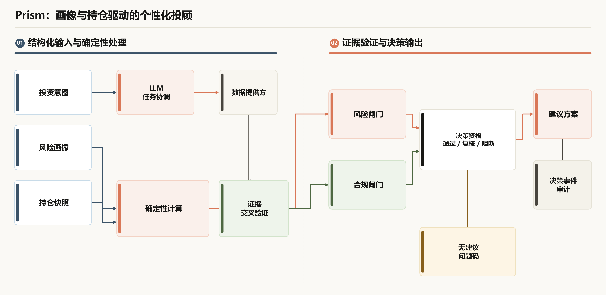

图 1承担全链路关系说明。评委查看具体实现时，可按以下五个节点读取对应章节，避免重复阅读同一条关系：

| 读取节点 | 评委查看内容 | 对应证据 |
| --- | --- | --- |
| 上下文 | 问卷、画像确认、持仓快照和用户归属 | 第 5.1 节、图 4 |
| 研究 | 研究计划、专业节点、证据验证和研究卡 | 第 5.2、5.3 节、图 5 |
| 计算 | 暴露、集中度、风险预算、目标结构和情景结果 | 第 5.4 节 |
| 审查 | 风险闸门、合规闸门和建议资格 | 第 5.5 节、图 6 |
| 回执 | 建议结果、决策事件、解释关系和历史比较 | 第 6、7、9 章 |

### 2.2 方案组成

| 方案组成 | 作用 | 关键输出 |
| --- | --- | --- |
| 用户上下文中心 | 统一管理风险问卷、画像、组合和会话事实 | `QuestionnaireSnapshot`、`RiskProfile`、持仓快照 |
| 研究协同中心 | 根据研究意图组织任务计划和专业节点 | `ResearchPlan`、`ResearchRunState`、研究卡 |
| 证据中心 | 保存来源、时间、字段状态和引用关系 | `Evidence`、`Fact`、`Finding`、`DecisionTrace` |
| 金融计算中心 | 对金额、权重、暴露、集中度和风险条件进行确定性计算 | 暴露报告、风险预算、配置方案、情景结果 |
| 风险审查中心 | 由独立规则检查风险条件和合规内容 | `PASS`、`REVIEW_REQUIRED`、`BLOCKED` |
| 建议与回执中心 | 将合格发现组合为建议并保存结果 | `DecisionReceipt`、`DecisionEvent` |
| 展示与交互中心 | 将研究、组合、证据和风险状态以工作台形式呈现 | 对话页、研究页、组合页、审计页 |

### 2.3 典型场景覆盖

| 场景 | 进入方式 | 处理链路 | 评委可观察结果 |
| --- | --- | --- | --- |
| 投资者画像建立 | 问卷或自然语言画像描述 | 提取、评分、冲突检查、用户确认 | 画像标签、分数、维度解释 |
| 持仓健康体检 | 文本、表格或图片导入 | 归一化、估值重算、穿透、集中度计算 | 持仓报告、风险因子、证据入口 |
| 个股与基金研究 | 研究工作台或对话入口 | 主题识别、数据查询、研究卡、证据验证 | 基本面、估值、行业、风险信息 |
| 组合优化 | 目标结构或画像约束 | 暴露分析、风险预算、配置计算、复核 | 当前与目标结构、变化原因 |
| 情景模拟 | 预设或自定义冲击条件 | 确定性计算、原方案与新方案对比 | 组合影响、风险变化、解释图 |
| 再平衡规划 | 当前组合与目标组合 | 调整计算、行动排序、交易后复核 | 分步行动、金额变化、复核状态 |
| 投顾回溯 | 历史决策与建议页面 | 事件查询、回执比较、证据展开 | 可追踪的决策记录 |

### 2.4 评委阅读路径

本方案采用项目详细方案中常见的组织方式，将“项目概况、方案概要、产品方案、技术路线、核心技术、创新亮点、效果验证、工程保障、参考资料”连续呈现。每个核心技术单元均按照以下顺序说明：

`问题场景 → 设计方法 → 技术路线 → 工程实现 → 展示结果与验证依据`

这种编排让技术图示、流程图、表格和代码索引各自承担清晰的证明作用：技术图示说明系统关系，流程图说明处理过程，表格说明输入输出，代码和测试索引提供工程依据。当前界面能力通过页面锚点、源码位置和验证文件说明。

## 3. 产品能力与典型应用场景

### 3.1 投资工作台

投资工作台将账户风险信息、资产概览和重点任务集中在同一页面，用户可以进入持仓体检、标的研究和组合再平衡流程。

当前评审界面以 `app/api/static/index.html` 和 `app/api/static/app.js` 的现行页面结构为准。Agent 任务中心承担统一入口，组合、研究、解释和评测页面按任务展开。

| 当前页面 | 页面锚点 | 评委可观察能力 |
| --- | --- | --- |
| Agent 任务中心 | `#copilot` | 自然语言问题、画像状态、组合状态和任务入口 |
| 组合总览 | `#overview`、`#portfolio` | 持仓明细、组合报告、基金与 ETF 穿透 |
| 研究工作台 | `#research-tracks`、`#stock-research`、`#fund-research`、`#convertible-bond-research` | 多专业研究与专项研究 |
| 组合决策 | `#portfolio-optimization`、`#scenario-simulation`、`#portfolio-rebalancing` | 目标结构、情景模拟和调仓计划 |
| 分析依据 | `#advanced-explainability`、`#evaluation-dashboard` | 因果解释、评测结果和运行状态 |

当前 Pages 演示使用现行静态页面和当前账户接口快照提供可重复的浏览路径。页面入口位于 `app/api/static/index.html`，快照回放由 `app/api/static/pages-snapshot.js` 读取 `app/api/static/pages-snapshot.json` 完成，浏览器验证文件为 `tests/browser/test_pages_snapshot.mjs`。

评委可直接打开 [Prism Pages 演示](https://prism.daoyezongzi.org/?pages=1) 查看当前页面。现场页面以“任务入口—分析结果—账户条件”的布局组织内容，具体可观察项如下：

| 当前页面区域 | 现场可见内容 | 评委可判断的能力 |
| --- | --- | --- |
| 主导航 | AI 对话、持仓分析、大盘鉴别、交易风格、个人中心；系统治理可展开 | 任务入口与专家工具分层组织 |
| Agent 首页 | 大盘分析、行业配置、个股分析、ETF 基金筛选、可转债投资、资产重组优化六项工具 | 工具状态以 `READY`、`NEED_INPUT` 显示，进入后再提交结构化任务 |
| 账户与偏好 | 成长型 · 85 分、已确认持仓（5 项）、总资产 ¥1,437,253、行业上限 ≤ 60% | 画像、持仓数量、资产和配置条件进入页面上下文 |
| 持仓分析 | 5 项已确认证券、`LIVE` 报告、集中度、行业分布、现金比例和风险状态 | 组合报告、数值计算、超限提示和后续操作集中呈现 |

### 3.2 持仓健康体检与底层穿透

系统能够读取组合持仓，对基金和 ETF 的底层成分进行穿透，并将多个持仓来源汇总到行业、标的和资产类别层面。

当前页面以 `#overview` 和 `#portfolio` 中的组合报告、持仓明细及底层成分区域呈现。

体检结果包括：

* 当前资产结构与主要暴露；
* 基金或 ETF 穿透后的标的重叠；
* 行业集中度和风险预算使用情况；
* 引发风险提示的持仓来源；
* 后续研究、情景模拟和再平衡入口。

### 3.3 标的深度研究

标的研究页面将行情、财务、估值、行业与画像匹配信息组织为可阅读的研究结果。

当前页面入口为 `#stock-research`、`#fund-research` 和 `#convertible-bond-research`。研究结果由结构化数据和证据对象支撑，页面可向下展开查看数据来源、观察时间、报告期间、缺失字段和研究状态。

股票、ETF、基金和可转债分别由对应研究模块处理，研究任务从统一的投顾工作台进入。

### 3.4 组合再平衡

再平衡页面将目标结构与当前结构的差异转换为分步行动计划，并在每一步显示调整对象、权重变化和金额变化。

当前页面入口为 `#portfolio-optimization`、`#scenario-simulation` 和 `#portfolio-rebalancing`。

| 再平衡环节 | 系统处理 | 页面呈现 |
| --- | --- | --- |
| 目标确认 | 读取用户画像、组合约束和目标结构 | 当前目标、约束条件 |
| 变化计算 | 计算每项资产的目标权重与当前权重差异 | 调整方向和金额 |
| 行动排序 | 按确定性规则形成分步行动 | 卖出、买入和顺序 |
| 结果复核 | 重新计算组合暴露、集中度和风险状态 | 调整后结果与风险提示 |

### 3.5 画像与持仓输入

用户可以通过结构化表单、自然语言和图片导入完成画像与持仓输入。自然语言内容先形成类型化提案，持仓图片经过识别后进入字段校验和数值重算流程。

| 输入方式 | 当前实现入口 | 处理结果 |
| --- | --- | --- |
| 结构化画像 | `app/api/static/index.html` 的画像区域 | 风险问卷、画像维度和配置条件 |
| 自然语言持仓 | `#copilot` 持仓入口 | 识别后进入字段校验与组合确认 |
| 截图或文字导入 | `#portfolio` 与 `#copilot` 持仓入口 | 持仓快照、估值重算和后续分析 |

### 3.6 研究与审计展示

系统将研究节点、证据链和决策解释集中到研究工作台与审计页面。评委可以从研究主题进入节点结果，再进入来源和计算过程。

当前页面入口为 `#research-tracks`、`#advanced-explainability` 和 `#evaluation-dashboard`；研究、证据和回执对象由 `app/research/`、`app/contracts/`、`app/recommendation/` 与 `app/store/` 提供。

### 3.7 当前页面截图

以下图片均由最新 Pages 快照页面生成，采集时间为 2026-09-17，分别对应评委进入系统后可以直接查看的主要页面。


图 7 当前 Pages 快照：主导航、六项分析工具、账户与偏好和投顾对话入口。


图 8 当前 Pages 快照：持仓分析报告、风险对照、行业分布和持仓明细。


图 9 当前 Pages 快照：指数行情、技术指标、宏观因子联动和行业轮动入口。


图 10 当前 Pages 快照：历史交易导入、交易风格状态和交易明细筛选。


图 11 当前 Pages 快照：19 题问卷、八维投资者画像和资产配置参考。

## 4. 总体技术方案

### 4.1 系统架构

Prism 采用模块化单体结构。接口、应用服务、领域计算、研究协同、数据提供方、持久化和静态工作台在同一应用中按职责协作，模块之间通过结构化接口和明确状态传递信息。

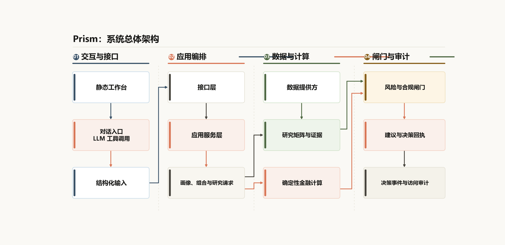

图 2承担模块关系说明；4.2 节用分层表解释目录、职责和输出，4.3 节单独说明一次请求的时序。三者分别对应架构关系、职责分工和交互过程。

### 4.2 分层职责

| 层级 | 主要目录 | 面向评委的能力说明 | 主要输出 |
| --- | --- | --- | --- |
| 交互层 | `app/api/static/` | 提供投资工作台、对话、画像、组合、研究、审计和工作流页面 | 页面状态、图表、卡片和操作入口 |
| 接口层 | `app/api/` | 提供 HTTP、SSE、健康检查、接口文档和用户归属校验 | JSON 响应、流式事件、状态码 |
| 应用服务层 | `app/service/` | 串联画像、研究、计算、闸门、建议和存储 | 端到端投顾结果 |
| 研究协同层 | `app/orchestration/`、`app/research/` | 生成研究计划，按依赖执行专业节点，组织证据验证 | 研究计划、运行状态、研究发现 |
| 领域计算层 | `app/profile/`、`app/portfolio/`、`app/risk/`、`app/allocation/`、`app/optimization/`、`app/scenarios/`、`app/recommendation/` | 执行画像评分、组合计算、风险预算、配置、情景、建议资格判定 | 数值结果、风险结果、建议回执 |
| 数据能力层 | `app/providers/` | 统一处理行情、财务、新闻、研究资料和技能查询 | 带来源、时间和状态的提供方结果 |
| 存储审计层 | `app/store/`、`app/history/`、`app/explainability/` | 保存上下文、决策事件、历史建议、解释关系和访问记录 | 历史回放、审计记录、解释图 |

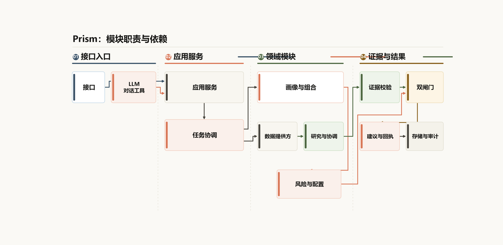

### 4.3 用户请求的数据流

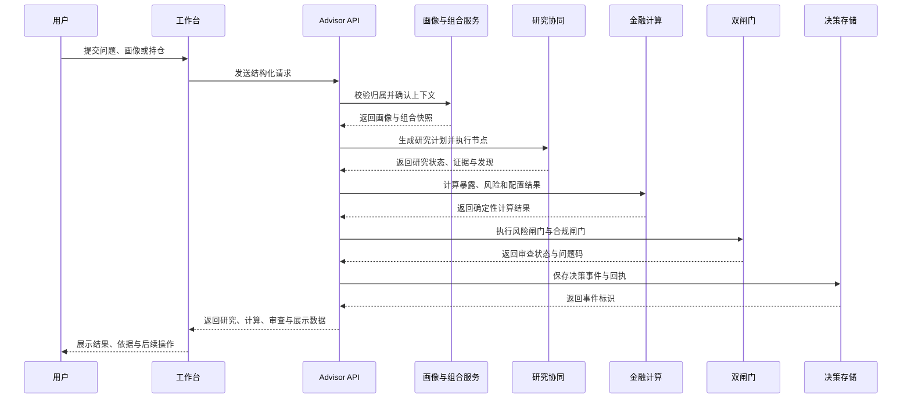

### 4.4 技术组成

| 技术组成 | 当前使用方式 | 支撑能力 |
| --- | --- | --- |
| Python 3.11 | 后端应用、领域计算和测试 | 统一实现业务服务与验证工具 |
| FastAPI | HTTP、SSE、OpenAPI 和静态资源挂载 | 提供投顾与专项分析接口 |
| Pydantic 2 | 输入输出对象、字段校验和版本字段 | 保证结构化数据可以校验与传递 |
| `Decimal` | 金额、权重、分数和金融指标计算 | 保持金融计算精度与守恒 |
| SQLite / PostgreSQL 适配 | 决策事件、上下文和审计数据 | 支持本地运行与存储替换 |
| 原生 HTML、CSS、JavaScript | 工作台、图表、流式状态和工作流页面 | 形成可直接展示的产品界面 |
| Pillow、RapidOCR | 图片读取、持仓图片识别和字段处理 | 支持非结构化持仓输入 |
| 可配置 LLM 接口 | 对话、意图、槽位提取和解释 | 提升自然语言交互能力 |

### 4.5 对外接口分组

| 接口分组 | 代表路径 | 能力 |
| --- | --- | --- |
| 服务入口 | `GET /`、`GET /api/docs`、`GET /api/health` | 工作台、OpenAPI 和健康检查 |
| 用户与运行状态 | `/api/v1/auth/*`、`/api/v1/runtime/*` | 本地账户、数据模式、提供方配置和运行能力 |
| 画像与组合 | `/api/v1/advisor/profile/*`、`/api/v1/advisor/context/*`、`/api/v1/advisor/portfolio/*` | 问卷、画像、持仓、组合报告与上下文 |
| 研究场景 | `/api/v1/advisor/research-runs`、`/api/v1/advisor/stock-research-runs`、`/api/v1/advisor/fund-research-runs`、`/api/v1/advisor/convertible-bond-research-runs` | 研究矩阵、股票、基金和可转债 |
| 组合决策 | `/api/v1/advisor/portfolio-optimization-runs`、`/api/v1/advisor/scenario-simulation-runs`、`/api/v1/advisor/rebalancing-runs` | 目标结构、情景模拟和再平衡 |
| 投顾对话 | `/api/v1/advisor/queries`、`/api/v1/copilot/chat` | 投顾查询、工具调用和流式对话 |
| 解释与历史 | `/api/v1/advisor/explainability-runs`、`/api/v1/decision-events`、`/api/v1/advisor/recommendation-history` | 因果解释、决策事件和建议历史 |

### 4.6 结果状态

系统将数据服务状态、证据质量状态和建议审查状态分别表示，评委可以从页面和接口结果中识别处理进度与结果性质。

| 状态类别 | 状态值 | 含义 |
| --- | --- | --- |
| 数据提供方 | `SUCCESS` | 查询得到完整记录 |
| 数据提供方 | `PARTIAL` | 查询得到记录，同时存在缺失字段或结构化问题 |
| 数据提供方 | `EMPTY` | 查询范围明确，结果数量为零 |
| 数据提供方 | `FAILED` | 查询执行出现网络、鉴权、超时或解析问题 |
| 建议审查 | `PASS` | 风险闸门与合规闸门均通过 |
| 建议审查 | `REVIEW_REQUIRED` | 结果需要人工复核或补充信息 |
| 建议审查 | `BLOCKED` | 关键条件未满足，停止建议组合 |

## 5. 核心技术路线与实现

### 5.1 投资者画像与个性化计算

#### 问题场景

不同投资者在风险承受能力、投资期限、流动性需求、收益预期、投资经验和持仓结构方面存在差异。投顾结果需要把这些差异转换为可参与后续研究与计算的结构化信息。

#### 设计方法

系统将正式问卷、自然语言画像提案、用户确认信息和已确认行为事件分开管理。正式问卷形成计算基础，自然语言用于提高输入效率，行为信息用于画像复核。

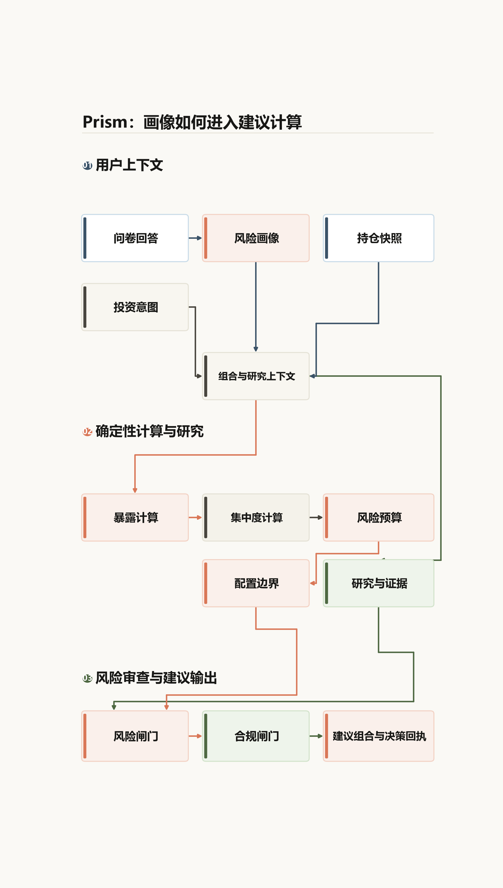

#### 技术路线

| 输入来源 | 确定性处理 | 结构化产物 | 评委可见结果 |
| --- | --- | --- | --- |
| 19 道正式风险问卷 | 校验题目完整性、顺序、选项范围和问卷版本；按 8 个维度计算分数 | `QuestionnaireSnapshot`、`RiskProfile` | 风险等级、维度分数、适当性状态和确认时间 |
| 自然语言画像描述 | 提取类型化字段，记录原文摘要和输入指纹，与正式问卷逐维度比较 | `ProfileExtractionProposal`、`ProfileConflict` | 待确认差异、问卷值、提议值和用户选择 |
| 已确认行为事件 | 统计交易次数、换手率、持仓集中度、行业集中度和权益仓位；数据不足时保留状态 | 行为画像、行为证据和复核结果 | 行为标签、数据充分性和风险复核 |
| 已确认画像与组合 | 读取画像版本、用户归属和持仓快照，传给风险预算、配置和研究服务 | 研究上下文、配置范围和建议输入 | 画像条件如何影响研究范围与组合结果 |

画像处理的关键规则是：正式问卷提供评分基础，自然语言提案需要经过用户确认，行为画像用于复核，三类信息均保留版本、时间和用户归属。任何未确认的提案都不能直接进入风险或组合计算。

#### 工程实现

* `app/profile/questionnaire.py` 定义问卷模板、题目顺序和快照生成；
* `app/profile/scoring.py` 执行风险分数和维度评分；
* `app/profile/contracts.py` 定义 `RiskProfile` 与相关画像对象；
* `app/service/natural_profile.py` 将自然语言内容转换为画像提案，并记录原文依据；
* `app/profile/behavior.py` 根据已确认行为事件形成独立的行为画像；
* `/api/v1/advisor/profile/questionnaire/confirm`、`/api/v1/advisor/profile-proposals/confirm` 和 `/api/v1/advisor/context/profile` 提供画像确认与上下文接口。

#### 展示结果与验证依据

画像页面能够展示风险等级、画像维度、配置倾向和待确认内容。`tests/unit/test_full_questionnaire.py`、`tests/unit/test_profile_scoring.py`、`tests/unit/test_natural_profile.py`、`tests/unit/test_behavior_profile.py` 和 `tests/integration/test_phase23_profile_confirmation.py` 覆盖问卷完整性、评分、自然语言提案、行为画像和确认流程。

### 5.2 多专业研究协同

#### 问题场景

一次投资问题可能同时涉及市场、行业、股票、基金、ETF、可转债和组合。不同研究节点需要共享主题、标的、时间范围和用户条件，并按照依赖关系形成完整结果。

#### 设计方法

系统由中央协调模块生成研究计划，将复杂问题转换为结构化节点；研究执行器根据节点依赖进行有界拓扑执行，专业模块负责自己的研究卡和结果对象。

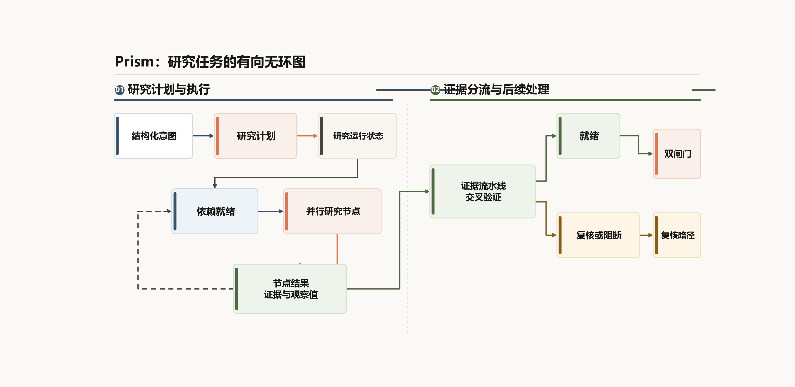

#### 技术路线

| 阶段 | 输入与依赖 | 执行内容 | 评委可观察输出 |
| --- | --- | --- | --- |
| 意图整理 | 用户问题、画像和组合上下文 | 识别研究主题、标的、期间和必需字段 | 结构化投资意图 |
| 计划生成 | 结构化意图 | 中央协调模块生成有依赖关系的 `ResearchPlan` | 研究范围、节点清单和依赖关系 |
| 专业节点 | 计划节点与数据提供方结果 | 按依赖执行市场、行业、股票、基金、ETF 和可转债研究 | 各节点状态、研究卡和问题对象 |
| 结果验证 | 节点结果、主张和证据 | 归一化证据，检查来源、时间、字段和独立血缘 | 证据质量、交叉验证状态和研究发现 |

研究执行保留节点状态、超时、取消和问题码；节点结果经过证据验证后才进入事实和发现，研究计划本身不直接生成建议。

#### 工程实现

* `app/orchestration/contracts.py` 定义 `ResearchPlan`、`ResearchRunState` 和节点状态；
* `app/orchestration/` 负责任务计划、依赖关系和有界执行；
* `app/research/pipeline.py` 负责研究证据流水线、结果状态和问题对象；
* `app/stock/`、`app/fund/`、`app/convertible_bond/` 承载专项研究；
* `app/api/main.py` 提供研究矩阵、股票、基金和可转债运行接口；
* `app/api/static/` 将节点状态、研究卡和结果入口呈现给用户。

#### 展示结果与验证依据

研究矩阵页面展示多专业节点及其处理关系，研究结果可以继续展开到证据和事实。`tests/unit/test_bounded_orchestration.py`、`tests/unit/test_specialist_matrix.py`、`tests/unit/test_research_evidence_pipeline.py`、`tests/integration/test_phase7_bounded_orchestration.py`、`tests/integration/test_phase16_specialist_matrix.py` 和 `tests/integration/test_phase24_research_scenarios.py` 覆盖计划、节点、依赖和研究场景。

### 5.3 证据链与研究可信度

#### 问题场景

金融研究结论需要说明数据来源、观察时间、报告期间、字段口径和验证状态。单独展示生成文本无法说明结论与原始资料之间的关系。

#### 设计方法

Prism 将研究信息组织为四层关系：

`
Recommendation → Finding → Fact → Evidence
`

建议引用发现，发现引用事实，事实引用证据。证据保留来源、时间、请求指纹、质量状态和关联标识，研究流程在形成发现前完成字段检查与交叉验证。

#### 技术路线

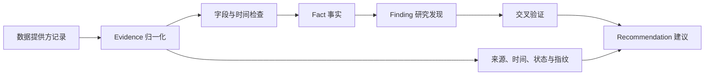

#### 工程实现

* `app/contracts/evidence.py` 定义 `Evidence`、`Fact`、`Finding` 和建议引用对象；
* `app/research/cross_validation.py` 执行来源独立性、时间一致性和指标口径检查；
* `app/research/pipeline.py` 组织证据流水线、质量状态和问题码；
* `app/recommendation/contracts.py` 定义建议绑定、规则版本和 `DecisionReceipt`；
* `app/store/contracts.py` 定义 `DecisionEvent`，保存决策内容、关联标识和内容哈希。

#### 展示结果与验证依据

研究页面与解释页面可以从结论进入事实和来源，决策历史可以读取对应回执与事件。`tests/unit/test_evidence_contract.py`、`tests/unit/test_evidence_finding_bridge.py`、`tests/unit/test_research_cross_validation.py`、`tests/integration/test_phase8_evidence_finding_bridge.py`、`tests/integration/test_phase10_research_evidence_pipeline.py` 和 `tests/integration/test_phase12_recommendation_receipt.py` 覆盖证据、事实、发现、交叉验证和回执关系。

### 5.4 确定性组合计算

#### 问题场景

持仓分析涉及金额、权重、基金成分、行业暴露、集中度、风险预算和目标结构。计算结果需要稳定、可复核并可以解释每一项来源。

#### 设计方法

金融计算由确定性领域模块执行。大语言模型负责意图理解、字段提取和自然语言解释；金额、权重、暴露、集中度、风险预算、配置和调仓数值由 Python 服务计算。

#### 技术路线

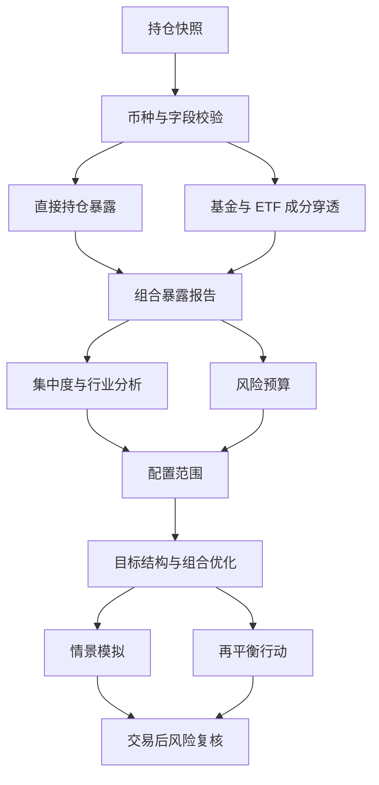

#### 计算关系

对于组合总价值 `V`、持仓 `i` 的价值 `v_i`、标的或行业 `g` 在持仓中的穿透权重 `w_{i→g}`，系统按以下关系计算暴露：

`
E_g = Σ_i (v_i × w_{i→g})
exposure_pct_g = E_g / V × 100
`

集中度使用各分组暴露占比计算：

`
HHI = Σ_g (E_g / V)² × 10000
`

目标结构与当前结构的变化以确定性差异计算：

`
Δ_i = target_weight_i − current_weight_i
`

#### 工程实现

* `app/portfolio/exposure.py` 的 `calculate_exposure` 计算直接暴露与穿透暴露；
* `app/risk/concentration.py` 的 `calculate_concentration` 计算分组集中度；
* `app/risk/budget.py` 计算风险预算使用情况；
* `app/allocation/` 生成资产、行业和标的的配置范围；
* `app/optimization/` 与 `app/service/` 提供目标结构和组合优化；
* `app/scenarios/custom_stress.py` 的 `calculate_custom_stress` 执行自定义情景计算；
* `app/rebalancing/` 与 `app/service/` 生成再平衡行动并执行交易后复核；
* 领域计算使用 `Decimal`，输入校验、组合守恒和约束条件由测试覆盖。

#### 展示结果与验证依据

组合体检、情景模拟和再平衡页面分别展示暴露来源、方案差异和行动顺序。`tests/unit/test_portfolio_exposure.py`、`tests/unit/test_risk_concentration.py`、`tests/unit/test_risk_budget.py`、`tests/unit/test_allocation_envelope.py`、`tests/unit/test_scenario_simulation.py`、`tests/unit/test_portfolio_rebalancing.py`、`tests/integration/test_phase3_exposure.py`、`tests/integration/test_phase4_risk_budget.py`、`tests/integration/test_phase28_portfolio_optimization.py`、`tests/integration/test_phase33_scenario_simulation.py` 和 `tests/integration/test_phase35_portfolio_rebalancing.py` 覆盖主要计算链路。

### 5.5 风险与合规双闸门

#### 问题场景

投顾结果需要同时满足用户适当性、组合风险、研究证据和合规披露要求。单次文本生成无法承担这些检查工作。

#### 设计方法

Prism 在建议组合前执行两个独立闸门：

* 风险闸门检查画像、组合、暴露、集中度、风险预算和配置条件；
* 合规闸门检查建议候选、发现引用、风险揭示和失效条件。

两个闸门分别产生状态，最终按 `BLOCKED > REVIEW_REQUIRED > PASS` 裁决。只有两个闸门均为 `PASS` 时，建议组合器才生成 `DecisionReceipt`。

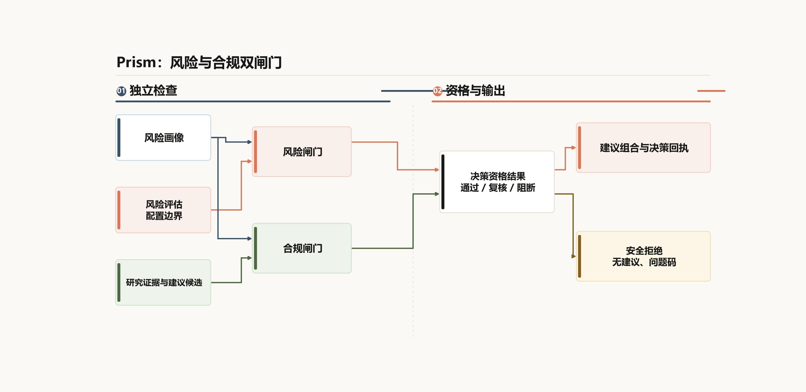

#### 技术路线

| 检查单元 | 检查内容 | `PASS` | `REVIEW_REQUIRED` | `BLOCKED` |
| --- | --- | --- | --- | --- |
| 风险闸门 | 归属、画像、组合、暴露、集中度、风险预算和配置条件 | 风险条件完整且在允许范围内 | 数据不完整或需要补充确认 | 归属错误、输入篡改、关键风险条件失效 |
| 合规闸门 | 研究引用、风险揭示、失效条件和禁止表述 | 引用闭合且披露完整 | 缺少披露或需要人工复核 | 出现禁止表述、引用断裂或安全问题 |
| 资格裁决 | 两个闸门的组合状态 | 两者均为 `PASS`，生成建议和回执 | 任一闸门需要复核，返回补充清单 | 任一闸门阻断，停止建议组合 |

#### 工程实现

* `app/gates/risk.py` 的 `evaluate_risk_gate` 执行风险与归属检查；
* `app/gates/compliance.py` 的 `evaluate_compliance_gate` 执行引用、披露和文本检查；
* `app/gates/pipeline.py` 的 `evaluate_decision_gates` 聚合两个闸门状态；
* `app/recommendation/composer.py` 的 `compose_recommendations` 在生成结果前重新校验输入并执行双闸门；
* `app/recommendation/contracts.py` 保存闸门标识、规则版本、问题码、失效条件和回执关系。

建议结果包含 `NO_GUARANTEE`、`LOSS_RISK`、`EVIDENCE_SCOPE` 和 `INVALIDATION_CONDITIONS` 等机器可读披露，便于界面展示与后续审计。

#### 展示结果与验证依据

系统可以展示通过结果、复核结果和阻断结果，并为每一种状态保留处理原因。`tests/unit/test_decision_gates.py`、`tests/unit/test_recommendation_composer.py`、`tests/integration/test_phase11_risk_compliance_gates.py` 和 `tests/integration/test_phase12_recommendation_receipt.py` 覆盖双闸门及建议组合。

### 5.6 数据提供方与运行状态

#### 问题场景

行情、财务、新闻和研究资料来自不同接口，返回时间、字段质量和服务状态各有差异。研究系统需要让数据来源与结果状态跟随处理流程。

#### 设计方法

Prism 通过统一的数据提供方接口表示请求、记录、指纹、超时、缓存方式和结果状态。直接请求、缓存结果和备用来源可以在同一结果结构中说明服务方式。

#### 技术路线

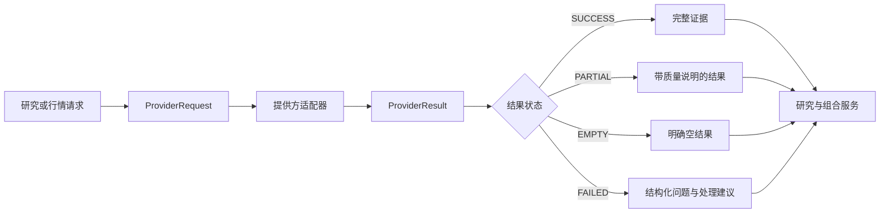

#### 工程实现

* `app/providers/` 定义提供方请求、记录、结果和恢复策略；
* `app/runtime/` 管理数据模式、能力探测和运行配置；
* `app/api/main.py` 提供问财配置、提供方查询、运行状态和健康检查接口；
* `app/store/` 保存可用于审计的状态与访问记录；
* `tests/unit/test_provider_contract.py`、`tests/unit/test_provider_resilience.py`、`tests/unit/test_runtime_mode_and_providers.py`、`tests/integration/test_fixture_provider.py` 和 `tests/integration/test_live_fixture_refusal.py` 验证状态与提供方处理。

#### 展示结果与验证依据

运行状态页面展示当前数据模式、提供方能力、查询状态和结构化问题。评委可以从健康检查、运行能力和问财配置页面查看系统状态。相关测试覆盖提供方接口规则、恢复处理、运行模式和固定数据状态。

### 5.7 数据真实性与缺失语义

金融数据进入研究或组合计算前，需要同时保留内容状态、时间口径和来源关系。数据提供方状态、送达方式和证据质量分别记录，缓存或备用来源不会改写原始内容状态。

| 检查维度 | 必须保留的内容 | 处理规则 | 评委可核验对象 |
| --- | --- | --- | --- |
| 来源归属 | 提供方、来源、记录标识、请求标识和请求指纹 | 每条记录都可以回到一次具体请求和来源 | ProviderRequest、ProviderRecord |
| 时间口径 | as_of、observed_at、retrieved_at、period 和 units | 区分观察时间、获取时间、报告期间和单位 | ProviderRecord、Evidence |
| 字段完整性 | required_fields、missing_fields 和问题对象 | 必需字段缺失时保留缺失状态，不写入默认数值 | ProviderResult、研究状态 |
| 内容状态 | SUCCESS、PARTIAL、EMPTY、FAILED | 完整、部分、空结果和执行失败分别进入后续路径 | ProviderResult |
| 证据质量 | evidence_id、lineage_id、质量状态和关联标识 | 只有来源闭合、字段有效且交叉验证通过的证据形成已验证事实 | Evidence、Fact、Finding |
| 服务方式 | 直接请求、新鲜缓存、备用提供方和过期缓存 | 送达方式独立记录，过期缓存标记为 STALE | ProviderServingMode、Evidence |

空结果保持为空结果，失败保持为失败状态，缺失字段不补写零值或推断值。研究运行没有完整结束时，暂时支持的主张进入复核，不生成已验证事实和发现；来源冲突保留双方证据并进入复核。

## 6. 典型业务闭环案例

### 6.1 案例目标

以“投资者提交组合并询问是否需要调整”为例，展示 Prism 如何把用户条件、组合数据、研究证据、风险计算和行动建议连接为完整闭环。

该案例的页面能力以当前 `app/api/static/index.html` 页面结构和接口实现为准。文档中的技术图示用于说明信息组织与处理关系；运行系统时，画像、组合和数据提供方结果由当前请求中的确认上下文与运行状态生成。

### 6.2 业务处理流程

图 1已经说明全链路关系，本案例用阶段表突出输入、输出和评委判断点：

| 阶段 | 本案例输入 | 关键处理 | 评委判断点 |
| --- | --- | --- | --- |
| 上下文确认 | 风险问卷、画像提案、持仓快照 | 校验归属、版本、字段和观察时间 | 结果确实绑定当前用户条件 |
| 研究与验证 | “是否需要调整”的结构化意图 | 执行市场、行业和标的研究，形成证据、事实与发现 | 研究结论有来源和状态 |
| 组合计算 | 持仓、基金成分、画像条件 | 计算暴露、集中度、风险预算和配置范围 | 数值能够复核，超限项能够定位 |
| 方案比较 | 当前结构、目标结构和情景条件 | 生成目标结构、情景差异和再平衡行动 | 调整原因、金额和风险变化清晰 |
| 资格审查 | 研究发现、计算结果和建议候选 | 执行风险与合规双闸门 | 通过、复核和阻断状态有明确依据 |
| 结果回执 | 审查状态和关联标识 | 保存建议、决策事件和解释关系 | 结果能够回看和比较 |

### 6.3 处理阶段与输出

| 阶段 | 输入 | 系统动作 | 输出 |
| --- | --- | --- | --- |
| 上下文确认 | 问卷、画像提案、持仓和组合信息 | 校验归属、版本、字段和观察时间 | 已确认画像与组合快照 |
| 研究计划 | 自然语言问题和结构化意图 | 识别主题、标的和研究范围 | `ResearchPlan` |
| 专业研究 | 研究节点与数据提供方结果 | 执行市场、行业、标的和资产研究 | 研究状态、证据和发现 |
| 组合计算 | 持仓快照、成分快照和画像条件 | 计算暴露、集中度、风险预算和配置范围 | 组合报告、风险结果和目标结构 |
| 方案比较 | 当前组合、目标结构和情景条件 | 计算情景影响与调整差异 | 情景结果和再平衡计划 |
| 资格审查 | 研究发现、计算结果和建议候选 | 执行风险与合规双闸门 | `PASS`、`REVIEW_REQUIRED` 或 `BLOCKED` |
| 结果回执 | 审查结果和关联标识 | 组合建议、保存事件、生成解释入口 | 建议回执、决策事件和历史记录 |

### 6.4 评委可见的证明点

| 证明点 | 页面或接口 | 技术依据 |
| --- | --- | --- |
| 用户条件确实进入结果 | 画像页面、组合页面和建议页面 | `RiskProfile`、组合上下文和归属校验 |
| 研究结果具有来源关系 | 研究卡、证据展开和解释页面 | `Evidence`、`Fact`、`Finding` |
| 组合变化可以计算 | 健康体检、情景和再平衡页面 | `calculate_exposure`、风险预算和调仓服务 |
| 建议经过规则检查 | 建议状态和审计事件 | `evaluate_decision_gates`、`DecisionReceipt` |
| 结果可以回看 | 历史建议、决策事件和对比页面 | `DecisionEvent`、内容哈希和历史服务 |

## 7. 系统实现与效果验证

### 7.1 可见成果

评委可以通过以下页面快速观察系统能力：

| 成果页面 | 可见能力 | 当前页面或实现位置 |
| --- | --- | --- |
| Agent 任务中心 | 用户问题、画像状态、组合状态和任务入口 | `#copilot`、`app/api/static/index.html` |
| 组合健康体检 | 底层穿透、暴露、集中度和证据入口 | `#overview`、`#portfolio` |
| 标的深度研究 | 行情、财务、估值、行业和画像匹配 | `#stock-research`、`#fund-research`、`#convertible-bond-research` |
| 再平衡计划 | 当前与目标结构、分步行动和复核 | `#portfolio-rebalancing` |
| 情景模拟 | 原方案与调整后方案的影响比较 | `#scenario-simulation` |
| 高级解释 | 因果关系、关键驱动因素和条件变化 | `#advanced-explainability` |
| 评测看板 | 质量、规则和运行结果的集中展示 | `#evaluation-dashboard` |
| API 文档 | 接口分组、请求响应和 OpenAPI 入口 | `GET /api/docs`、`app/api/main.py` |

当前演示入口为 [Prism Pages 演示](https://prism.daoyezongzi.org/?pages=1)。现场页面显示任务导航、六项分析工具、账户与偏好、持仓分析报告和大盘鉴别结果，`tests/browser/test_pages_snapshot.mjs` 使用实际页面检查加载、导航、组合体检结果、同源资源和控制台错误。

| 当前演示检查点 | 评委可观察内容 | 验证依据 |
| --- | --- | --- |
| Agent 首页 | 六项分析工具显示 `READY` 或 `NEED_INPUT`，并提供常用提问入口 | `app/api/static/index.html`、`app/api/static/app.js`、`tests/browser/test_pages_snapshot.mjs` |
| 账户与偏好 | 成长型 · 85 分、已确认持仓（5 项）、总资产 ¥1,437,253、行业上限 ≤ 60% | `app/api/static/pages-snapshot.json`、`tests/browser/test_pages_snapshot.mjs` |
| 持仓分析报告 | `LIVE` 报告覆盖 5 项证券，贵州茅台占证券持仓 53.87%，组合状态为需要复核 | `app/api/static/pages-snapshot.json`、`app/api/static/app.js` |
| 风险对照 | 单一标的集中度、权益类占比、现金比例分别展示当前值、画像阈值、状态和计算口径 | `app/api/static/pages-snapshot.json`、`app/api/static/app.js` |
| 大盘鉴别 | 上证指数 `000001.SH`、3,875.60、-0.41%，显示 `CALCULATED`、观察时间和数据来源 | `app/api/static/pages-snapshot.json`、`app/api/static/app.js` |
| 交易风格 | `INSUFFICIENT_DATA` 状态、历史交易导入步骤和交易明细筛选入口 | `app/api/static/pages-snapshot.json`、`app/api/static/app.js` |
| 个人中心 | `C5 · 成长型 · 85 分`、八维画像雷达图、19 题问卷和画像级配置参考 | `app/api/static/pages-snapshot.json`、`app/api/static/app.js` |

这些页面和验证路径构成完整的评审路径；评委可以从任务入口进入账户、组合、市场和画像结果，具体运行状态见第 9.2 节。

### 7.2 自动化验证分层

| 验证层级 | 代表文件 | 验证内容 |
| --- | --- | --- |
| 领域单元验证 | `tests/unit/test_profile_scoring.py`、`tests/unit/test_portfolio_exposure.py`、`tests/unit/test_risk_budget.py` | 画像评分、暴露、风险预算和约束计算 |
| 证据与建议验证 | `tests/unit/test_evidence_contract.py`、`tests/unit/test_research_cross_validation.py`、`tests/unit/test_decision_gates.py` | 来源关系、交叉验证、风险与合规状态 |
| 研究协同验证 | `tests/unit/test_bounded_orchestration.py`、`tests/unit/test_specialist_matrix.py` | 研究计划、依赖关系、节点状态和专业矩阵 |
| 接口集成验证 | `tests/integration/test_phase13_api.py`、`tests/integration/test_phase14_advisor_api.py`、`tests/integration/test_phase15_query_workbench.py` | HTTP 接口、投顾主链路和工作台 |
| 场景集成验证 | `tests/integration/test_phase24_research_scenarios.py`、`tests/integration/test_phase28_portfolio_optimization.py`、`tests/integration/test_phase35_portfolio_rebalancing.py` | 研究、优化和再平衡闭环 |
| 浏览器验证 | `tests/browser/test_agent_home.mjs`、`tests/browser/test_model_settings_state.mjs` | 页面启动、交互状态和用户设置 |
| 确定性回放 | `tools/evaluate_mvp.py`、`tests/integration/test_phase21_evaluation.py` | 固定输入、规则版本、结果状态和回执一致性 |
| 并发与恢复验证 | `tools/load_test.py`、`tools/http_load_test.py`、`tools/provider_resilience_load_test.py` | 并发请求、时延记录、提供方恢复和存储副作用 |

### 7.3 评测看板与解释结果

评测看板当前页面位于 `#evaluation-dashboard`，用于集中呈现研究质量、规则状态、回执结果和运行信息。

高级解释当前页面位于 `#advanced-explainability`，把用户画像约束、市场事实、风险预算和建议结果组织为可查看的因果关系。

情景模拟当前页面位于 `#scenario-simulation`，将输入条件、原组合、调整后组合和风险变化放在同一视图中。

### 7.4 验证执行方式

仓库提供统一测试入口：

```powershell
pytest -q
```

前端关键脚本可以使用 Node.js 语法检查：

```powershell
node --check app/api/static/app.js
```

评估工具可以读取固定案例，检查建议状态、决策回执、内容哈希和重复运行结果。负载工具可以设置并发数量、请求数量和超时参数，并保存完成数、错误类别、分位数时延和存储副作用检查结果。以上工具分别用于功能正确性、前端语法、结果一致性和运行能力验证。

本次文档整理后的验证记录如下：

* `node --check app/api/static/app.js` 返回码为 0；
* `tests/browser/test_pages_snapshot.mjs` 对最新 Pages 快照页面验证通过；
* 文档中的 6 个本地技术图示、5 个最新 Pages 快照界面截图引用和代码、测试路径均已检查存在。

### 7.5 评审结果读取方式

评委查看一次结果时，可以按照以下顺序读取：

1. 页面顶部确认用户画像、组合和当前任务；
2. 查看研究或组合结果中的状态标签；
3. 展开证据、事实、发现和计算来源；
4. 查看风险闸门与合规闸门状态；
5. 查看建议回执、失效条件和决策事件；
6. 通过历史页面比较同一用户的不同方案。

## 8. 创新亮点与项目优势

### 8.1 证据优先的投顾智能体

Prism 将“回答问题”提升为“组织可验证的决策材料”。研究结论、组合计算和建议回执共享来源关系，用户和评委都可以沿着证据链回看处理过程。

### 8.2 语言交互与金融计算分工

系统使用大语言模型处理自然语言意图、字段提取、研究协作和通俗化表达；确定性模块负责金额、权重、暴露、集中度、风险预算、配置范围、情景结果和建议资格。两类能力通过结构化对象连接，形成清晰的职责分工。

### 8.3 从画像到行动的个性化闭环

风险画像进入研究范围、风险预算、配置范围和建议复核；当前组合进入暴露、集中度、情景和再平衡计算；用户确认信息进入上下文记忆和决策事件。个性化结果贯穿研究、计算、展示和回溯。

### 8.4 面向专业场景的多模块协作

系统覆盖市场、行业、股票、ETF、基金、可转债和组合分析，并通过统一研究计划与节点状态组织不同专业能力。新增研究主题可以复用计划、提供方、证据和展示机制。

### 8.5 面向评委的可视化证明

系统把复杂处理过程转换为工作台卡片、研究矩阵、证据浏览、因果解释、情景对比和再平衡步骤。产品界面与技术对象相互对应，评委能够同时看到使用体验和工程实现。

### 8.6 可复核的决策记录

每次建议组合都可以关联画像版本、研究运行、证据标识、闸门结果、规则版本和决策事件。内容哈希与归属校验使历史结果具备清晰的身份和复核入口。

### 8.7 项目优势

| 优势 | 具体表现 | 评审价值 |
| --- | --- | --- |
| 场景完整 | 覆盖画像、研究、组合、风险、建议和审计 | 体现系统级方案能力 |
| 技术清晰 | 语言交互、确定性计算、证据验证和闸门职责明确 | 便于理解核心创新 |
| 结果可见 | 页面、图表、流程和接口均有可观察输出 | 便于现场展示 |
| 依据充分 | 代码、测试、固定案例和运行工具形成验证索引 | 支撑实现可信度 |
| 服务可延展 | 研究节点、数据提供方和领域模块具有统一接口 | 便于拓展竞赛场景 |

## 9. 工程保障与运行条件

### 9.1 应用运行结构

应用通过 `create_app()` 生成 FastAPI 应用，静态工作台由应用统一提供，领域服务通过依赖注入连接存储和数据提供方。SQLite 适合本地演示与评审，PostgreSQL 适配用于需要独立数据库服务的运行环境。

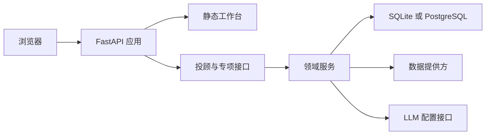

### 9.2 数据与服务状态

运行状态通过以下入口查看：

| 入口 | 作用 |
| --- | --- |
| `GET /api/health` | 检查应用进程和基础响应 |
| `GET /api/v1/runtime/data-mode` | 查看当前数据模式 |
| `GET /api/v1/runtime/capability-gaps` | 查看运行能力状态 |
| `GET /api/v1/runtime/wencai-settings` | 查看问财运行配置状态 |
| `POST /api/v1/runtime/wencai-settings/test` | 执行配置与提供方能力检查 |

数据结果携带来源、观察时间、获取时间、期间、单位、缺失字段和状态。页面能够区分完整结果、部分结果、明确空结果和执行问题，保证评委查看的每项数据都有清晰的来源与状态。

### 9.3 用户归属与访问审计

用户画像、组合、研究运行、建议和决策事件均带有用户归属标识。接口层对请求归属进行检查，存储层按归属查询，访问审计记录请求方法、路径、状态和关联信息。含用户语义的请求不进入公共缓存，保证不同用户的上下文彼此独立。

### 9.4 运行配置与数据能力

问财 SkillHub、行情、财务和其他数据提供方通过运行配置接入。配置测试以技能清单执行最小查询，并将可用性、记录数量、结果数量和安全问题码返回给运行模式控制器。研究服务根据返回状态组织结果，确保页面能够继续呈现处理进度和数据状态。

### 9.5 错误处理与结果连续性

应用将超时、取消、鉴权失败、限流、无数据、字段缺失和解析错误编码为结构化问题。研究运行、组合分析和建议审查均保留状态、问题码和处理说明，前端按照结果状态提供复核入口、补充信息入口或后续操作入口。

### 9.6 评审演示建议

评审演示可以沿以下页面顺序展开：

1. 打开投资工作台，展示用户状态和任务入口；
2. 进入画像与持仓输入，完成上下文确认；
3. 打开组合健康体检，展示穿透与集中度结果；
4. 进入标的或专项研究，展开证据来源；
5. 运行情景模拟或再平衡，查看方案变化；
6. 打开解释页面，查看画像、事实和建议之间的关系；
7. 查看评测看板与决策历史，展示验证和回溯能力。

## 10. 参考资料与实现索引

### 10.1 项目内部资料

| 资料 | 用途 |
| --- | --- |
| `README.md` | 项目运行方式、核心能力和仓库入口 |
| `docs/submission/technical-report.md` | 系统设计、接口、计算、风险和测试依据 |
| `docs/submission/figures/` | 评审版技术图示 |
| `docs/showcase/current-pages-snapshot-*.png` | 最新 Pages 快照界面截图 |
| `app/api/static/index.html` | 当前界面页面结构、页面锚点和入口 |
| `app/api/static/app.js` | 当前界面状态与交互逻辑 |
| `app/api/static/pages-snapshot.js`、`app/api/static/pages-snapshot.json` | 当前 Pages 演示的接口快照回放资源 |
| `app/api/static/styles.css` | 当前界面基础样式 |
| `app/api/static/prism-v2.css` | 当前界面视觉样式 |
| `app/api/main.py` | FastAPI 应用、接口路径和应用组装 |
| `app/contracts/` | 领域对象、证据对象和共享接口规则 |
| `tests/` | 单元、集成、浏览器和场景验证 |
| `tools/capture_pages_snapshot.mjs`、`tests/browser/test_pages_snapshot.mjs` | 当前接口快照生成与浏览器验证 |
| `tools/` | 固定回放、负载、提供方和运行辅助工具 |

### 10.2 外部参考项目详细方案

| 编号 | 参考文档 | 参考用途 |
| --- | --- | --- |
| 1 | 计忆之星《僵尸企业画像及分类——项目详细方案（终稿）》 | 观察项目概况、方案概要、技术路线、商业价值和图表组织 |
| 2 | e往无前《基于大模型的语料库问答系统——项目详细方案》 | 观察产品展示、核心技术、创新亮点和测试场景组织 |
| 3 | 毓秀网络《基于 AI 语音合成的教学声音处理软件——项目详细方案》 | 观察产品方案、技术方案、创新功能和风险控制组织 |
| 4 | 养贤大队《AI 辅助的教师备课系统构建——项目详细方案》 | 观察需求分析、产品方案、技术开发、运营推广和参考文献组织 |

### 10.3 参考项目详细方案的格式共性

本方案吸收四份参考项目详细方案的共同组织方式：

本文件采用 Markdown 形式：开头元数据表承担封面信息，目录承担章节导航，多级标题、表格、流程图和图注承担 Word/PDF 项目方案中的主要版式功能。

* 采用标题页信息、目录和多级编号标题，帮助评委建立全文结构；
* 先说明项目背景、赛题需求和方案价值，再展示产品功能与使用场景；
* 通过技术图示、流程图、架构图、表格和图注连接概念说明与工程实现；
* 在技术路线中说明开发环境、系统组成、核心方法、实现过程和验证结果；
* 单独呈现创新亮点、项目优势、运行保障和参考资料；
* 使用“功能介绍—技术实现”或“问题—设计—技术路线—实现—结果”的连续说明方式，让每项能力具有可阅读的证明链。

### 10.4 代码与测试索引

| 评审主题 | 主要实现位置 | 主要验证位置 |
| --- | --- | --- |
| 用户画像与行为画像 | `app/profile/`、`app/profile/behavior.py`、`app/service/natural_profile.py` | `tests/unit/test_full_questionnaire.py`、`tests/unit/test_behavior_profile.py`、`tests/integration/test_phase23_profile_confirmation.py` |
| 研究计划与专业节点 | `app/orchestration/`、`app/research/`、`app/stock/`、`app/fund/`、`app/convertible_bond/` | `tests/unit/test_bounded_orchestration.py`、`tests/unit/test_specialist_matrix.py`、`tests/integration/test_phase16_specialist_matrix.py` |
| 证据与发现 | `app/contracts/evidence.py`、`app/research/pipeline.py` | `tests/unit/test_evidence_contract.py`、`tests/unit/test_evidence_finding_bridge.py`、`tests/integration/test_phase10_research_evidence_pipeline.py` |
| 组合计算与风险 | `app/portfolio/`、`app/risk/`、`app/allocation/`、`app/optimization/` | `tests/unit/test_portfolio_exposure.py`、`tests/unit/test_risk_concentration.py`、`tests/unit/test_risk_budget.py`、`tests/integration/test_phase28_portfolio_optimization.py` |
| 情景与再平衡 | `app/scenarios/`、`app/rebalancing/`、`app/service/` | `tests/unit/test_scenario_simulation.py`、`tests/unit/test_portfolio_rebalancing.py`、`tests/integration/test_phase33_scenario_simulation.py`、`tests/integration/test_phase35_portfolio_rebalancing.py` |
| 风险与合规闸门 | `app/gates/`、`app/recommendation/` | `tests/unit/test_decision_gates.py`、`tests/unit/test_recommendation_composer.py`、`tests/integration/test_phase11_risk_compliance_gates.py` |
| 决策回执与历史 | `app/store/`、`app/history/`、`app/explainability/` | `tests/unit/test_store.py`、`tests/unit/test_recommendation_history.py`、`tests/integration/test_phase34_recommendation_history.py`、`tests/integration/test_phase37_advanced_explainability.py` |
| 接口与工作台 | `app/api/`、`app/api/static/` | `tests/integration/test_phase13_api.py`、`tests/integration/test_phase14_advisor_api.py`、`tests/integration/test_phase15_query_workbench.py`、`tests/browser/` |

## 11. 评审材料索引

| 材料类型 | 文件 |
| --- | --- |
| 投顾全链路图 | `docs/submission/figures/prism-figure-01-overview.png` |
| 系统总体架构图 | `docs/submission/figures/prism-figure-02-architecture.png` |
| 模块依赖关系图 | `docs/submission/figures/prism-figure-03-dependencies.png` |
| 研究编排与证据流水线图 | `docs/submission/figures/prism-figure-04-research-dag.png` |
| 个性化计算链路图 | `docs/submission/figures/prism-figure-05-personalization-chain.png` |
| 风险与合规双闸门图 | `docs/submission/figures/prism-figure-06-decision-gates.png` |
| 当前界面结构 | `app/api/static/index.html`、`app/api/static/app.js`、`app/api/static/styles.css`、`app/api/static/prism-v2.css` |
| 当前 Pages 演示 | `https://prism.daoyezongzi.org/?pages=1`、`app/api/static/pages-snapshot.js`、`app/api/static/pages-snapshot.json`、`tests/browser/test_pages_snapshot.mjs` |
| 当前 Pages 快照截图 | `docs/showcase/current-pages-snapshot-workbench-20260917.png`、`current-pages-snapshot-portfolio-20260917.png`、`current-pages-snapshot-market-20260917.png`、`current-pages-snapshot-trading-style-20260917.png`、`current-pages-snapshot-profile-20260917.png` |
| 当前接口实现 | `app/api/main.py` |
| 当前技术设计依据 | `docs/submission/technical-report.md` |

## 12. 架构决策、运行条件与后续工作

### 12.1 关键架构决策

以下决策来自当前实现、测试和 docs/adr/0001-modular-monolith.md，用于说明系统采用现有组织方式的原因：

| 决策 | 当前实现 | 解决的评审问题 | 主要依据 | 对结果的影响 |
| --- | --- | --- | --- | --- |
| 模块化单体 | app/api、app/service、领域目录、app/providers 和 app/store 在同一进程协作 | 评委可以沿目录和接口查看完整链路 | docs/adr/0001-modular-monolith.md、app/api/main.py | 保持模块职责、依赖注入和本地启动路径 |
| 结构化研究有向无环图 | ResearchPlan、节点状态、依赖门控和有界执行器 | 研究任务具有明确顺序、状态和故障位置 | app/orchestration/、app/service/specialist_matrix.py | 支持并行执行、超时传播、取消和固定回放 |
| 证据优先 | Evidence → Fact → Finding → Recommendation 贯穿研究和回执 | 每项发现可以回到来源和验证状态 | app/contracts/evidence.py、app/research/ | 未闭合证据进入复核或阻断 |
| 确定性金融计算 | 画像评分、暴露、穿透、集中度、风险预算、优化、情景和再平衡由 Python 服务计算 | 评委可以复核数值和阈值 | app/profile/、app/portfolio/、app/risk/、app/optimization/、app/scenarios/、app/rebalancing/ | 语言模型只处理语言输入和解释，不承担数值裁决 |
| 数据提供方四态 | SUCCESS、PARTIAL、EMPTY、FAILED 与来源、指纹和问题对象绑定 | 空结果、部分数据和执行失败具有清晰含义 | app/providers/contracts.py、app/providers/ | 数据质量沿研究、证据和闸门链路传播 |
| 双闸门与组合器重验 | 风险闸门、合规闸门和建议组合器分别检查输入、引用和披露 | 建议资格具有可见的检查条件 | app/gates/、app/recommendation/ | 任一关键条件未满足时不生成建议或回执 |
| 用户归属与内容哈希 | 认证模式使用账户绑定 owner_id；开发模式使用 X-Owner-ID 做对象隔离；事件保存内容哈希 | 结果可以区分用户、版本和内容变化 | app/api/access.py、app/store/、app/gates/fingerprint.py | 支持隔离、幂等、漂移检查和历史追踪 |
| 固定数据与真实数据分层 | MOCK 读取固定数据，LIVE 根据能力探测和正式数据规则运行 | 演示可重复，真实数据状态可单独核验 | app/runtime/、app/providers/runtime.py、app/api/static/ | 页面明确显示数据模式，固定示例不会冒充实时事实 |
| 当前 Pages 快照发布 | pages-snapshot.js 拦截页面的 /api/ 请求并回放 pages-snapshot.json 中已保存的响应 | 公开页面可以展示当前账户数据 | app/api/static/pages-snapshot.js、app/api/static/pages-snapshot.json、LOG.md | 浏览器通过同源静态文件读取响应；响应中的 data_mode 和业务状态保持原值 |
| 任务优先的静态工作台 | 原生 HTML、JavaScript、CSS 组织页面，工作流编辑使用 AntV X6 | 评委可以从任务入口进入结果和技术依据 | app/api/static/、package.json、tools/build_workflow.mjs | 页面与接口同源，现行资源可以直接发布和验证 |

### 12.2 运行条件与能力状态

| 运行维度 | 系统提供的能力 | 运行条件 | 当前状态表达 | 评委查看位置 |
| --- | --- | --- | --- | --- |
| 数据模式 | MOCK 固定数据、LIVE 真实提供方能力和操作级状态 | LIVE 需要凭据、能力探测和正式接口规则验证 | /api/v1/runtime/data-mode、能力矩阵 | 第 9.2 节、运行状态页面 |
| 投资者输入 | 19 道问卷、画像提案、行为画像、持仓导入、图片识别和基金成分快照 | 输入需通过归属、版本、时间、字段和一致性校验 | 快照、草稿、确认状态和问题码 | 第 3.5、5.1 节 |
| 研究服务 | 市场、行业、股票、基金、ETF、可转债研究、研究流水线和证据链 | 固定服务用于回放；实时路径按能力探测和数据状态处理 | 节点、运行、证据和发现状态 | 第 5.2、5.3、5.6 节 |
| 组合分析 | 暴露、穿透、集中度、风险预算、配置范围、目标结构、情景和再平衡 | 持仓、报价、行业、现金和成分数据满足对应接口规则 | READY、REVIEW_REQUIRED、BLOCKED | 第 5.4 节、组合页面 |
| 对话与模型 | 意图识别、工具调用、画像提案、流式回复和解释 | 远程模型需要配置；金融事实通过结构化服务获得 | 模型配置、工具结果和流式事件 | #copilot、app/llm/ |
| 持久化 | SQLite 默认存储、可选 PostgreSQL、决策事件、记忆、账户和审计 | 数据目录、数据库连接、迁移和权限可用 | 版本、内容哈希、迁移记录和问题码 | app/store/、app/history/ |
| 交易支持方式 | 再平衡金额、数量、费用、现金和交易后风险测算 | 输入有效，用户能够查看行动计划 | ADVISORY_ONLY | 第 3.4、5.4 节 |
| 部署方式 | 本地回环服务、同源静态页面和真实 HTTP 只读观测 | 启动脚本、运行依赖、凭据和上游额度可用 | 健康状态、探测结果和提供方状态 | 第 9 章 |

当前本地应用默认访问 127.0.0.1:8000，使用 data/private 保存数据库。Windows 默认使用 ProtectedSecretStore 保存受保护凭据。问财、扶摇、雅虎财经、港股资讯网和同花顺量化接口按照各自配置与协议提供数据；外部服务额度、数据留存、展示和再分发授权由部署环境单独确认。交易支持方式由行动计划和交易后风险测算提供。

### 12.3 已知技术问题

| 问题 | 当前状态 | 对评委判断的影响 | 后续核验方式 |
| --- | --- | --- | --- |
| 问财部分技能额度 | hithink-market-query 当前曾返回 401，运行状态记录 QUOTA_EXHAUSTED；其他能力按单项状态继续处理 | 依赖该技能的实时字段可能进入复核或失败状态 | 额度恢复后重新执行九项能力探测和财务复验 |
| 实时研究服务覆盖 | 投顾、研究矩阵、股票、基金、可转债完整研究、预设情景和固定工作流仍保留固定服务路径 | LIVE 研究请求需要正式数据和来源证据 | 逐项接入真实服务，补充来源、权限和回放记录 |
| 个股与基金扩展指标 | 个股历史估值分位、完整个股适当性和基金底层行业分类仍需补充 | 相关页面保留缺失字段和复核状态 | 补充有授权来源的历史指标与成分分类 |
| 海外市场权限 | 同花顺量化接口和港美股权限需要单独核验 | 海外指数、因子和行业观察按可用来源展示 | 完成权限核验、覆盖范围测试和来源授权确认 |
| 真实模型质量 | 画像提取、语义检索和对话质量依赖实际模型配置；有限规则路径已经提供 | 影响语言理解、摘要和排序体验 | 使用目标模型、固定问题集和人工复核评估 |
| 外部授权与长期服务质量 | 上游额度、留存、展示授权和长期服务等级需要部署环境单独形成证据 | 影响实时数据运营和公开部署 | 补充授权文件、监控、压力测试和服务等级记录 |

### 12.4 技术债务

| 技术债务 | 当前表现 | 后续维护要求 |
| --- | --- | --- |
| 接口注册集中 | 大量路由和依赖组装集中在 app/api/main.py | 按领域整理路由模块，保持现有路径、响应模型和归属检查 |
| 提供方接口并存 | FinancialProvider 结构化调用与行情、行业、因子专用方法同时存在 | 补充适配器转换层，保留专用数据能力的字段校验 |
| 缓存为进程内结构 | 提供方缓存使用有界进程内结构 | 多进程运行时补充共享缓存、权限隔离、失效和指标记录 |
| PostgreSQL 写入策略 | 适配器复用存储接口规则，写入使用数据库范围锁和比较交换 | 提升并发时补充连接池、事务观测和故障恢复压力测试 |
| 本地认证与审计 | 本地账户、会话和访问审计已经提供 | 扩展多实例密钥管理、会话失效和审计查询能力 |
| 静态资源构建 | 工作流和 Markdown 资源需要由构建工具生成后随应用发布 | 保持构建版本、第三方许可和资源完整性检查 |

### 12.5 后续工作

| 优先级 | 工作内容 | 当前基础 | 验收证据 |
| --- | --- | --- | --- |
| 高 | 恢复问财额度并扩大实时研究覆盖 | 已有九项技能清单、能力探测和四态结果 | 真实请求记录、来源证据、权限记录和回放结果 |
| 高 | 建立真实 HTTP、外部数据服务和长期可用性记录 | 已有 tools/http_load_test.py、健康检查和本地观测 | 样本窗口、并发规模、错误分类、P95、外部服务状态和授权范围 |
| 中 | 提升模型评测和语义记忆质量 | 已有固定问题路由、自然语言画像和来源检索 | 目标模型评测集、人工标注、提示注入测试和检索相关性报告 |
| 中 | 扩展组合分析 | 已有确定性目标结构、压力分析和调仓闭环 | 流动性压力、历史回放、组合约束和性能评测 |
| 中 | 完善个股、基金和海外研究指标 | 已有专项研究接口、数据提供方适配和状态传播 | 授权来源、时间口径、字段覆盖率和交叉验证结果 |
| 低 | 支持多进程运行和共享缓存 | 已有依赖注入、PostgreSQL 适配和缓存配置 | 多实例部署、故障恢复、权限隔离和压力测试记录 |

### 12.6 术语、代码与接口索引

| 术语或对象 | 定义 | 主要实现位置 | 关键状态或结果 |
| --- | --- | --- | --- |
| QuestionnaireSnapshot | 19 道问卷的版本化确认快照 | app/profile/questionnaire.py、app/profile/contracts.py | 题目完整、版本、归属和确认时间 |
| RiskProfile | 供风险和组合计算使用的投资者画像 | app/profile/contracts.py、app/profile/scoring.py | 风险分数、等级、限制条件和画像版本 |
| PortfolioImportBundle | 时点持仓快照和可选成分快照组成的组合输入 | app/portfolio/contracts.py | COMPLETE、PARTIAL、EMPTY、FAILED |
| ProviderResult | 数据提供方调用的统一结果对象 | app/providers/contracts.py | SUCCESS、PARTIAL、EMPTY、FAILED |
| Evidence、Fact、Finding | 来源、事实和研究发现的连续对象 | app/contracts/evidence.py、app/research/ | 质量状态、来源、期间、血缘和引用 |
| DecisionReceipt、DecisionEvent | 建议回执和可审计决策事件 | app/recommendation/、app/store/ | 闸门状态、规则版本、内容哈希和关联标识 |
| PASS、REVIEW_REQUIRED、BLOCKED | 建议审查状态 | app/gates/、app/recommendation/ | 通过、复核或停止建议组合 |
| ADVISORY_ONLY | 再平衡计算只提供决策支持 | app/service/portfolio_rebalancing.py | 生成行动计划，不调用交易接口 |

接口入口可以从 GET /api/docs 查看 OpenAPI 定义；研究、组合、闸门、回执和历史接口的代表路径已经列在 4.5 节。评委阅读代码时可以先按本索引定位对象，再通过 7.2 节验证文件检查其行为。
