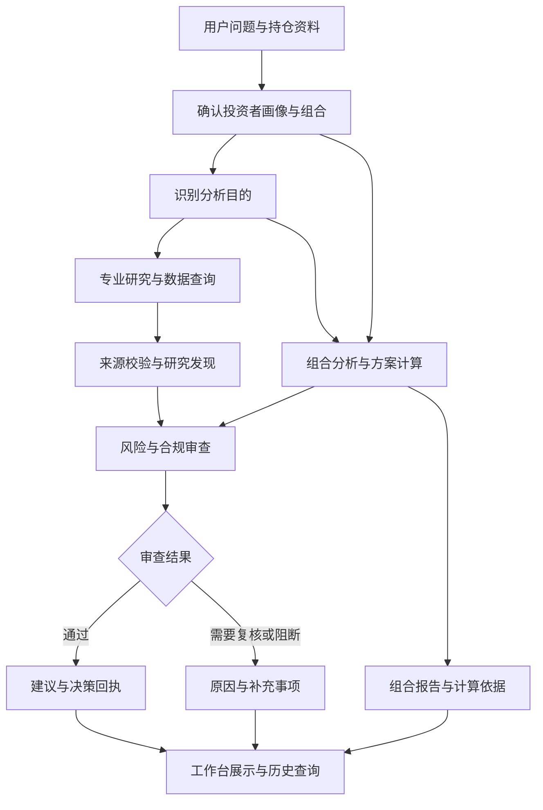
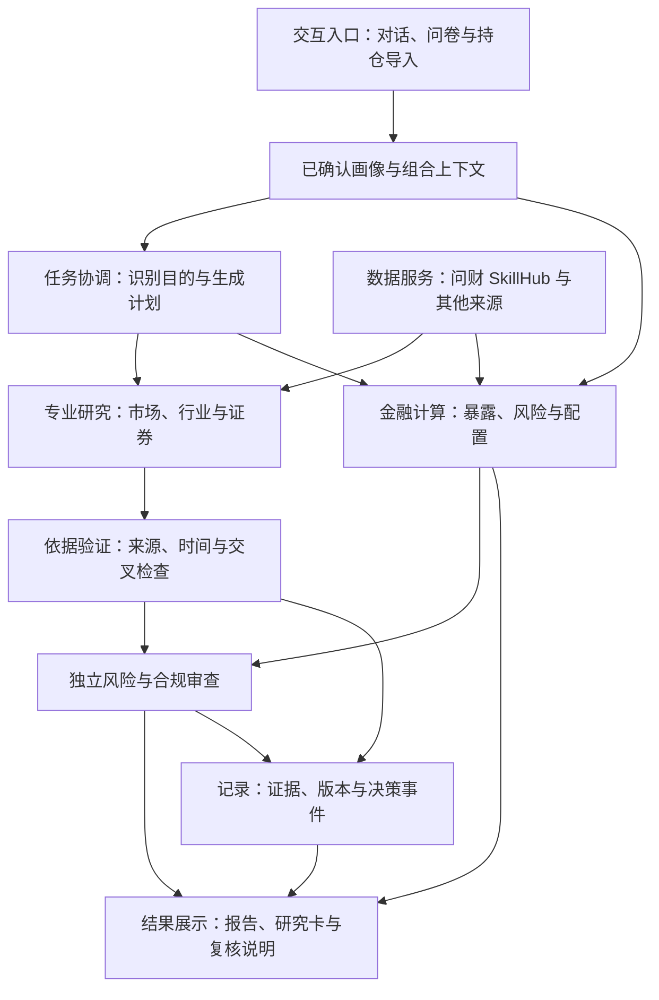
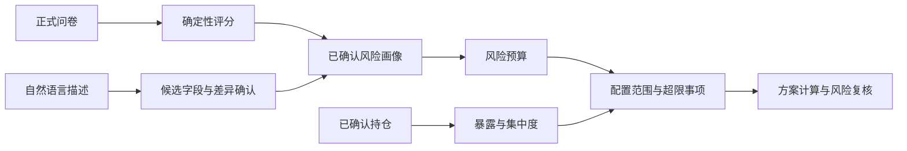
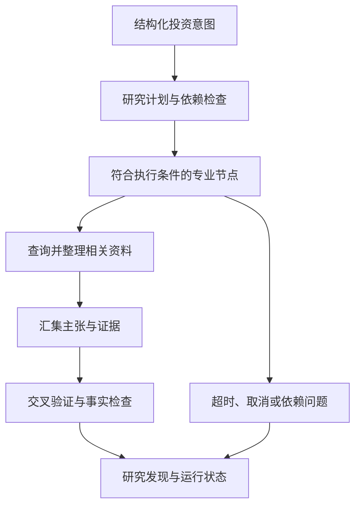
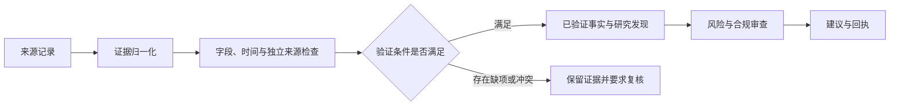
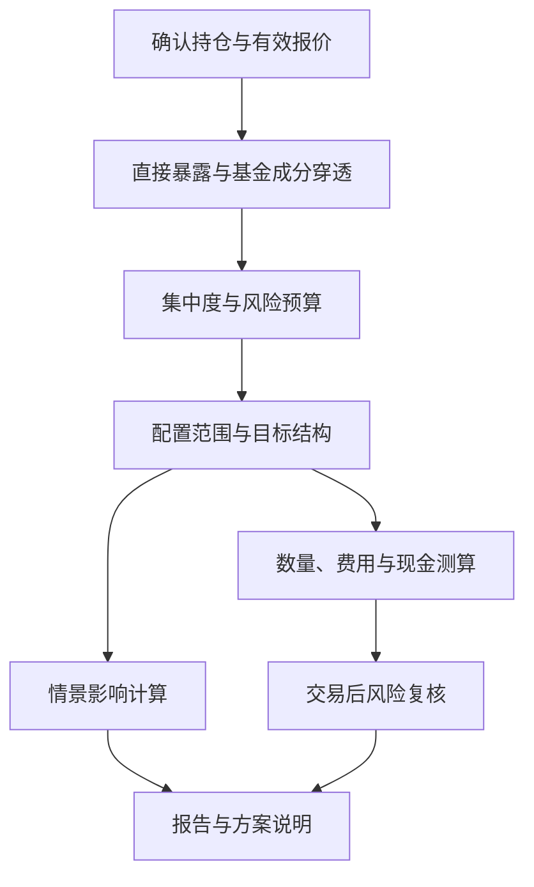
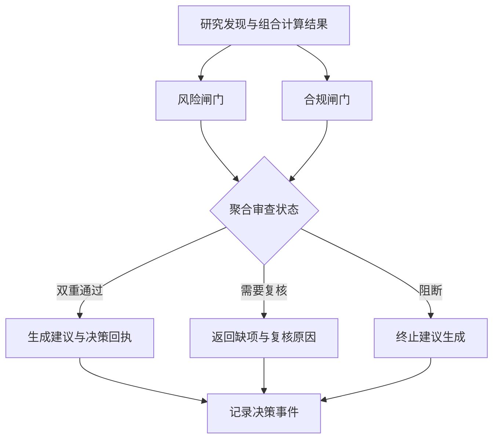

# Prism 个性化证券投顾智能体系统技术方案

参赛方向：基于同花顺问财 SkillHub 的个性化证券投顾智能体系统设计

## 目录

1. [第一章 项目概况与需求分析](#chapter-1)
2. [第二章 整体解决方案](#chapter-2)
3. [第三章 产品功能与应用展示](#chapter-3)
4. [第四章 总体技术架构](#chapter-4)
5. [第五章 核心技术与实现方法](#chapter-5)
6. [第六章 典型业务案例](#chapter-6)
7. [第七章 系统实现与效果验证](#chapter-7)
8. [第八章 技术特色与项目价值](#chapter-8)
9. [第九章 工程保障与发展方向](#chapter-9)
10. [附录 工程实现与核验索引](#appendix)

## 第一章 项目概况与需求分析

### 一、 项目背景

证券投资分析需要同时回答三个问题：投资者能够承受多大风险，所持资产存在什么问题，当前信息是否足以支持调整。行情、财务资料、风险问卷和账户持仓通常分布在不同入口，用户需要自行整理数据、计算比例并判断信息是否适用于自己的组合。

Prism 面向同花顺 A18 个性化证券投顾智能体赛题，将画像建立、证券研究、持仓分析和风险复核集中到同一工作台。用户通过问卷、持仓导入和自然语言提出需求，系统返回带有数据依据、计算口径和风险说明的分析结果。

### 二、 用户需求与技术问题

一项投资观点只有与用户的风险条件和当前持仓结合，才能形成有意义的组合分析。Prism 将需求转换为表 1-1 所列的处理任务。

表 1-1 用户需求与系统处理方法

| 用户需求 | 分析中需要解决的问题 | 系统处理方法 | 用户获得的结果 |
| --- | --- | --- | --- |
| 了解自己的风险承受能力 | 自然语言描述难以直接参与数值计算 | 正式问卷评分，画像提案确认，行为信息复核 | 风险等级、维度解释和配置参考 |
| 理解当前持仓风险 | 持仓数量多不代表行业和标的分散 | 汇总市值，分析底层成分，计算集中度 | 风险来源、占比、阈值和复核提示 |
| 获取与问题相关的证券信息 | 不同研究主题需要不同数据与处理方法 | 识别研究意图，组织专业研究任务 | 行情、财务、行业和专项研究结果 |
| 判断结论是否有依据 | 数据来源、时间和结论之间容易失去关联 | 保存证据、事实、研究发现和建议的引用关系 | 可以逐层查看的分析依据 |
| 比较调整方案 | 权重、金额、现金和风险需要同时满足约束 | 确定性计算目标结构、情景影响和调整行动 | 调整前后变化及计算说明 |
| 持续追问和复核 | 多轮交互需要使用一致的画像与持仓 | 确认上下文，保留版本与历史记录 | 可恢复的上下文与可复核的历史结果 |

### 三、 项目目标

Prism 以个性化、可解释和可验证作为技术目标。个性化通过画像参与风险预算和配置范围计算体现；可解释通过来源、公式、阈值和处理状态体现；可验证通过已保存报告、接口结果、领域测试和运行记录体现。

赛题覆盖大盘研判、行业配置、个股分析、ETF 与基金筛选、可转债分析和资产组合优化。系统按这些主题组织功能入口，并按各项服务的数据条件决定可用状态。实时组合分析、证券查询与完整研究流水线的运行条件见第九章。

## 第二章 整体解决方案

### 一、 从用户问题到分析结果

用户提出“我的持仓是否需要调整”时，Prism 先读取已确认的画像与持仓，计算组合中的风险暴露，再根据问题查询相关证券资料。组合报告展示风险来自哪些资产、与画像要求相差多少；需要生成完整建议时，研究发现继续经过证据校验和风险、合规审查。

图 2-1 展示各项能力之间的信息关系。具体请求按所需能力执行相应流程，查询单只股票行情可以直接返回行情结果。

图 2-1 用户问题与系统处理流程

### 二、 方案组成

系统将交互、研究、计算和审查连接起来，各部分保留明确的输入与输出。这样既能完成单项查询，也能为跨模块的组合决策保留数据关系。

表 2-1 方案组成及其作用

| 组成部分 | 接收的信息 | 主要处理 | 交付结果 |
| --- | --- | --- | --- |
| 用户上下文 | 问卷、自然语言描述、已确认持仓 | 评分、字段确认、版本管理 | 可参与计算的画像与组合 |
| 专业研究 | 投资问题、研究主题、证券与期间 | 任务计划、专业节点执行、结果汇集 | 带状态的研究结果 |
| 数据与证据 | 行情、财务、新闻、研究资料 | 字段归一化、来源和时间核验 | 可引用的数据依据 |
| 金融计算 | 市值、成分、画像约束、目标结构 | 暴露、集中度、风险预算和调整计算 | 数值报告与方案变化 |
| 风险与合规 | 研究发现、计算结果、建议候选 | 适当性、引用关系、披露和禁止表述检查 | 通过、复核或阻断结果 |
| 工作台与记录 | 各项分析结果、处理状态 | 卡片展示、证据展开、事件保存 | 用户可阅读并可回看的结果 |

### 三、 用户操作过程

1. 在个人中心完成风险问卷，确认风险画像。
2. 导入文字、表格或截图中的持仓，核对识别结果并确认组合。
3. 在 AI 对话或对应功能页面提交分析问题。
4. 查看持仓报告、证券资料、市场分析或方案测算。
5. 根据结果中的来源、观察时间、风险阈值和复核事项判断后续操作。

账户状态、数据完整性和服务可用性会影响分析结果。需要补充信息时，系统返回具体原因；再平衡输出用于方案研究和风险复核，交易由用户在外部交易系统中决定和执行。

## 第三章 产品功能与应用展示

本章使用 2026 年 9 月 17 日采集的 Pages 页面截图。公开页面读取已保存的服务响应，展示内容对应各自的报告时间和数据观察时间。截图用于说明功能与信息组织，案例数值以第六章指定的正式报告为准。

### 一、 投资任务工作台

工作台集中呈现 AI 对话、证券分析工具、画像状态和持仓状态。用户可以直接提出问题，也可以从大盘、行业、个股、ETF 基金、可转债和资产组合入口选择任务。工具状态提示当前是否具备输入条件。

图 3-1 投资任务工作台。分析入口与账户条件同时呈现，用户可以据此选择任务并确认分析上下文。

### 二、 画像建立与持仓输入

正式问卷包含 19 道问题，覆盖投资经验、风险承受、投资行为、研究需求和智能辅助需求等内容，形成八个展示维度。风险评分按确定性规则生成，后续风险预算使用已确认画像。

自然语言能够补充投资期限、流动性需求和其他条件；这些内容形成待确认提案。截图识别和文字导入则将证券名称、数量、价格与现金转换为持仓字段，供用户核对。

图 3-2 个人中心。问卷、风险等级、八维画像和资产配置参考共同说明用户条件如何被系统记录。

### 三、 持仓分析与组合报告

持仓分析将资产结构、标的集中度、行业分布、现金比例和盈亏放在同一报告中。每项风险提示同时给出当前值、适用阈值与计算口径，用户可以定位风险来自哪项持仓。

对基金和 ETF，系统根据成分快照计算底层资产暴露，识别不同产品之间的重复持有。穿透结果同时保留成分来源与覆盖率；无法识别的部分保留为未分类暴露。

图 3-3 持仓分析页面。组合报告、风险对照、行业分布和持仓明细共同支撑风险复核。

### 四、 市场观察与证券研究

大盘鉴别页面将指数行情、技术指标、宏观信息和行业观察集中呈现，并显示数据来源、观察时间与计算状态。个股查询提供行情及可取得的财务、估值信息；基金和可转债通过对应的数据查询与研究入口处理。

完整研究由专业节点、证据处理和结果审查组成。页面按实际可用能力显示研究结果，未取得的指标保留缺失说明。查询获得的单项行情与完整研究结果分别记录其状态。

图 3-4 大盘鉴别页面。行情走势与计算结果共同展示，来源与时间用于判断信息的适用范围。

### 五、 目标结构与再平衡测算

组合决策页面依据画像约束和当前组合计算目标结构，展示资产调整方向、金额、数量、费用与现金变化。交易后重新检查集中度及配置条件，并显示仍需复核的事项。自定义情景分析按照用户给定的冲击条件计算组合变化。

表 3-1 组合决策功能及输出

| 功能 | 用户需要提供的信息 | 主要处理 | 结果内容 |
| --- | --- | --- | --- |
| 目标结构 | 已确认画像、持仓和有效报价 | 根据风险约束计算配置范围 | 当前权重、目标结构和约束说明 |
| 情景分析 | 组合与冲击条件 | 计算各项暴露受到的影响 | 组合损益变化及贡献来源 |
| 再平衡测算 | 当前结构、目标结构、交易条件 | 计算行动顺序、金额、数量与费用 | 分步计划、现金变化及风险复核 |
| 历史复核 | 已保存报告或决策事件 | 读取原始输入版本与结果 | 对应时点的计算依据和处理状态 |

### 六、 行为画像与持续复核

交易风格页面接收历史交易，形成行为分析所需的数据。系统根据数据充分性决定是否计算行为特征；样本不足时明确显示信息不足，并保留问卷画像作为可用的风险输入。

图 3-5 交易风格页面。历史交易入口、明细筛选与数据充分性状态共同说明行为分析的输入条件。

## 第四章 总体技术架构

### 一、 以分析任务组织系统

Prism 将一次分析组织为用户上下文、任务协调、专业处理、依据验证和结果呈现五个部分。画像决定计算所使用的风险条件；研究意图决定需要查询的主题；金融计算服务给出数值；风险与合规模块决定完整建议是否具备生成资格。

图 4-1 中，纵向表示请求处理过程，数据与审计能力分别支撑查询和结果追踪。

图 4-1 Prism 总体技术架构

### 二、 大语言模型与金融程序的职责

自然语言交互需要理解用户表达，金融计算需要明确公式、单位和约束。Prism 通过结构化数据连接两类处理：模型提取意图和候选字段，程序校验字段并完成计算，解释环节引用已经生成的结果。

表 4-1 技术职责与校验方式

| 处理环节 | 使用的技术 | 负责的工作 | 结果校验 |
| --- | --- | --- | --- |
| 语言理解 | 可配置 LLM 接口 | 识别意图、提取字段、组织解释 | 字段类型、来源引用与用户确认 |
| 任务组织 | 依赖关系与有向无环图 | 明确研究节点、执行顺序和运行状态 | 依赖完整性、循环关系与时间预算 |
| 数据接入 | 提供方适配与结构化校验 | 查询、归一化、记录来源与时间 | 必需字段、单位、期间和结果状态 |
| 数值计算 | Python 与 Decimal | 画像评分、暴露、风险、配置与调整 | 金额守恒、权重范围与约束条件 |
| 建议审查 | 独立确定性规则 | 风险、归属、证据引用与披露检查 | 双重通过条件及复核原因 |
| 交互与记录 | Web 页面、HTTP、SSE 与数据库 | 展示过程、保存结果、恢复上下文 | 用户归属、记录版本与内容一致性 |

### 三、 数据与结果如何关联

每次分析绑定已确认的画像版本和持仓快照。研究结果保留来源与观察时间，组合计算保留使用的数值和风险条件，建议回执保留关联的研究与审查结果。用户重新确认画像或刷新组合后，相关分析依据新输入重新计算。

工程实现采用模块化单体：Web 页面、接口和应用服务在一个应用中协作，领域模块分别承担研究、金融计算和审查职责。该结构便于本地启动、联调和完整流程复核。具体组件、目录和接口见附录。

## 第五章 核心技术与实现方法

### 一、 将投资者信息转换为计算条件

1. 应用问题

   投资者对风险的描述、问卷答案与实际交易行为可能存在差异。系统需要明确采用哪组信息进行计算，并让用户能够理解自己的回答如何影响结果。

2. 技术方法

   正式问卷形成评分基础，自然语言描述形成带有原文依据的候选字段，用户确认后保存画像。行为信息单独形成行为画像与复核结果。问卷的八个展示维度用于说明投资者特征，基础风险评分使用损失承受、投资期限、流动性需求、投资经验和收益预期五个离散维度。

   风险等级进入版本化预算规则，确定单一资产、行业及未分类暴露的适用上限。表 5-1 列出风险预算模块中的当前规则；计算使用所属报告的统一分母和已确认画像。

表 5-1 画像风险等级对应的风险预算

| 风险等级 | 单一资产上限 | 已识别行业上限 | 科技行业合计上限 | 未分类合计上限 |
| --- | ---: | ---: | ---: | ---: |
| 保守型 | 20% | 30% | 25% | 10% |
| 均衡型 | 35% | 45% | 40% | 20% |
| 成长型 | 50% | 60% | 60% | 35% |

3. 处理流程

图 5-1 投资者画像参与组合计算的流程

4. 结果与验证

   画像页面显示风险等级、维度分数和确认状态；组合报告显示适用上限与当前占比。同一持仓在不同风险等级下使用不同预算规则。第六章给出成长型画像下的集中度复核实例。行为数据不足时，系统保留数据充分性说明；行为画像进入有效风险画像需要显式转换。

### 二、 按研究任务组织专业协作

1. 应用问题

   投资问题可能涉及市场、行业、证券和组合多个层面。不同任务所需的数据与执行条件不同，上游资料不足也会影响后续结论。

2. 技术方法

   中央协调模块将结构化投资意图转换为研究计划。计划包含专业节点、依赖关系与必需字段；执行器按照有向无环图调度任务，按依赖并行执行可运行节点，并限制节点与整体执行时间。研究矩阵与个股、基金、可转债专项研究模块共同提供相应的研究能力。

   专业协作通过结构化节点输入与输出完成。节点接收确定的研究范围，返回研究结果、证据引用和运行状态。具备执行条件的节点按计划运行，依赖未满足的节点保留原因。

3. 处理流程

图 5-2 专业研究与证据处理流程

4. 结果与验证

   研究运行保留节点结果、失败位置和关联资料，能够检查结论来自哪些处理环节。计划生成、节点依赖、执行状态和研究场景已有对应测试。完整研究流水线使用固定案例验证流程；实时查询能力按服务逐项接入，使用条件见第九章。

### 三、 建立可追溯的研究依据

1. 应用问题

   金融结论需要对应具体来源、日期和指标口径。仅有一段解释文字，无法判断结论采用了哪些资料，也难以检查多个来源是否相互矛盾。

2. 技术方法

   Prism 将分析依据组织为 Evidence、Fact、Finding 和 Recommendation 四类对象，分别承载原始依据、已验证事实、研究发现和建议。建议引用发现，发现引用事实，事实引用证据；每条引用保留标识和状态。

表 5-2 分析依据的层次与作用

| 层次 | 记录内容 | 校验重点 | 用户复核的问题 |
| --- | --- | --- | --- |
| Evidence | 来源记录、字段、时间、单位和期间 | 内容完整性、质量与来源身份 | 数据从哪里取得，适用于什么时间 |
| Fact | 通过验证的金融事实 | 证据是否有效，引用是否完整 | 这项事实有何依据 |
| Finding | 对事实的结构化分析 | 事实引用、研究状态与冲突 | 为什么形成这项判断 |
| Recommendation | 经过审查的建议 | 发现引用、画像约束与双重审查 | 建议适用于谁，在什么条件下有效 |

3. 处理流程

图 5-3 从原始数据到建议依据的处理流程

4. 结果与验证

   研究结果和历史回执能够沿引用关系定位来源。两个记录是否具有独立来源，通过数据血缘核验；同源数据的不同呈现形式不能增加独立证据数量。报告期间不同、字段缺失或来源存在冲突时，系统保留对应状态，供后续复核。

### 四、 使用确定性方法完成组合计算

1. 应用问题

   组合分析涉及多项金额、百分比和风险条件。直接持有股票与通过基金间接持有同一股票时，还需要合并计算风险暴露。计算必须说明分母、单位、时间和数据覆盖范围。

2. 技术方法

   组合计算使用 Decimal 处理金额与权重，由领域程序执行暴露、集中度、风险预算、目标结构、情景影响和再平衡计算。大语言模型根据计算结果解释含义。

   对持仓价值 $v_i$ 和持仓中属于标的或行业 $g$ 的成分比例 $w_{i,g}$，暴露金额与占比为：

$$
E_g=\sum_i v_i w_{i,g},\qquad p_g=\frac{E_g}{V}\times100\%
\tag{5-1}
$$

   $w_{i,g}$ 使用 0 至 1 的比例。$V$ 为当前报告明确采用的组合总价值。直接持有对应资产时，其成分比例为 1；基金或 ETF 按披露成分计算，并保留未覆盖部分。

   集中度采用 Herfindahl-Hirschman Index（HHI），按同一分组口径计算：

$$
HHI=10000\sum_g\left(\frac{E_g}{V}\right)^2
\tag{5-2}
$$

   数值越高，表明该口径下的资产分布越集中。证券明细的持仓占比与含现金总资产占比需要分别说明；第六章按这两个分母分别复核报告数据。该正式报告使用已保留两位小数的百分比数值平方求和计算 HHI，最终结果再保留两位小数；领域暴露模块按原始金额比例计算，各项结果随所属报告说明计算口径。

   目标权重与当前权重均使用 0 至 1 的比例时，目标金额变化为：

$$
\Delta v_i=V\left(w_i^{\mathrm{target}}-w_i^{\mathrm{current}}\right)
\tag{5-3}
$$

   再平衡进一步使用报价、交易单位、费用和可用现金计算数量与行动顺序，重新检查交易后的现金与风险条件。金额变化只是行动计算的输入之一。

3. 处理流程

图 5-4 组合分析与方案计算流程

4. 结果与验证

   报告展示风险贡献来源、当前比例、目标变化和复核结果。第六章使用已保存的真实报告复核市值、总资产和集中度。金额总和与现金相加必须等于总资产；展示百分比按规则舍入，计算依据保留原始精度。情景结果表示输入冲击条件下的计算结果。

### 五、 独立执行风险与合规审查

1. 应用问题

   研究资料充分、组合数值正确和建议符合用户条件是不同的要求。系统需要分别检查这些条件，并在结果不完整时说明具体原因。

2. 技术方法

   风险闸门检查画像、组合、证据、预算和配置范围之间的一致性；合规闸门检查候选文本、发现引用、风险揭示与禁止表述。建议组合器在生成回执前重新校验输入。只有两个闸门均通过，才具备完整建议生成资格。

   当前组合存在超限项时，系统仍然可以分析降低风险的方向。是否具备建议资格取决于证据完整性、约束一致性和处置条件；风险提示随结果保留。

3. 处理流程

图 5-5 风险与合规双重审查流程

表 5-3 审查状态与处理结果

| 状态 | 判定条件 | 系统动作 | 用户能够看到的信息 |
| --- | --- | --- | --- |
| PASS | 风险与合规闸门均通过 | 生成建议并保留披露与回执 | 建议依据、适用条件和风险说明 |
| REVIEW_REQUIRED | 存在可复核的资料缺项或披露问题 | 暂缓建议组合 | 缺失内容与复核原因 |
| BLOCKED | 归属不一致、引用断裂、输入失效或禁止表述等 | 终止建议组合 | 阻断原因及对应问题 |

4. 结果与验证

   通过、复核和阻断均保留状态。建议附带不保证收益、损失风险、证据范围及失效条件等披露；报告与建议服务各自保留适用的处理状态。双闸门和建议组合的对应实现与验证文件见附录。

### 六、 保留金融数据的来源与状态

1. 应用问题

   行情、财务和研究资料来自不同服务。没有查询到记录、返回字段不完整和请求失败具有不同含义，需要分别呈现。

2. 技术方法

   数据接入模块将请求与响应转换为统一结构，保存来源、观察时间、获取时间、报告期间、单位和缺失字段。直接请求、缓存及备用提供方分别记录服务方式，数据内容状态保持原有含义。

表 5-4 数据结果状态与后续处理

| 状态 | 表示的情况 | 后续处理 | 页面说明 |
| --- | --- | --- | --- |
| SUCCESS | 返回完整记录 | 按流程核验证据并使用数据 | 数据及来源时间 |
| PARTIAL | 返回记录但存在缺失字段或问题 | 使用可用部分并保留质量说明 | 可用数据、缺项和影响 |
| EMPTY | 查询成功且明确没有记录 | 保留查询范围与空结果 | 当前范围无数据 |
| FAILED | 网络、鉴权、额度、超时或解析失败 | 返回结构化问题 | 失败原因与处理条件 |

3. 处理流程与结果

   请求经过提供方适配、字段检查和来源记录后，按表 5-4 进入后续分析。缺失字段保持缺失，零值保留为真实零值；过期缓存带有过期标记。研究与计算据此判断是否能够继续，用户能够知道结果受哪些数据条件影响。

## 第六章 典型业务案例

### 一、 案例输入与分析目的

本案例采用仓库保存的正式组合报告，回答“当前组合有哪些风险需要关注”。报告生成于 2026 年 9 月 15 日 07:42:36 UTC，2026 年 9 月 17 日被收录到 Pages 快照。报告标记为 LIVE，采用成长型画像，风险分数为 85，适当性等级为 C5。

案例中的五项证券及金额直接读取该报告。全部金额单位为人民币元，持仓报价仅对应报告时点。

表 6-1 案例证券持仓与市值

| 证券 | 数量（股） | 报告采用价格（元） | 市值（元） | 占证券持仓比例 |
| --- | ---: | ---: | ---: | ---: |
| 宁德时代 | 1,000 | 316.36 | 316,360.00 | 22.32% |
| 贵州茅台 | 600 | 1,272.75 | 763,650.00 | 53.87% |
| 中芯国际 | 2,000 | 114.86 | 229,720.00 | 16.21% |
| 中国平安 | 800 | 53.90 | 43,120.00 | 3.04% |
| 恒瑞医药 | 1,500 | 43.13 | 64,695.00 | 4.56% |

证券市值合计为 1,417,545.00 元，现金为 28,000.00 元，含现金总资产为 1,445,545.00 元。

### 二、 计算过程与风险识别

1. 核对总资产

   五项证券的数量与价格相乘后得到各自市值，证券市值合计与现金相加得到总资产。该关系确定后续百分比计算的分母。

2. 定位单一资产集中度

   贵州茅台在证券持仓中的比例为 $763650/1417545\times100\%=53.87\%$。采用含现金总资产作为分母时，比例为 $763650/1445545\times100\%=52.83\%$。画像对应的单一资产上限为 50%，按总资产口径仍然超限。

3. 检查资产结构与现金

   权益类资产占总资产 98.06%，超过报告中画像配置参考区间 70% 至 90% 的上限；现金占比为 1.94%，低于报告现金检查所使用的 5.00% 下限。系统同时保留比例、阈值与风险状态。

4. 检查组合集中程度

   报告的证券资产 HHI 为 3,692.96，由表 6-1 的五项百分比数值平方求和并保留两位小数得到。行业风险 HHI 为 3,555.39，按含现金总资产口径下的行业与现金分组比例计算。行业风险检查采用 2,500.00 阈值，结果为 OVERBOUND。

表 6-2 案例风险检查结果

| 检查项 | 观察值 | 适用规则 | 报告结果 | 解释 |
| --- | ---: | --- | --- | --- |
| 单一资产占比 | 52.83% | 含现金总资产口径，上限 50% | OVERBOUND | 贵州茅台超过画像上限 |
| 权益类资产占比 | 98.06% | 画像参考区间 70% 至 90% | OVERBOUND | 股票资产占用较多组合资金 |
| 现金占比 | 1.94% | 报告检查下限 5.00% | OVERBOUND | 现金低于该项参考要求 |
| 行业集中度 HHI | 3,555.39 | 报告检查上限 2,500.00 | OVERBOUND | 行业分布需要进一步复核 |
| 最大行业占比 | 52.83% | 成长型已识别行业上限 60% | PASS | 该项行业比例处于画像上限以内 |

### 三、 用户获得的结果

报告返回 REVIEW_REQUIRED，并指出需要关注的单一资产集中、权益类比例、现金和行业集中度。各项检查独立计算，最大行业占比通过仍可与其他风险检查超限同时出现。

这份结果使用户能够从“组合是否有风险”继续追问到“风险来自哪项持仓、采用什么分母、与我的画像上限相差多少”。持仓明细、画像规则和计算结果共同提供答案。

### 四、 与后续方案分析的关系

用户可以在有效报价、行业和现金信息完整时进入目标结构与再平衡测算，查看方案变化及交易后复核。完整研究建议还需要具备验证后的研究依据，并通过双重审查。

本案例覆盖已经保存的画像、持仓、确定性计算和风险报告。其后续分析入口按照第九章列出的运行条件执行，案例结果保持为对应报告时点的组合风险判断。

## 第七章 系统实现与效果验证

### 一、 已有实现成果

Prism 已具备浏览器工作台、本地服务、结构化数据接口及确定性金融计算模块。第三章展示实际保存的页面截图，第六章提供可以复算的组合报告。专业研究、证据和建议模块提供独立的输入输出与验证入口。

表 7-1 实现成果与核验材料

| 实现内容 | 可观察的结果 | 核验材料 | 能够说明的能力 |
| --- | --- | --- | --- |
| 投资者画像 | 19 题问卷、八维展示、风险等级 | 个人中心截图、问卷与画像响应 | 画像输入、评分与确认 |
| 组合报告 | 五项证券、现金、配置与集中度 | 正式组合报告及持仓分析截图 | 数值计算、画像阈值与风险提示 |
| 市场观察 | 指数行情、技术指标和状态 | 大盘页面截图、已保存分析响应 | 数据展示与指标组织 |
| 交易风格 | 历史交易入口、数据充分性状态 | 交易风格截图、行为画像响应 | 行为输入及不足状态说明 |
| 研究与建议 | 节点结果、证据引用、审查与回执 | 研究、证据与建议模块及评测案例 | 研究流程、引用校验和建议资格判断 |

### 二、 案例数值复核

针对第六章报告，复核直接使用已保存的服务响应和确定性计算，逐项检查市值、总资产、持仓比例与风险指标。

表 7-2 案例数值复核项目

| 复核对象 | 计算或检查方法 | 报告值 | 核验范围 |
| --- | --- | ---: | --- |
| 证券市值 | 汇总五项数量与价格的乘积 | 1,417,545.00 元 | 五项证券全部参与计算 |
| 总资产 | 证券市值与现金相加 | 1,445,545.00 元 | 现金为 28,000.00 元 |
| 最大证券持仓占比 | 最大证券市值除以证券市值合计 | 53.87% | 按两位小数展示 |
| 最大资产占比 | 最大证券市值除以含现金总资产 | 52.83% | 用于单一资产上限复核 |
| 权益类资产占比 | 股票市值除以含现金总资产 | 98.06% | 与画像参考区间比较 |
| 现金比例 | 现金除以含现金总资产 | 1.94% | 与报告现金下限比较 |
| 证券资产 HHI | 表 6-1 的两位小数百分比数值平方求和 | 3,692.96 | 使用证券持仓分母，最终保留两位小数 |

### 三、 验证体系

验证围绕计算正确性、研究依据、接口协作和用户操作展开。表 7-3 说明各类验证的对象与判定方法，具体文件和执行入口见附录。

表 7-3 系统验证对象与判定方法

| 验证类别 | 主要对象 | 判定方法 | 证据范围 |
| --- | --- | --- | --- |
| 领域计算 | 画像、暴露、预算与再平衡 | 检查公式、金额守恒、阈值及状态 | 给定输入下的规则正确性 |
| 证据校验 | 来源、事实、发现与建议 | 检查引用完整性、来源独立性与冲突 | 研究依据是否满足使用条件 |
| 任务协作 | 计划、依赖、节点与时间预算 | 检查执行顺序、运行状态与问题传播 | 任务组织与异常处理 |
| 接口集成 | 上下文、研究、组合与回执 | 检查输入输出、用户归属和状态 | 服务间数据一致性 |
| 浏览器交互 | 导航、对话、画像与组合页面 | 检查页面操作、返回结果和错误 | 已执行场景的用户操作路径 |
| 确定性回放 | 版本化案例与规则 | 比较重复运行的语义结果 | 固定输入下的结果稳定性 |
| 负载观测 | 请求成功率与时延 | 记录并发规模、接口及分位数 | 指定环境和指定接口的表现 |

### 四、 历史运行记录与质量目标

项目记录中保留了一次本地真实 HTTP 持仓读取观测：100 个并发请求，100 次请求成功，P95 为 326 ms。P95 表示 95% 的请求时延不超过该值。该记录说明指定本地读取场景的响应能力，环境与接口范围随记录保留。

赛题使用不少于 100 个并发咨询、单次响应不超过 3 秒和 99.9% 可用性作为质量目标。外部模型、实时金融数据和完整咨询涉及额外服务，需分别观测端到端时延、成功率及长期可用性。

固定评测集包含九个案例，覆盖正常建议、不同画像、集中度超限、成分缺失、来源冲突、用户归属和时间字段等情况。它用于验证规则处理与结果一致性；实时市场研究质量与长期投资表现需要相应数据和独立评估。

## 第八章 技术特色与项目价值

### 一、 个性化条件直接参与计算

画像通过风险预算和配置范围影响组合判断。第六章中成长型画像的单一资产上限为 50%，系统将该值与报告总资产口径下的 52.83% 比较，并生成复核提示。用户能够看到个性化条件如何改变分析结果。

### 二、 研究结论保留可追溯依据

证据、事实、研究发现与建议采用连续引用关系。来源身份、数据期间、质量状态与审查结果贯穿处理过程，使结果能够逐层复核。该方法也为来源冲突、数据过期和结论失效提供明确检查位置。

### 三、 语言理解与数值推导分别实现

大语言模型承担意图理解和解释，确定性服务承担金融数值与规则判定。用户可以用自然语言提问，同时根据公式与输入重新核算金额、比例和风险阈值。

### 四、 风险判断具有独立处理过程

组合计算给出观察值，风险预算给出适用上限，风险与合规模块检查完整建议资格。当前持仓存在风险时，系统保留超限事实、处置方向和复核原因，使风险控制贯穿计算与建议生成。

表 8-1 技术特色与对应价值

| 技术特色 | 实现机制 | 可观察结果 | 项目价值 |
| --- | --- | --- | --- |
| 画像参与计算 | 画像版本与风险预算关联 | 当前比例与个人阈值并列展示 | 分析结果与用户条件相关 |
| 分层研究依据 | 来源、事实、发现与建议相互引用 | 证据展开与历史回执 | 支持检查结论依据 |
| 确定性金融计算 | Decimal、明确公式与守恒校验 | 暴露、集中度和行动金额 | 支持复算与规则验证 |
| 专业任务协作 | 结构化计划与依赖执行 | 节点状态与研究结果 | 支持多个研究主题协同处理 |
| 双重审查 | 独立风险、合规和建议资格检查 | 通过、复核和阻断结果 | 明确建议生成条件 |

## 第九章 工程保障与发展方向

### 一、 数据质量与异常处理

系统保存查询来源、观察时间、获取时间、单位、期间和缺失字段。超时、额度不足、鉴权失败和解析问题分别记录，页面据此说明哪些信息可用、哪些信息需要补充。缓存与备用来源的使用保留标记，过期内容进入相应质量状态。

### 二、 用户信息与结果记录

画像、组合、研究运行和决策事件绑定用户归属。启用认证时，由服务端账户确定访问范围；开发环境中的对象隔离标识具有独立的使用条件。Windows 本地凭据使用受保护存储，访问审计记录请求方法、路径、结果状态和关联信息。

报告和决策记录保存输入版本及内容身份，支持历史复核。上下文恢复需要显式操作，恢复后根据适用条件重新运行派生计算。

### 三、 部署与展示方式

本地应用由 FastAPI 提供接口和同源工作台，SQLite 保存本地数据；系统保留 PostgreSQL 存储适配。Windows 启动入口配置运行依赖并检查服务，本地默认访问地址为 `127.0.0.1:8000`。

Pages 页面读取已保存的接口响应，适合展示相同时点的页面与报告。实时查询、模型对话和需要写入结果的功能由配置完整的本地服务提供。

### 四、 各项能力的运行条件

表 9-1 能力范围与运行条件

| 能力 | 已有实现 | 使用条件 | 后续完善内容 |
| --- | --- | --- | --- |
| 画像与持仓 | 正式问卷、自然语言提案、文字及图片导入 | 用户确认、字段完整、版本与归属有效 | 增加实际输入场景的质量评估 |
| 实时证券数据 | 问财 SkillHub 与其他行情、财务提供方 | 凭据、权限、额度和上游服务可用 | 扩充有授权数据覆盖 |
| 组合报告与再平衡 | 真实持仓的确定性分析与行动测算 | 报价、行业、现金和成分满足计算要求 | 完善成分行业分类与覆盖 |
| 完整研究与建议 | 专业研究、证据流水线、双闸门和固定案例运行 | 完整实时路径仍需逐项补充正式数据与独立来源 | 扩展实时研究及来源验证 |
| 情景与工作流 | 自定义压力计算及固定场景流程 | 按服务区分自定义输入与固定案例 | 增加真实场景执行覆盖 |
| 个股扩展指标 | 行情及可取得的财务、估值字段 | 历史估值分位和完整个股适当性仍需补充 | 接入所需历史数据与评价方法 |
| 模型与服务质量 | 模型配置、工具调用与运行观测 | 实际模型、数据权限及服务环境有效 | 目标问题集、人工复核和长期观测 |

运行能力随数据权限、额度和配置变化，由当前服务响应确认。问财曾出现额度耗尽记录，系统保留该类状态与恢复条件。完整实时研究、海外数据授权和长期服务质量需要各自的验证材料。

## 附录 工程实现与核验索引

### 一、 工程技术文档与图示依据

工程结构、字段规则、部署方法和完整测试说明见[技术设计文档](technical-report.md)。本文图 2-1、图 4-1、图 5-1、图 5-2 和图 5-5 分别参考其中的处理链路、总体架构、个性化计算、研究编排和双闸门关系，按业务含义组织节点。

原有图示位于 `docs/submission/figures/`，包括处理链路、总体架构、模块依赖、研究编排、个性化计算和双闸门六幅图。第三章使用 `docs/showcase/` 中带 `20260917` 日期的五幅 Pages 截图。

### 二、 实现模块与验证文件

表 A-1 核心能力与工程依据

| 能力 | 实现位置 | 代表验证文件 | 核验内容 |
| --- | --- | --- | --- |
| 画像评分 | `app/profile/questionnaire.py`、`app/profile/scoring.py` | `tests/unit/test_full_questionnaire.py`、`tests/unit/test_profile_scoring.py` | 题目完整性、评分与风险等级 |
| 画像提案与行为 | `app/service/natural_profile.py`、`app/profile/behavior.py` | `tests/unit/test_natural_profile.py`、`tests/unit/test_behavior_profile.py` | 原文引用、确认与数据充分性 |
| 研究协作 | `app/orchestration/`、`app/research/pipeline.py` | `tests/unit/test_bounded_orchestration.py`、`tests/unit/test_specialist_matrix.py` | 计划、依赖与节点状态 |
| 研究依据 | `app/contracts/evidence.py`、`app/research/cross_validation.py` | `tests/unit/test_evidence_contract.py`、`tests/unit/test_research_cross_validation.py` | 引用完整性与独立来源 |
| 暴露与集中度 | `app/portfolio/exposure.py`、`app/risk/concentration.py` | `tests/unit/test_portfolio_exposure.py`、`tests/unit/test_risk_concentration.py` | 穿透、分组与 HHI |
| 风险预算与配置 | `app/risk/budget.py`、`app/allocation/` | `tests/unit/test_risk_budget.py`、`tests/unit/test_allocation_envelope.py` | 画像阈值与配置范围 |
| 正式组合报告 | `app/portfolio/report.py` | `tests/unit/test_portfolio_report.py` | 市值、现金、比例与报告身份 |
| 优化与再平衡 | `app/optimization/`、`app/rebalancing/` | `tests/integration/test_phase28_portfolio_optimization.py`、`tests/integration/test_phase35_portfolio_rebalancing.py` | 目标结构与行动计算 |
| 情景分析 | `app/scenarios/custom_stress.py` | `tests/unit/test_scenario_simulation.py` | 输入冲击与组合影响 |
| 双重审查 | `app/gates/`、`app/recommendation/composer.py` | `tests/unit/test_decision_gates.py`、`tests/unit/test_recommendation_composer.py` | 风险、合规与建议资格 |
| 数据服务 | `app/providers/`、`app/runtime/` | `tests/unit/test_provider_contract.py`、`tests/unit/test_provider_resilience.py` | 字段、状态与服务方式 |
| 页面与快照 | `app/api/static/` | `tests/browser/test_pages_snapshot.mjs` | 页面加载、导航与保存结果 |

### 三、 技术组件与接口入口

表 A-2 技术组件及使用位置

| 技术组件 | 使用位置 | 主要作用 | 配套条件 |
| --- | --- | --- | --- |
| Python 3.11 及兼容运行环境 | 后端与领域计算 | 运行服务、规则和工具 | 依赖按项目配置安装 |
| FastAPI | Web 服务 | HTTP、SSE、OpenAPI 与静态资源 | 同源工作台与服务配置 |
| Pydantic 2 | 数据对象 | 类型、字段与版本校验 | 输入输出遵循对象规则 |
| Decimal | 金融计算 | 十进制金额、权重和比例运算 | 明确精度及舍入方法 |
| SQLite 与 PostgreSQL 适配 | 存储 | 上下文、事件与审计 | 数据库连接及迁移 |
| HTML、CSS、JavaScript | 工作台 | 图表、卡片、交互与流式状态 | 浏览器与同源资源 |
| Pillow 与 RapidOCR | 持仓导入 | 图片读取与文字识别 | 识别结果需字段校验 |
| 可配置 LLM 接口 | 对话与语言处理 | 意图识别、字段提取与解释 | 模型配置、连接及返回校验 |

表 A-3 主要接口入口

| 接口类别 | 代表路径 | 功能 | 主要检查 |
| --- | --- | --- | --- |
| 服务入口 | `GET /api/health`、`GET /api/docs` | 健康检查与接口说明 | 应用状态与接口定义 |
| 画像与上下文 | `/api/v1/advisor/profile/*`、`/api/v1/advisor/context/*` | 问卷、画像与确认上下文 | 用户归属与版本 |
| 持仓与报告 | `/api/v1/advisor/portfolio/*` | 导入、刷新、持仓与正式报告 | 快照、报价与数据完整性 |
| 专业研究 | `/api/v1/advisor/research-runs`、`/api/v1/advisor/stock-research-runs` | 矩阵及股票研究 | 运行模式、证据及状态 |
| 基金与可转债 | `/api/v1/advisor/fund-research-runs`、`/api/v1/advisor/convertible-bond-research-runs` | 专项研究 | 输入范围与数据能力 |
| 组合决策 | `/api/v1/advisor/portfolio-optimization-runs`、`/api/v1/advisor/rebalancing-runs` | 优化与再平衡 | 约束、现金与交易后风险 |
| 情景分析 | `/api/v1/advisor/scenario-simulation-runs` | 情景运行 | 运行模式与冲击条件 |
| 投顾与对话 | `/api/v1/advisor/queries`、`/api/v1/copilot/chat` | 查询、工具调用与解释 | 已确认上下文与审查状态 |
| 历史记录 | `/api/v1/decision-events`、`/api/v1/advisor/recommendation-history` | 决策事件与历史建议 | 用户归属与内容身份 |
| 运行能力 | `/api/v1/runtime/data-mode`、`/api/v1/runtime/capability-gaps` | 模式与服务能力 | 实际配置及探测状态 |

### 四、 案例来源与复核条件

第六章的数据来自 `app/api/static/pages-snapshot.json` 中 `GET /api/v1/advisor/portfolio/report` 的已保存响应，报告编号为 `portfolio-report-1da3aff92cabe199157c5833ee813107`，规则版本为 `portfolio-report-rules.v1`。报告观察时间、生成时间和 Pages 采集时间分别保留，资产数据以该报告为准。

复核使用五项证券的数量与价格计算市值，使用 Decimal 重算总资产及各项比例。正式报告的证券资产 HHI 使用两位小数持仓百分比的平方和；行业风险 HHI 使用行业与现金分组的两位小数百分比平方和，结果按 `ROUND_HALF_UP` 保留两位小数。工程模型 `PortfolioReport` 对报告字段及总资产守恒进行校验。

第七章引用的 100 并发、100 次成功和 P95 326 ms 来自 `LOG.md` 的 2026 年 9 月 8 日本地只读 HTTP 观测记录，原记录为 326.038 ms；其工具入口为 `tools/http_load_test.py`。确定性回放入口为 `tools/evaluate_mvp.py`，案例目录为 `eval_cases/`。上述资料分别保留运行环境、输入和适用范围。

### 五、 状态与对象术语

表 A-4 主要术语

| 术语 | 含义 | 所属环节 | 使用说明 |
| --- | --- | --- | --- |
| LLM | 大语言模型 | 语言处理 | 识别意图、提取候选字段并解释结果 |
| DAG | 有向无环图 | 任务协调 | 表示节点依赖与可执行顺序 |
| Evidence | 原始证据对象 | 依据验证 | 保存来源、字段、时间与质量 |
| Fact / Finding | 已验证事实与研究发现 | 研究分析 | 逐层引用其依据 |
| DecisionReceipt | 决策回执 | 建议生成 | 关联发现、审查结果及适用条件 |
| PASS / OVERBOUND | 通过与超出检查范围 | 指标检查 | 与对应指标及阈值一起阅读 |
| CALCULATED | 已完成计算 | 数值处理 | 表示计算状态 |
| REVIEW_REQUIRED | 需要复核 | 报告或建议审查 | 同时返回复核原因 |
| LIVE | 真实提供方运行模式 | 数据服务 | 报告仍保留具体数据时间 |
| ADVISORY_ONLY | 仅供研究与咨询 | 再平衡 | 输出测算结果，不执行交易 |
