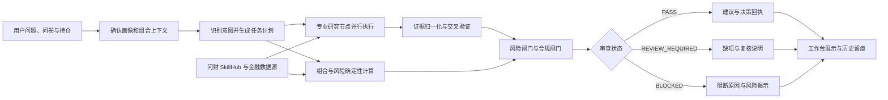
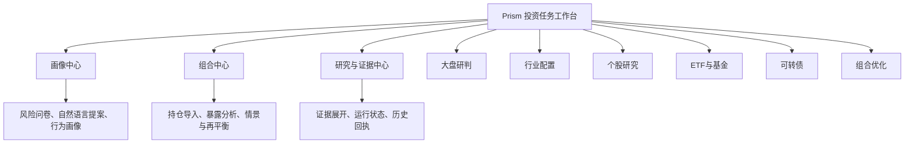
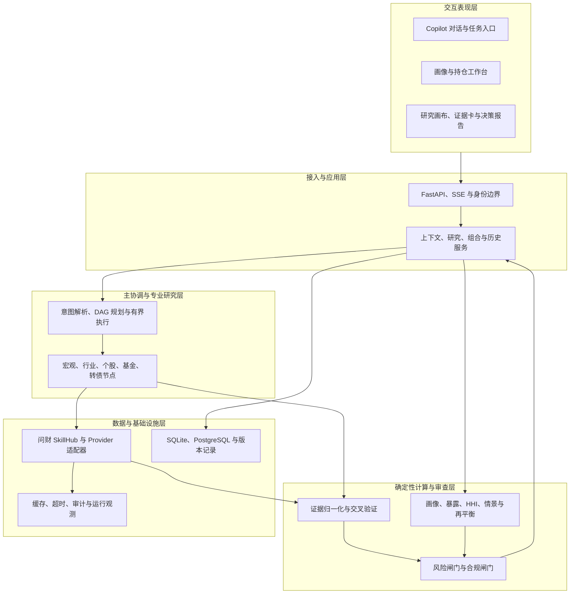
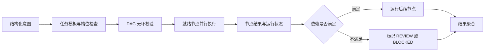
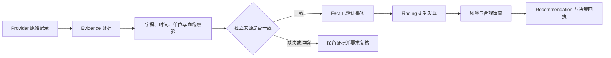
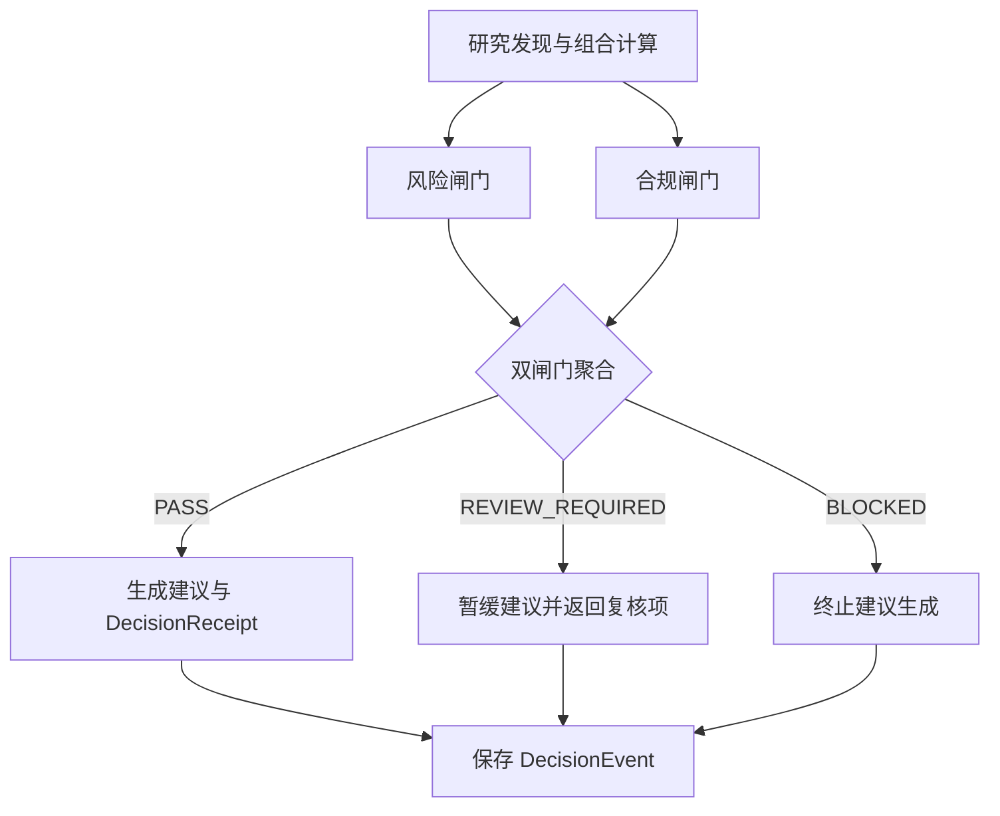

# Prism 个性化证券投顾智能体系统项目详细方案

参赛方向：基于同花顺问财 SkillHub 的个性化证券投顾智能体系统设计

文档定位：面向竞赛评审的项目总体方案，重点说明项目价值、产品形态、技术架构、核心实现、创新机制、验证成果与落地路径。

> **项目边界**：Prism 是证券研究与投资决策支持系统，不连接交易委托接口。大语言模型仅负责意图识别、槽位解析与结果解释；金融数据计算、组合测算、风险判定和合规裁决均由确定性程序执行。

## 目录

1. [第一章 项目概况](#chapter-1)
2. [第二章 方案概要](#chapter-2)
3. [第三章 产品方案](#chapter-3)
4. [第四章 产品功能与应用展示](#chapter-4)
5. [第五章 技术方案](#chapter-5)
6. [第六章 创新亮点](#chapter-6)
7. [第七章 系统验证与项目成果](#chapter-7)
8. [第八章 落地模式与项目价值](#chapter-8)
9. [第九章 风险控制与发展规划](#chapter-9)
10. [附录 工程实现与核验索引](#appendix)

## 第一章 项目概况

### 一、 项目背景

证券投顾正在由静态信息展示转向智能协作。用户需要系统结合其风险承受能力、投资期限、流动性要求和真实持仓，持续回答“当前风险在哪里、结论依据是什么、可以如何调整”。

传统投顾服务依赖人工经验和分散工具，服务半径、响应效率与个性化程度受到限制；通用大语言模型虽然能够理解自然语言，但无法天然保证金融数据真实、计算结果正确、建议符合适当性要求。Prism 围绕同花顺 A18 赛题，使用问财 SkillHub 与结构化金融数据能力，将用户画像、多场景研究、组合计算、证据追溯和风险合规审查连接为完整的决策支持流程。

### 二、 行业痛点与项目任务

表 1-1 行业痛点与 Prism 处理目标

| 行业痛点 | 根本原因 | Prism 处理机制 | 预期结果 |
| --- | --- | --- | --- |
| 建议缺乏个性化 | 风险问卷、持仓和研究过程相互割裂 | 将已确认画像转换为风险预算和配置约束 | 同一组合在不同画像下得到不同风险判断 |
| 多场景分析相互孤立 | 大盘、行业、个股、基金和转债使用不同资料与方法 | 采用“1 个主协调器 + N 个专业研究节点”的任务体系 | 统一规划、并行执行、结构化汇总 |
| 金融数据与结论难以核验 | 来源、时间、口径和结论未形成引用关系 | 建立 Evidence—Fact—Finding—Recommendation 证据链 | 结论可逐层追溯至原始依据 |
| 大模型可能产生数值幻觉 | 语言生成与金融计算职责混合 | LLM 与确定性计算引擎物理隔离 | 金额、比例、阈值和调仓数量可复算 |
| 建议合规边界不清 | 风险审查与内容生成耦合 | 独立风险闸门与合规闸门双重裁决 | 不满足条件时明确复核或阻断 |
| 外部服务不稳定 | 上游额度、超时和数据缺失会沿链路放大 | 有界并行、超时控制、缓存与备用来源、显式降级 | 失败不伪装为成功，影响范围可见 |

### 三、 项目定位

Prism 面向个人投资者及为其提供服务的证券业务团队，定位为“可解释、可计算、可审查的个性化证券投顾智能体工作台”。系统覆盖大盘研判、行业配置、个股分析、ETF 与基金筛选、可转债分析、组合风险体检和再平衡测算。

系统以形成闭合决策链为目标：用户条件可确认、数据来源可追溯、计算过程可复算、风险边界可执行、历史结论可回看。

### 四、 建设目标与验收口径

表 1-2 项目目标与验收方式

| 建设目标 | 核心要求 | Prism 实现方式 | 验收材料 |
| --- | --- | --- | --- |
| 个性化 | 画像必须实质影响结果 | 画像评分、版本化风险预算、配置边界 | 不同画像案例与风险报告 |
| 全场景 | 覆盖赛题要求的主要投顾任务 | 专业研究矩阵与专项研究服务 | 页面、接口及研究运行记录 |
| 可解释 | 结论具有来源、时间与逻辑链 | 四层证据对象、因果路径与决策回执 | Evidence Card、历史回执 |
| 准确性 | 金融数值能够复算 | Decimal、公式、守恒与阈值校验 | 单元测试、固定案例、正式报告 |
| 合规性 | 建议符合适当性和披露要求 | 风险与合规双闸门 | PASS、REVIEW_REQUIRED、BLOCKED 结果 |
| 稳定性 | 具备并发、超时和降级能力 | 有界任务执行、Provider 四态、缓存与备用源 | 负载记录、故障注入和接口测试 |

## 第二章 方案概要

### 一、 总体设计思路

Prism 以“用户约束先行、专业研究协同、金融计算确定、建议输出受控”为总体设计原则。系统先确认用户画像和持仓，再将问题转换为结构化研究任务；专业节点获取并验证资料，确定性引擎完成数值计算，风险与合规模块决定结果是否具备建议资格。

图 2-1 Prism 端到端投顾决策流程

### 二、 “1+N”多智能体协作体系

“1”代表中央协调器，负责意图识别、任务拆解、依赖检查、超时预算和结果汇总；“N”代表按研究职责划分的专业节点。专业节点具有明确输入、输出、数据要求和状态契约，不以自由对话代替金融研究流程。

表 2-1 多智能体职责矩阵

| 智能体或节点 | 主要输入 | 核心职责 | 结构化输出 |
| --- | --- | --- | --- |
| 中央协调器 | 用户意图、画像、持仓、任务模板 | 生成 DAG、检查依赖、调度节点 | 研究计划、节点状态、汇总结果 |
| 宏观研究节点 | 指数、宏观因子、政策与市场数据 | 判断市场环境与主要驱动 | 宏观事实、风险因子、观察结论 |
| 行业研究节点 | 行业行情、景气数据、事件资料 | 分析行业景气与集中风险 | 行业事实、比较结果、风险提示 |
| 个股研究节点 | 行情、财务、估值与公告 | 形成公司层面的结构化研究 | 财务事实、研究发现、失效条件 |
| ETF 与基金节点 | 基金资料、费率、波动与成分 | 筛选产品并穿透底层暴露 | 产品事实、成分覆盖、集中度 |
| 可转债节点 | 转债价格、正股、债底与信用字段 | 计算转股价值与溢价率 | 确定性指标、风险发现 |
| 组合决策节点 | 已确认组合、画像预算、有效报价 | 计算暴露、情景与再平衡方案 | 组合报告、行动测算、复核状态 |

### 三、 三类能力的职责边界

表 2-2 大模型、确定性引擎与硬闸门职责

| 能力类型 | 允许承担的工作 | 禁止承担的工作 | 输出约束 |
| --- | --- | --- | --- |
| 大语言模型 | 意图识别、槽位解析、追问澄清、通俗解释 | 金融加减乘除、暴露穿透、调仓数量、风险裁决 | 只能引用结构化输入与已计算结果 |
| 确定性引擎 | 画像评分、金额权重、HHI、风险预算、情景和再平衡 | 生成未经审查的主观投资承诺 | 公式、精度、版本和状态可复核 |
| 风险与合规闸门 | 适当性、证据完整性、禁止表述、风险披露 | 修改原始金融事实或绕过缺失数据 | 仅输出 PASS、REVIEW_REQUIRED、BLOCKED |

### 四、 赛题要求覆盖关系

表 2-3 赛题任务与项目能力对应关系

| 赛题要求 | Prism 对应能力 | 产品入口 | 工程证据 |
| --- | --- | --- | --- |
| 用户画像与风险偏好 | 19 题问卷、自然语言提案、行为画像、风险预算 | 个人中心、画像确认 | 画像服务与评分测试 |
| 多场景投顾分析 | 大盘、行业、个股、基金、转债和组合分析 | 投资任务工作台 | 专项研究服务与接口测试 |
| 多智能体协同 | 中央协调、DAG、有界并行、结果聚合 | 研究工作流 | 编排器与研究矩阵测试 |
| 数据溯源与幻觉控制 | Provider 状态、证据链、交叉验证 | Evidence Card | 证据契约与冲突案例 |
| 可视化与多轮交互 | 对话入口、指标卡、研究流程、上下文恢复 | Copilot 工作台 | 浏览器测试与页面快照 |
| 高并发与稳定性 | 超时预算、缓存、备用源、负载观测 | 运行状态页 | 本地 HTTP 负载记录 |
| 合规安全 | 用户归属、风险闸门、合规闸门、审计记录 | 风险提示与决策回执 | 闸门测试与历史事件 |

## 第三章 产品方案

### 一、 产品功能结构

Prism 采用“一个工作台、三个中心、六类任务”的产品结构。一个工作台承担统一对话和任务入口；三个中心分别管理用户画像、持仓组合和证据历史；六类任务覆盖赛题要求的主要投顾场景。

图 3-1 Prism 功能模块与职责依赖

### 二、 投资者画像与风险偏好

正式问卷覆盖损失承受、投资期限、流动性需求、投资经验和收益预期等基础维度，并形成风险等级。自然语言描述只生成待确认字段，不直接改写已生效画像；历史交易用于形成行为证据，当样本不足时显示 `INSUFFICIENT_DATA`，不以推测值替代。

表 3-1 画像信息的作用

| 信息来源 | 处理方式 | 是否需要确认 | 对系统的影响 |
| --- | --- | --- | --- |
| 正式问卷 | 确定性评分与等级映射 | 提交即形成版本 | 决定基础风险等级与预算规则 |
| 自然语言描述 | LLM 提取候选字段并保留原文 | 必须逐项确认 | 补充期限、流动性和目标条件 |
| 当前持仓 | 计算资产、行业和现金暴露 | 导入后核对 | 形成组合风险事实 |
| 历史交易 | 计算持有期、换手与行为特征 | 数据充分后复核 | 用于识别问卷与行为差异 |

### 三、 多场景研究与证据展示

用户可以通过自然语言提问，也可以直接选择大盘、行业、个股、基金或可转债任务。系统根据意图生成结构化计划，将任务交给对应研究节点；页面同时展示节点状态、数据来源、观察时间和缺失字段。研究结果按照“证据—事实—发现”展开，用户可以从结论反向定位依据。

### 四、 组合分析与决策支持

组合中心接收文字、表格或截图持仓。用户确认后，系统计算市值、现金、资产结构、底层成分暴露、单一资产集中度和行业集中度，并与画像对应的风险预算比较。具备有效报价和约束时，系统继续计算目标结构、情景变化与再平衡行动；所有方案标记为 `ADVISORY_ONLY`，不执行自动交易。

表 3-2 组合能力与输出

| 功能 | 必要输入 | 确定性处理 | 用户输出 |
| --- | --- | --- | --- |
| 持仓体检 | 已确认持仓、现金和价格 | 市值、权重、HHI、风险预算 | 风险来源、观察值、阈值和状态 |
| 基金穿透 | 基金成分与报告期 | 合并直接和间接暴露 | 底层资产、覆盖率和未分类部分 |
| 情景分析 | 组合与用户指定冲击 | 重新计算组合价值和贡献 | 基线—情景差异及主要影响项 |
| 目标结构 | 画像预算、当前暴露 | 约束下的目标权重提案 | 当前权重、目标权重和失效条件 |
| 再平衡 | 目标结构、报价、交易单位和费用 | 股数、费用、现金、换手与交易后复核 | 分步行动、现金变化和剩余风险 |

### 五、 用户操作流程

1. 注册或登录本地账户，完成风险问卷并确认画像；
2. 导入文字、表格或截图持仓，核对证券、数量、价格与现金；
3. 在工作台输入问题或选择专业任务；
4. 查看研究节点、数据状态、组合计算和风险裁决；
5. 展开证据链，核对来源、报告期、计算口径与失效条件；
6. 在数据充分时运行情景或再平衡测算，并保存结果用于历史复核。

## 第四章 产品功能与应用展示

本章使用 2026 年 9 月 17 日采集的项目页面快照。截图用于说明当前产品形态和信息组织；其中的行情、组合和状态均对应各自记录的观察时间，不代表持续有效的市场结论。

### 一、 投资任务工作台

工作台以对话作为主入口，同时展示画像状态、持仓状态和专业任务入口。用户可以输入“分析我的持仓风险”等自然语言问题，也可以直接进入大盘、个股、基金、可转债和组合分析。

图 4-1 投资任务工作台

### 二、 画像建立与风险约束

个人中心展示正式问卷、风险等级、八维画像和资产配置参考。问卷评分与自然语言提案分开处理，未经确认的候选字段不能直接进入风险预算。

图 4-2 投资者画像与风险约束

### 三、 持仓分析与风险体检

持仓页面在同一视图中呈现资产结构、证券集中度、行业分布、现金比例和风险检查。每项状态同时给出观察值、适用阈值与计算口径，支持从组合问题定位到具体持仓。

图 4-3 持仓分析与风险对照

### 四、 市场观察与研究任务

大盘页面组织指数行情、技术指标、宏观因子和行业观察，并显示数据来源、观察时间和当前可用状态。单项查询可以直接返回结果，完整研究则进入多节点执行与证据校验流程。

图 4-4 大盘鉴别与市场观察

### 五、 行为画像与持续复核

交易风格页面接收历史交易，展示数据充分性和可计算的行为特征。系统不在样本不足时强行给出风格结论，问卷画像仍作为有效的基础风险输入。

图 4-5 行为画像与数据充分性

## 第五章 技术方案

### 一、 开发环境与技术选型

表 5-1 主要技术组件

| 层次 | 技术组件 | 主要用途 | 选型理由 |
| --- | --- | --- | --- |
| 前端 | HTML、CSS、JavaScript、AntV X6 | 工作台、图表、研究流程和 DAG 画布 | 轻量同源部署，复用成熟图编排能力 |
| 服务端 | Python 3.11、FastAPI、Pydantic 2 | HTTP、SSE、应用服务和数据契约 | 类型边界清晰，适合异步任务与金融计算 |
| 计算 | Decimal、领域规则模块 | 金额、权重、风险、情景和再平衡 | 避免二进制浮点误差，便于复算 |
| 数据 | 问财 SkillHub、金融数据 Provider 适配器 | 行情、财务、行业、基金和转债数据 | 统一上游差异并保留来源状态 |
| 存储 | SQLite、PostgreSQL 适配 | 上下文、事件、审计和历史结果 | 支持本地演示与后续部署扩展 |
| 图像识别 | Pillow、RapidOCR | 截图持仓文字识别 | 将非结构化输入转为待确认字段 |
| 大模型 | OpenAI-compatible 可配置接口 | 意图、槽位和自然语言解释 | 与业务计算解耦，支持模型替换 |

### 二、 系统总体架构

Prism 采用模块化单体架构。前端、接口、应用服务和领域模块在一个可部署应用中协作，研究、计算、证据和审查保持独立边界。相较于过早拆分微服务，该方案减少竞赛演示和本地部署的运维复杂度，同时通过稳定契约保留未来拆分条件。

图 5-1 Prism 系统总体架构

### 三、 Web 前端技术实现

前端采用任务导向的信息架构，包含统一对话入口、画像与持仓上下文、专业任务入口、L2 决策卡和 L3 证据审计视图。固定研究 DAG 使用 AntV X6 展示节点与依赖，列表视图与画布共用同一图模型，避免出现两套状态。

界面使用高密度标签表达状态：`PASS` 表示已满足检查条件，`OVERBOUND` 表示观察值超出阈值，`CALCULATED` 表示已完成确定性计算，`REVIEW_REQUIRED` 表示仍需补充资料或复核。错误、空结果和数据缺失使用独立提示，不以默认值掩盖。

### 四、 服务端与任务编排实现

中央协调器接收结构化意图，根据任务类型生成有向无环图。执行器使用依赖关系决定可运行节点，在节点和整体时间预算内执行任务；相互独立的节点并行运行，上游失败时下游节点保留未执行原因。

图 5-2 多智能体任务编排流程

表 5-2 编排状态与处理原则

| 状态 | 判定条件 | 后续动作 | 用户可见信息 |
| --- | --- | --- | --- |
| READY | 输入与依赖完整 | 进入执行队列 | 节点目标与所需数据 |
| RUNNING | 节点在时间预算内运行 | 接收结构化结果 | 当前进度与运行节点 |
| REVIEW_REQUIRED | 数据部分缺失、冲突或使用备用来源 | 保留可用结果，暂停升级结论 | 缺项、冲突和影响范围 |
| BLOCKED | 必需依赖失败、归属错误或输入无效 | 停止相关下游节点 | 阻断位置与恢复条件 |
| COMPLETED | 输出通过契约校验 | 进入证据与审查流程 | 节点结果和引用标识 |

### 五、 投资者画像与个性化计算

画像评分由确定性规则完成。正式问卷形成基础画像，自然语言只形成候选字段，行为数据形成独立证据。已确认风险等级进入版本化风险预算，控制单一资产、行业、科技行业合计及未分类暴露上限。

表 5-3 当前风险预算规则

| 风险等级 | 单一资产上限 | 已识别行业上限 | 科技行业合计上限 | 未分类合计上限 |
| --- | ---: | ---: | ---: | ---: |
| 保守型 | 20% | 30% | 25% | 10% |
| 均衡型 | 35% | 45% | 40% | 20% |
| 成长型 | 50% | 60% | 60% | 35% |

画像版本、持仓快照和规则版本共同绑定一次计算。用户重新确认画像或刷新组合后，派生结果需要重新运行，避免旧结论在新条件下继续生效。

### 六、 研究证据与幻觉控制

Prism 将研究依据拆分为四类对象：Evidence 保存原始来源、字段、时间和单位；Fact 表示通过验证的金融事实；Finding 表示基于事实形成的结构化发现；Recommendation 表示通过风险与合规审查后的建议。引用方向固定，不能由结论反向补造依据。

图 5-3 金融证据链与幻觉控制流程

同一数据的转发、缓存或不同展示形式不能被计作多个独立来源。来源冲突、时间过期、字段缺失时，系统保留证据但不升级为已验证事实；LLM 生成的文本也不能反向成为金融事实。

### 七、 确定性金融计算引擎

组合计算全部使用 Decimal 和明确公式。对持仓价值 $v_i$ 及其在标的或行业 $g$ 中的成分比例 $w_{i,g}$，暴露金额与占比为：

$$
E_g=\sum_i v_iw_{i,g},\qquad p_g=\frac{E_g}{V}\times100\%
\tag{5-1}
$$

$V$ 为报告指定口径下的组合总资产。直接持有的证券成分比例为 1；基金或 ETF 使用披露成分，并将未覆盖部分保留为未分类暴露。

集中度使用 Herfindahl-Hirschman Index：

$$
HHI=10000\sum_g\left(\frac{E_g}{V}\right)^2
\tag{5-2}
$$

目标结构与当前结构的金额变化为：

$$
\Delta v_i=V\left(w_i^{\mathrm{target}}-w_i^{\mathrm{current}}\right)
\tag{5-3}
$$

再平衡服务在金额变化基础上继续计算 0.50% 默认权重死区、换手上限、整手股数、印花税、过户费、佣金、现金变化和交易后风险。任何缺少有效报价、币种不一致或目标权重不守恒的输入都会产生错误或复核状态，而不是由模型补齐。

### 八、 数据接入与质量控制

问财 SkillHub 和其他金融数据源通过统一 Provider 契约接入。每次响应保留 Provider、source、lineage、observed_at、retrieved_at、报告期、单位和 missing_fields。

表 5-4 数据结果状态

| 状态 | 业务含义 | 后续处理 | 页面表达 |
| --- | --- | --- | --- |
| SUCCESS | 查询成功且必需字段完整 | 进入验证与计算 | 展示数据、来源和时间 |
| PARTIAL | 查询成功但字段不完整 | 使用可用部分并降低结论等级 | 展示缺项和影响 |
| EMPTY | 查询成功但指定范围无记录 | 保留空结果，不解释为零 | 展示查询范围与空状态 |
| FAILED | 鉴权、额度、超时、网络或解析失败 | 停止依赖该数据的计算 | 展示安全错误与恢复条件 |

缓存与备用来源不会改变原始数据状态；过期缓存明确标记为 stale。报价冲突、财务口径冲突和来源身份不独立时进入复核，不以平均值自动消除分歧。

### 九、 风险与合规双重审查

风险闸门检查画像、持仓、证据、风险预算与配置结果是否一致；合规闸门检查事实引用、风险揭示、禁止表述和候选文本。建议组合器只有在两个闸门均为 `PASS` 时才生成正式建议和决策回执。

图 5-4 风险与合规双闸门

表 5-5 审查状态与系统动作

| 状态 | 典型条件 | 系统动作 | 输出内容 |
| --- | --- | --- | --- |
| PASS | 证据、画像、组合和披露均满足要求 | 生成建议与回执 | 建议、依据、风险和失效条件 |
| REVIEW_REQUIRED | 数据部分缺失、来源冲突或仍需人工复核 | 暂缓完整建议 | 缺项、冲突和补充事项 |
| BLOCKED | 用户归属不一致、引用断裂、输入失效或禁止表述 | 终止建议生成 | 阻断原因和安全提示 |

### 十、 存储、部署与安全

本地应用由 FastAPI 提供同源工作台和接口，SQLite 保存账户、已确认上下文、研究运行与决策事件，并保留 PostgreSQL 适配。用户归属由服务端账户确定；Windows 本地凭据使用受保护存储，浏览器不保存明文密钥。访问审计记录请求方法、路径、结果与关联标识。

模块化单体是当前阶段的合理选择：它降低了竞赛环境中的部署和联调成本，并通过 Pydantic 契约、领域模块和事件记录维持可测试性。后续可按研究执行、数据 Provider 和历史服务的压力边界拆分。

## 第六章 创新亮点

Prism 的独特性不依赖某一个模型或某一项算法，而在于把画像、授权、持仓、研究、计算、审查和回执放入同一条状态化决策链。产品 PRD 中的 19 题问卷、8 维画像、6 类投顾任务、持仓适配度、五步协作过程和全局授权开关，在工程层分别对应版本化上下文、能力路由、证据型研究、确定性计算和建议资格审查。任一关键条件变化，相关分析都需要重新计算或降级，不继续沿用旧结论。

图 6-1 Prism 个性化投顾闭环

### 一、 投资画像编译为全局运行参数

PRD 将 19 题问卷划分为 6 个部分，并形成风险承受、投资经验、交易活跃、自主研究、信息投入、AI 信任、个性需求和辅助需求 8 个量化维度。Prism 在此基础上生成 C1 至 C5 风险等级、投资者原型、画像标签、服务策略、推荐智能体和建议资产配置。画像不是仅供展示的用户标签，而是后续计算和产品行为的共同输入。

用户重新测评后，画像变化同步作用于顶栏、AI 对话侧栏、个人中心、持仓适配度、风险预算和再平衡复核。与只在会话提示词中附加“保守型”标签的做法相比，Prism 让同一画像版本在交互层、计算层和审查层保持一致，避免页面推荐与组合风险判断使用不同用户条件。

### 二、 场景状态与授权共同驱动能力路由

系统不会把所有问题交给同一条通用问答链路。大盘、行业、个股、ETF 与基金、可转债、资产重组优化分别进入对应专业任务；资产重组优化先检查持仓是否存在，无持仓时转入导入流程；券商持仓和实时行情授权关闭后，相关数据能力随之停止；未知标的或指数只进入标明边界的定性模式。

这种路由同时考虑用户意图、当前业务状态和数据授权。常见金融问答产品通常只根据文本识别主题，Prism 进一步判断当前条件是否足以执行任务，并明确给出补充数据、切换工具页、降级分析或停止执行的结果。

### 三、 对话入口与专业工具形成双向闭环

AI 对话承担统一入口，持仓分析、大盘鉴别和个人中心承担结构化操作。用户可以从大盘页面把当前指数带回 AI 对话继续追问，也可以从对话中的资产重组请求跳转持仓导入；对话右侧持续显示画像和持仓速览，快捷能力直接切换六类专业模式。

Prism 因此同时保留自然语言的低门槛和专业工具的确定性。它不同于仅提供聊天窗口的金融助手，也不同于只能在固定表单中生成报告的规则型投顾：对话负责表达问题，工具页负责确认状态和数据，二者共享同一用户上下文。

### 四、 画像适配度连接个人约束与真实持仓

风险测评与持仓分析不是两个独立模块。系统将非可转债权益市值占比与画像建议权益区间直接比较，并将单一资产、行业、科技行业和未分类暴露纳入风险预算。持仓变化、报价刷新或画像重测都会触发适配度和风险事实重新计算。

这一机制把“用户能承受什么风险”与“用户实际上承担了什么风险”放在同一界面和同一计算口径下。传统风险问卷通常只决定产品风险等级，传统持仓工具通常只展示盈亏和占比；Prism 用画像预算解释持仓偏离，并把偏离结果继续传递给研究和再平衡流程。

### 五、 多智能体协作过程可观察

PRD 明确展示意图理解与画像匹配、实时数据检索、多智能体协同分析、交叉验证与一致性校验、合规审查与风险提示五个阶段。工程实现进一步使用 DAG 管理依赖和并行节点，记录 READY、RUNNING、REVIEW_REQUIRED、BLOCKED 和 COMPLETED 状态。

用户看到的不只是等待动画，还能判断任务正在获取什么数据、哪些节点已经完成、哪项依赖导致复核或阻断。相比只返回最终文本的助手，该机制使多智能体协作具有可观测的执行过程，便于发现缺项、定位失败并恢复任务。

### 六、 证据等级决定结论能否升级

专业节点按 Evidence、Fact、Finding、Recommendation 四层对象输出结果。Evidence 保存来源、字段、观察时间和单位；Fact 必须引用有效证据；Finding 必须引用闭合事实；Recommendation 只有通过风险与合规审查后才能形成。多个节点表达相同观点不会自动提高可信度，系统还要检查引用关系和来源独立性。

该机制把“多智能体一致”与“事实成立”区分开。常见多智能体方案容易把多数意见当作正确答案，Prism 要求结论能够回到原始记录，并在来源冲突、时间过期或字段缺失时降低结论等级。

### 七、 大模型与金融计算物理隔离

LLM 负责意图识别、槽位解析、追问澄清和通俗解释；确定性引擎使用 Decimal、明确公式和领域规则计算市值、盈亏、权重、暴露、HHI、风险预算、情景变化和再平衡数量。模型不能直接生成基金穿透结果、权重守恒或调仓股数。

这一边界使金融数值具备固定分母、精度、阈值和规则版本，能够通过单元测试和案例回放复算。模型替换只影响语言理解与表达，不改变底层计算口径，也不会绕过适当性和合规规则。

### 八、 建议资格先于建议生成

Prism 先判断系统是否具备生成建议的资格，再决定输出内容。数据状态严格区分 SUCCESS、PARTIAL、EMPTY 和 FAILED；风险闸门核对画像、持仓、预算和配置结果，合规闸门核对事实引用、风险揭示和禁止表述。任一闸门未通过，系统只能返回 REVIEW_REQUIRED 或 BLOCKED，不生成完整建议。

通过后的 DecisionReceipt 绑定画像版本、持仓快照、研究结果、证据引用、闸门状态和规则版本；DecisionEvent 保存通过、复核或阻断事件。与在生成文本后追加免责声明相比，该机制将合规要求放在建议生成之前，并能够解释一条建议在什么条件下产生、何时失效。

### 九、 典型产品形态差异

以下对比按产品机制归纳典型形态，不针对特定品牌作功能评价。Prism 的差异不在于单独拥有问卷、聊天或持仓页面，而在于这些能力使用同一画像和上下文版本，并通过明确的状态契约连接。

表 6-1 Prism 与典型智能投顾形态对比

| 对比维度 | 通用金融问答助手 | 规则型智能投顾工具 | Prism |
| --- | --- | --- | --- |
| 用户建模 | 通常依赖当前提问和少量偏好标签 | 问卷主要用于风险等级和组合模板 | 19 题、8 维画像形成全局运行参数 |
| 个性化范围 | 影响回答主题或表达方式 | 主要影响资产配置区间 | 同时影响能力路由、风险预算、持仓适配和审查 |
| 交互形态 | 以单一聊天窗口为主 | 以固定表单和报告为主 | 对话入口与持仓、大盘、画像工具双向跳转 |
| 多场景协同 | 不同问题在同一问答链路处理 | 聚焦组合配置或产品匹配 | 六类专业任务由中央协调器统一编排 |
| 数据条件处理 | 数据不足时追问或给出概括性回答 | 缺少必要数据时停止测算 | 状态与授权共同路由，明确补充、降级或阻断 |
| 过程透明度 | 主要展示最终回复 | 主要展示规则结果 | 展示五步协作、节点状态、数据来源和审查状态 |
| 金融计算 | 可能与语言生成混合 | 使用固定规则计算 | LLM 与确定性计算物理隔离，结果可复算 |
| 合规控制 | 常在结果末尾附加风险提示 | 以适当性匹配和固定披露为主 | 风险与合规双闸门在建议生成前独立裁决 |
| 历史复核 | 保存会话文本 | 保存测评或配置报告 | 保存画像、持仓、证据、规则和裁决的决策回执 |

表 6-2 创新机制与可验证成果

| 创新机制 | Prism 独特组合 | PRD 中的产品依据 | 可验证成果 |
| --- | --- | --- | --- |
| 画像全局生效 | 画像同时进入交互、计算和审查 | 重测后全局刷新画像组件与持仓适配度 | 同一版本在不同页面得到一致风险边界 |
| 条件化能力路由 | 意图、状态与授权共同决定执行路径 | 六类模式、持仓检查、授权开关和未知对象降级 | 无数据时转入补充流程，不伪造完整结论 |
| 对话工具闭环 | 自然语言与专业页面共享上下文 | 大盘追问、资产重组跳转、画像和持仓速览 | 问题、数据确认和继续追问连续衔接 |
| 画像持仓联动 | 画像预算与真实资产暴露持续比较 | 权益仓位适配条和持仓整体分析 | 直接显示偏离区间和影响来源 |
| 可观察编排 | 五步过程与 DAG 节点状态对应 | 协作过程、交叉验证和审查状态展示 | 可定位运行节点、缺项和阻断原因 |
| 证据型研究 | 结论升级取决于引用闭合而非节点票数 | 数据来源标签、交叉验证和合规状态 | 可从结论回查事实与原始证据 |
| 确定性计算隔离 | 语言模型不承担金额和风险裁决 | 持仓指标与风险画像规则均有明确口径 | 公式、精度、阈值和规则版本可复算 |
| 建议资格与回执 | 双闸门裁决后才生成版本化建议 | 全程风险提示、合规审查与不执行交易 | PASS、REVIEW_REQUIRED、BLOCKED 可回放 |

## 第七章 系统验证与项目成果

### 一、 典型组合案例

本案例使用项目保存的正式组合报告，回答“当前组合有哪些风险需要关注”。报告生成于 2026 年 9 月 15 日 07:42:36 UTC，使用成长型画像，风险分数为 85，适当性等级为 C5。金额单位均为人民币元，价格仅对应报告时点。

表 7-1 案例持仓与市值

| 证券 | 数量（股） | 报告价格（元） | 市值（元） | 占证券持仓比例 |
| --- | ---: | ---: | ---: | ---: |
| 宁德时代 | 1,000 | 316.36 | 316,360.00 | 22.32% |
| 贵州茅台 | 600 | 1,272.75 | 763,650.00 | 53.87% |
| 中芯国际 | 2,000 | 114.86 | 229,720.00 | 16.21% |
| 中国平安 | 800 | 53.90 | 43,120.00 | 3.04% |
| 恒瑞医药 | 1,500 | 43.13 | 64,695.00 | 4.56% |

证券市值合计 1,417,545.00 元，现金 28,000.00 元，含现金总资产 1,445,545.00 元。贵州茅台占证券持仓 53.87%，占含现金总资产 52.83%，超过成长型画像 50% 的单一资产上限。

表 7-2 案例风险检查结果

| 检查项 | 观察值 | 适用规则 | 裁决 | 业务解释 |
| --- | ---: | --- | --- | --- |
| 单一资产占比 | 52.83% | 含现金总资产口径，上限 50% | OVERBOUND | 单一标的超过画像预算 |
| 权益类资产占比 | 98.06% | 配置参考区间 70%–90% | OVERBOUND | 权益资产占用较高 |
| 现金占比 | 1.94% | 报告检查下限 5.00% | OVERBOUND | 流动性缓冲不足 |
| 证券资产 HHI | 3,692.96 | 同一报告口径计算 | CALCULATED | 证券持仓集中度较高 |
| 行业风险 HHI | 3,555.39 | 检查上限 2,500.00 | OVERBOUND | 行业分布需要复核 |
| 最大行业占比 | 52.83% | 成长型行业上限 60% | PASS | 单项行业上限检查通过 |

该案例最终状态为 `REVIEW_REQUIRED`。最大行业占比通过不代表整个组合无风险；系统保留各项独立裁决，避免用单一指标覆盖其他超限事实。

### 二、 验证体系

表 7-3 验证对象与方法

| 验证类别 | 主要对象 | 判定方法 | 能够证明的范围 |
| --- | --- | --- | --- |
| 单元测试 | 画像、暴露、预算、证据、闸门和再平衡 | 固定输入检查公式、阈值和异常 | 领域规则与契约正确性 |
| 集成测试 | 上下文、研究、组合、历史和接口 | 检查跨模块输入输出及用户归属 | 服务协作与持久化一致性 |
| 浏览器测试 | 导航、对话、页面状态和结果展开 | 执行真实页面操作路径 | 当前用户交互可用性 |
| 固定案例回放 | 九个版本化评测案例 | 重复运行并比较语义结果 | 规则与状态的确定性 |
| 故障注入 | PARTIAL、EMPTY、FAILED、来源冲突 | 验证降级、阻断和错误传播 | 异常状态处理能力 |
| 负载观测 | 本地 HTTP 读取接口 | 记录成功率与 P50、P95、P99 | 指定环境和接口的性能 |

### 三、 当前成果

表 7-4 已实现成果与核验材料

| 成果 | 当前实现 | 可见结果 | 工程依据 |
| --- | --- | --- | --- |
| 个性化画像 | 19 题问卷、候选提案、行为证据 | 风险等级、维度解释和预算 | 画像模块与对应测试 |
| 多场景研究 | 大盘、行业、个股、基金、转债任务 | 研究节点、数据状态和 Evidence Card | 研究服务与专项测试 |
| 组合决策 | 暴露、HHI、预算、情景与再平衡 | 组合报告、行动测算和交易后复核 | 组合与再平衡模块 |
| 可解释链路 | Evidence—Fact—Finding—Recommendation | 来源、时间、引用和历史回执 | 证据契约与决策事件 |
| 合规控制 | 风险与合规双闸门 | 通过、复核或阻断 | gates 与 recommendation 模块 |
| 工程工作台 | FastAPI、同源页面、本地账户与存储 | 可操作页面和接口文档 | API、浏览器与持久化测试 |

### 四、 性能记录与指标边界

项目保留一次本地真实 HTTP 持仓读取观测：100 个并发请求全部成功，P95 为 326.038 ms。该记录能够证明指定本地只读接口在对应环境下的并发响应能力，但不能替代完整投顾链路、外部数据源和远程模型的端到端性能验收。

表 7-5 赛题质量目标与当前证据

| 指标 | 赛题目标 | 当前证据 | 结论 |
| --- | ---: | --- | --- |
| 并发咨询 | 不少于 100 用户 | 本地持仓读取接口 100 并发成功 | 已验证局部接口，完整咨询链路待验收 |
| 单次响应 | 不超过 3 秒 | 本地持仓读取 P95 326.038 ms | 不外推至外部 Provider 与 LLM |
| 系统可用性 | 99.9% 以上 | 已有失败降级、缓存与故障注入测试 | 长期部署可用性尚需持续观测 |
| 数据延迟 | 秒级 | 响应保留 observed_at 与 retrieved_at | 取决于上游权限、额度与服务状态 |
| 结果可解释 | 逻辑链与可靠来源 | 证据链、阈值、公式和决策回执 | 已形成可核验实现 |

## 第八章 落地模式与项目价值

### 一、 服务对象与价值主张

Prism 采用 B2B2C 为主、个人研究版为辅的落地思路。证券公司、投顾团队和金融科技平台可以将其作为投顾工作台或智能能力组件，个人投资者则通过受控的研究与组合工具获得可解释的决策支持。

表 8-1 服务对象与价值

| 服务对象 | 主要需求 | Prism 交付能力 | 直接价值 |
| --- | --- | --- | --- |
| 个人投资者 | 理解持仓风险并获得个性化解释 | 画像、持仓体检、研究和情景分析 | 降低信息整理与计算门槛 |
| 投资顾问团队 | 扩大服务半径并保持口径一致 | 多智能体研究、证据卡和合规审查 | 提升研究准备与客户沟通效率 |
| 证券公司 | 建设可治理的智能投顾能力 | 私有部署、账户隔离、审计和接口集成 | 形成可控、可追溯的智能服务底座 |
| 金融科技平台 | 快速组合投顾场景 | 标准 API、Provider 适配和模块化能力 | 缩短个性化投顾产品建设周期 |

### 二、 交付与收入模式

表 8-2 可行落地模式

| 模式 | 交付内容 | 适用客户 | 收入来源 |
| --- | --- | --- | --- |
| 私有化部署 | 工作台、服务端、规则、账户与审计能力 | 券商、投顾机构 | 软件许可、部署实施与年度维护 |
| 平台能力接入 | 画像、研究、证据、组合和闸门 API | 金融科技平台 | 接口服务与调用量套餐 |
| 专业模块订阅 | 组合体检、基金穿透、再平衡或证据审查 | 中小投顾团队 | 模块订阅和增值服务 |
| 个人研究版 | 受限数据能力与个人组合工具 | 个人投资者 | 基础功能与专业版订阅 |

上述模式均以数据授权、投顾资质、用户适当性和监管要求为前提。当前项目不宣称已经取得面向公众提供证券投资顾问业务的资质，商业化阶段必须由具备相应条件的主体完成合规评估和服务承接。

### 三、 核心资源与合作体系

核心资源包括问财 SkillHub 及合规金融数据、画像和组合领域规则、证据与审查契约、可验证评测案例以及本地可运行工程。重要合作方包括持牌证券机构、金融数据服务方、云与安全服务方及合规咨询机构。

### 四、 项目价值

Prism 把分散、不可核验的研究过程转换为结构化、可追溯、可复算的决策支持过程。

1. 对用户：说明风险来自哪里、为什么得出结论、哪些条件会使结论失效；
2. 对投顾团队：复用研究流程和审查口径，减少重复资料整理；
3. 对机构：保留来源、计算、裁决和历史事件，为治理与审计提供基础；
4. 对生态：通过标准 Provider 和服务契约接入不同数据与模型，降低系统锁定。

## 第九章 风险控制与发展规划

### 一、 项目风险与控制措施

表 9-1 主要风险及对策

| 风险类别 | 具体风险 | 影响 | 当前控制措施 | 后续措施 |
| --- | --- | --- | --- | --- |
| 数据风险 | 上游额度、延迟、缺失或口径冲突 | 研究和组合结果不完整 | Provider 四态、时间戳、血缘与显式降级 | 增加正式授权数据和长期质量监控 |
| 模型风险 | 意图误判、文本幻觉和前提漂移 | 任务错误或解释失真 | 槽位确认、结构化输入、事实黑板 | 建立目标问题集和人工抽检机制 |
| 计算风险 | 分母、精度或规则版本不一致 | 金额和阈值不可复核 | Decimal、守恒、公式和版本绑定 | 扩充边界案例与独立复算 |
| 合规风险 | 超适当性建议、收益承诺或披露不足 | 违反监管与损害用户权益 | 独立风险和合规闸门、禁止表述和披露 | 由持牌机构完成规则审定与持续更新 |
| 安全风险 | 用户持仓、凭据或账户越权 | 隐私和资产信息泄露 | owner 隔离、受保护凭据、访问审计 | 接入生产身份、密钥管理与独立审计 |
| 性能风险 | 高峰并发、外部超时和任务堆积 | 响应超时与服务不可用 | 有界并行、超时、缓存和备用源 | 完成端到端压测、容量规划与长期 SLA 观测 |

### 二、 当前能力边界

1. 问财 SkillHub 与其他实时服务受凭据、额度、授权和上游状态约束；
2. 持仓 OCR 的识别结果必须由用户确认，证券目录仅用于身份匹配，不替代行情和财务数据；
3. 完整研究质量、远程 LLM 效果和外部服务性能需要按实际部署配置独立验收；
4. 再平衡尚不包含基于历史协方差、流动性压力和长期回测的全局最优求解；
5. 100 并发和 P95 326.038 ms 仅代表已记录的本地持仓读取场景；
6. 所有方案均为 `ADVISORY_ONLY`，系统不执行交易，不承诺收益。

### 三、 发展规划

表 9-2 项目迭代路线

| 阶段 | 建设重点 | 关键任务 | 验收结果 |
| --- | --- | --- | --- |
| 近期 | 完成竞赛交付与真实链路验收 | 补齐实时研究案例、端到端演示和完整压测 | 可重复演示、测试报告和问题清单 |
| 中期 | 强化机构级数据与合规能力 | 正式数据授权、规则审定、生产身份与审计 | 私有化试点和受控用户验证 |
| 远期 | 扩展组合决策与持续评估 | 协方差、流动性、回测、模型和策略评估 | 可量化的长期服务质量体系 |

### 四、 项目结论

Prism 已形成从用户画像、专业研究、金融计算到风险合规审查的完整产品与工程框架。项目成果是一套能够说明“为谁分析、使用什么数据、如何计算、为何得出结论、是否允许生成建议”的可验证投顾决策链。该方案与同花顺 A18 赛题提出的个性化、多智能体、数据准确、可解释和合规安全要求形成直接对应，并为后续机构级部署保留了明确的工程边界。

## 附录 工程实现与核验索引

### 一、 核心模块与验证文件

表 A-1 核心能力的工程依据

| 能力 | 实现位置 | 代表验证文件 | 核验内容 |
| --- | --- | --- | --- |
| 画像评分 | `app/profile/questionnaire.py`、`app/profile/scoring.py` | `tests/unit/test_full_questionnaire.py`、`tests/unit/test_profile_scoring.py` | 题目、评分与风险等级 |
| 画像与行为 | `app/service/natural_profile.py`、`app/profile/behavior.py` | `tests/unit/test_natural_profile.py`、`tests/unit/test_behavior_profile.py` | 候选确认与数据充分性 |
| 任务编排 | `app/orchestration/`、`app/service/specialist_matrix.py` | `tests/unit/test_bounded_orchestration.py`、`tests/unit/test_specialist_matrix.py` | DAG、依赖与节点状态 |
| 研究证据 | `app/contracts/evidence.py`、`app/research/cross_validation.py` | `tests/unit/test_evidence_contract.py`、`tests/unit/test_research_cross_validation.py` | 引用与独立来源 |
| 暴露与预算 | `app/portfolio/exposure.py`、`app/risk/` | `tests/unit/test_portfolio_exposure.py`、`tests/unit/test_risk_budget.py` | 穿透、集中度和阈值 |
| 组合报告 | `app/portfolio/report.py` | `tests/unit/test_portfolio_report.py` | 市值、现金、比例与报告身份 |
| 情景与再平衡 | `app/scenarios/`、`app/rebalancing/` | `tests/unit/test_scenario_simulation.py`、`tests/unit/test_portfolio_rebalancing.py` | 冲击、费用、现金与行动 |
| 双重审查 | `app/gates/`、`app/recommendation/` | `tests/unit/test_decision_gates.py`、`tests/unit/test_recommendation_composer.py` | 风险、合规与建议资格 |
| 数据服务 | `app/providers/`、`app/runtime/` | `tests/unit/test_provider_contract.py`、`tests/unit/test_provider_resilience.py` | 数据状态与降级 |
| 页面交互 | `app/api/static/` | `tests/browser/test_pages_snapshot.mjs` | 页面加载、导航与快照 |

### 二、 主要接口入口

表 A-2 主要接口

| 接口类别 | 代表路径 | 主要功能 | 核心检查 |
| --- | --- | --- | --- |
| 服务状态 | `GET /api/health`、`GET /api/docs` | 健康检查与接口说明 | 应用状态和契约 |
| 画像上下文 | `/api/v1/advisor/profile/*`、`/api/v1/advisor/context/*` | 问卷、画像与确认上下文 | 用户归属与版本 |
| 持仓组合 | `/api/v1/advisor/portfolio/*` | 导入、刷新、报告与风险 | 快照、报价与完整性 |
| 专业研究 | `/api/v1/advisor/research-runs`、`/api/v1/advisor/stock-research-runs` | 研究矩阵与个股研究 | 运行模式、证据和状态 |
| 基金与转债 | `/api/v1/advisor/fund-research-runs`、`/api/v1/advisor/convertible-bond-research-runs` | 专项研究 | 数据能力和字段口径 |
| 组合决策 | `/api/v1/advisor/portfolio-optimization-runs`、`/api/v1/advisor/rebalancing-runs` | 目标结构与再平衡 | 约束、现金和交易后风险 |
| 情景分析 | `/api/v1/advisor/scenario-simulation-runs` | 自定义或固定情景 | 冲击条件与运行模式 |
| 投顾对话 | `/api/v1/advisor/queries`、`/api/v1/copilot/chat` | 查询、工具调用与解释 | 已确认上下文和审查状态 |
| 历史记录 | `/api/v1/decision-events`、`/api/v1/advisor/recommendation-history` | 决策事件与历史建议 | 用户归属与内容身份 |

### 三、 案例来源与复核条件

第七章案例来自 `app/api/static/pages-snapshot.json` 保存的正式组合报告，报告编号为 `portfolio-report-1da3aff92cabe199157c5833ee813107`，规则版本为 `portfolio-report-rules.v1`。市值按数量乘以报告价格复核；总资产按证券市值与现金相加复核；证券资产 HHI 使用报告定义的证券持仓分母和两位小数占比平方和。

本地真实 HTTP 负载记录来自 `LOG.md`，工具入口为 `tools/http_load_test.py`。固定评测入口为 `tools/evaluate_mvp.py`，案例位于 `eval_cases/`。所有运行数字均与对应环境、接口和输入共同解释。

### 四、 状态与术语

表 A-3 主要状态与对象

| 术语 | 含义 | 所属环节 | 使用说明 |
| --- | --- | --- | --- |
| Evidence | 原始证据对象 | 数据与研究 | 保存来源、字段、时间和质量 |
| Fact | 已验证金融事实 | 证据校验 | 必须引用有效 Evidence |
| Finding | 结构化研究发现 | 专业研究 | 必须引用闭合 Fact |
| Recommendation | 审查后的建议 | 建议生成 | 必须通过双闸门 |
| PASS | 满足检查条件 | 计算或审查 | 与对应阈值和范围共同阅读 |
| OVERBOUND | 观察值超出阈值 | 风险检查 | 不等同于自动交易指令 |
| CALCULATED | 已完成确定性计算 | 金融计算 | 表示状态，不表示投资收益 |
| REVIEW_REQUIRED | 需要补充或人工复核 | 全流程 | 同时返回原因和影响范围 |
| BLOCKED | 当前条件下禁止继续 | 编排或审查 | 返回阻断位置和恢复条件 |
| ADVISORY_ONLY | 仅供决策参考 | 组合方案 | 不执行真实交易 |
