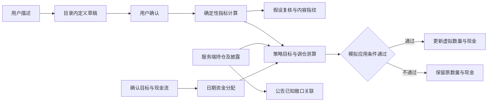

# Prism 功能创新的技术机制配图

## 第1章 交付与使用

本组包含五张内置 AI 生图工具生成的 PNG，分别解释一个已实现的小块技术。按用户后续要求，最终图片采用白底中心示意图，去除大标题、页脚、说明栏和外围面板；保留机制对象、箭头和必要的短标签。自然文档页、容器和账本的轮廓用于表达对象，不作为页面外框。

| 编号 | 配图 | 聚焦技术 | 形象表达 | 提示词 |
|---|---|---|---|---|
| 01 | [受约束定义生成](01-constrained-method-definition.png) | 目录约束、定义校验与确认边界 | 筛选器、节点、开关、计算器 | [生成提示词](prompts/01-constrained-method-definition.txt) |
| 02 | [内容变化记录](02-content-fingerprint-events.png) | SHA-256 内容指纹与事件去重 | 双次复核、指纹、比较器、账本 | [生成提示词](prompts/02-content-fingerprint-events.txt) |
| 03 | [公告敞口关联](03-announcement-exposure-paths.png) | 主体匹配及已披露成分穿透 | 公告、直接路径、基金分块、金额汇合 | [生成提示词](prompts/03-announcement-exposure-paths.txt) |
| 04 | [虚拟账本更新](04-gated-virtual-ledger.png) | 同基线比较及风险检查后记账 | 双策略路径、检查闸门、独立账本 | [生成提示词](prompts/04-gated-virtual-ledger.txt) |
| 05 | [日期资金分配](05-dated-funding-pool.png) | 按时间分配同一资金池 | 日期轴、资金容器、缺口、时间闸门 | [生成提示词](prompts/05-dated-funding-pool.txt) |

[逐张预览](preview.html)。第四、第五张另有定向修订提示词，位于 prompts 中。最终文件尺寸及 SHA-256 见 [verification.json](verification.json)。

## 第2章 核心技术与创新功能的对应关系

| 基础核心技术 | 细分机制 | 创新功能中的使用 | 对应配图 | 实现依据 |
|---|---|---|---|---|
| 画像与风险约束映射 | 确认画像、版本绑定、风险预算比较 | 约束虚拟调仓；资金规划调整方案复用画像 | 04、05的关联说明 | app/profile/scoring.py；app/risk/budget.py |
| 来源关联证据验证 | 主体、指标、单位、期间、来源独立性 | 研究指标保留来源与验证状态；CALCULATED不自动成为已验证事实 | 01的关联说明 | app/research/cross_validation.py；app/service/personal_research.py |
| 持仓穿透与集中度 | 成分比例乘持仓市值、残余单列、同分母聚合 | 公告匹配直接及基金披露路径；模拟后复算风险 | 03、04 | app/portfolio/exposure.py；app/risk/concentration.py |
| 受约束再平衡 | 交易单位、费用、现金、换手率、先卖后买 | 策略目标生成虚拟调仓；资金预留影响测算 | 04、05的关联说明 | app/service/portfolio_rebalancing.py |
| 研究任务依赖执行 | 引用检查、无环依赖、运行准入、时间预算 | 指标依赖求值；假设与模拟调用个人研究运行时 | 01、02、04 | app/service/personal_research.py；app/service/research_runtime.py |
| 风险与合规双重审查 | 独立判定、状态聚合、引用与输入绑定 | 完整建议资格审查；虚拟账本另执行调仓规则、体检和完整预算检查 | 04的关联说明 | app/gates/pipeline.py；app/service/shadow_portfolios.py |

表中“关联说明”表示相应技术在功能流程中使用，不表示全部细节均绘于该图。第四张三个闸门表示实际模拟更新条件，不把它们误称为风险与合规双闸门。

## 第3章 单块技术说明

### 一、受约束的研究定义生成

1. 问题：将自然语言研究要求转换为能校验、能复用的指标定义。
2. 输入：用户描述、可调用技能目录、允许字段、既有草稿。
3. 处理：明确净利率和百分比条件可由规则解析；其他描述依赖已配置模型。输出遵守 Pydantic 定义，检查技能可调用性、引用及依赖环，经用户确认后保存。
4. 执行：程序读取金融输入，检查主体、期间、单位及分母，再用 Decimal 计算。目前算子为 ratio_pct、difference、weighted_mean。
5. 示例：净利润20万元、营业收入100万元，净利率 = 20 ÷ 100 × 100% = 20%；与15%阈值比较，观察条件成立。
6. 创新与边界：描述、定义、确认、执行具有明确分工；不执行模型生成代码。CALCULATED表示程序完成计算，结果仍可为 DERIVED_FROM_SINGLE_SOURCE_UNVERIFIED。

依据：app/service/research_method_builder.py 的 MethodBuilder.generate/confirm；app/service/personal_research.py 的 PersonalResearchDefinition.graph、calculate_personal_indicators。

### 二、内容指纹驱动的变化记录

1. 问题：持续复核不应将相同内容反复记为新变化。
2. 输入：已确认方法及版本、证券主体、指定报告期、条件和间隔。
3. 处理：运行指标并作确定性判断；指纹覆盖配置、判定状态、来源及指标值。指纹相同仍更新复核时间；不同才新增变化事件。
4. 示例：净利率20%与15%阈值形成 SUPPORTED；12%形成 CONTRADICTED。只有配置、状态、来源、指标等内容均相同时，重复20%才不会形成新事件。来源变化也可能产生变化事件。
5. 创新与边界：事件反映内容变化，可保留核对依据；资料不足为 INSUFFICIENT_DATA，方法版本变化为 STALE_METHOD。趋势需三个指定递增报告期，缺期不推断。图中H1、H2为指纹符号，不是真实哈希。

依据：app/service/investment_hypotheses.py 的 judge_hypothesis、HypothesisMonitor._evaluate；app/service/research_lab_store.py 的 digest。

### 三、公告主体关联直接与间接敞口

1. 问题：用户需要知道公告主体与自己的已知持仓有何关联。
2. 输入：可访问、已发布、主体明确的公告或财报及版本；当前服务端组合；基金披露成分。
3. 处理：按证券主体匹配 DIRECT和LOOK_THROUGH贡献；将UNLOOKED_THROUGH独立保留。文档版本差异由SequenceMatcher比较，引用保留文档与持仓版本。
4. 示例：组合仅由公司A直接持仓10,000元与ETF10,000元构成。ETF已披露公司A成分占基金10%，间接敞口 = 10,000 × 10% = 1,000元；合计11,000元，占组合20,000元的55%。未披露90%对应9,000元，不能计入公司A已知敞口。
5. 创新与边界：文档主体、披露路径、金额及版本形成关联记录；文本变化不构成股价因果判断。删除或更正文档会使旧关联失效。

依据：app/service/announcement_impact.py 的 AnnouncementImpact.analyze/list；app/portfolio/exposure.py。

### 四、风险检查后的虚拟账本更新

1. 问题：不同策略比较须共享基线，并约束模拟成交。
2. 输入：同一初始组合、共同报价与费用条件、已确认画像、方法、可选政策和2—5套策略；图仅画两套。
3. 处理：指标条件选择目标权重；复用再平衡程序测算。仅调仓规则PASS、组合体检PASS、完整预算无超限、现金与数量非负时应用数量、现金和费用更新。
4. 输出：有交易为APPLIED，通过但无交易为HELD；未满足应用条件保留原数量与现金，并保留本次观察记录。即使没有模拟成交，按新报价计算的权益仍可变化。
5. 创新与边界：同条件前向虚拟账本支持公平比较。重复报价不重复推进；画像、政策、方法或数据模式变化要求新建实验。当前支持股票、ETF整数持仓和人民币现金，不提交真实订单，不宣称历史回测或未来收益。

依据：app/service/shadow_portfolios.py 的 ShadowPortfolios.create/_step；app/service/portfolio_rebalancing.py。

### 五、按日期分配同一资金池

1. 问题：多个目标不能重复占用同一笔现金，也不能提前使用未来收入。
2. 输入：当前现金、目标金额与日期及优先级、用户确认的收支。
3. 处理：按日期排序，同日先处理现金流、再按目标优先级分配。分配额 = min(max(可用现金, 0), 目标金额)；缺口 = 目标金额 − 分配额。未获资金的目标不形成实际支出；确认支出仍作为负债处理。
4. 示例：2026-10-07初始现金30,000元；2026-10-08目标40,000元分配30,000元，缺口10,000元、余额0元；2026-11-07确认收入20,000元到期后余额20,000元，近期目标的原缺口记录仍保留。图使用“当前、近期目标、后续收入”表示这三个时点。
5. 创新与边界：确定性日期调度连接用途和实际现金预留；不假设投资收益或达标概率。目标、持仓、报价、画像或政策变化需重新测算。

依据：app/service/funding_goals.py 的 calculate_funding_schedule。

### 六、计算与更新边界

图示跨功能对应关系用于解释职责，各输出继续受来源、版本和功能准入条件限制。

## 第4章 验证与生成记录

1. 五张最终配图及中文、数值、路径已逐张人工模型视觉检查。图片无外围面板，短标签直接依附对象。
2. 对两种版式进行了比较：带标题和规则栏的完整信息图便于独立讲解；中心示意图更适合插入正文。按用户最新要求采用后者，把公式和边界保存在本说明中。
3. 使用内置 image_gen 工具逐张生成。旧版第一张为弃用草稿；原始第二张两次遇到网络错误。最终五张使用新的中心构图提示词成功生成。
4. 第四张定向修正被拦截动作的位置；第五张定向修正初始与分配后余额标签、未来资金路径。修订提示词均保留。
5. [verify.py](verify.py)复核示例算术、实际假设判断、实际资金调度、指纹性质、PNG可解码性、比例及文件哈希。验证只读取业务输入，不修改应用、数据库或凭据。五张图另经浏览器按960像素正文宽度渲染并逐张检查，主要标签可读，结果见[preview-verification.json](preview-verification.json)。最终图片均为1672×941像素，接近16:9；提示词中的构图要求不代表工具保证4K输出。
6. 本次配图涉及的源码文件哈希记录于verification.json，用于标明核对版本；现有用户工作区修改不属于本次交付。
