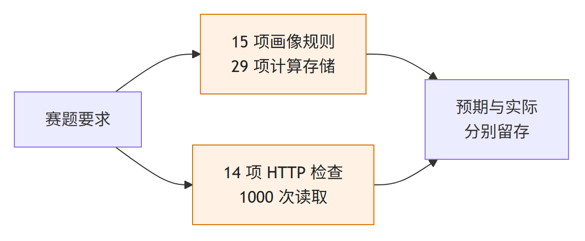
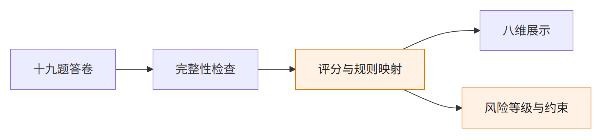
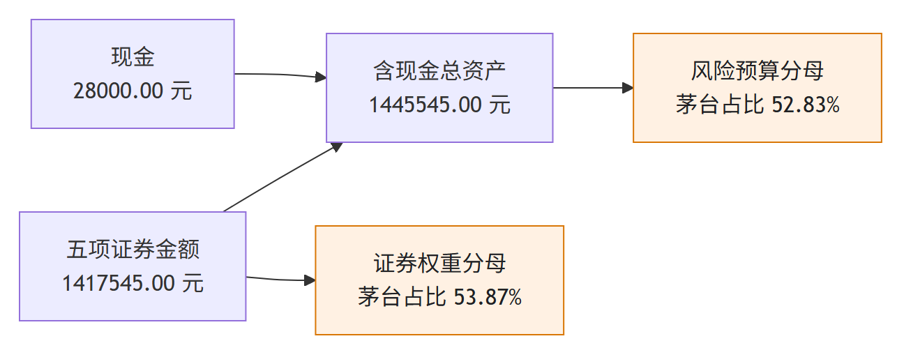
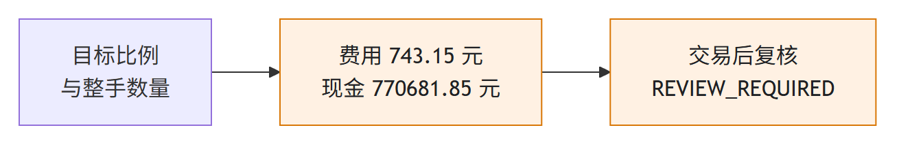
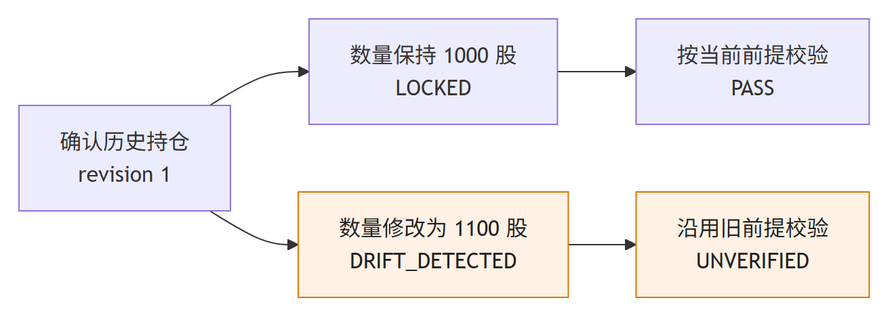
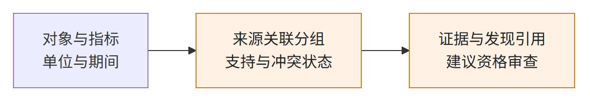
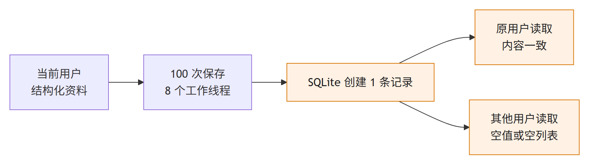
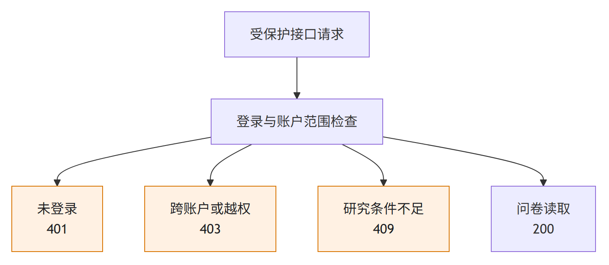

# Prism 个性化证券投顾智能体系统测试报告

赛题 A18　基于同花顺问财 SkillHub 的个性化证券投顾智能体系统设计

测试日期：2026 年 9 月 18 日

测试程序版本：d45d71fcffcfe313a71d3e006d6ccc4287c5fb0a

本报告面向竞赛评审，记录投资者画像、组合计算、交易测算、会话事实、记忆存储和本地服务的测试方法与结果。测试覆盖确定性计算、真实 SQLite 读写和 TCP HTTP 请求；涉及历史行情的案例均保留原始观察时间。

本次取得 15 项画像规则测试、29 项计算与存储检查、14 项 HTTP 功能检查的通过记录。100 并发任务下的 1,000 次问卷读取全部成功，P95 为 6.019 秒。完整投顾咨询时延、100 名不同用户同时咨询及持续可用性仍属于待验证指标。

## 第一章 测试依据与环境

### 一 测试对象与赛题要求

测试对象为 Prism 个性化证券投顾智能体系统。赛题要求通过第三方大模型与同花顺问财 SkillHub 完成投资分析，支持用户画像、多场景研究、专业智能体协作、数据溯源、多轮交互和风险提示。本报告按照需求建立检查项目，并用能够支持相应结论的证据判定状态。

| 需求类别 | 赛题要求 | 本报告检查对象 | 对应章节 |
| --- | --- | --- | --- |
| 个性化服务 | 结合问卷、自然语言与历史信息 | 评分、确认、画像约束与条件比较 | 第二章、第三章 |
| 多场景研究 | 大盘、行业、个股、基金、可转债与组合 | 场景入口、研究服务状态与计算能力 | 第二章 |
| 多智能体协作 | 任务并发、结果聚合与分歧处理 | 依赖关系、来源关联与建议资格 | 第三章 |
| 数据可靠性 | 多源信息、秒级更新、溯源与幻觉检测 | 来源、时间、金额复算与结构化断言 | 第二章、第三章 |
| 服务质量 | 至少 100 用户并发、响应不超过 3 秒、可用性至少 99.9% | 请求范围、耗时分布与观测条件 | 第四章 |
| 安全与交互 | 风险提示、上下文记忆与可解释展示 | 账户隔离、状态提示与版本控制 | 第五章 |

测试通过依据为事先明确的预期与程序输出一致。业务输出为 REVIEW_REQUIRED 或 HTTP 409 时，若符合安全检查的预期，该检查可以通过；这不代表对应业务建议已经具备输出条件。



### 二 环境与证据分类

| 环境项目 | 记录值 | 使用范围 | 说明 |
| --- | --- | --- | --- |
| 操作系统 | Windows 11 10.0.26200 | 本地计算与 HTTP 服务 | 单台开发设备 |
| Python | 3.12.14 | 项目运行环境 | 使用仓库现有虚拟环境 |
| FastAPI / Pydantic | 0.141.1 / 2.13.5 | 接口与数据校验 | 由运行环境读取版本 |
| pytest | 8.4.2 | 画像规则检查 | 保留 JUnit XML |
| 数据存储 | SQLite | 记忆、会话与 HTTP 账户 | 独立内存数据库或任务目录数据库 |
| HTTP 传输 | 回环地址上的真实 TCP | 已登录问卷读取与访问控制 | 单个 Uvicorn 进程，无反向代理 |

证据 E01 为本次画像规则 JUnit 记录。E02 为本次程序执行的 JSON 结果，保存测试输入对应的期望、实际值和程序版本。E03 为本次 HTTP 结果，记录请求数量、状态码和延迟。E04 为仓库页面快照，采集于 2026 年 9 月 17 日 10:08:50 UTC，其中组合报告生成于 9 月 15 日 07:42:36 UTC。E05 为当前代码和技术文档，支持实现检查。E06 为项目历史测试日志，仅用于说明已有验证和未解决事项。

E04 中的 LIVE 字段是保存时的状态标签。本次读取和复算没有重新访问行情提供方，因此不据此声明当前行情有效或接口现时可用。明确变更画像条件、数量或目标比例的测试会注明变更字段，原始文件保持不变。

本次测试没有替换外部服务响应。HTTP 账户通过真实注册接口创建；账户数据库和凭据位于任务中间目录，未使用已有用户账户。结果文件不包含密码、Cookie 或 API 密钥。

## 第二章 核心业务测试

### 一 画像评分与完整问卷

画像验证关注输入完整性、计算确定性、冲突确认与展示规则。五项基础风险评分和十九题完整问卷分别检查，避免将评分维度数量与界面展示维度数量混用。完整问卷包含六个分区、十九道题目，输出八个展示维度。

| 检查组 | 主要输入 | 预期行为 | 本次结果 |
| --- | --- | --- | --- |
| 基础评分 | 五项结构化评分参数 | 相同输入得到相同分数 | 通过 |
| 评分端点 | 全部最低值、全部最高值 | 分别得到 0.00 与 100.00 | 通过 |
| 冲突确认 | 问卷与提取结果在三项条件上不同 | 形成待确认状态，未确认不能完成画像 | 通过 |
| 数据校验 | 非法范围、无时区时间、重复字段 | 拒绝不符合约束的输入 | 通过 |
| 问卷完整性 | 缺题、重复题目、未知题号 | 拒绝不完整答卷 | 通过 |
| 展示映射 | 固定完整答卷 | C4、八维结果及配置参考一致 | 通过 |

三个测试文件合计 15 项检查通过，失败、错误和跳过数量均为零。评分中间值案例为 50.00；完整问卷展示案例包含 10% 现金、20% 债券、70% 权益的配置参考，以及 60% 至 80% 的权益参考范围。这些比例对应测试答卷的展示规则，不构成交易建议。

自然语言相关检查直接传入结构化提取结果，验证的是冲突处理和确认机制。本次未调用第三方模型执行自然语言理解，因此没有给出模型提取准确率或自由文本识别准确率。



### 二 历史持仓与金额复算

采用 E04 保存的五项证券及现金，逐项使用 Decimal 复算数量乘价格，再检查证券金额、现金与总资产。该案例沿用报告时点的价格，测试期间没有进行证券交易。

| 证券 | 数量 | 报告价格 元 | 复算市值 元 |
| --- | --- | --- | --- |
| 宁德时代 | 1,000 | 316.36 | 316,360.00 |
| 贵州茅台 | 600 | 1,272.75 | 763,650.00 |
| 中芯国际 | 2,000 | 114.86 | 229,720.00 |
| 中国平安 | 800 | 53.90 | 43,120.00 |
| 恒瑞医药 | 1,500 | 43.13 | 64,695.00 |

五项证券金额合计 1,417,545.00 元，加上现金 28,000.00 元，总资产为 1,445,545.00 元，与保存报告一致。NUM-01 同时比较全部五个市值，NUM-02 检查总金额，不以抽取单个证券代替全部持仓的金额检查。

证券持仓占比采用证券市值作为分母，风险预算中的资产占比采用含现金总资产作为分母。贵州茅台对应的两个比例分别为 53.87% 与 52.83%。NUM-03 逐项检查证券占比，NUM-04 使用展示的两位小数百分比平方求和，得到证券 HHI 3,692.96。



本次验证证明该历史案例的保存金额与程序复算一致。行情原始报价真实性、交易所时效性及其他日期数据质量，需要通过相应来源独立验证。

### 三 组合风险体检

使用当前 calculate_portfolio_health 读取保存的组合与已确认画像，在原报告时点重新计算。画像风险分数为 85.00，风险等级为 GROWTH。现金、行业占比和行业 HHI 使用含现金总资产口径。

| 检查项 | 观察结果 | 程序规则 | 判定 |
| --- | --- | --- | --- |
| 现金比例 | 1.94% | 至少 5.00% | OVERBOUND |
| 最大行业比例 | 52.83% | 成长型上限 60% | PASS |
| 科技行业比例 | 15.89% | 成长型上限 60% | PASS |
| 行业 HHI | 3,555.39 | 上限 2,500.00 | OVERBOUND |
| 组合体检状态 | 存在超限 | 存在问题需复核 | REVIEW_REQUIRED |

NUM-05 至 NUM-07 对现金比例、行业 HHI 和总状态进行精确检查，全部通过。程序保留行业标签，行业汇总结果对应五个证券行业及现金。行业 HHI 将现金作为一个分组纳入计算；该口径需要随结果说明，不能与只计算证券的 HHI 混用。

最大行业占比通过与整体体检要求复核可以同时发生。不同检查项表达不同约束，单项通过不能替代整体检查。对评审而言，这个案例体现系统能够保留局部通过和整体复核两类状态，支持逐项解释风险原因。

当前返回的六项金额贡献构成完整直接持仓计算。此案例没有基金持仓穿透，不能据此证明基金底层披露完整性。基金场景还需要核验披露日期、覆盖比例和未知资产部分。

### 四 多场景接口与业务条件

多场景能力按照已有功能入口、计算路径和真实研究服务三个方面检查。E04 记录了市场观察、画像、持仓报告等页面所需响应。本次 HTTP 测试针对正式账户再次验证研究模板接口的拒绝行为。

| 场景 | 已有证据 | 当前可支持的结论 | 验收状态 |
| --- | --- | --- | --- |
| 大盘观察 | 历史市场分析与行情响应 200 | 保存页面具有市场数据输入 | 当前在线质量待验证 |
| 行业与组合 | 保存的行业字段、本次体检结果 | 行业汇总与预算检查已执行 | 计算检查通过 |
| 个股研究 | 当前模板接口返回 409 | 正式账户明确拒绝未接入研究路径 | 完整研究未通过验收 |
| ETF 基金 | 当前模板接口返回 409 | 研究输入条件不足时不输出演示结果 | 完整研究未通过验收 |
| 可转债研究 | 当前模板接口返回 409 | 服务限制明确返回 | 完整研究未通过验收 |
| 组合优化 | 本次目标权重到数量计算 | 费用、数量与交易后状态可复核 | 局部计算检查通过 |

六个模板入口分别为投顾查询、研究矩阵、个股、基金、可转债及情景分析。本次均返回 HTTP 409，错误代码为 LIVE_RESEARCH_NOT_AVAILABLE，响应列出真实提供方、必需字段和独立证据等缺失条件。HTTP-07 系列检查验证这些拒绝符合预期，不把拒绝计作研究能力已完成。

历史页面中的 HTTP 200 仅表明当时请求取得响应。历史响应时间、完整字段、来源独立性和新鲜度需要分别核验。报告不将接口数量或页面数量直接转换为场景完成率。

## 第三章 创新机制验证

### 一 相同持仓与不同画像条件

为了观察个性化参数的实际作用，保持五项证券、现金、价格与行业不变，只变更风险等级及风险分数。三组条件分别为 CONSERVATIVE 20 分、BALANCED 50 分和 GROWTH 85 分。其余字段沿用保存的画像，因此该实验是控制条件下的规则敏感性检查。

| 条件 | 单一资产上限 | 行业上限 | 科技比例上限 |
| --- | --- | --- | --- |
| 保守型 | 20% | 30% | 25% |
| 平衡型 | 35% | 45% | 40% |
| 成长型 | 50% | 60% | 60% |

PRO-01 核验三个单一资产上限依次为 20%、35%、50%。风险预算结果中，三组条件分别记录 3、2、1 项超限。该数量来自风险预算模块，不包含组合体检另外检查的现金下限和行业 HHI。

贵州茅台占含现金总资产 52.83%，因此在三个单一资产上限下均存在超限；保守型与平衡型还受到更低行业上限的约束。结果展示个性化条件如何改变问题清单，且保留相同的原始持仓作为比较基础。

创新价值在于画像参数进入确定性约束检查，结果具有明确阈值和超限对象。本次证据证明给定参数能够影响风险预算，不证明画像对个人未来行为或投资收益的预测能力。

### 二 目标权重与实际交易数量

再平衡实验使用同一历史组合，明确设置五项证券目标权重各 10%、现金目标 50%，最低现金 5%、换手上限 100%，并提供已确认成长型画像。测试目标用于检查数量计算与复核过程，不作为面向投资者的配置推荐。

| 执行顺序 | 证券 | 程序测算数量 | 金额 元 |
| --- | --- | --- | --- |
| 1 | 贵州茅台减持 | 500 股 | 636,375.00 |
| 2 | 宁德时代减持 | 600 股 | 189,816.00 |
| 3 | 中芯国际减持 | 800 股 | 91,888.00 |
| 4 | 中国平安买入 | 1,800 股 | 97,020.00 |
| 5 | 恒瑞医药买入 | 1,800 股 | 77,634.00 |

REB-03 比较重复执行的完整响应；REB-05 检查每项执行数量满足整手规则；REB-06 检查卖出步骤先于买入步骤。三项均通过。程序测算的目标证券市值不必等于连续目标金额，差额来自交易单位和数量规则。

本案例中，宁德时代连续目标市值为总资产的 10%，即 144,554.50 元；实际数量测算后该项市值为 126,544.00 元。连续目标市值与数量测算结果共同说明交易单位约束的影响。



### 三 费用与交易后风险复核

费用计算独立于大模型。本次直接调用 trade_fees，检查 4,000 元股票买入费用为 5.04 元、卖出费用为 7.04 元。费用采用当前程序配置，未对任何券商实际收费进行认证。

| 现金项目 | 金额 元 | 计算作用 | 证据 |
| --- | --- | --- | --- |
| 原有现金 | 28,000.00 | 初始可用资金 | E04 |
| 卖出金额 | 918,079.00 | 增加可用资金 | E02 |
| 买入金额 | 174,654.00 | 减少可用资金 | E02 |
| 总费用 | 743.15 | 减少可用资金 | E02 |
| 测算后现金 | 770,681.85 | 收支核算结果 | REB-04 |

现金恒等关系为：原有现金加卖出金额，减去买入金额与全部费用，等于测算后现金。REB-04 比较程序返回与独立复算结果，REB-07 检查现金非负，均通过。调整后资产总额为 1,444,801.85 元，与原总资产扣除 743.15 元费用一致。

交易后完整体检仍为 REVIEW_REQUIRED，行业 HHI 为 3,281.63，超过 2,500.00；现金比例为 53.34%。当前行业 HHI 把现金作为分组，较高现金权重仍会增加该指标。程序同时保留“交易后仍有资产或行业风险预算超限”的问题记录。

该实验说明数量计算完成后仍会重新检查组合条件。测试结论是计算与复核过程按预期执行，目标组合并未取得全部风险条件通过。

### 四 会话事实与修订控制

多轮咨询中，用户可能修改数量、持仓或画像。系统保存会话事实与修订号，并使用内容指纹判断当前输入是否与已确认前提一致。本次采用实际 SQLite 存储方法保存会话，使用历史组合构造完整事实对象。

| 测试动作 | 初始条件 | 实际输出 | 判定 |
| --- | --- | --- | --- |
| 未确认时查询 | 没有会话记录 | NOT_LOCKED | 通过 |
| 保存并读取前提 | 首次修订 1 | LOCKED | 通过 |
| 数量 1,000 改为 1,100 | 已确认记录保持不变 | DRIFT_DETECTED，变化字段 portfolio | 通过 |
| 校验已确认数量 | 当前修订 1，数量 1,000 | PASS | 通过 |
| 使用修订 2 校验 | 实际修订仍为 1 | UNVERIFIED | 通过 |
| 沿用旧前提校验新数量 | 当前输入已变化 | UNVERIFIED | 通过 |

SES-07 向数据库提交旧修订号，程序抛出 StoreConflictError；SES-08 改变顶层字段顺序，指纹保持一致，证明比较不依赖 JSON 字段排列。



本次执行范围包含事实状态、修订与结构化校验。流式输出期间连续检查及终止处理在当前代码中存在，本次没有启动外部模型流式会话，因此流式输出终止的端到端效果标记为待验证。

### 五 来源独立性与建议资格

当前 cross_validation 实现按 subject、metric、unit 和 period 检查观测范围，再按照 lineage_id 分组。同一关联来源的重复资料不能增加独立来源数量，同一来源出现不同数值会保留冲突。未知关联、未验证数据和范围不同的数据会形成问题记录。

| 检查环节 | 当前实现行为 | 对建议的意义 | 本次证据层级 |
| --- | --- | --- | --- |
| 范围检查 | 比较对象、指标、单位、期间 | 保持可比较条件 | 代码核验 |
| 来源分组 | 根据 lineage_id 聚合 | 重复资料不扩大来源数量 | 代码核验 |
| 冲突保留 | 同源不同值进入未解决集合 | 保留分歧，不直接覆盖 | 代码核验 |
| 资格审查 | 证据、事实、研究发现及建议引用连续检查 | 控制建议使用条件 | 技术文档及代码核验 |



该机制对应赛题的交叉验证、分歧处理和可解释要求。其创新点在于把来源质量与建议资格连接起来，使研究任务结束和建议可用分别具有判定条件。

本次未取得来自多个真实独立来源的同期间研究材料，也没有执行完整研究服务。因此本节不提供独立来源识别准确率，不声明外部研究结论已获验证。lineage_id 的正确性仍取决于接入数据中的关联信息；分组规则本身无法替代对来源身份的验证。

### 六 记忆保存与账户隔离

长期记忆使用已确认问卷、画像和组合构建结构化记录。本次直接调用 SQLiteDecisionEventStore，使用同一条历史资料记录进行重复保存和用户隔离检查。

| 检查项目 | 执行条件 | 预期与实际 | 判定 |
| --- | --- | --- | --- |
| 重复保存 | 8 个线程、100 次保存同一记录 | 只创建 1 条新记录 | 通过 |
| 完整读取 | 读取当前用户保存记录 | 全部序列化字段相同 | 通过 |
| 跨用户读取 | 另一用户请求相同 memory_id | 返回空值 | 通过 |
| 跨用户列表 | 查询另一用户的记忆列表 | 记录数量为 0 | 通过 |

MEM-01 至 MEM-04 全部通过。重复保存采用真实数据库锁和唯一记录规则，没有替换存储接口。100 次保存由 8 个工作线程执行，不能表述为 100 个用户的并发访问。



当前语义检索路径限制用户范围并读取最近 100 条记录，模型排序仅使用候选摘要。历史记忆恢复后仍需用户确认当前条件。本次验证覆盖保存、完整读取和隔离；语义排序质量、跨会话界面恢复及确认流程的端到端效果待验证。

## 第四章 性能与稳定性

### 一 本地计算耗时

对第三章再平衡请求顺序执行 100 次，使用高精度单调计时器记录函数调用开始至返回的耗时。该调用包含确定性数量计算、费用、现金和交易后检查，不包含 HTTP、外部行情或模型生成。

| 测量项目 | 设置或结果 | 统计口径 | 适用结论 |
| --- | --- | --- | --- |
| 输入 | 同一历史五证券组合及目标条件 | 固定工作负载 | 便于重复核验 |
| 重复次数 | 100 | 顺序执行 | 观察函数耗时分布 |
| 并发数量 | 1 | 单线程调用 | 不代表并发吞吐量 |
| P95 | 3.574 毫秒 | 排序后线性插值 | 当前本地计算观测 |

执行结果的 100 条原始耗时保存在 E02。P95 按排序后位置 94.05 插值计算，单位为毫秒。参数和组合相同，仅计时值受系统调度、运行缓存和其他任务影响。

局部函数耗时能够说明该计算在本机的执行成本。完整咨询需要另外计入请求处理、数据查询、模型推理、并行任务等待、结果校验和传输时间。不得将 3.574 毫秒与赛题的完整投顾响应要求直接等同。

### 二 真实 HTTP 并发读取

本次通过 Uvicorn 启动实际 FastAPI 应用，监听本机回环地址。账户使用真实注册接口创建，客户端使用返回的登录 Cookie；每个读取请求经过实际访问控制及 SQLite 会话处理。应用启动和注册过程不计入读取负载的测量窗口。

| 指标 | 本次结果 | 口径 | 证据 |
| --- | --- | --- | --- |
| 并发任务数 | 100 | 单个登录账户 | E03 |
| 请求数量 | 1,000 | 问卷模板 GET 请求 | E03 |
| 成功与失败 | 1,000 / 0 | 成功指 HTTP 2xx | E03 |
| 测量窗口 | 22.568 秒 | 从负载开始到全部完成 | E03 |
| P50 / P95 / P99 | 1,679.267 / 6,018.757 / 9,088.207 毫秒 | 所有请求耗时分布 | E03 |

全部请求均返回 HTTP 200。负载前单独核验问卷返回 19 道题；负载循环统计状态码与耗时，没有逐条比较响应正文。因此请求成功率是 HTTP 层的观测指标。

P95 为 6.019 秒，高于三秒参考值。这是在本地读取接口上的结果，已经表明当前测试条件下存在时延问题；完整投顾咨询尚未执行，不能宣布赛题响应时间达标。该负载使用单个已登录账户，也不能替代 100 名独立用户同时咨询的验收。

历史技术文档记录过另一组持仓读取结果，请求范围、样本量与环境不同。本报告以本次 E03 作为当前并发读取证据，不将两组观测直接比较为性能提升或下降。

### 三 稳定性与可用性判定

测试服务执行结束后正常终止，线程退出检查通过。数据库会话与业务请求均使用真实程序。本次没有长时间持续观测、故障恢复演练或多进程部署测试。

| 验收目标 | 本次已取得证据 | 仍需取得的证据 | 状态 |
| --- | --- | --- | --- |
| 100 用户并发咨询 | 100 并发读取任务完成 | 不同账户、完整咨询、多场景结果质量 | 待验证 |
| 完整响应不超过 3 秒 | 本地读取 P95 为 6.019 秒 | 全请求最大值及完整咨询计时 | 未证明达标 |
| 可用性至少 99.9% | 1,000 次读取无 HTTP 错误 | 明确服务窗口、探测频率、故障与恢复记录 | 待验证 |
| 外部服务故障处理 | 正式研究接口受控拒绝 | 实际超时、限流、权限错误及恢复 | 待验证 |

赛题对单次响应提出上限要求，P95 只能描述 95% 分位，不能替代每个请求都不超过上限的判定。后续验收应同时记录最大值、超时数量、首次输出时间和完整响应时间，并明确哪项与赛题要求对应。

99.9% 可用性需要定义观测时段和不可用条件。有限请求全部成功不能直接推出长期可用性。在连续观测中，还应检查业务结果有效性；仅健康接口可访问不足以说明投顾咨询可用。

## 第五章 安全与交互

### 一 访问控制与账户范围

本次安全检查通过真实 TCP HTTP 访问本地服务，没有绕过应用认证。注册账户为任务专用普通账户，不具备管理员权限。

| 检查动作 | 预期 | 实际 | 判定 |
| --- | --- | --- | --- |
| 未登录读取问卷 | HTTP 401 | HTTP 401 | 通过 |
| 注册后读取问卷 | HTTP 200 | HTTP 200，19 道题 | 通过 |
| 发送其他账户标识 | HTTP 403 | HTTP 403 | 通过 |
| 使用其他站点来源写入 | HTTP 403 | HTTP 403 | 通过 |
| 普通账户修改服务模式 | HTTP 403 | HTTP 403 | 通过 |
| 退出后再次读取 | HTTP 401 | HTTP 401 | 通过 |

SEC-01 和 SEC-02 在程序与存储层补充检查：其他用户读取已保存会话返回空值，使用其他用户身份校验账户事实抛出 StoreOwnerError。HTTP 层和存储层的证据分别记录，避免仅依赖页面入口隐藏来推断数据隔离。



本次检查范围不包括网络渗透、跨设备会话安全、部署证书或全量依赖漏洞扫描。报告中的“安全检查通过”仅指表列操作取得预期结果。

### 二 风险提示与受控拒绝

正式研究模板接口在缺少真实研究路径时返回 UNAVAILABLE，并包含错误代码、说明和缺失字段。六个接口均未返回演示研究结果。这种行为使用户能够区分资料不足和不存在风险，也便于评委检查系统是否诚实说明运行条件。

| 输出对象 | 当前内容 | 测试或核验方式 | 使用含义 |
| --- | --- | --- | --- |
| 再平衡响应 | ADVISORY_ONLY 免责声明 | 读取本次完整输出 | 仅供方案测算 |
| 组合体检 | OVERBOUND 与 REVIEW_REQUIRED | 复算并比较状态 | 保留风险问题 |
| 研究服务限制 | LIVE_RESEARCH_NOT_AVAILABLE | 真实 HTTP 请求 | 完整研究暂不可用 |
| 会话前提变化 | UNVERIFIED | 修订与数量变更测试 | 需要重新确认 |

风险和合规模块分别承担确定性条件检查与建议文本检查。当前代码具备对应接口和判定流程；本次重点执行账户隔离、事实校验和输出条件检查，没有开展覆盖全部金融表达的合规语料评估，因此不声明法律合规认证或全部违规表达可识别。

结构化断言校验限定于指定字段及明确买入排除条件。其通过不能扩大为整段自然语言没有幻觉。自由文本是否引用真实资料，需要结合引用映射、模型输出和人工审核开展专门评估。

### 三 界面信息与解释性检查

现有技术材料展示工作台、画像、持仓、市场与交易风格页面。本次通过对应数据对象和保存响应核验展示所需内容，不将历史截图视作当前浏览器执行结果。

| 页面或对象 | 可展示的信息 | 现有证据 | 本次状态 |
| --- | --- | --- | --- |
| 画像结果 | 等级、八维评分、配置参考 | 完整问卷测试 | 数据规则通过 |
| 组合报告 | 数量、价格、市值、比例与问题 | 历史报告与当前复算 | 数值通过 |
| 调仓结果 | 数量、费用、现金及复核问题 | 当前完整响应 | 计算通过 |
| 研究限制 | 不可用原因和缺失字段 | 当前 HTTP 响应 | 接口行为通过 |
| 交互布局 | 浏览器尺寸、操作反馈和截图 | 历史展示材料 | 当前界面待验证 |

本报告配图使用测试对象与已核验结果制作流程图，图内数字与对应表格一致。配图说明机制和结果，不作为真实浏览器截图。

界面验收应在同一服务版本和同一资料时点进行，记录输入、点击顺序、页面结果及接口响应。多轮追问还应检查消息窗口、事实版本和用户确认状态。当前没有该轮完整浏览器操作记录，因此不作交互体验全面通过的判定。

## 第六章 验收结果与适用条件

### 一 验收结果

| 验证组 | 本次规模 | 结果 | 结论范围 |
| --- | --- | --- | --- |
| 画像规则 | 15 项 pytest 测试 | 全部通过 | 指定结构化输入与问卷规则 |
| 计算与存储 | 29 项脚本检查 | 全部通过 | 历史组合复算、测算与隔离 |
| HTTP 功能 | 14 项状态检查 | 全部通过 | 认证、权限与正式研究拒绝 |
| 并发读取 | 100 并发、1,000 请求 | 全部 HTTP 200，P95 6.019 秒 | 单账户问卷读取 |
| 全量回归 | 本次未执行 | 历史日志有 5 项失败 | 不能声明全量通过 |

三组功能检查共 58 项，统计单位包括 pytest 测试项和脚本断言项。它们用于检索和复核本次结果，不作为代码覆盖率、需求完成率或产品质量评分。1,000 次负载请求单独统计，不加入功能检查数量。

目前具备可复核证据的重点包括画像计算、组合金额与分母、风险参数作用、交易后复核、会话修订和账户范围。来源独立性及建议资格连接具有实现材料；外部独立来源验证与完整咨询仍需要相应运行记录。

测试报告可用于说明当前实现的工程机制、已完成验证和服务条件。系统整体尚不能依据本报告宣布满足全部赛题指标。

### 二 未通过项目与补充验收条件

| 项目 | 当前状态 | 完成验收所需材料 | 优先级 |
| --- | --- | --- | --- |
| 读取接口时延 | 本次 P95 超过三秒参考值 | 请求阶段计时、相同条件复测与最大值 | 高 |
| 真实多场景咨询 | 多个研究入口受控不可用 | 真实数据、模型响应、引用及最终结果 | 高 |
| 独立来源与幻觉检测 | 实现核验，缺少在线样本 | 来源标注、对照真值、错误类型及样本量 | 高 |
| 全量回归中的失败 | 历史日志记录 5 项失败 | 当前失败复现、修复记录与完整复测 | 高 |
| 100 独立用户咨询 | 尚未执行 | 账户规模、负载模型与业务结果检查 | 高 |
| 长期可用性 | 尚无持续观测 | 服务窗口、可用率计算和故障记录 | 高 |
| 浏览器与流式终止 | 当前端到端待验证 | 操作记录、状态变化和实际输出终止 | 中 |

读取接口时延的具体原因需要另行诊断，本报告不将其直接归因于数据库、认证或模型。全量历史失败也不根据日志摘要认定根因，保留当前版本复现要求。

再次执行测试时应记录新的程序版本与环境，保留原始结果，不通过改变判定标准消除失败。外部服务的凭据、授权及实际数据字段满足条件后，完整咨询验收需要从用户问题开始，到最终建议与风险提示返回结束，覆盖全部处理过程。

## 附录一 功能检查明细

### 一 画像规则用例

| 编号 | 检查内容 | 预期结果 | 本次结果 |
| --- | --- | --- | --- |
| P01 | 评分重复执行及序列化 | 50.00 且一致 | PASS |
| P02 | 最低与最高评分 | 0.00 与 100.00 | PASS |
| P03 | 评分不依赖自由文本及随机数 | 同输入同结果 | PASS |
| P04 | 问卷与提取信息冲突 | 产生三项待确认条件 | PASS |
| P05 | 未解决冲突 | 拒绝完成画像 | PASS |
| P06 | 显式选择冲突结果 | 保存选择及审计信息 | PASS |
| P07 | 提取结果序列化 | 保存摘要标识 | PASS |
| P08 | 非法范围与无时区时间 | 校验失败 | PASS |
| P09 | 未知字段及对象修改 | 校验失败 | PASS |
| P10 | 摘要与重复结构化值 | 校验失败 | PASS |
| P11 | 冲突状态不一致 | 校验失败 | PASS |
| P12 | 完整问卷模板 | 六分区、十九题 | PASS |
| P13 | 缺题、重复及未知题 | 校验失败 | PASS |
| P14 | 快照确定性与维度 | 相同标识、八维输出 | PASS |
| P15 | 展示规则映射 | C4 与对应配置参考 | PASS |

P01 至 P07 对应 test_profile_scoring.py；P08 至 P11 对应 test_profile_contracts.py；P12 至 P15 对应 test_full_questionnaire.py。完整函数标识、耗时及 pytest 元数据保存于 E01。

### 二 计算与存储用例

| 编号 | 检查内容 | 预期结果 | 本次结果 |
| --- | --- | --- | --- |
| NUM-01 | 五项市值 | 数量乘价格逐项一致 | PASS |
| NUM-02 | 总资产 | 1,445,545.00 元 | PASS |
| NUM-03 | 证券权重 | 五项比例一致 | PASS |
| NUM-04 | 证券 HHI | 3,692.96 | PASS |
| NUM-05 | 现金比例 | 1.94% | PASS |
| NUM-06 | 行业 HHI | 3,555.39 | PASS |
| NUM-07 | 体检状态 | REVIEW_REQUIRED | PASS |
| PRO-01 | 三种画像条件 | 上限 20%、35%、50% | PASS |
| REB-01 至 02 | 买卖费用 | 5.04 元、7.04 元 | PASS |
| REB-03 | 再平衡重复计算 | 完整响应相同 | PASS |
| REB-04 | 现金守恒 | 770,681.85 元 | PASS |
| REB-05 至 07 | 整手、顺序、非负现金 | 条件满足 | PASS |
| SES-01 至 02 | 确认前后状态 | NOT_LOCKED、LOCKED | PASS |
| SES-03 至 06 | 变化与版本校验 | 检出变化，拒绝旧前提 | PASS |
| SES-07 至 08 | 修订冲突与稳定指纹 | 异常被识别，指纹一致 | PASS |
| SEC-01 至 02 | 用户范围 | 不泄露其他用户事实 | PASS |
| MEM-01 至 04 | 重复保存与隔离 | 一条记录及用户隔离 | PASS |

此表按内容合并展示，共 29 项检查。E02 逐项保存原始编号、标题、预期与实际值。REB-03、MEM-02 保存完整序列化对象进行比较，正文只展示与结论相关的字段。

## 附录二 HTTP 检查与负载条件

### 一 接口检查明细

| 编号 | 请求对象 | 预期状态 | 实际状态 |
| --- | --- | --- | --- |
| HTTP-01 | 未登录读取问卷 | 401 | 401 |
| HTTP-02 | 注册测试账户 | 201 | 201 |
| HTTP-03 | 已登录读取问卷 | 200 | 200 |
| HTTP-04 | 指定其他账户标识 | 403 | 403 |
| HTTP-05 | 跨站来源写入 | 403 | 403 |
| HTTP-06 | 普通账户修改模式 | 403 | 403 |
| HTTP-07-1 | 投顾查询模板 | 409 | 409 |
| HTTP-07-2 | 研究矩阵模板 | 409 | 409 |
| HTTP-07-3 | 个股研究模板 | 409 | 409 |
| HTTP-07-4 | 基金研究模板 | 409 | 409 |
| HTTP-07-5 | 可转债研究模板 | 409 | 409 |
| HTTP-07-6 | 情景分析模板 | 409 | 409 |
| HTTP-08 | 退出登录 | 200 | 200 |
| HTTP-09 | 退出后读取问卷 | 401 | 401 |

并发读取路径为 /api/v1/advisor/profile/questionnaire-template。客户端连接上限与保持连接上限均为 100，请求超时为 30 秒，采用 100 个工作任务读取队列中的 1,000 个请求。服务与客户端位于同一设备。

测量区间为 2026 年 9 月 18 日 15:46:38.456735 UTC 至 15:47:01.023967 UTC。P95 使用所有请求耗时排序后的线性插值。错误数量为零；本次结果中 sla_verified 明确为 false。

## 附录三 证据文件与程序位置

### 一 证据索引

以下路径相对于项目根目录。保留报告、结果文件和源程序，可以从展示结论定位至相应执行记录。

| 证据 | 文件 | 类型 | 支持内容 |
| --- | --- | --- | --- |
| E01 | docs/submission/test-evidence/profile-rules.xml | 本次执行 | 15 项画像规则测试 |
| E02 | docs/submission/test-evidence/current-results.json | 本次执行 | 29 项检查及计算耗时 |
| E03 | docs/submission/test-evidence/http-results.json | 本次执行 | 14 项 HTTP 检查及并发结果 |
| E04 | app/api/static/pages-snapshot.json | 历史保存 | 组合、画像与页面响应 |
| E05 | docs/submission/competition-technical-solution.md | 技术材料 | 创新机制、架构与计算说明 |
| E06 | LOG.md | 历史记录 | 全量测试及工程变更记录 |

| 实现对象 | 程序位置 | 本次方法 | 关联用例 |
| --- | --- | --- | --- |
| 画像 | app/profile/scoring.py | pytest 执行 | P01 至 P11 |
| 完整问卷 | app/profile/questionnaire.py | pytest 执行 | P12 至 P15 |
| 组合体检 | app/portfolio/health.py | 历史输入复算 | NUM 系列 |
| 风险预算 | app/risk/budget.py | 三条件计算 | PRO-01 |
| 再平衡 | app/service/portfolio_rebalancing.py | 完整函数执行 | REB 系列 |
| 会话事实 | app/service/session_truth.py | 状态与断言执行 | SES、SEC 系列 |
| 记忆存储 | app/store/sqlite.py | SQLite 并发保存 | MEM 系列 |
| 来源检查 | app/research/cross_validation.py | 实现核验 | 第三章第五节 |

E02 保存原始快照文件 SHA-256，以便确认复算输入。生成 Word 的排版程序与测试采集程序分离，报告排版不修改程序执行结果。

## 附录四 复核方法与命令

### 一 重复执行条件

运行目录为项目根目录，使用已安装依赖的项目 Python。下列命令分别执行规则检查、计算与存储验证及真实 HTTP 验证。HTTP 脚本创建独立数据库、注册临时账户并启动回环服务，结束时终止服务。

```text
.venv\Scripts\python.exe -m pytest --confcutdir=tests/unit tests/unit/test_profile_scoring.py tests/unit/test_profile_contracts.py tests/unit/test_full_questionnaire.py --junitxml=docs/submission/test-evidence/profile-rules.xml

.venv\Scripts\python.exe -X utf8 -m tools.collect_system_test_evidence

.venv\Scripts\python.exe -X utf8 -m tools.collect_system_http_evidence
```

规则测试使用 confcutdir 指定范围，不加载仓库根测试配置中的运行模式替换。函数检查直接调用真实计算和存储实现。HTTP 检查使用正式账户访问控制，不执行演示研究服务，不发送证券委托。

复核时应保存执行时间、Git 提交、依赖版本和原始输入文件指纹。重新运行会生成新结果文件，报告中对应数字需要按新记录同步。耗时结果允许因设备负载而变化，功能预期保持不变。

建议逐项复核第三章：固定持仓比较三个画像条件；检查五项交易数量及全部费用；修改数量并观察会话状态；使用另一个用户标识读取记忆。涉及外部研究能力时，必须增加真实提供方输出、来源关联与完整咨询记录。

## 附录五 需求验收清单

### 一 赛题要求覆盖

| 要求 | 本次证据 | 当前判定 | 完整验收所需条件 |
| --- | --- | --- | --- |
| 第三方模型分析 | 技术实现材料 | 在线效果待验证 | 真实模型输入与输出 |
| SkillHub 接入 | 接入代码与服务条件 | 完整服务待验证 | 授权、真实响应与字段映射 |
| 用户画像 | E01、PRO-01 | 规则检查通过 | 自然语言与历史数据综合评估 |
| 多场景建议 | 接口及保存材料 | 部分计算通过 | 各场景完整真实研究结果 |
| 1+N 协作 | 编排实现材料 | 当前执行待验证 | 专业任务并发与聚合记录 |
| 交叉验证与分歧 | 来源检查实现 | 在线验证待完成 | 多个独立真实来源 |
| 溯源与幻觉检测 | 事实断言执行、引用实现 | 结构化范围通过 | 自由文本真值与引用评估 |
| 秒级数据更新 | 历史时点信息 | 待验证 | 提供方观察与获取时间 |
| 100 用户咨询 | E03 局部负载 | 待验证 | 独立用户完整咨询 |
| 三秒响应 | E03 读取 P95 超出参考值 | 未证明达标 | 完整响应与最大值检查 |
| 99.9% 可用性 | 短时请求成功记录 | 待验证 | 持续服务观测 |
| 可解释展示 | 计算输出与历史页面 | 数据内容可复核 | 当前浏览器操作验证 |
| 多轮与记忆 | SES、MEM 系列 | 事实与存储通过 | 流式与跨会话操作验证 |

评审可根据需求编号查阅正文案例及结果文件，检查相应测试是否覆盖完整业务过程。
