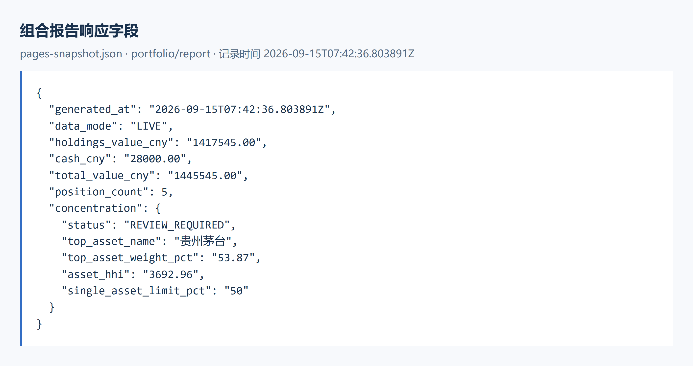
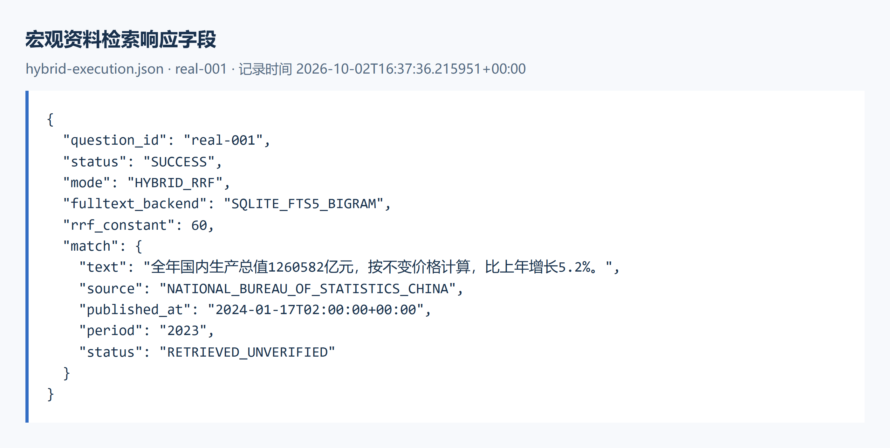
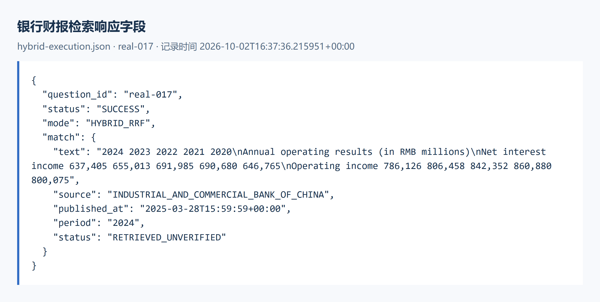

# Prism 配图介绍

## 组合报告响应字段

该图选取仓库保存的正式组合报告字段，展示报告时间、金额与集中度状态。报告生成于 2026 年 9 月 15 日，证券市值与现金共同构成总资产，集中度返回 REVIEW_REQUIRED。图片展示该时点的历史报告。

来源：pages-snapshot.json · portfolio/report；记录时间：2026-09-15T07:42:36.803891Z。

## 宏观资料检索响应字段

该图来自实际研究文档检索记录 real-001，展示关键词和语义向量合并后的宏观资料响应。图片保留 RRF、FTS5、原文、来源与 RETRIEVED_UNVERIFIED，配套 JSON 保存查询时间条件及来源地址。

来源：hybrid-execution.json · real-001；记录时间：2026-10-02T16:37:36.215951+00:00。

## 银行财报检索响应字段

该图来自实际研究文档检索记录 real-017，展示工商银行 2024 年报中的净利息收入与营业收入片段。金额单位沿用原文的 RMB millions，图片保留发布时间、期间和检索状态，配套 JSON 保存来源地址。

来源：hybrid-execution.json · real-017；记录时间：2026-10-02T16:37:36.215951+00:00。

## 第 1 页 Prism 技术与创新

演示文稿依据《技术文档－创新详解版》组织系统技术、四项创新机制和实际数据记录。图形说明模块职责、算法输入输出以及来源和版本关系，具体实现位置列入各页备注与技术对应表。

对应：第五至第七章。

## 第 2 页 系统与核心技术

开发环境与系统职责 → 六项核心技术

对应：分类 01。

## 第 3 页 系统技术架构

架构图展示同源工作台、FastAPI 应用及专业研究、证据验证、确定性计算和双闸门之间的关系。画像和持仓提供用户约束，金融 Provider 提供记录与质量状态，建议结果关联可验证回执及历史记录。

对应：5.2 前后端 AI 系统。

## 第 4 页 开发环境与前后端职责

浏览器组织输入与展示；FastAPI 校验并调用应用服务；领域模块完成研究、计算与审查。具体依赖按项目配置安装，HTTP 和 SSE 传递请求及运行事件。

对应：5.1 开发环境 / 5.2 前后端 AI 系统。

## 第 5 页 数据接入与确认输入

外部查询由 Provider 统一字段和来源状态；图片与表格经识别或导入形成待确认资料。语言模型产生意图与字段候选，用户确认后才形成计算上下文。

对应：5.2.1 前端系统 / 5.2.3 AI 服务开发系统。

## 第 6 页 画像与风险约束映射

正式问卷经确定性规则形成分数与风险等级，预算绑定用户和画像版本。持仓观察值按同一分母与预算比较，超限记录保留观察值、上限和幅度。

对应：5.3.1 投资者画像与风险约束映射。

## 第 7 页 来源关联约束的证据验证

验证按主体、指标、单位、期间与质量筛选记录，随后按 lineage_id 分组。有效独立来源参与支持与反对计数，冲突和依据不足保留为明确状态，引用继续传入研究结果。

对应：5.3.2 来源关联约束的证据验证。

## 第 8 页 持仓暴露与集中度计算

持仓市值与成分比例产生资产及行业暴露。基金未覆盖成分继续保留，报告注明分母、分组及精度。证券 HHI 与含现金行业 HHI 使用各自的计算口径。

对应：5.3.3 持仓暴露与集中度计算。

## 第 9 页 交易单位与现金约束的再平衡

目标权重转换为金额与数量，卖出受持仓约束并扣除费用，买入受现金预留和交易单位约束。程序更新现金后重新计算换手率、组合暴露与风险，输出实际测算数量。

对应：5.3.4 交易单位与现金约束下的再平衡。

## 第 10 页 专业研究依赖执行

研究计划声明依赖、必需字段和时间预算。满足依赖的节点并行运行，结果保留状态与引用；未完成条件影响整体结果和下游建议资格。专业处理入口覆盖市场、行业、证券、基金及可转债。

对应：5.3.5 专业研究协作。

## 第 11 页 风险与合规双重审查

风险与合规分别检查其职责内的输入。整体状态按 BLOCKED、REVIEW_REQUIRED、PASS 的顺序聚合，只有双方 PASS 才取得建议资格；建议组合器继续核对输入绑定和引用。

对应：5.3.6 风险与合规双重审查。

## 第 12 页 算法与创新机制

按技术文档 6.1—6.5 说明机制、算法与评价条件

对应：分类 02。

## 第 13 页 画像驱动的风险约束映射算法

创新机制把问卷字段、确定性分数、预算选择和持仓超限连接起来。维度变化影响分数，风险等级跨越分界时改变预算；上限比较、用户归属和画像版本参与同一次评估。

对应：6.1 画像驱动的风险约束映射算法。

## 第 14 页 来源关联约束的证据交叉验证算法

来源分组控制独立支持数量，同组重复记录只增加引用记录。组内冲突、口径差异或未验证输入要求复核；两个独立来源支持且无反对和待处理问题时才返回 SUPPORTED。

对应：6.2 来源关联约束的证据交叉验证算法。

## 第 15 页 交易单位与现金约束的再平衡算法

二分查找在候选交易手数范围内寻找能够覆盖成交金额和费用、同时保留最低现金的最大整数手数。每项交易更新现金，最后使用实际数量复核风险；这一计算保证单项可负担数量，整体配置仍受后续检查约束。

对应：6.3 交易单位与现金约束的再平衡算法。

## 第 16 页 依赖执行与独立双闸门的专业协作机制

任务依赖与研究状态约束后续证据使用，用户归属和输入版本约束审查对象。两个独立判定共同决定建议资格，回执保存输入、证据、规则版本与裁决关系，便于历史复核。

对应：6.4 依赖执行与独立双闸门的专业协作机制。

## 第 17 页 创新评价对象与使用条件

评价分别检查个人条件参与计算、证据满足规则、金额及比例可复算，以及建议资格符合审查结果。正式报告能够证明对应输入下的计算与状态；外部金融研究基准及完整咨询性能需要对应评价记录。

对应：6.5 创新评价与后续研究。

## 第 18 页 实际数据与验证

历史正式报告 · 实际文档检索 · 技术与工程证据

对应：分类 03。

## 第 19 页 实际组合报告字段

该图选取仓库保存的正式组合报告字段，展示报告时间、金额与集中度状态。报告生成于 2026 年 9 月 15 日，证券市值与现金共同构成总资产，集中度返回 REVIEW_REQUIRED。图片展示该时点的历史报告。

对应：7.1 正式组合报告案例。

## 第 20 页 实际宏观资料检索字段

该图来自实际研究文档检索记录 real-001，展示关键词和语义向量合并后的宏观资料响应。图片保留 RRF、FTS5、原文、来源与 RETRIEVED_UNVERIFIED，配套 JSON 保存查询时间条件及来源地址。

对应：5.3.5 专业研究协作 / 当前文档检索实现。

## 第 21 页 实际银行财报检索字段

该图来自实际研究文档检索记录 real-017，展示工商银行 2024 年报中的净利息收入与营业收入片段。金额单位沿用原文的 RMB millions，图片保留发布时间、期间和检索状态，配套 JSON 保存来源地址。

对应：5.3.5 专业研究协作 / 当前文档检索实现。

## 第 22 页 正式报告的金额与风险复算

金额与风险来自同一份历史正式报告。证券市值加现金等于总资产；最大资产按含现金总资产口径占 52.83%，超过成长型 50% 上限，现金占 1.94%，报告整体要求复核。

对应：7.1 正式组合报告案例。

## 第 23 页 专业研究的检索与计算支持

当前专业研究还使用 PDF 提取、关键词检索、语义向量和 RRF，以及时间序列计算模块。向量模型与 HMM 属于可选能力，运行依赖本地模型或相应库、输入质量和数据时间条件。

对应：5.3.5 关联支持技术 / 当前实现补充。

## 第 24 页 存储、安全与历史解释

上下文、研究记录与回执按用户归属保存。内容指纹和版本关系支持历史复核，Windows DPAPI 保护本地凭据，Markdown 经 DOMPurify 处理后展示，前端证据视图保留引用方向。

对应：5.2 前后端 AI 系统 / 7.4 用户信息与部署。

## 第 25 页 实现技术与文档对应索引

核心技术与创新机制使用同一套已核对的代码位置。完整对应表继续列出直接依赖、标准库、金融 Provider、前端工具和可选研究能力，具体条件与实际证据分别记录。

对应：5.3 核心技术 / 第六章 创新亮点。

