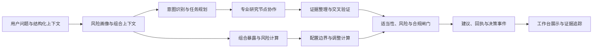
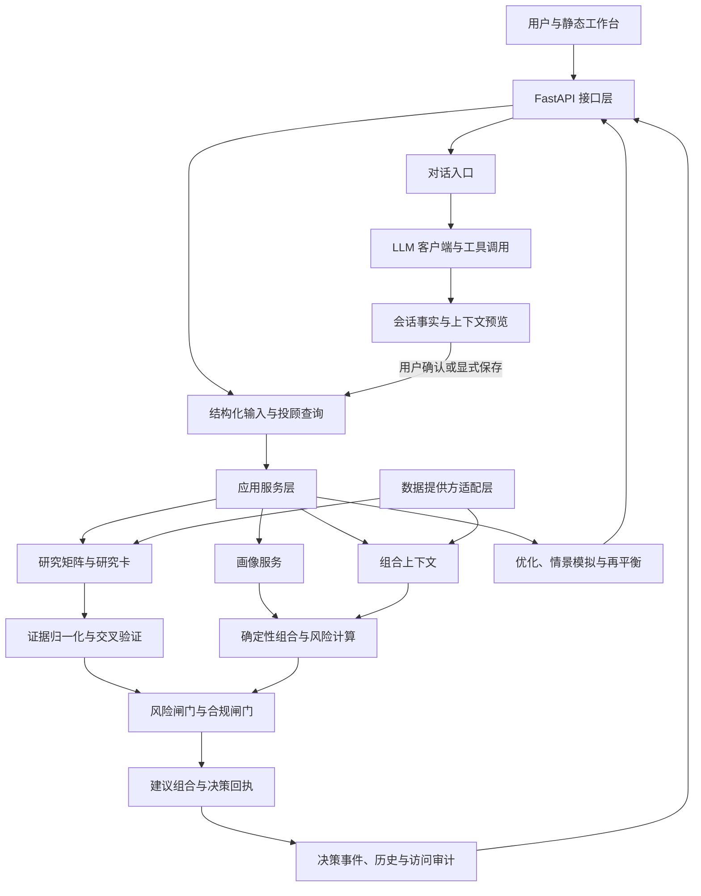
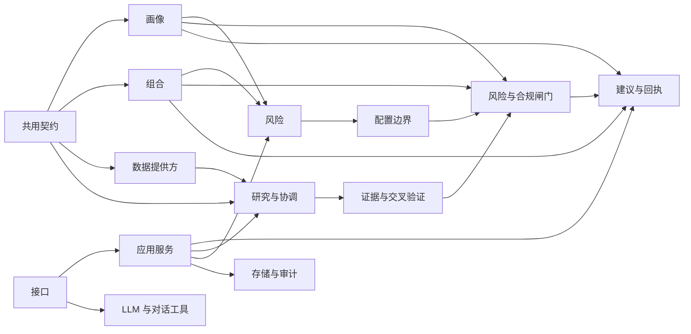
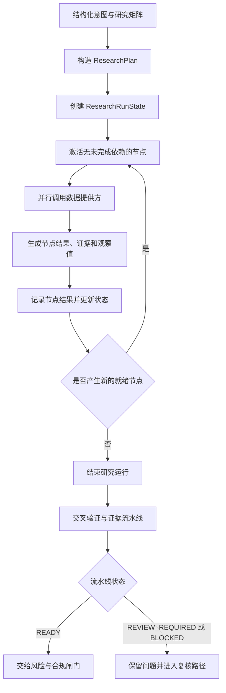
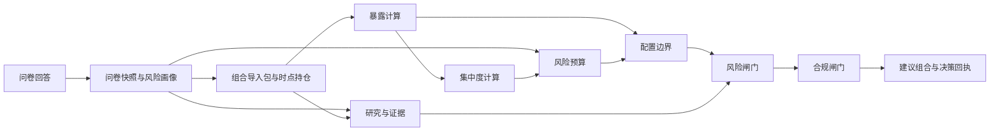
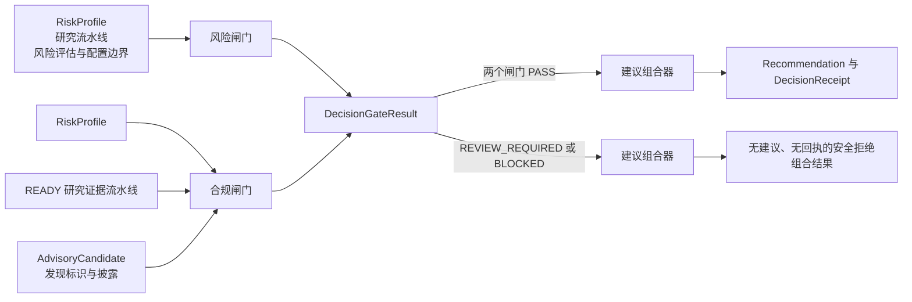

# Prism 技术设计文档

> 文档阶段：第一轮骨架与大纲
>
> 结构基线：基于 arc42 精简版，并结合 Prism 的工程实现与比赛展示要求组织。
>
> 组织主线：个性化 → 证据 → 确定性风险与决策
>
> 内容范围：系统能力、架构结构、接口契约、运行流程、确定性计算和验证证据。

## 1. 项目概述与赛题理解

> 本章依据：[项目总规范](../../Prism.md)、[项目说明](../../README.md)、[赛题说明](../../competition_brief.txt)、[实施架构](../architecture.md)和[技术实现说明](../prd-integration-guide.md)。

### 1.1 项目背景与赛题理解

Prism 面向同花顺 A18“基于同花顺问财 SkillHub 的个性化证券投顾智能体系统设计”赛题，提供面向证券研究与组合决策的个性化工作台。系统以用户风险画像、投资组合上下文和投资问题为输入，组织专业研究、证据校验、组合分析、风险合规检查和结果解释。

赛题要求系统具备以下技术能力：

* 通过问卷、自然语言交互和持仓信息形成用户画像，识别风险偏好、投资期限、收益预期等结构化信息；
* 支持大盘研判、行业配置、个股分析、ETF 与基金筛选、可转债分析、资产组合优化等研究场景；
* 通过宏观、行业、个股、基金等专业研究节点完成多任务协作、结果聚合和交叉验证；
* 接入行情、财务、新闻和研究报告等金融数据，保留数据来源与投资逻辑；
* 通过多轮对话、上下文记忆和可视化界面展示分析过程、风险提示和组合建议；
* 通过风控与合规审核流程支持稳定、可解释的投顾决策服务。

### 1.2 核心问题

证券投顾系统需要同时处理用户差异、研究场景差异、金融数据质量和组合约束。Prism 将问题拆分为以下技术问题：

| 技术问题 | 系统需要处理的对象 | Prism 的处理方向 |
| --- | --- | --- |
| 用户需求差异 | 风险承受能力、投资期限、流动性需求、收益预期、持仓结构 | 形成结构化风险画像和投资组合上下文，并将其传入后续计算链路 |
| 研究任务差异 | 大盘、行业、个股、基金、ETF、可转债等研究主题 | 通过中央协调模块和专业研究节点分解任务并聚合结果 |
| 金融数据质量 | 来源、时间、单位、报告期、数据完整性和来源一致性 | 通过数据提供方协议、证据对象、字段校验和交叉验证组织数据 |
| 组合决策计算 | 资产暴露、集中度、风险预算、配置边界和再平衡 | 由确定性计算模块完成金额、权重、风险和调整结果计算 |
| 建议可追溯性 | 研究结论、风险判断、建议动作和数据来源之间的关联 | 建立 `Recommendation → Finding → Fact → Evidence` 追踪链 |
| 风险控制 | 适当性、风险约束、合规规则和建议生成条件 | 通过独立闸门完成建议资格判定和结果审计 |

### 1.3 Prism 的解决方案

Prism 将投顾任务组织为结构化处理链路：



系统提供以下能力组合：

1. 用户通过风险测评、画像确认和组合上下文确认形成可计算的投资者上下文；
2. 中央协调模块将结构化投资意图映射为研究任务计划；研究执行器按照节点依赖调度专业研究节点并聚合结果；
3. 研究节点输出带有来源和状态的结构化研究结果，证据模块完成证据、事实与发现的校验和关联；建议模块在风险与合规闸门通过后将发现关联到建议并生成决策回执；
4. 组合分析模块计算持仓暴露、基金与 ETF 穿透、集中度、风险预算、配置边界、目标结构、情景影响和再平衡方案；
5. 风险与合规闸门检查研究结果、画像约束、组合风险和建议条件；
6. 工作台通过接口、决策回执、历史事件和证据展开呈现结果。

### 1.4 核心设计原则

| 原则 | 技术含义 |
| --- | --- |
| 证据优先 | 研究结论、事实、发现和建议均保留来源、时间、状态及关联标识，建议沿 `Recommendation → Finding → Fact → Evidence` 追踪。 |
| 确定性计算优先 | 金额、权重、组合暴露、集中度、风险预算、配置边界和调整动作由确定性程序计算；大语言模型（LLM）承担意图理解、任务协作和自然语言解释。 |
| 个性化约束驱动 | 风险画像和投资组合上下文进入风险预算、配置边界和建议组合计算；结构化投资意图决定研究任务范围，形成用户相关的结果。 |
| 结构化协作 | 中央协调模块、专业研究节点和任务有向无环图（DAG）通过明确输入、输出和状态协作，关键数据使用结构化契约传递。 |
| 独立风险与合规 | 适当性、风险和合规规则独立运行，建议资格由闸门结果决定。 |
| 状态与来源明确 | 数据状态、来源身份、观察时间、检索时间和验证结果随结果返回，支持工作台展示和后续审计。 |

### 1.5 系统目标与设计范围

本报告围绕 Prism 的实际工程结构说明以下系统能力：

| 能力范围 | 系统能力 | 主要代码与资料依据 |
| --- | --- | --- |
| 用户上下文 | 风险问卷、投资者画像、画像提案与确认、投资组合导入和上下文确认 | `app/profile/`、`app/portfolio/`、`app/api/main.py` |
| 研究协作 | 研究任务计划、研究节点矩阵、有限拓扑执行、研究场景和专业研究卡 | `app/orchestration/`、`app/research/`、`app/stock/`、`app/fund/`、`app/convertible_bond/` |
| 证据链路 | 证据、事实、发现、建议、交叉验证、决策回执和决策事件之间的关联 | `app/contracts/`、`app/gates/`、`app/recommendation/`、`app/store/` |
| 组合计算 | 组合暴露、基金与 ETF 穿透、集中度、风险预算、配置边界、组合优化、情景模拟和再平衡 | `app/portfolio/`、`app/risk/`、`app/allocation/`、`app/optimization/`、`app/scenarios/`、`app/rebalancing/` |
| 风险与合规 | 适当性检查、风险闸门、合规闸门、建议资格判定和结果审计 | `app/gates/`、`app/recommendation/`、`app/explainability/`、`app/history/` |
| 数据与接口 | 数据提供方适配、缓存与回退、数据状态、HTTP/SSE 接口和静态工作台 | `app/providers/`、`app/api/`、`app/api/static/` |
| 工程验证 | 契约校验、领域单元测试、接口集成测试、浏览器验证、确定性回放和本地负载测试 | `tests/`、`tools/`、`README.md` |
## 2. 需求与系统约束

> 本章依据：[项目总规范](../../Prism.md)、[赛题说明](../../competition_brief.txt)、[技术实现说明](../prd-integration-guide.md)、[画像与组合导入契约](../archive/profile-portfolio-contracts.md)、[数据提供方协议](../archive/provider-protocol.md)和[风险与合规闸门](../archive/risk-compliance-gates.md)。

本章将业务目标转换为系统输入、处理、输出和可验证约束。功能需求说明系统提供的处理能力，系统约束说明数据、计算、风险、接口和运行环境必须遵循的规则。

### 2.1 系统功能需求

`Advisor`、研究、组合和审查接口接收带有用户归属与版本信息的结构化上下文；对话入口接收自然语言请求，并在会话事实锁定后引用画像和持仓。各服务根据结构化投资意图组织研究、计算与审查，并返回带状态和关联标识的结果对象。

| 需求域 | 主要输入 | 核心处理 | 可验证输出 |
| --- | --- | --- | --- |
| 用户上下文 | 风险问卷、画像提案、行为事件、持仓和组合导入包 | 校验字段、计算风险画像、处理冲突、确认组合上下文 | 问卷快照、风险画像、行为画像、持仓快照和上下文记录 |
| 研究任务 | 结构化投资意图、研究场景、标的或主题 | 生成任务计划，按节点依赖执行四类研究矩阵，并通过个股、基金、可转债研究卡提供对应场景分析 | 研究计划、研究运行记录、节点状态和研究结果 |
| 证据处理 | 数据提供方结果、来源标识、观察时间和报告期 | 归一化证据，校验字段和数据状态，执行交叉验证，建立事实与发现关联 | `Evidence`、`Fact`、`Finding`、`DecisionTrace` |
| 组合分析 | 已确认风险画像、持仓快照、基金或 ETF 穿透快照 | 计算组合暴露、集中度、风险预算、配置边界和调整前后影响 | 暴露报告、风险预算评估、配置边界、情景结果和再平衡行动计划 |
| 建议与审查 | 研究发现、组合计算结果、风险结果和合规候选文本 | 执行风险闸门和合规闸门，组合建议并生成回执 | 建议对象、闸门结果、决策回执和决策事件 |
| 交互与审计 | 查询请求、会话上下文、历史事件和用户操作 | 提供 HTTP、SSE 和静态工作台接口，保存结构化上下文与决策记录 | 研究工作台、证据展开、历史查询、状态回执和访问审计 |

上述功能通过 `app/api/main.py` 暴露接口，通过 `app/service/` 连接画像、研究、组合、闸门、建议和存储模块。各接口按自身契约返回适用的 `schema_version`、归属标识、状态和关联标识，前端按对应契约渲染结果。

### 2.2 个性化投顾需求

个性化投顾的计算基础由正式风险测评、结构化画像和当前投资组合共同构成；系统另行接收用户行为证据，用于计算行为画像和画像复核结果。系统将自然语言中明确表达的投资期限、流动性、投资经验、收益预期和最大回撤容忍度提取为带原文引用的类型化候选字段；候选需与正式问卷比对并经用户确认后进入确定性计算链路。

| 个性化维度 | 结构化输入 | 影响的系统处理 | 主要结果 |
| --- | --- | --- | --- |
| 风险承受能力 | 损失承受评分、风险问卷答案、适当性等级 | 计算风险分数、风险等级和风险预算 | 风险画像、适当性结果、资产与行业约束 |
| 投资期限与收益预期 | 投资期限、收益预期和最大回撤容忍度 | 选择风险预算，计算配置边界和失效条件 | 配置区间、风险解释和重新评估条件 |
| 流动性需求 | 流动性等级、近期资金需求和现金下限 | 约束资产配置、调仓金额和交易后现金 | 流动性风险结果、调整行动和现金校验 |
| 资产偏好 | 资产类别偏好、行业偏好和排除项 | 保存结构化偏好，供上下文展示和显式买入排除校验使用；风险预算与配置边界按风险等级和组合暴露计算 | 偏好记录、超限提示和排除项校验 |
| 当前组合 | 标的、资产类型、数量、市值、币种、来源和观察时间 | 计算直接暴露、基金与 ETF 穿透、集中度和调仓影响 | 组合暴露、集中度风险、目标结构和再平衡方案 |
| 投资行为 | 已确认行为事件、历史交易特征和组合变化 | 计算行为画像、识别画像与实际行为偏差，并提供独立的画像复核结果 | 行为证据、风险提示和画像复核入口 |
| 交互偏好 | 关注场景、解释深度、追问内容和研究意图 | 生成研究任务范围，调整结果展示方式 | 研究计划、解释内容和上下文记忆 |

个性化输入遵循以下契约：

1. 正式风险问卷包含 19 道题、8 个评估维度、问卷版本和规则版本；答案经过完整性、题目顺序、选项范围和重复标识校验后生成问卷快照。
2. 风险分数和适当性等级由确定性规则计算，最大回撤容忍度作为独立约束保留。风险画像携带 `owner_id`、`profile_id`、版本、时间和偏好字段，供后续模块引用。
3. 自然语言画像提取输出类型化画像提案。提案与正式问卷出现维度冲突时生成冲突记录，用户明确选择后才能形成确认画像；画像确认结果可通过上下文记忆接口显式保存，保存内容携带画像版本和归属标识。
4. 投资组合采用归属明确的持仓快照和组合导入包。基金与 ETF 穿透数据带有父标的、成分、权重、覆盖率、来源和观察时间，组合分析基于已确认快照计算。
5. 结构化投资意图决定研究任务范围；风险画像和投资组合上下文进入风险预算、配置边界、组合分析和建议组合计算。每次建议均能回溯到所使用的画像版本和组合快照。

### 2.3 金融数据真实性要求

金融数据从提供方请求进入结果契约，再经过归一化和验证形成证据。系统同时记录数据内容、时间、来源和调用上下文，保证研究结论能够追踪到具体金融事实。

| 真实性要求 | 约束内容 | 工程落点 |
| --- | --- | --- |
| 来源可归属 | 每条记录需要来源、记录标识或血缘标识；每次调用需要请求标识和查询指纹 | `ProviderRequest`、`ProviderResult`、`ProviderRecord`、`request_fingerprint` |
| 时间与口径一致 | 时间戳字段使用带时区的时间，报告期按期间字段保留 | `as_of`、`observed_at`、`retrieved_at`、`period`、`units` |
| 必需字段可校验 | 研究任务声明 `required_fields`，提供方逐记录校验必需字段存在且值不为 `None` | 请求契约、结果契约和归一化校验 |
| 缺失语义稳定 | 缺失字段保持缺失，真实数值零与缺失状态分别编码 | `missing_fields`、问题对象和证据质量状态 |
| 查询状态可区分 | 成功、部分成功、明确无数据、执行失败分别处理 | `SUCCESS`、`PARTIAL`、`EMPTY`、`FAILED` |
| 证据来源可审计 | 提供方结果保留请求指纹；归一化后的证据通过稳定 `evidence_id` 绑定提供方、来源、期间、记录身份和请求指纹的编码结果，并保留质量状态与关联标识 | `Evidence`、`Fact`、`Finding`、`DecisionTrace` |
| 敏感信息可控 | 请求参数、诊断和日志执行敏感字段检测与脱敏 | 数据提供方契约、安全问题对象和日志处理 |

数据提供方结果采用四态语义：

| 状态 | 结果内容 | 证据处理 | 后续语义 |
| --- | --- | --- | --- |
| `SUCCESS` | 至少一条完整记录，无缺失字段和问题 | 字段归一化为 `VERIFIED` 证据 | 可进入事实和发现校验 |
| `PARTIAL` | 至少一条记录，同时存在缺失字段或结构化问题 | 生成带质量说明的 `PARTIAL` 证据 | 结果可展示，完整事实链等待补充或复核 |
| `EMPTY` | 查询范围明确且记录数为零，无错误问题 | 不生成证据 | 返回明确的空结果和查询范围 |
| `FAILED` | 没有记录，包含超时、鉴权、网络或解析等问题 | 不生成证据 | 返回可重试性和安全问题信息 |

直接请求、新鲜缓存或备用提供方的结果分别归一化为 `VERIFIED` 或 `PARTIAL`；过期缓存回退归一化为 `STALE`。数据提供方四态与服务方式分开记录，服务方式不改写 `ProviderResult.status`。

证据进入研究结论前需要满足以下顺序：

1. 归一化器根据提供方、来源、记录标识（或血缘标识）、期间、字段和请求指纹生成稳定证据标识；
2. 交叉验证检查独立血缘、时间一致性、指标口径和实际结论冲突；
3. 仅由满足验证条件且引用闭合的证据形成可引用事实和发现；
4. 重要冲突、数据缺失和提供方失败保留原始状态及安全问题，进入复核或降级路径。

### 2.4 风险与合规约束

风险与合规检查位于研究和组合计算之后、建议组合之前，分别由风险闸门和合规闸门执行。两个闸门共享归属、画像、研究运行和引用标识，但各自独立计算状态。

| 约束域 | 校验对象 | 结果状态 | 系统动作 |
| --- | --- | --- | --- |
| 归属与完整性 | 用户、画像、组合、研究运行、闸门和建议候选的 `owner_id` 及关联标识 | 输入不一致或内容篡改为 `BLOCKED` | 返回安全问题，停止后续建议组合 |
| 研究证据 | 研究运行状态、证据链、事实、发现和引用闭合 | 可复核问题为 `REVIEW_REQUIRED`；未验证证据、引用断裂或研究运行阻断为 `BLOCKED` | 保留研究结果、证据质量和复核原因，停止后续建议组合 |
| 风险预算 | 暴露、集中度、风险预算评估、配置边界和超限项 | 完整风险超限可形成带处置项的通过结果；风险输入不完整为 `REVIEW_REQUIRED` | 生成风险降低方向、超限标识和配置边界 |
| 适当性 | 画像、风险等级、最大回撤容忍度、风险预算和配置边界的一致性 | 绑定不一致为 `BLOCKED`；风险输入不完整为 `REVIEW_REQUIRED` | 返回安全问题或复核原因，并停止或暂缓建议组合 |
| 合规文本 | 建议候选、所引用发现和强制披露 | 缺少披露为 `REVIEW_REQUIRED`，出现禁止表述为 `BLOCKED` | 校验必需披露码，并在通过后随建议结果附带披露；禁止表述保留为安全问题 |
| 建议资格 | 风险闸门与合规闸门的组合状态 | 只有两者均为 `PASS` 时具备建议生成资格 | `PASS` 时生成建议和决策回执；通过或拒绝结果均记录为决策事件 |

合规闸门要求建议候选包含以下机器可读披露：

* `NO_GUARANTEE`：收益和结果不作保证；
* `LOSS_RISK`：说明本金损失和波动风险；
* `EVIDENCE_SCOPE`：说明本次判断使用的证据范围；
* `INVALIDATION_CONDITIONS`：说明建议失效或需要重新评估的条件。

风险闸门和合规闸门的组合状态按 `BLOCKED`、`REVIEW_REQUIRED`、`PASS` 的顺序裁决。建议对象只能引用当前研究运行中的发现，发现必须闭合到经验证事实和证据。调仓模块提供确定性行动计划与交易后风险复核，执行边界保持为决策支持，真实交易由外部交易系统承接。

### 2.5 性能与工程约束

性能约束同时包含赛题质量目标和工程验证规则。赛题提出不少于 100 用户同时在线咨询、单次投顾响应不超过 3 秒、系统可用性达到 99.9% 以上；工程实现将这些目标拆解为可记录的并发、延迟、错误和服务状态指标。

| 约束项 | 目标或规则 | 工程实现与验证口径 |
| --- | --- | --- |
| 并发处理 | 支持不少于 100 个并发咨询用户的测试场景 | 研究节点采用有界并行；负载工具记录请求完成数、错误类别、归属隔离和存储副作用 |
| 响应时延 | 单次投顾响应目标不超过 3 秒；数据提供方请求默认超时预算为 3000 毫秒 | 异步任务、有界超时；注入 `ProviderExecutionPolicy` 时使用缓存和提供方回退；分别记录端到端时延与提供方时延 |
| 可用性 | 以 99.9% 作为系统质量目标 | 健康检查、超时、重试、缓存、备用提供方和可控降级共同提供运行状态；验证记录区分应用、存储和外部数据服务 |
| 计算精度 | 金额、权重、分数和金融指标使用十进制定点计算 | 领域计算使用 `Decimal`，组合守恒、边界、舍入和调整后复核由测试验证 |
| 契约稳定 | 公共对象按适用契约携带版本、归属和关联标识；字段保持明确、不可变和可校验 | Pydantic 契约、`schema_version`、时区校验、未知字段拒绝和引用闭包校验 |
| 运行可回放 | 相同输入、规则版本和固定生成时间产生稳定结果标识 | 语义指纹、确定性排序、幂等决策事件、内容哈希和固定时间回放 |
| 数据隔离 | 用户画像、持仓、上下文、建议和事件按用户归属隔离；含用户语义的 Provider 请求不进入公共缓存 | 归属协议标识（`X-Owner-ID`）、服务端归属校验、存储索引、访问审计和缓存策略 |
| 故障处理 | 超时、取消、鉴权失败、限流、无数据和解析错误保持不同的结构化状态 | 统一问题编码、可重试标识、安全诊断、缓存服务方式和四态结果协议 |
| 部署适配 | 应用、存储和外部提供方可以通过应用工厂和依赖注入替换 | `create_app()`、SQLite 决策事件存储、PostgreSQL 存储适配和 Provider 接口 |

性能结果需要保存测试场景、传输方式、样本数量、请求总数、分位数时延、错误类别和副作用检查；运行环境信息由执行记录另行保存。固定数据、进程内接口或合成提供方的测量结果作为对应环境的基线记录，外部数据服务的响应与可用性单独核验。

这些约束共同形成建议生成的前置条件：用户上下文可归属，金融数据状态明确，确定性计算完成，证据引用闭合，风险闸门和合规闸门通过，随后进入建议组合；通过或拒绝结果均进入决策事件记录。

## 3. 系统总体架构

> 本章依据：[实施架构](../architecture.md)、[模块化单体架构决策](../adr/0001-modular-monolith.md)、[技术实现说明](../prd-integration-guide.md)、[项目说明](../../README.md)、[`create_app()`](../../app/api/main.py)和[当前代码目录](../../app/)。

Prism 采用模块化单体结构。各领域模块在同一 Python 应用进程内通过明确的契约和服务接口协作，接口层、应用服务、确定性计算、研究证据、数据提供方和存储分别承担不同职责。主投顾纵切与研究卡、组合优化、情景模拟、再平衡、评测和可解释性服务共享领域契约，但通过各自接口独立调用。

### 3.1 总体架构视图

系统的逻辑依赖关系如下。语言交互产生结构化意图、工具结果或解释文本；经过显式提取、确认和接口契约校验的结构化输入，才进入相应应用服务。对话工具结果单独返回，不自动写入研究证据、闸门、回执或决策事件。



主投顾服务在 `app/service/advisor_query.py` 中形成一条可回放的端到端调用链：请求经过契约重校验后生成风险画像，计算持仓暴露、集中度、风险预算和配置边界，执行研究运行并构造证据流水线，再生成建议候选，执行双闸门，最后组合建议结果。`app/api/main.py` 在得到结果后构造并保存 `DecisionEvent`，由接口返回决策结果和事件状态。

### 3.2 系统分层

| 层级 | 主要目录 | 主要职责 | 对外输出或依赖 |
| --- | --- | --- | --- |
| 交互表现层 | `app/api/static/` | 提供投顾对话、画像、组合、研究、审计和工作流页面，展示状态标签、证据链和风险提示 | 调用 HTTP、SSE 接口；不直接执行金融计算 |
| 接口与协议层 | `app/api/` | 定义 FastAPI 路由、请求响应模型、归属校验、异常映射、数据模式切换和依赖注入 | 向页面和外部调用方提供按路由定义的 JSON 或 SSE 响应 |
| 语言交互层 | `app/llm/`、`app/service/natural_profile.py` | 调用兼容 OpenAI 接口的模型，完成对话、工具调用、自然语言画像槽位提取和解释生成 | 输出结构化提案、工具结果或文本；结构化对象进入确定性契约校验 |
| 应用服务层 | `app/service/` | 组合画像、持仓、研究、计算、闸门、建议和存储服务，承载各类运行请求 | 向接口层返回完整领域响应；调用下层模块 |
| 协调与证据层 | `app/orchestration/`、`app/research/` | 构造研究计划和研究运行，执行有界拓扑，管理节点状态、交叉验证和证据流水线 | 读取数据提供方结果，输出研究状态和证据；研究运行满足要求时形成事实、发现和追踪关系 |
| 确定性领域层 | `app/profile/`、`app/portfolio/`、`app/risk/`、`app/allocation/`、`app/gates/`、`app/recommendation/`；组合优化、情景模拟和再平衡服务位于 `app/service/` | 计算画像分数、组合暴露、集中度、风险预算、配置边界、优化结果、情景影响、再平衡和建议资格 | 通过领域契约返回数值、状态、风险问题、闸门结果和回执 |
| 数据提供方层 | `app/providers/` | 统一请求、结果、指纹、超时、缓存、备用提供方、回退和证据归一化协议，连接合成和外部数据源 | 向研究与行情服务提供带来源、时间和状态的结果 |
| 持久化与审计层 | `app/store/`、`app/history/` | 保存决策事件、结构化上下文、问卷快照、组合报告、行为画像、访问审计和用户偏好 | 向应用服务提供按用户归属的查询与幂等写入 |
| 契约基础层 | `app/contracts/` | 提供不可变领域模型、字段校验、版本标识、证据对象和跨模块引用规则 | 被各层复用，约束数据结构和引用闭包 |

各层的依赖方向遵循“接口调用应用服务，应用服务组合领域模块，领域模块通过数据提供方取得外部数据，应用服务或接口写入存储”。语言交互层可以生成输入提案和解释内容，但金融事实、金额、权重、风险和建议资格沿确定性领域层流转。

### 3.3 模块职责与依赖

模块之间以领域对象和应用服务作为边界。主要依赖关系如下：



| 模块 | 职责 | 主要依赖与边界 |
| --- | --- | --- |
| `app/contracts/` | 定义通用模型基类、证据、事实、发现、建议和追踪对象 | 被各领域模块引用；只负责结构和引用校验，不决定具体业务算法 |
| `app/profile/` | 提供风险问卷、确定性评分、风险画像、行为画像和展示模型 | 依赖契约；输出画像和行为结果，风险分数由规则计算 |
| `app/portfolio/` | 接收持仓快照、组合导入包、基金穿透快照，计算直接与间接暴露 | 依赖契约和持仓数据；为风险、配置、优化、模拟和再平衡提供组合输入 |
| `app/providers/` | 实现数据提供方协议、请求指纹、四态结果、缓存回退、实时数据适配和证据归一化 | 依赖契约；保留来源和状态，不执行组合或风险计算 |
| `app/research/` 与 `app/orchestration/` | 定义研究节点、研究计划、运行状态、有限拓扑、交叉验证和证据桥接 | 调用数据提供方；输出研究对象，研究流水线与建议组合保持分层 |
| `app/risk/` 与 `app/allocation/` | 计算集中度、风险预算、超限项和配置边界 | 消费画像与暴露结果；输出约束和风险结果，不直接执行交易 |
| `app/service/portfolio_optimization.py`、`app/service/scenario_simulation.py`、`app/service/portfolio_rebalancing.py` | 提供组合目标结构、情景模拟、费用与整手约束、交易后风险复核 | 消费已确认画像和组合上下文；作为独立服务返回对应结果 |
| `app/gates/` 与 `app/recommendation/` | 执行风险、合规和建议资格判断，组合建议并生成 `DecisionReceipt` | 消费已校验的研究、画像、组合和风险对象；建议引用发现和闸门结果 |
| `app/service/` | 负责投顾查询、研究卡、画像提案与确认、优化、模拟、调仓、评测、解释和历史等应用流程 | 编排领域模块，不重新实现底层金融规则 |
| `app/store/` 与 `app/history/` | 持久化决策事件、上下文、报告、审计记录和历史回执 | 由应用服务和接口调用；写入按用户归属、内容哈希和事件标识校验 |
| `app/api/` 与 `app/llm/` | 暴露接口、管理运行模式和会话交互，连接模型与结构化服务 | `app/api/` 负责边界校验和异常映射；`app/llm/` 负责语言交互，不替代领域计算 |

主投顾链路的关键依赖闭合为：`RiskProfile` 与 `PortfolioImportBundle` 产生暴露和风险预算，`READY` 研究运行在证据引用闭合后形成证据和发现，配置边界与研究结果共同进入双闸门，闸门结果进入建议组合和 `DecisionReceipt`，事件存储保存最终可回放关系。研究卡、优化、模拟和再平衡沿相同契约独立运行，其结果由各自接口返回。

### 3.4 外部系统、数据源与接口

Prism 将外部能力分为金融数据、语言模型、持久化和用户交互四类。所有需要进入研究或计算链路的数据，先经过对应的适配和契约校验。

| 外部能力或接口组 | 当前接入位置 | 主要用途 | 交互边界 |
| --- | --- | --- | --- |
| 同花顺问财 SkillHub | `WencaiSkillHubProvider`、`app/providers/iwencai_skills.json` | 提供公告、新闻、研报、行情、财务、行业、宏观、基金和可转债查询技能 | 依据版本化技能清单选择路由；配置凭据且运行模式允许时发起请求，请求携带调用标识，结果映射为四态数据提供方结果 |
| 扶摇金融数据服务 | `FuyaoFinanceProvider` | 获取 A 股行情快照和披露的基金穿透数据 | 凭据保留在服务端；响应按业务状态、时间戳和字段进行校验 |
| 东方财富行业资料 | `EastmoneyIndustryProvider` | 获取证券行业分类和标准化行业标识 | 作为行业元数据服务，结果带检索时间；行业资料时间不等于行情时间 |
| 海外行情数据服务 | `YahooFinanceProvider`、`EtNetProvider`、兼容的 `IFindQuantProvider` 注入点 | 作为可选的辅助海外指数行情和历史序列数据源 | 当前实现提供可注入接口，由接口层按标的能力选择已配置的数据提供方，并保留查询失败状态；外部服务质量按实际请求核验 |
| 合成数据与离线回放 | `FixtureFinancialProvider`、各类 `Fixture*Service` | 驱动契约测试、研究运行、固定评测和确定性回放 | 使用严格校验的本地数据；结果带离线来源标识，不与实时来源混用 |
| 兼容 OpenAI 接口的模型服务 | `app/llm/`、用户模型配置和对话路由 | 对话生成、工具调用、自然语言画像候选和解释内容 | 模型输出先进入结构化提案或工具契约；模型配置可通过注入的 `secret_store` 保护，具体安全存储由运行入口配置决定 |
| 本地与关系型存储 | `SQLiteDecisionEventStore`、`PostgresDecisionEventStore` | 保存决策事件、画像快照、组合报告、上下文记忆和访问审计 | 通过 `create_app()` 注入；事件按用户归属和内容哈希执行幂等校验；PostgreSQL 需显式提供 `database_url` 并安装对应依赖 |
| 浏览器与调用方 | `GET /`、`/api/docs`、`/api/health`、`/api/v1/*` | 提供工作台、接口文档、健康检查、研究、组合、投顾、审计和运行配置入口 | 结构化接口按自身契约返回 JSON；`/api/v1/copilot/chat` 使用 SSE 流式返回对话事件 |

接口按用途分为以下几组：

| 接口组 | 代表路径 | 处理对象 |
| --- | --- | --- |
| 身份与访问 | `/api/v1/auth/*`、`/api/v1/access-audit` | 本地账户、会话、访问审计和用户归属 |
| 画像与上下文 | `/api/v1/advisor/profile/*`、`/api/v1/advisor/profile-proposals*`、`/api/v1/advisor/context/portfolio`、`/api/v1/advisor/context/profile`、`/api/v1/advisor/context-memory*`、`/api/v1/advisor/session-truth*`、`/api/v1/advisor/profile-extractions` | 问卷、画像提案、行为画像、组合上下文、会话事实和记忆 |
| 投顾主链路 | `/api/v1/advisor/query-template`、`/api/v1/advisor/queries`、`/api/v1/decision-events` | 投顾请求、画像、组合、研究、证据、双闸门、建议和决策事件 |
| 专项分析 | `/api/v1/advisor/*-research-runs`、`/api/v1/advisor/portfolio-optimization-runs`、`/api/v1/advisor/scenario-simulation-runs`、`/api/v1/advisor/rebalancing-runs` | 研究卡、组合优化、情景模拟和再平衡 |
| 对话与实时数据 | `/api/v1/copilot/chat`、`/api/v1/copilot/live-quote`、`/api/v1/copilot/live-fund` | 流式对话、工具调用、行情和基金数据展示 |
| 市场与运行配置 | `/api/v1/market/*`、`/api/v1/market-assessments/*`、`/api/v1/runtime/*` | 市场目录、指数分析、数据模式、问财配置和数据提供方查询 |
| 历史与评测 | `/api/v1/decision-events`、`/api/v1/advisor/recommendation-history`、`/api/v1/advisor/evaluation-dashboard-*` | 决策事件、建议回溯、回执对比和评测汇总 |

使用用户归属的接口通过服务端归属依赖校验请求、上下文和结果之间的 `owner_id`；本地账户认证启用时由访问中间件建立会话和审计记录。数据提供方、模型服务和存储的故障均转换为结构化状态，沿接口返回可解释的结果。

## 4. 智能体协作与任务执行

### 4.1 中央协调模块

Prism 的任务执行由结构化意图、研究专员矩阵和有界运行器共同完成。当前任务协调职责分布在多个服务中：`intent_planning.py` 处理结构化意图计划，`advisor_query.py` 编排投顾查询，`specialist_matrix.py` 执行四轨研究矩阵并构造证据流水线。规划过程不执行数据查询，也不生成事实、发现或建议。

任务协调职责的主要实现位于 `app/service/intent_planning.py`、`app/service/advisor_query.py` 和 `app/service/specialist_matrix.py`。其中，`intent_planning.py` 将明确的投顾意图映射为只读投顾计划摘要；`advisor_query.py` 编排投顾查询；`specialist_matrix.py` 将研究矩阵转换为可执行研究计划，调用有向无环图运行器并构造研究证据流水线。

| 输入或输出 | 主要字段 | 处理职责 | 结果边界 |
| --- | --- | --- | --- |
| 投顾意图 | `intent_id`、`owner_id`、`intent_type` | 校验归属、时间、意图类型和必要上下文 | 形成可追踪的计划输入 |
| 投顾上下文 | `portfolio_bundle_id`、`position_snapshot_id`、`questionnaire_id` | 绑定组合、持仓快照和问卷结果 | 保持投资者画像与组合数据的归属一致 |
| 研究计划 | `plan_id`、四类研究角色、`node_count` | 根据现有研究矩阵确定研究范围 | 只描述任务，不携带研究结果 |
| 运行结果 | 运行状态、节点状态、证据、观察值 | 汇总提供方结果并执行状态收敛 | 交给证据流水线判断可用性 |

`AdvisorIntentRequest` 要求意图、组合、持仓和问卷均具有明确标识，且 `generated_at` 必须带时区。`build_intent_plan` 校验意图与矩阵的所有者一致，并根据已校验矩阵返回覆盖宏观、行业、个股和基金四类角色的投顾计划。返回的 `AdvisorPlanResponse` 包含稳定的计划标识、研究范围和节点数量，不包含事实数值、证据记录、风险结论或建议组合。

`build_intent_plan` 接收结构化的 `AdvisorIntentRequest` 并生成只读计划；该过程不执行数据查询，也不写入证据、风险闸门、合规闸门或决策事件。

### 4.2 专业研究节点

研究矩阵定义四类有边界的专业研究节点，每个节点对应一个数据提供方请求和一个明确的研究主张。节点由 `ResearchSpecialistNode` 表示，包含节点标识、投资者归属、研究角色、节点类型、数据操作、研究对象、必需字段、依赖节点、超时、主张标识、来源、记录和血缘标识。

| 研究角色 | 节点类型 | 允许的数据操作 | 当前研究对象示例 |
| --- | --- | --- | --- |
| 宏观研究 | `MACRO` | `MACRO_DATA` | 政策利率 |
| 行业研究 | `INDUSTRY` | `INDUSTRY_DATA` | 科技行业增长 |
| 个股研究 | `STOCK` | `COMPANY_DATA`、`MARKET_DATA` | 报告期收入、市场数据 |
| 基金研究 | `ETF_FUND` | `FUND_DATA` | 基金科技行业权重 |

节点的角色、节点类型和数据操作由契约校验相互约束。主张指标必须属于必需字段，依赖列表必须唯一且按稳定顺序排列，节点超时不能超过矩阵预算。矩阵还要求覆盖四种必要节点类型，校验节点、请求、来源、记录和血缘标识的唯一性，并拒绝依赖环。

同一 `claim_id` 可以由多个节点提供。矩阵要求同一主张至少具有两个来源和两个独立血缘，同时要求研究角色、对象、指标、单位、期间、期望值和发现元数据一致。该约束为交叉验证提供明确的来源集合，避免把重复记录当作独立来源。

研究专员节点承担数据获取和结构化观察职责。当前四轨研究矩阵覆盖宏观、行业、个股和基金四类研究角色。`SpecialistMatrixOutput` 包含矩阵、运行结果和证据流水线结果，并校验节点、研究主张及证据流水线之间的标识一致性；该输出不包含建议、交易动作或决策回执。

### 4.3 任务有向无环图（DAG）

`app/orchestration/contracts.py` 定义研究计划、节点规格、运行状态和节点运行状态；`app/orchestration/state_machine.py` 负责状态转移；`app/orchestration/executor.py` 定义节点请求，并在预算内调用数据提供方、归一化结果。计划建立时会计算稳定的拓扑顺序，拒绝重复节点、未知依赖、自依赖和循环依赖。

一次研究运行包含运行预算、截止时间和节点集合。节点初始为 `PENDING`，没有未完成依赖的节点进入 `RUNNING`。当前一轮的可运行节点通过 `asyncio.gather` 并行调用提供方；只有依赖节点全部为 `COMPLETE`，下游节点才会在下一轮进入运行状态。每个节点的请求同时受节点超时和运行剩余预算约束。



运行器按节点标识稳定排序结果，合并证据和观察值时检查全局标识唯一性。状态机负责收敛依赖关系：必需节点无法完成时，运行转为失败并关闭其余活跃节点；依赖未完成时，状态机会关闭受影响的下游节点；可选节点异常时，运行可以保留部分结果并进入部分完成状态。研究运行结束后，结果由证据流水线统一判断是否形成可用的证据闭包。

### 4.4 关键运行时流程

当前存在两条相关执行路径：结构化意图经 `build_intent_plan` 生成只读计划；研究矩阵经 `build_research_plan`、`create_research_run`、`execute_research_run` 和 `build_research_evidence_pipeline` 完成研究执行与证据校验。`execute_research_run` 接收调用方传入的 `FinancialProvider`；矩阵服务和投顾查询服务当前默认使用 `FixtureFinancialProvider`，矩阵服务还支持注入 `ProviderExecutionPolicy`。

| 阶段 | 主要实现 | 关键处理 | 可观察结果 |
| --- | --- | --- | --- |
| 请求校验 | `AdvisorIntentRequest`、`ResearchSpecialistMatrixRequest` | 校验归属、时区、场景和敏感字段 | 结构化请求或安全拒绝 |
| 意图计划 | `build_intent_plan` | 将结构化意图映射到四类研究角色，绑定所有者和研究矩阵 | 计划标识、研究范围和节点数量 |
| 研究计划 | `build_research_plan` | 规范化节点顺序，校验所有者、依赖关系和循环依赖 | `ResearchPlan` 及稳定拓扑顺序 |
| 运行初始化 | `create_research_run`、`start_research_run` | 建立运行预算、截止时间和节点状态 | `PENDING` 转为 `RUNNING` |
| 节点执行 | `execute_research_run` | 并行调用提供方，执行单节点及全局预算约束 | 节点结果、证据和观察值 |
| 状态收敛 | `record_node_result`、结束或取消函数 | 激活下游节点，关闭受影响节点，更新运行状态 | `COMPLETED`、`PARTIAL`、`FAILED` 或 `CANCELLED` |
| 证据处理 | `build_research_evidence_pipeline` | 交叉验证主张，建立证据、事实和发现关系 | `READY`、`REVIEW_REQUIRED` 或 `BLOCKED` |

在单个节点内，提供方结果先通过统一归一化逻辑转换为节点结果、证据和研究观察值。成功结果可以参与主张验证；部分结果保留可见记录和缺失字段；空结果保留查询范围和空状态；失败结果保留安全问题类别。原始提供方响应、异常文本、认证信息和密钥不会进入运行结果。

研究运行的 `COMPLETED` 状态只描述节点状态机已经完成；证据流水线还要检查每个主张的证据数量、独立血缘、元数据一致性和桥接结果。只有运行完整、所有主张通过交叉验证且每个桥接结果均为 `READY` 时，流水线才会形成包含证据、事实和发现的 `DecisionTrace`。投顾查询服务随后调用风险闸门和合规闸门，并将闸门结果传入建议组合器。

### 4.5 异常处理与可控降级

异常处理由提供方状态、节点运行状态、研究运行状态和证据流水线状态共同表达。各层保留失败原因的安全类别与可审计标识，避免把不可用数据转换为正常数值。

| 异常场景 | 节点或运行处理 | 证据流水线处理 | 用户可见结果 |
| --- | --- | --- | --- |
| 提供方超时、取消或内部失败 | 转换为安全的失败结果，节点进入 `FAILED` | 运行降级并进入复核或阻断 | 显示数据源不可用及影响范围 |
| 运行级显式取消 | 活跃节点进入 `CANCELLED`，运行进入 `CANCELLED` | 不形成就绪证据闭包 | 显示取消原因及未完成节点 |
| 提供方返回 `EMPTY` | 节点保留空结果和查询范围 | 不把空结果升级为事实，通常进入复核 | 显示范围内无记录 |
| 提供方返回 `PARTIAL` | 节点保留已有记录、缺失字段和问题 | 使相关主张降为未解决状态 | 显示可用字段与缺失项 |
| 必需节点未完成 | 运行转为 `FAILED`，关闭其余活跃节点 | 禁止形成事实和发现 | 显示研究运行失败及受影响范围 |
| 可选节点未完成 | 运行可以转为 `PARTIAL` | 运行降级，支持主张需要复核 | 显示部分完成状态 |
| 运行超过截止时间 | 未完成节点关闭，运行记录截止时间问题 | 进入 `REVIEW_REQUIRED` | 显示超时与未完成节点 |
| 来源分歧或证据不足 | 保留各来源观察值 | 进入 `REVIEW_REQUIRED` | 显示来源及复核原因 |
| 归属、标识或证据闭包无效 | 拒绝不一致输入或输出 | 进入 `BLOCKED` | 显示安全拒绝和问题类别 |

当前研究服务提供五个可回放场景：`BASELINE_READY`、`SOURCE_DISAGREEMENT`、`SOURCE_PARTIAL`、`SOURCE_EMPTY` 和 `SOURCE_FAILED`。这些场景通过夹具提供方重现来源一致、来源冲突、字段缺失、范围无结果和来源失败，并验证运行状态、证据状态、流水线状态及安全错误信息的一致性。

降级策略保持三项边界：异常节点不会被默认为成功，空结果不会被默认为零值，非就绪流水线不会生成事实、发现或建议。执行器通过调用方传入的 `FinancialProvider` 保持提供方接口边界；矩阵服务的默认路径使用 `FixtureFinancialProvider`，策略注入只改变执行策略，不改变研究节点、证据、血缘和流水线契约。

## 5. 证据架构

### 5.1 证据优先原则

Prism 将每条可行动建议组织为可复核的闭合链：

```text
Recommendation（建议）
        ↓
Finding（发现）
        ↓
Fact（事实）
        ↓
Evidence（证据）
```

证据是由数据提供方结果归一化得到的标准化观测。系统记录来源、字段、数值、单位、期间、观测时间、获取时间、质量状态和血缘标识，再允许后续模块消费。单独保存一个链接、新闻标题或自然语言结论，不足以形成可验证的金融事实。

| 环节 | 主要输入 | 确定性处理 | 形成条件 |
| --- | --- | --- | --- |
| 数据结果 | 数据提供方响应 | 校验状态、字段、时间、来源和归属 | 获得结构化结果或安全失败状态 |
| 证据 | 归一化记录 | 生成稳定标识，保留质量和血缘 | 记录可追踪的标准化观测 |
| 事实 | 已注册证据 | 校验值、期间、证据引用和事实状态 | 证据闭合且事实字段一致 |
| 发现 | 一个或多个事实 | 按明确方法计算或归纳判断 | 事实引用、严重程度、置信度和方法完整 |
| 建议 | 发现、画像和约束 | 执行闸门、配置边界和失效条件校验 | 建议资格通过并形成回执 |

证据优先原则由契约和服务共同执行。数据提供方负责结果状态与字段完整性，研究模块负责观察值和主张验证，证据桥接模块负责将通过验证的主张转换为事实和发现，风险与合规模块负责建议资格。语言模型输出不直接进入金融事实、主张验证、风险计算或建议资格判定；这些结果由确定性契约和服务生成。

### 5.2 证据、事实、发现与建议

共享对象定义在 `app/contracts/evidence.py`，研究流水线和建议组合服务通过这些对象传递结果。这些契约继承严格的不可变模型基类并拒绝未声明字段。决策事件在存储写入和读取时重新构造并校验嵌套契约对象。

| 对象 | 核心字段 | 状态或校验规则 | 下游用途 |
| --- | --- | --- | --- |
| `Evidence`（证据） | `evidence_id`、提供方、来源、字段、值、单位、期间、获取时间、质量、血缘 | `VERIFIED` 必须有值且不带质量说明；其他质量状态必须有质量说明 | 支持研究观察和事实闭合 |
| `Fact`（事实） | `fact_id`、主体、指标、值、单位、期间、状态、`evidence_ids` | `VERIFIED` 必须有值和至少一个证据；其他状态必须为空值并说明原因 | 为发现和风险计算提供标准事实 |
| `Finding`（发现） | `finding_id`、类型、严重程度、陈述、`fact_ids`、置信度、方法 | 至少引用一个事实，引用标识不得重复 | 表达研究或风险判断 |
| `Recommendation`（建议） | 动作、标的、配置区间、理由、`finding_ids`、合规状态、失效条件 | 至少引用一个发现，并携带独立合规状态和失效条件 | 形成建议组合和决策回执 |
| `DecisionTrace`（决策追踪） | 证据、事实、发现、建议集合 | 校验标识唯一、引用存在、值和期间一致 | 提供完整审计和结果回放对象 |

证据质量状态包括 `VERIFIED`、`STALE`、`PARTIAL`、`CONFLICTING` 和 `INVALID`。`STALE` 表示数据仍可读取但超过新鲜度窗口；`PARTIAL` 表示字段或来源覆盖不完整；`CONFLICTING` 表示独立来源存在尚未解决的口径或数值冲突；`INVALID` 表示解析、范围、口径或完整性校验失败。质量状态之外，系统要求非 `VERIFIED` 证据携带 `quality_note`。

事实状态包括 `VERIFIED`、`UNAVAILABLE`、`INVALID` 和 `NOT_APPLICABLE`。不可用、无效和不适用事实保持空值，并通过 `reason` 说明状态原因。提供方超时、无记录或解析失败不会写入零值；真实零值必须具有相应的已验证证据。

研究证据流水线 `build_research_evidence_pipeline` 消费一次研究执行结果和一组带发现元数据的主张，并根据运行状态执行交叉验证和证据桥接。当主张集合和证据闭包校验通过时，运行状态非 `COMPLETED` 会将支持主张重标为 `UNRESOLVED`，流水线进入 `REVIEW_REQUIRED`，不生成事实和发现；若同时存在主张、输入或证据闭包错误，流水线进入 `BLOCKED`。流水线状态为 `READY` 时，为每条已支持主张建立事实、发现和闭合追踪；研究证据流水线不创建建议，建议由后续画像、组合、风险和合规处理共同形成。

`DecisionTrace` 在对象创建时校验标识唯一、引用存在，以及已验证事实与证据之间的值和期间关系。`REVIEW_REQUIRED` 建议同样不能引用非 `VERIFIED` 事实；`PASSED` 建议还不能引用非 `VERIFIED` 证据。决策事件存储在写入和读取时重新校验完整结果。

### 5.3 数据血缘、追踪与审计

数据血缘由来源标识、记录标识、请求标识、血缘标识和时间字段共同表达。提供方请求通过 `request_id` 标识，系统依据操作、主体、截止时间 `as_of`、必需字段和参数计算请求指纹；提供方结果同时保存 `request_id` 和 `request_fingerprint`。提供方记录保存来源、记录标识、字段、值、单位、期间、观测时间和血缘标识。归一化 `Evidence` 保存证据标识、提供方、来源、字段、值、单位、期间、观测时间、获取时间、质量状态和血缘标识；研究观察保存用户归属、证据标识、主体、指标、单位、期间和血缘标识。

| 追踪层级 | 关键标识 | 保存内容 | 主要校验 |
| --- | --- | --- | --- |
| 提供方请求 | `request_id` | 操作、主体、截止时间 `as_of`、必需字段、参数、超时 | 请求字段和敏感信息校验 |
| 提供方结果 | `request_id`、`request_fingerprint` | 提供方、状态、记录、缺失字段、问题、获取时间 | 请求指纹、结果状态和记录结构校验 |
| 提供方记录 | `record_id`、`lineage_id` | 来源、字段、值、单位、期间和观测时间 | 记录字段和时间校验 |
| 证据与观察 | `evidence_id`、`observation_id`、`lineage_id` | 标准化值、字段、单位、期间、质量和归属 | 标识唯一、数值可解析、来源一致 |
| 主张验证 | `claim_id`、`validation_id` | 期望值、支持证据、反对证据、独立血缘和问题 | 主体、指标、单位、期间和血缘规则 |
| 决策追踪与事件 | `fact_id`、`finding_id`、`recommendation_id`、`event_id` | 对象引用和完整结果 | `DecisionTrace` 校验引用闭合；`DecisionEvent` 校验事件归属、身份、时间和 `content_hash` |

同一上游记录产生的多条观测会共享血缘标识。交叉验证按血缘分组，并将同一血缘内的重复观测记录为重复项，只计算一次独立来源。不同血缘可以分别支持或反对同一主张；没有血缘的观测仍可展示，但不能证明独立支持。

运行结果、证据流水线和决策事件均使用稳定标识与确定性排序。研究运行合并节点结果时检查证据标识和观察标识的全局唯一性；证据流水线按主张标识稳定排序；决策事件存储在写入和读取时重新构造契约对象，核对事件标识、状态、时间、内容哈希和追踪对象。用户归属由 `owner_id` 贯穿意图、研究、观察、画像、组合、闸门和事件。

审计结果保留可供复核的安全问题码和对象标识，过滤原始异常文本、认证信息、密钥和未经归一化的提供方载荷。决策事件详情保留已归一化证据、事实、发现、建议及其状态；研究流水线保留问题码、证据标识、血缘和复核原因，供工作台展示和结果复核。

### 5.4 交叉验证

交叉验证由 `app/research/cross_validation.py` 实现。`ValidationClaim` 固定主张主体、指标、单位、期间和期望值；`validate_claim` 只比较范围匹配且质量为 `VERIFIED` 的研究观察值，并按 `lineage_id` 统计独立来源。

| 验证状态 | 形成条件 | `confidence` 语义 | 后续处理 |
| --- | --- | --- | --- |
| `SUPPORTED` | 至少两个独立血缘支持期望值，且没有反对血缘；结果若携带未关联观测或其他问题标识，证据桥接仍会阻断事实生成 | 完整支持时为 `1.00` | 可以进入证据桥接 |
| `CONTRADICTED` | 至少两个独立血缘反对期望值，且没有支持血缘；未关联观测仍保留为复核证据 | 为 `0.00` | 进入人工复核 |
| `UNRESOLVED` | 支持与反对并存，或存在口径不匹配、非验证证据、血缘冲突或部分节点 | 支持血缘占独立血缘的比例 | 进入人工复核 |
| `INSUFFICIENT` | 可用独立血缘少于两个，包含空结果、失败节点和仅有未关联血缘的情况 | 为 `0.00` | 进入人工复核 |

验证过程按以下顺序处理：先检查用户归属与主张范围，再排除主体、指标、单位或期间不一致的观察值，随后排除非 `VERIFIED` 观察值，最后按血缘分组比较数值。一个血缘内部出现多个不同数值时，该血缘进入未解决状态；支持与反对血缘同时出现时，主张进入 `UNRESOLVED`。验证结果携带支持、反对、重复血缘、未关联和未解决证据标识，便于逐项复核。

`confidence` 对清晰支持固定为 `1.00`，对清晰反对和独立来源不足固定为 `0.00`；对未解决主张按支持血缘占可计数独立血缘的比例计算。研究运行非 `COMPLETED` 时，流水线将原支持结果改为 `UNRESOLVED`，并设置 `confidence=0.50`。该指标表示确定性的一致性和覆盖率，不表示收益概率、胜率或模型预测置信度。验证方法字段明确记录按血缘分组的标量相等规则，系统不使用智能体数量或重复文章数量进行投票。

证据桥接由 `app/research/evidence_bridge.py` 实现。只有状态为 `SUPPORTED`、问题列表为空、无反对证据、无重复血缘和未解决证据、支持证据对应至少两个独立血缘的验证结果，才进入事实生成。桥接模块随后检查证据和观察值是否存在，且逐一核对归属、主体、指标、单位、期间、数值、提供方、来源、血缘、观测时间和获取时间；任一条件不满足即生成 `BLOCKED` 结果。通过后生成 `VERIFIED` 事实和发现。

### 5.5 数据冲突与缺失处理

冲突与缺失均保留为显式状态，并沿提供方、研究节点、验证结果和证据流水线逐层传递。处理过程如下：

| 问题类型 | 识别依据 | 证据处理 | 用户可见结果 |
| --- | --- | --- | --- |
| 范围不匹配 | 主体、指标、单位或期间与主张不同 | 直接验证时列入 `unresolved_evidence_ids`；显式观测范围不闭合时生成 `CLAIM_INVALID` | 保留运行结果并说明排除原因；根据调用路径进入复核或阻断 |
| 非验证质量 | 研究观察质量为 `STALE`、`PARTIAL`、`CONFLICTING` 或 `INVALID` | 不参与支持或反对计数，保留质量说明；证据与观察值质量不一致时由桥接模块阻断 | 显示质量状态和补充要求 |
| 同一血缘重复 | 多条观测共享 `lineage_id` | 标记重复血缘，只计算一个来源 | 显示来源去重依据 |
| 缺少独立血缘 | 观测没有 `lineage_id` | 允许展示，不能证明独立支持 | 显示独立来源不足 |
| 单一血缘内部冲突 | 同一血缘含有不同数值 | 标记血缘冲突，主张为 `UNRESOLVED` | 显示血缘内数值分歧 |
| 独立来源间冲突 | 支持和反对血缘同时存在 | 保留双方证据，不生成已验证事实 | 交叉验证状态为 `UNRESOLVED`，桥接和流水线状态为 `REVIEW_REQUIRED` |
| 证据记录缺失或被篡改 | 引用不存在、值不一致、来源不一致或归属不一致 | 桥接拒绝并生成安全问题 | 状态为 `BLOCKED` |
| 提供方无结果或失败 | `EMPTY`、`FAILED` 或研究运行未完整结束 | 不将空或失败转换为数值 | 显示查询范围、失败类别和影响节点 |

证据流水线对运行状态进行二次判断。即使某条主张在部分运行中暂时具有支持观察值，只要研究运行没有完整结束，且主张与证据闭包校验通过，流水线就把该支持结果降为 `UNRESOLVED`，进入 `REVIEW_REQUIRED`，并且不生成事实和发现；若同时存在主张、输入或证据闭包错误，则进入 `BLOCKED`。`READY` 要求研究运行完整、所有主张验证通过、每个桥接结果均为就绪且追踪对象闭合。

问题处理保持原始语义：空值不替换为零，缺失字段不补写推断值，来源冲突不通过文字总结消除，桥接失败不降级为建议。问题码、影响主张、证据标识和安全说明会进入流水线结果，供研究工作台、风险闸门和决策事件使用。

## 6. 用户画像与个性化机制

### 6.1 风险测评

Prism 使用版本化问卷形成投资者的基础风险输入。问卷模板由 `app/profile/questionnaire.py` 定义，包含 6 个部分和 Q1 至 Q19 共 19 道问题，题型包括单选、多选和五点评分。问卷同时记录投资经验、投资目标、决策方式、研究痛点、个性化需求和对智能辅助分析的信任与担忧。

问卷回答归一化为八个维度：`risk`、`exp`、`act`、`res`、`inf`、`ai`、`per` 和 `aid`。`QuestionnaireSnapshot` 保存回答、维度分数、适当性等级、风险分数、问卷版本、规则集版本、用户归属和确认时间，并校验回答必须覆盖全部问题且维度顺序固定。

基础风险分数由 `score_questionnaire` 确定性计算，使用五个离散维度：损失承受、投资期限、流动性需求、投资经验和收益预期。计算规则如下：

| 维度 | 权重 | 离散值处理 |
| --- | ---: | --- |
| 损失承受能力 | 30% | 五点值归一化到 0 至 1 |
| 投资期限 | 25% | 短、中、长期映射为 1、3、5 |
| 流动性需求 | 20% | 低、中、高需求映射为 5、3、1 |
| 投资经验 | 10% | 新手、中级、资深映射为 1、3、5 |
| 收益预期 | 15% | 低、中、高预期映射为 1、3、5 |

加权结果乘以 100，并以十进制定点数保留两位小数。风险等级按分数划分为 `0..33` 的保守型、`34..66` 的均衡型和 `67..100` 的成长型。最大回撤容忍度作为独立约束保留在画像中，不从风险分数反推；可选收益区间保留区间端点和顺序校验。

问卷、画像和快照分别携带问卷版本、规则集版本、画像版本和快照版本；快照校验用户归属、问卷与画像标识、时间及风险分数的一致性。问卷确认后产生不可变快照，风险画像引用该问卷标识；问卷或画像版本变化后，后续组合和风险对象按新版本重新计算。

### 6.2 投资者画像

`RiskProfile` 是确定性计算使用的投资者画像，包含风险分数、风险等级、投资期限、流动性需求、投资经验、收益预期、最大回撤容忍度、预期收益区间、资产偏好、行业偏好、排除项、置信度、问卷标识和画像版本。画像带有 `owner_id`，并由严格不可变契约约束字段和时间。

画像提案使用 `ProfileExtractionProposal` 表示。提案只接受类型化的可选维度、偏好与排除项、置信度、带时区提取时间和 64 个十六进制字符的输入摘要。`build_profile_draft` 将提案与当前问卷逐维度比较；发生差异时生成 `ProfileConflict`，草稿状态为 `REQUIRES_CONFIRMATION`。没有差异时草稿状态为 `READY`，确认流程仍重新构造并校验草稿。

`finalize_profile` 要求每个真实冲突明确选择 `USE_QUESTIONNAIRE` 或 `USE_EXTRACTION`，拒绝未知冲突标识、缺少选择和未解决选择。确认后，系统按选择生成新的 `RiskProfile`，保留冲突的问卷值、提取值、解决方式和最终值。提案不能静默覆盖问卷维度，画像服务也不会把未经确认的提案直接交给风险和组合计算。

行为画像由 `app/profile/behavior.py` 根据用户归属范围内的交易事件和持仓快照计算。服务统计 90 日交易次数、换手率、持仓集中度、行业集中度、权益资产占比、最大回撤、观察跨度和交易资产类型数量；至少有 3 条交易记录和 2 条持仓快照，且权益仓位、最大持仓和换手率可计算时，才生成行为风险分数及对应行为证据。行为风险分数由回撤、权益仓位、最大持仓和换手率四部分组成；行为风险分数可用时，与问卷风险分数取较低值形成有效风险分数，行为数据不足或核心指标缺失时沿用问卷风险分数。

行为画像还生成八维行为维度、行为类型、标签、证据状态、置信度和展示策略。数据不足时保留 `INSUFFICIENT_DATA` 状态，不生成行为风险分数和行为证据。`effective_risk_profile` 可以将有效行为风险结果转换为现有确定性闸门可消费的标准 `RiskProfile`；行为画像中的 `persona` 是画像展示字段，风险计算仍以字段、规则版本和证据状态为准。

### 6.3 投资组合上下文

组合上下文由 `PortfolioImportBundle` 表示，包含一个非空的时点持仓快照和可选的基金或 ETF 成分快照。`Position` 记录标的、类型、数量、市值、币种、行业、来源和观察时间；`PositionSnapshot` 校验用户归属、快照时间和持仓标识唯一。金额、数量和权重使用 `Decimal`，避免在导入边界引入二进制浮点误差。

基金成分由 `FundHoldingSnapshot` 和 `LookThroughHolding` 表示。成分记录父标的、底层标的、底层类型、权重、行业、来源和观察时间；覆盖率是数据源元数据，单独保存且取值在 0 至 100 之间。成分权重总和不能超过 100%，父标的必须存在于持仓快照且资产类型一致。

组合导入状态分为 `COMPLETE`、`PARTIAL`、`EMPTY` 和 `FAILED`。完整结果必须有快照且无缺失或问题；部分结果必须保留可用快照并说明缺失项或问题；空结果只说明已检查范围且没有记录；失败结果必须包含安全问题。空导入不变成零值持仓，失败导入也不转化为空结果。

组合包在创建时闭合用户与父标的关系：持仓快照、基金成分快照和所有底层记录属于同一 `owner_id`，每个成分快照的父标的存在于持仓中，且同一父标的最多对应一个成分快照。导入契约保存原始观察，不在此处计算暴露、集中度、相关性、风险预算或配置边界。

已确认的组合可以通过 `/api/v1/advisor/context/portfolio` 进入会话上下文，接口重新校验请求头归属与组合归属一致。画像可以通过 `/api/v1/advisor/context/profile` 进入会话上下文，服务端重新计算 `RiskProfile`。上下文记忆服务保存已经确认的问卷、画像、组合包和可选计划或运行标识，并使用用户归属和规范化内容哈希形成幂等的不可变记录；恢复记忆需要用户显式操作，并重新运行派生计算。

### 6.4 个性化约束生成

个性化约束由已确认的 `RiskProfile`、持仓及基金成分快照、暴露结果和集中度结果共同生成。`app/risk/budget.py` 根据画像风险等级选择版本化风险预算，`app/allocation/envelope.py` 将风险预算与组合观察转换为配置约束边界。画像中的风险等级和最大回撤容忍度会进入风险预算，画像版本和用户归属贯穿后续对象。

风险预算的固定规则如下：

| 风险等级 | 单一资产上限 | 已识别行业上限 | 科技行业合计上限 | 未分类合计上限 |
| --- | ---: | ---: | ---: | ---: |
| `CONSERVATIVE` | 20% | 30% | 25% | 10% |
| `BALANCED` | 35% | 45% | 40% | 20% |
| `GROWTH` | 50% | 60% | 60% | 35% |

画像的最大回撤容忍度作为预算中的独立字段保存。`assess_risk_budget` 对单一资产、已识别行业、科技行业合计和未分类合计逐项比较，生成观察权重、限制权重和超出部分。集中度报告不可用时，预算评估为 `BLOCKED`；存在部分数据或超限项时，评估为 `REVIEW_REQUIRED`；完整数据且没有超限项时，评估为 `PASS`。

`build_allocation_envelope` 生成资产、行业、科技行业和未分类合计四类配置边界。每个边界包含当前权重、适用上限、目标区间、最小降低幅度、超限标识和约束影响。`WITHIN_LIMIT` 表示当前权重处于限制内，目标区间等于当前权重；`OVER_LIMIT` 表示需要降低该项权重以满足上限，目标区间为零至适用上限；上游暴露或集中度部分完成时，各边界为 `UNRESOLVED`。

配置边界记录画像版本、预算标识、评估标识、暴露报告标识、集中度报告标识和失效条件。组合、基金成分、穿透覆盖率、基准币种或画像版本变化时，边界需要重新计算。边界服务输出约束和影响结果，不执行资产选择、价格确定、数量计算、资金再分配或交易。

### 6.5 画像到建议的计算链路

画像对最终建议的影响沿确定性数据链传递：



当前 `FixtureAdvisorQueryService.run` 的投顾查询顺序为：服务端重新校验请求，依据问卷生成 `RiskProfile`，计算组合暴露和集中度，评估风险预算并生成配置边界，执行研究运行和证据流水线，组装建议候选，执行风险与合规闸门，最后调用建议组合器。研究、画像、组合和风险对象之间的用户归属、画像版本、组合标识、报告标识和时间字段在服务层逐项校验。

行为画像是独立的确定性画像能力。当前 `FixtureAdvisorQueryService.run` 依据问卷生成 `RiskProfile`，不自动计算或合并行为画像；显式调用 `effective_risk_profile` 后，行为风险结果才会作为有效风险画像参与风险预算和配置边界计算。

| 画像字段或结果 | 影响的确定性对象 | 影响方式 | 结果表现 |
| --- | --- | --- | --- |
| 风险分数与风险等级 | 风险预算、配置边界、风险闸门 | 选择固定上限并参与一致性校验 | 单一资产、行业和科技行业上限随等级变化 |
| 最大回撤容忍度 | 风险预算与适当性校验 | 作为独立约束传递 | 进入风险预算和后续闸门输入 |
| 投资期限与流动性需求 | 已确认的 `RiskProfile` | 作为画像字段保存，供适当性或建议服务显式读取 | 本章的风险预算和配置边界不直接使用这两个字段 |
| 资产偏好、行业偏好和排除项 | 已确认画像和需要这些字段的后续服务 | 作为画像字段供后续服务读取 | 当前投顾查询服务不自动将这些字段注入候选约束 |
| 行为风险结果 | 有效风险画像、风险预算与配置边界 | 通过 `effective_risk_profile` 显式转换为标准 `RiskProfile` | 行为数据充分时影响风险预算与配置边界；数据不足时继续使用问卷风险分数 |
| 组合快照与基金成分 | 暴露、集中度、预算评估和配置边界 | 提供当前权重、穿透权重和覆盖率 | 形成当前组合超限项与约束影响 |

同一组合在不同风险画像下会得到不同的风险预算和配置边界；同一画像在持仓或成分快照变化后会重新得到暴露、集中度和配置结果。建议组合必须引用已验证研究发现、已计算风险对象和通过的双闸门结果，并携带配置区间与失效条件。

## 7. 确定性金融计算与组合分析

### 7.1 组合暴露

`app/portfolio/exposure.py` 的 `calculate_exposure` 接收 `PortfolioImportBundle`，按持仓快照的基准币种计算组合暴露。基金成分快照的父标的必须存在且身份一致，快照及成分观察时间不得晚于持仓快照。每条暴露贡献保留用户归属、来源持仓、基金成分、父标的和计算基础。

| 暴露基础 | 适用对象 | 计算方式 | 结果字段 |
| --- | --- | --- | --- |
| `DIRECT` | 非 ETF、非共同基金持仓 | 直接使用导入的市值 | 标的、行业、市值和组合权重 |
| `LOOK_THROUGH` | 存在有效成分快照的 ETF 或共同基金 | 父标的市值乘以成分权重 | 底层标的、父标的、成分来源和穿透权重 |
| `UNLOOKED_THROUGH` | 成分缺失、未来快照或未覆盖的父标的价值 | 保留未穿透的剩余价值 | 父标的、剩余价值和部分问题 |

对每条贡献，组合权重按以下公式计算，并以十进制定点数保留两位小数：

\[
w_i = \operatorname{round}_{0.01}\left(\frac{V_i}{V_{portfolio}} \times 100\right)
\]

所有基准币种贡献的市值必须闭合组合总市值；已归因价值、未分类价值和科技行业价值分别闭合报告字段。组合总基准币种市值为零时，暴露结果为 `FAILED`，不生成报告。非基准币种持仓记录 `NON_BASE_CURRENCY` 问题，不猜测汇率。

科技行业分类采用固定规则：行业字段去除首尾空白并转为小写后，恰好为 `technology`、`information technology` 或 `tech` 时标记为科技行业。其他行业和缺失行业保留原始分类或进入未分类集合，不调用自然语言分类器。

### 7.2 基金 / ETF 穿透

基金和 ETF 的穿透计算由 `FundHoldingSnapshot`、`LookThroughHolding` 和暴露计算服务共同完成。对父标的市值为 `V_parent`、底层成分权重为 `w_pct` 的记录，底层暴露为：

\[
V_{underlying} = V_{parent} \times \frac{w_{pct}}{100}
\]

成分快照必须与持仓快照在父标的身份上有效匹配，快照及成分观察时间不得晚于持仓快照。报告的成分权重可以小于 100%，剩余部分生成 `UNLOOKED_THROUGH` 贡献；`coverage_pct` 保存在基金成分快照中，作为来源覆盖率元数据，暴露计算不根据该字段外推或归一化已报告权重。

| 穿透情形 | 计算结果 | 暴露状态 | 后续处理 |
| --- | --- | --- | --- |
| 成分快照有效且权重完整 | 生成底层成分贡献 | `COMPLETE` 或按其他问题决定 | 进入集中度和风险预算 |
| 成分权重未覆盖父标的全部价值 | 生成已穿透贡献和剩余贡献 | `PARTIAL` | 保留剩余价值和覆盖问题 |
| 成分快照缺失或观察时间在未来 | 父标的整体保留为未穿透贡献 | `PARTIAL` | 研究和配置结果进入复核 |
| 成分快照父标的或用户归属不一致 | 组合包契约拒绝 | 输入拒绝 | 不进入数值计算 |

每条穿透贡献保存父标的、持仓标识、成分标识和基金快照标识。成分权重总和不能超过 100%，父标的必须存在于持仓快照且资产类型必须为 ETF 或共同基金。穿透计算保留成分来源和观察时间，后续模块可以沿贡献标识回到原始组合输入。

### 7.3 集中度风险

`app/risk/concentration.py` 消费暴露贡献，分别按资产标识和行业标识聚合。缺失行业以及未穿透残余贡献进入 `UNCLASSIFIED`；其他行业值按去空格和小写后的自身标识分组。任何贡献都保留在聚合中，资产分组和行业分组的市值均须闭合暴露报告总市值。

单一资产、行业和科技行业权重均按聚合市值计算。资产集中度赫芬达尔—赫希曼指数使用未舍入权重计算：

\[
HHI = \sum_{g=1}^{n}\left(\frac{V_g}{V_{portfolio}}\right)^2 \times 10000
\]

最终指数保留两位小数。最大资产和最大行业按市值降序、分组标识升序确定；报告分组本身按分组键稳定排序。每个分组保存来源暴露标识和用户归属，便于解释集中度来自哪些直接持仓或穿透成分。

暴露结果为 `PARTIAL` 时，集中度结果保留可计算报告并传播部分问题；暴露结果为 `FAILED` 或没有可用报告时，集中度结果为 `FAILED`。集中度服务负责观察和分组计算，风险预算服务负责将观察与画像上限比较。

### 7.4 风险预算

`build_risk_budget` 将确认后的 `RiskLevel` 映射为版本化固定预算；`assess_risk_budget` 将集中度观察与预算逐项比较。预算对象包含单一资产、已识别行业、科技行业、未分类合计和最大回撤容忍度字段。

| 风险等级 | 单一资产 | 已识别行业 | 科技行业 | 未分类合计 |
| --- | ---: | ---: | ---: | ---: |
| `CONSERVATIVE` | 20% | 30% | 25% | 10% |
| `BALANCED` | 35% | 45% | 40% | 20% |
| `GROWTH` | 50% | 60% | 60% | 35% |

每条超限记录包含超限类型、目标标识、观察权重、限制权重和超出部分：

\[
excess_{g} = observed_{g} - limit_{g}, \quad observed_{g} > limit_{g}
\]

评估状态为 `PASS` 时，集中度完整且没有预算超限；存在超限或部分问题时为 `REVIEW_REQUIRED`；集中度报告不可用时为 `BLOCKED`。风险预算评估输出预算超限记录和约束状态，后续配置边界、组合优化和风险闸门消费这些对象。

### 7.5 配置边界

`build_allocation_envelope` 将风险预算转换为按资产、已识别行业、科技行业合计和未分类合计组织的配置边界。每条 `AllocationBand` 包含当前权重、允许上限、目标区间、最小降低幅度、约束维度、目标标识和对应超限标识。

| 边界状态 | 形成条件 | 目标区间 | 计算含义 |
| --- | --- | --- | --- |
| `WITHIN_LIMIT` | 当前权重不超过适用上限 | 当前权重至当前权重 | 该约束项保持现状 |
| `OVER_LIMIT` | 当前权重超过适用上限 | 0 至适用上限 | 最小降低幅度为当前权重减上限 |
| `UNRESOLVED` | 暴露或集中度存在部分问题 | 保留当前权重，并按照当前值与适用上限生成待复核区间 | 等待输入补全或复核；该区间不表示统计置信区间 |

配置边界不把多个维度的影响简单相加，因为资产、行业、科技行业和未分类合计可能重叠。`ConstraintImpact` 只比较单个观察项与对应上限的差异，配置边界不选择卖出标的、成交价格、交易数量或资金去向。输入完整且风险预算通过时，配置结果为 `READY`；预算需要复核时为 `REVIEW_REQUIRED`；上游失败时为 `BLOCKED`。

### 7.6 目标结构计算与组合优化

`app/service/portfolio_optimization.py` 提供 `CAP_AND_REDISTRIBUTE_V1` 目标结构算法。服务接收结构化问卷、组合导入包和固定场景；运行时通过 `confirm_questionnaire` 生成画像，或使用已传入的确认画像，然后重新计算暴露、集中度和风险预算。目标结构使用单一资产、行业、科技行业合计和未分类合计四类预算维度，保留每个约束的当前权重、目标权重、上限、差额和约束标识。

算法先将权重换算为百分之一百分点的整数单位，100.00% 对应 10000 个单位；再按稳定标识处理最大余数分配。对超过行业、科技行业或单一资产上限的权重，算法释放可调整部分，并按剩余容量和稳定行业键分配到可容纳的资产。目标总和、单一资产上限、行业约束、聚合约束和约束引用闭包在响应契约中重新校验。

| 优化状态 | 条件 | 结果 |
| --- | --- | --- |
| `READY` | 暴露和集中度完整、行业已分类、约束可以闭合 | 返回目标权重和完整约束关系 |
| `REVIEW_REQUIRED` | 穿透覆盖不足、非基准币种、未分类或歧义行业等输入问题 | 保留问题，不返回可用目标权重 |
| `BLOCKED` | 上游失败或预算容量无法同时满足约束 | 返回阻断原因，不返回目标权重 |

该算法输出目标结构提案和约束算术，结果可以作为再平衡模块的目标输入。目标结构本身不创建建议、决策回执或交易订单；方法版本、画像版本、组合快照和来源贡献标识进入追踪对象。

### 7.7 情景模拟

Prism 提供两类确定性情景分析：组合目标结构的假设覆盖模拟，以及固定行业冲击的压力分析。

`FixtureScenarioSimulationService` 在同一画像和组合基线上，依次计算基线暴露、集中度、风险预算和目标结构，再应用不可变场景覆盖层，重新计算模拟侧结果并生成差分。场景目录包括：

| 场景 | 覆盖层 | 变化 | 差分关注点 |
| --- | --- | --- | --- |
| `BASELINE_READY` | `IDENTITY` | 无变化 | 验证基线与模拟一致、差分为零 |
| `TIGHTER_TECH_CAP` | `LIMIT_OVERRIDE` | 科技行业上限收紧 10.00 个百分点 | 观察风险预算和目标权重变化 |
| `TOP_ASSET_TRIM_10PP` | `PORTFOLIO_ALLOCATION_SHIFT` | 移出头部资产对应组合总市值的 10.00%，即减少 10.00 个百分点的组合权重，并按规则分配其余权重 | 观察最大资产权重和资产 HHI |
| `LOOKTHROUGH_PARTIAL` | `DATA_COVERAGE` | 基金或 ETF 覆盖率降至 80.00% | 观察输入质量降级和复核状态 |

可比差分包含组合总市值、科技行业权重、最大资产权重、资产 HHI、科技行业上限和目标资产权重。仅当基线侧和模拟侧的 `ScenarioSimulationStatus` 均为 `READY` 时生成指标差分和目标差分；任一侧为 `REVIEW_REQUIRED` 或 `BLOCKED` 时，两类差分均为空。情景模拟回执在 `trace` 中记录 `derived_values_are_hypothetical=true`，假设对象记录 `hypothetical=true`，并保留画像、组合、场景参数、方法版本和失效条件。

固定行业压力分析由 `app/scenarios/custom_stress.py` 实现，支持科技、工业、消费医疗、金融周期和现金五类行业权重，行业冲击范围为 -30% 至 30%。服务先按冲击计算组合收益 `r=Σw_i s_i`，再按 `w'_i=w_i(1+s_i)/(1+r)` 重新计算压力后权重；波动率使用固定年化波动率和非对角相关系数 0.30 的协方差矩阵。基准风险价值使用基准组合市值，压力风险价值使用冲击后的组合市值；二者均按相应年化波动率和 `1.644854 / √252` 计算。响应输出情景收益、情景损益、基准与压力年化波动率、单日风险价值、行业压力后权重及方法说明。情景模拟回执通过 `trace` 和假设对象保存假设语义；自定义压力分析响应通过方法说明记录计算方法，当前响应契约未提供独立的假设标识字段。

### 7.8 再平衡

`app/service/portfolio_rebalancing.py` 根据当前持仓和目标权重生成确定性再平衡行动计划。请求契约校验用户归属、持仓包、目标权重、死区、换手率上限、最低现金比例、交易价格和资产类型；目标权重总和需在 100.00% 的 0.05 个百分点容差内。

| 计算项 | 处理规则 | 输出字段 |
| --- | --- | --- |
| 权重差额 | 初始行动按 `target_weight_pct - current_weight_pct` 计算，两位小数 | 当前权重、目标权重、初始差额 |
| 目标市值 | `total_value × target_weight_pct / 100`；可识别交易标的在执行阶段按报价、交易单位和可用现金重新计算 | 目标市值、实际金额差额 |
| 死区 | 权重差绝对值不超过默认 0.50% 时保持 `HOLD` | 动作类型和原因 |
| 交易数量 | 具有六位证券代码（可带 `.SH`、`.SZ` 或 `.BJ`）的交易动作进入价格和数量计算路径；股票、ETF 启用整手时按 100 股取整，其他代码资产按 1 单位取整；无此代码的抽象资产保留金额语义，不计算股数 | 股数、报价和可执行标识 |
| 交易费用 | 股票卖出按成交金额的 0.05% 计收印花税，股票交易按 0.001% 计收过户费；买卖交易均按成交金额的 0.025% 计收佣金，单笔最低 5 元，各项费用分别按分取整 | 各项费用和总费用 |
| 流动性顺序 | 先执行卖出和减持，再执行买入和增持 | 有序执行步骤 |

服务计算买入总额、卖出总额、总换手率、净现金流、费用、交易后现金、现金缺口和换手率上限状态。换手率按以下公式计算：

\[
turnover\_pct =
\frac{total\_buy + total\_sell}{total\_portfolio\_value}
\times 50
\]

初始行动按照 `target_weight_pct - current_weight_pct` 计算；对可识别交易标的，执行阶段再根据报价、交易单位和可用现金计算实际可执行金额与数量。死区内生成 `HOLD`；缺少报价、整手取整后数量为零、资金不足、现金比例不足或换手率超限时进入 `REVIEW_REQUIRED`。交易动作引用当前组合与目标权重的确定性差异，输出标注 `ADVISORY_ONLY`，由外部交易系统承接实际执行。

### 7.9 精度、守恒、舍入和计算边界

组合计算统一使用 `Decimal`，金融金额、权重、风险指标、差额和费用均在领域服务内完成定点运算。舍入位置由各模块契约固定，禁止使用浮点数替代金额或权重计算。

| 计算模块 | 守恒或精度要求 | 舍入规则 | 失败或降级条件 |
| --- | --- | --- | --- |
| 暴露 | 贡献市值闭合总市值，归因和未分类价值闭合总值 | 组合权重两位小数 | 存在可计算的基准币种市值且含非基准币种时为 `PARTIAL`；基准币种总市值为零时为 `FAILED` |
| 集中度 | 资产和行业分组闭合暴露总值 | 权重和 HHI 两位小数，HHI 使用未舍入权重 | 上游失败传播 `FAILED`，部分输入传播 `PARTIAL` |
| 风险预算 | 观察权重与限制权重逐项比较 | `Decimal` 比较，超出部分显式保存 | 缺少报告为 `BLOCKED` |
| 目标结构 | 目标权重整数单位总和闭合 10000 | 最大余数和稳定标识处理剩余单位 | 无法容纳剩余单位为 `BLOCKED` |
| 情景差分 | 基线值、模拟值和差额一致 | 差分两位小数 | 基线侧和模拟侧的 `ScenarioSimulationStatus` 均为 `READY` 才生成差分；任一侧为 `REVIEW_REQUIRED` 或 `BLOCKED` 时两类差分均为空 |
| 再平衡 | 买卖金额、费用、净现金流和交易后现金相互闭合 | 金额和权重两位小数，数量按整手 | 缺价、现金缺口或换手率问题进入复核；死区行动保持 `HOLD` |

暴露、集中度、目标结构、情景和再平衡的金额及权重两位小数采用 `ROUND_HALF_UP`；再平衡交易数量按 `ROUND_DOWN` 取整手，带确认画像的减持路径为满足目标可使用 `ROUND_UP`。本章各报告和回执在相应追踪字段中保存可用的输入标识、计算时间、方法版本或失效条件；具体行级对象按照所属契约保存其规定的标识和来源信息。数据不完整时保留已计算数值和质量状态，结果不会用默认零值、默认权重或估算汇率填补缺失字段。

## 8. 风险控制与合规

### 8.1 适当性相关风险约束

Prism 将投资者画像、组合风险结果、研究证据和配置约束绑定后执行基于画像的确定性风险约束检查。当前实现由风险闸门执行基于画像、风险预算、研究状态和配置边界的确定性风险约束检查；该检查不代表完整的法定适当性判断、辖区监管覆盖或法律意见。风险闸门的输入包括 `RiskProfile`、`ResearchEvidencePipelineResult`、`RiskBudgetAssessment` 和 `AllocationResult`，闸门读取已经完成的确定性结果，重新构造契约对象并核对关联关系，不在闸门内重复计算暴露、集中度或配置权重。

适当性检查的闭合条件如下：

| 检查对象 | 校验内容 | 通过要求 | 失败结果 |
| --- | --- | --- | --- |
| 用户归属 | 画像、研究运行、风险评估和配置结果的 `owner_id` | 所有对象归属于同一用户 | `BLOCKED` |
| 画像一致性 | `profile_id`、`profile_version`、风险等级和最大回撤容忍度 | 风险预算与配置边界绑定当前画像 | `BLOCKED` |
| 研究证据 | 研究流水线状态、追踪对象和证据质量 | 研究状态为 `READY`，追踪中事实和证据均已验证 | 复核或阻断 |
| 风险评估引用 | 风险评估中的预算、暴露报告标识、集中度报告标识、评估时间 | 风险评估与配置边界的标识、时间和用户归属相互闭合 | `BLOCKED` |
| 配置约束 | 资产、行业、科技行业和未分类边界 | 每个边界使用当前预算限制，超出项有对应超限标识 | 复核或阻断 |

最大回撤容忍度作为画像中的独立风险约束参与预算和闸门输入。风险分数和风险等级选择固定预算上限；组合暴露与集中度通过风险评估中的报告标识及配置边界关联，评估时间和配置计算时间用于闭合；画像版本由风险预算和配置边界保存，版本变化后重新计算派生风险对象。

### 8.2 风险闸门

`evaluate_risk_gate` 在 `app/gates/risk.py` 中实现。它对画像、研究流水线、风险预算评估和配置结果执行契约重验证，再按固定规则生成 `RiskGateResult`。结果包含闸门标识、用户与画像标识、研究运行标识、风险评估标识、配置请求标识、已检查的证据与事实标识、处置元数据和安全问题码，不包含买卖动作或建议文案。

风险闸门执行以下检查：

* 研究流水线为 `READY`，追踪中存在完整的证据、事实和发现，证据质量为 `VERIFIED`，引用关系闭合，追踪对象不包含建议对象。
* 画像、研究、风险评估和配置结果使用同一用户；风险预算使用当前画像版本、风险等级和最大回撤容忍度。
* 配置边界的限制权重与风险预算逐项一致，并具备科技行业和未分类合计边界。
* 风险评估的超限标识与配置边界的超限引用完全一致；每个超限项的当前权重、限制权重和最小降低幅度保持一致。
* 风险评估状态与配置结果状态符合固定映射：`PASS` 对应 `READY`，`REVIEW_REQUIRED` 对应 `REVIEW_REQUIRED`，`BLOCKED` 对应 `BLOCKED`。

风险闸门的状态语义如下：

| 状态 | 形成条件 | 结果处理 |
| --- | --- | --- |
| `PASS` | 全部身份、证据、画像、风险预算和配置约束校验通过 | 允许进入建议组合器 |
| `REVIEW_REQUIRED` | 研究、风险预算或配置边界存在待复核的部分数据、未解决项，或风险超限尚未由无上游问题且逐项闭合的 `OVER_LIMIT` 配置边界完成补救 | 保留问题码和引用，等待人工复核 |
| `BLOCKED` | 输入契约无效、用户或画像不一致、证据未验证、追踪损坏或配置标识不一致 | 生成阻断问题，停止建议资格传递 |

完整且确定性的风险预算超限具有独立处置路径。当风险评估包含超限项、上游没有问题，且配置边界通过 `OVER_LIMIT` 区间逐项闭合全部超限时，风险闸门可返回 `PASS` 并设置 `remediation_required=true`，同时保存精确的 `remediation_breach_ids`。此状态向建议组合器传递风险降低范围；组合器将其转换为对应资产边界的 `REDUCE` 建议。聚合超限若绑定到非资产边界，组合器返回 `AGGREGATE_BREACH_UNMAPPED`；风险评估与配置边界的超限标识未闭合时，由风险闸门返回 `ALLOCATION_IDENTITY_MISMATCH`。

### 8.3 合规闸门

`evaluate_compliance_gate` 在 `app/gates/compliance.py` 中实现。它接收当前画像、研究证据流水线和 `AdvisoryCandidate`，检查用户归属、发现引用闭合和有界文本策略。候选对象的陈述、理由和失效条件只在调用边界参与检查；合规闸门结果保存安全问题码和已检查的发现标识，不回显候选原文。

合规闸门确认候选引用的每个 `Finding` 均属于当前 `READY` 研究追踪，并沿 `Finding → Fact → Evidence` 完成闭合。每个事实必须为 `VERIFIED`，每条证据必须为 `VERIFIED`。候选必须提供以下四类机器可读披露：

| 披露代码 | 含义 | 缺少时的处理 |
| --- | --- | --- |
| `NO_GUARANTEE` | 不承诺收益结果 | `REVIEW_REQUIRED` |
| `LOSS_RISK` | 说明本金损失和波动风险 | `REVIEW_REQUIRED` |
| `EVIDENCE_SCOPE` | 说明证据来源、期间和适用范围 | `REVIEW_REQUIRED` |
| `INVALIDATION_CONDITIONS` | 说明建议失效或需要重新评估的条件 | `REVIEW_REQUIRED` |

文本策略对候选标识、用户标识、发现标识、陈述、理由、失效条件以及引用发现的陈述和方法进行长度和内容检查。命中保证收益、无风险、稳赚、保本、必涨等承诺性表达，命中数字化目标收益表达，或命中代码中定义的敏感字段子串（如 `api_key`、`authorization`、`password`、`private_key`、`secret`、`token`、`credential`、`cookie`）时，状态为 `BLOCKED`。明确的否定披露不会被当作收益承诺；机器可读披露仍然必须完整。原始异常文本、秘密字段和被拒绝文案不会进入闸门结果。

合规状态采用与风险闸门相同的三态语义。研究流水线为 `REVIEW_REQUIRED` 时，合规闸门保留复核状态；研究流水线为 `BLOCKED`、发现未知、事实或证据未验证、用户归属不一致或策略命中时，合规闸门返回 `BLOCKED`。

### 8.4 建议资格判定

`evaluate_decision_gates` 聚合独立的风险闸门和合规闸门结果，按照 `BLOCKED > REVIEW_REQUIRED > PASS` 计算总状态。`eligible_for_recommendation` 仅在两个子闸门均为 `PASS` 时为真。总结果保存三个闸门标识、用户与画像标识、研究运行标识、子闸门状态、检查引用和问题码，供后续建议组合与决策回执引用。



建议组合器 `compose_recommendations` 在生成结果前重新验证所有输入，并再次执行双闸门。闸门内容过期、候选对象变化、组合报告不闭合、配置边界不一致或模型复制修改绕过契约时，组合器返回带安全问题码的 `REVIEW_REQUIRED` 或 `BLOCKED` 结果，结果中不生成建议和回执。

当前建议组合能力包含两类确定性动作：无确认超限时，对资产边界生成当前权重不变的 `HOLD`；存在已闭合的风险超限时，对绑定对应超限标识的资产边界生成区间为零至允许上限的 `REDUCE`。每条建议绑定配置边界、维度、标的、当前权重、限制权重、目标区间和超限标识，并引用研究发现、失效条件和合规状态。建议组合器支持的输出字段不包含目标价格、交易数量、预期收益、概率或现金再分配。

仅在组合器重新校验全部输入、再次确认双闸门通过并生成合法建议后，系统才构造确定性 `DecisionReceipt`。任一闭合检查失败时不生成建议和回执。回执记录画像、组合、暴露、集中度、风险评估、配置请求、研究运行、候选和三个闸门的标识，保存证据、事实、发现、建议及建议到配置边界的绑定关系，记录规则版本、带时区生成时间、决策追踪哈希和回执内容哈希。回执的 `generation_mode` 为 `DETERMINISTIC`，模型版本集合为空；其中的哈希标识用于内容追踪，不等同于数字签名或法律凭证。

### 8.5 安全与交易边界

风险与合规控制同时覆盖数据边界、输出边界和副作用边界：

| 边界 | 工程控制 | 结果 |
| --- | --- | --- |
| 用户数据 | 请求使用 `X-Owner-ID` 作为本地隔离键；服务逐项核对对象 `owner_id` | 跨用户画像、组合、研究或事件无法进入同一决策链 |
| 契约完整性 | 闸门和建议组合器从序列化内容重新构造契约对象，校验引用、状态、身份和时间 | `model_copy(update=...)` 等绕过方式进入阻断路径 |
| 结果完整性 | 闸门标识、决策追踪和回执使用确定性哈希标识和内容哈希 | 内容变化会产生新的可审计标识 |
| 敏感信息 | 闸门结果仅保留安全问题码；决策事件接口不接收原始 `Provider` 记录、凭据或自由文本建议 | 拒绝结果不包含候选原文或回执 |
| 交易副作用 | 风险闸门、合规闸门、建议组合器和回执不调用外部交易接口 | 不生成订单或交易指令；再平衡行动计划由独立服务和接口另行定义 |

`X-Owner-ID` 是当前本地对象隔离键，不承担身份认证。决策事件接口按用户和事件标识查询，并在写入和读取时重新验证决策结果、回执和追踪哈希。风险闸门、合规闸门、建议组合器和回执不调用外部交易接口，不生成订单或交易指令；再平衡行动计划由独立服务和接口另行定义。

## 9. 数据与外部能力

### 9.1 同花顺问财与 SkillHub

项目将同花顺问财技能清单随代码维护在 `app/providers/iwencai_skills.json`，并由 `WencaiSkillHubProvider` 加载。清单版本为 `prism-iwencai-skills.v1`，包含 9 个技能的名称、技能标识、版本、接口路径、操作类型和安装包摘要。适配器按 `ProviderOperation` 和查询频道选择技能，不依赖当前用户目录中的命令行工具。

| 能力 | 技能标识 | 操作类型 | 接口路径 |
| --- | --- | --- | --- |
| 公告、新闻 | `announcement-search`、`news-search` | `SEARCH_NEWS`，由 `channel` 区分 | `/v1/comprehensive/search` |
| 研报 | `report-search` | `SEARCH_REPORTS` | `/v1/comprehensive/search` |
| 行情、财务、行业、宏观 | `hithink-market-query`、`hithink-finance-query`、`hithink-industry-query`、`hithink-macro-query` | 对应结构化操作 | `/v1/query2data` |
| 基金 | `hithink-fund-query` | `FUND_DATA` | `/v1/query2data` |
| 可转债 | `hithink-cb-selector` | `CONVERTIBLE_BOND_DATA` | `/v1/query2data` |

适配器支持构造参数和服务端环境变量配置。凭据可从 `WENCAI_SKILLHUB_API_KEY` 或 `IWENCAI_API_KEY` 读取，接口地址可从对应环境变量读取，默认地址来自技能清单。真实请求使用服务端 `Bearer` 鉴权，并携带请求标识、技能标识、技能版本、插件占位信息和随机追踪标识；浏览器响应不包含凭据。

结构化查询以 `subject` 和参数构造请求体，综合搜索根据频道选择公告、新闻或研报技能。响应必须为对象且 `status_code=0`；数据字段归入 `ProviderRecord`，并保留查询内容、来源、获取时间、摘要、结果项和字段列表。适配器将响应映射为 `SUCCESS`、`PARTIAL`、`EMPTY` 或 `FAILED`：有记录且满足必需字段时为 `SUCCESS`，有记录但缺少必需字段时为 `PARTIAL`，明确无记录时为 `EMPTY`，鉴权、额度、限流、接口或解析错误时为 `FAILED`。

运行时提供 `GET /api/v1/runtime/wencai-settings`、`PUT /api/v1/runtime/wencai-settings` 和 `POST /api/v1/runtime/wencai-settings/test`。配置测试对清单中的 9 个技能执行最小请求，并将可用性与契约验证状态交给运行模式控制器。测试结果按技能保留状态、记录数、结果项数量和安全错误码。

`LIVE` 模式只有在问财凭据已配置、契约验证通过且问财能力当前可用，或扶摇对应能力已通过真实探测后才允许开启。仅配置密钥不会直接将运行模式切换为 `LIVE`；已验证的能力按能力项分别记录，单项失败不会被标记为可用。

项目同时保留 `LiveWencaiProvider` 适配器，用于兼容既有调用和无凭据场景的结构化降级返回；默认应用工厂注册的是 `WencaiSkillHubProvider`。无凭据时，官方适配器返回带 `AUTH_FAILED` 的 `FAILED` 结果，兼容适配器返回带凭据未配置说明的 `PARTIAL` 结果。两条路径都不将降级记录标记为真实远程成功，也不在提供方内部执行暴露、集中度或风险计算。

### 9.2 行情及其他数据提供方

项目将实时行情、财务资料、行业分类、海外指数和宏观因子分别封装在独立适配器中，统一保留标的身份、观察时间、来源和错误类别。

| 提供方 | 代码位置 | 数据能力 | 数据处理 |
| --- | --- | --- | --- |
| 扶摇金融数据服务 | `app/providers/fuyao.py` | A 股报价、批量报价、指数快照与日线、披露财务指标、基金穿透和行业观察 | 服务端凭据；校验业务码、标的身份、时间戳、数值和高低价关系 |
| 腾讯、新浪公开行情 | `app/providers/live_market.py` | A 股报价、指数快照和指数日线 | 解析公开响应，校验返回标的、价格、观察时间和日线边界 |
| 静态行情及基金数据 | `StaticMarketProvider` | 预置演示股票报价和基金成分 | 记录 `is_synthetic=true`，用于可重复的离线运行 |
| 东方财富行业资料 | `app/providers/industry.py` | 根据完整证券代码获取行业分类 | 校验 `SECUCODE`，转换为标准行业标识；检索时间不等于行情时间 |
| 雅虎财经 | `app/providers/yahoo_finance.py` | 海外指数日线和宏观因子序列 | 解析日线、检查标的身份与高低价关系，标记非合成数据 |
| 港股资讯网 | `app/providers/etnet.py` | 香港主要指数公开图表日线和快照 | 解析页面内嵌数据，校验指数标识、日期、日线和成交量 |
| 同花顺量化接口 | `app/providers/ifind_quant.py` | 海外指数历史和美国十年期国债、布伦特、黄金等因子 | 使用服务端刷新令牌换取访问令牌，校验时间序列标的和数值 |

`CompositeMarketProvider` 在股票报价路径中按腾讯、新浪顺序调用，单个来源时限为 1.5 秒，总时限为 2 秒；股票报价路径支持来源冷却和 `FallbackStaticProvider` 静态回退。指数快照和指数日线只尝试两个公开来源，不使用静态回退，失败时分别返回空值或空列表。

扶摇适配器将 A 股证券代码规范为 6 位代码和交易所后缀，使用服务端 `HITHINK_FINANCE_API_KEY`，对接口返回的业务错误码单独映射。东方财富行业资料在进程内缓存 1800 秒，缓存内容仅作为行业元数据。雅虎财经和港股资讯网属于公开网页接口，适配器将数据按原始来源和观察日期返回，调用方继续处理延迟、限流和页面变化。同花顺量化接口使用服务端环境变量 `IFIND_QUANT_REFRESH_TOKEN` 获取刷新令牌并换取访问令牌；美国十年期国债、布伦特和黄金因子分别使用 `IFIND_US10Y_EDB_ID`、`IFIND_BRENT_CODE` 和 `IFIND_COMEX_GOLD_CODE` 配置指标或代码，访问令牌在进程内缓存 30 分钟。

### 9.3 数据提供方协议

使用 `ProviderRequest` 和 `ProviderResult` 的结构化调用遵循 `FinancialProvider` 协议，统一通过 `execute(request: ProviderRequest) -> ProviderResult` 执行。行情、行业和因子适配器还保留专用方法接口，例如 `get_quote`、`get_index_history`、`get_industry` 和 `get_factor_history`；这些接口由调用方单独处理超时、错误和结果归一化。请求对象包含以下字段：

| 对象 | 关键字段 | 不变量 |
| --- | --- | --- |
| `ProviderRequest` | `request_id`、`operation`、`subject`、`as_of`、`required_fields`、`parameters`、`timeout_ms` | 时间带时区；必需字段不重复；参数使用深层不可变 `FrozenDict`，递归拒绝敏感键 |
| `ProviderRecord` | `source`、`record_id`、`fields`、`units`、`period`、`observed_at`、`lineage_id` | 字段非空；观测时间带时区；单位为字符串 |
| `ProviderIssue` | 错误码、阶段、安全说明、可重试标识、重试时间、诊断 | 诊断结构不含敏感键 |
| `ProviderResult` | 请求标识、请求指纹、提供方、四态状态、获取时间、记录、缺失字段、问题、送达模式 | 状态与记录、缺失字段、问题、缓存年龄相互一致 |

`compute_request_fingerprint` 对协议版本、操作、主体、截止时间 `as_of`、排序后的必需字段和规范化参数进行规范化，再计算小写 SHA-256 摘要。`request_id` 和 `timeout_ms` 不参与语义指纹，因此调用关联标识变化不会改变同一语义查询的指纹；标的、指标、截止时间或参数变化会产生新的指纹。

四态结果遵循以下契约：

| 状态 | 记录要求 | 缺失字段和问题 | 证据处理 |
| --- | --- | --- | --- |
| `SUCCESS` | 至少一条记录，所有必需字段存在且有值 | 不允许缺失字段和问题 | 归一化为 `VERIFIED` 证据 |
| `PARTIAL` | 至少一条记录 | 至少有真实缺失字段或问题，缺失字段必须来自请求 | 归一化为带质量说明的 `PARTIAL` 证据 |
| `EMPTY` | 记录为空 | 不允许错误问题，必须有范围说明 | 不生成证据 |
| `FAILED` | 记录为空 | 至少有一个结构化问题 | 不生成证据，不写入零值 |

对遵循 `FinancialProvider` 协议的调用，`validate_result_for_request` 在结果返回后核对请求标识、请求指纹和记录字段；对 `PARTIAL` 进一步检查声明缺失字段是否确实缺失。请求或结果违反契约时，运行时将其转换为安全的 `FAILED / INVALID_RESPONSE` 结果。

### 9.4 数据状态与真实性标识

对进入 `ProviderResult` 和 `normalize_result_to_evidence` 的调用，数据状态分为内容状态、送达模式和证据质量三个层次。`ProviderResult.status` 描述返回内容，`ProviderServingMode` 描述返回路径，归一化后的 `EvidenceQualityStatus` 描述证据是否可以参与事实闭合。

| 送达模式 | 形成条件 | `cache_age_ms` | 证据质量 |
| --- | --- | ---: | --- |
| `DIRECT` | 请求提供方直接返回 | 不设置 | 按四态归一化规则处理 |
| `CACHE_FRESH` | 同一提供方和语义指纹命中新鲜缓存 | 必须设置 | 按原始四态处理 |
| `FALLBACK_PROVIDER` | 主提供方失败后，备用提供方返回结果 | 不设置 | 保留备用提供方、来源和血缘 |
| `CACHE_STALE_FALLBACK` | 主、备用均不可用，命中宽限期内的旧缓存 | 必须设置 | 归一化为 `STALE`，不能形成 `VERIFIED` 闭合 |

送达模式与四态状态相互独立。主提供方返回 `EMPTY` 时保留“查询范围内无记录”的语义，不由备用来源或缓存改写；失败路径可以通过备用提供方或旧缓存返回，但来源和年龄信息会保留。静态行情、静态基金和兼容适配器会在记录字段中保留合成、未配置或降级说明。`is_synthetic` 等字段用于结果解释；证据质量仍由四态结果和送达模式按照归一化规则确定。直接返回字典的专用适配器不会自动获得 `ProviderServingMode` 和 `EvidenceQualityStatus`；调用方需要将其转换到统一协议或按专用接口规则处理。

归一化规则由 `normalize_result_to_evidence` 固定：`SUCCESS` 生成验证证据，`PARTIAL` 生成部分证据，`CACHE_STALE_FALLBACK` 将证据质量设为 `STALE`，`EMPTY` 和 `FAILED` 返回空证据集合。证据标识使用提供方、来源、记录身份、字段、期间和请求指纹构造；记录必须提供 `record_id` 或 `lineage_id`，不能使用数组下标代替稳定身份。

### 9.5 故障处理与可控降级

对遵循 `FinancialProvider` 协议的调用，`execute_with_budget` 提供统一的请求级超时、异常映射和安全诊断边界。默认请求超时预算为 3000 毫秒；超时映射为 `FAILED / TIMEOUT` 并标记可重试，显式取消映射为 `FAILED / CANCELLED`，未知异常映射为 `FAILED / INTERNAL_ERROR`。扶摇、公开行情、行业和因子专用适配器使用各自的方法接口及超时、错误处理规则。异常诊断经过脱敏，只保留安全错误类别和必要的非敏感参数。

需要缓存和备用来源时，调用方显式传入 `ProviderExecutionPolicy`：

```python
cache = InMemoryProviderCache(ttl_ms=30_000, stale_grace_ms=120_000)
policy = ProviderExecutionPolicy(cache=cache, fallback=secondary_provider)
result = await execute_with_budget(primary_provider, request, policy=policy)
```

降级顺序由策略固定为：新鲜缓存、主提供方、一次备用提供方、旧缓存、失败结果。主提供方明确返回 `EMPTY` 时立即返回 `EMPTY`，不调用备用提供方，也不写入缓存，以保留查询范围内无记录的语义。缓存键由提供方名称和请求语义指纹组成；用户画像、组合、账户、持仓、偏好和上下文记忆等私人语义请求绕过公共缓存。缓存只保存经过请求契约验证的 `SUCCESS` 或 `PARTIAL` 结果，`EMPTY` 和 `FAILED` 不写入；缓存为线程安全的有界进程内最近最少使用结构，不跨进程持久化。

主、备用调用共享原始请求的总超时预算，剩余预算不足时不启动备用调用。主或备用结果会重新绑定当前 `request_id`，保持原请求指纹、记录、获取时间和血缘；旧缓存额外记录缓存年龄，并在证据归一化时进入 `STALE`。`execute_research_run` 可以将同一策略传递给并行研究节点，节点结果保留提供方身份、送达模式、缓存年龄和安全问题。

| 故障类型 | 结果状态 | 保留内容 | 下游动作 |
| --- | --- | --- | --- |
| 主提供方调用阶段失败 | 主调用阶段为 `FAILED` | 错误类别、可重试标识和安全诊断 | 按策略继续尝试备用提供方、旧缓存或最终失败结果 |
| 主提供方明确无记录 | `EMPTY` | 查询范围说明 | 保留空结果，不伪造数值 |
| 备用提供方成功 | 原始四态 | 备用提供方和来源标识 | 继续归一化并保留数据血缘 |
| 命中旧缓存 | `SUCCESS` 或 `PARTIAL` 与 `CACHE_STALE_FALLBACK` | 缓存年龄和旧记录 | 生成 `STALE` 证据，进入复核 |
| 所有路径失败 | `FAILED` | 主路径问题及安全类别 | 研究节点和证据流水线进入复核或阻断 |

## 10. 工程实现与部署

### 10.1 技术栈

Prism 采用 Python 后端、静态前端和可替换数据提供方组成的模块化单体结构。依赖、可选能力和构建产物由 `pyproject.toml`、`package.json` 与打包配置统一管理。

| 层次 | 技术或组件 | 主要职责 | 版本约束或配置 | 代码依据 |
| --- | --- | --- | --- | --- |
| 后端运行时 | Python | 承载领域服务、确定性计算、提供方适配器和 API | `>=3.11,<3.13` | `pyproject.toml` |
| 接口层 | FastAPI、Pydantic | HTTP 路由、请求校验、响应契约、异常映射 | FastAPI `>=0.115,<1`；Pydantic `>=2.10,<3` | `app/api/main.py`、`app/api/contracts.py` |
| 本地服务 | Uvicorn | 启动 ASGI 应用并提供回环地址访问 | `web` 可选依赖 | `start.bat`、`start_mac.sh` |
| 数据处理 | `Decimal`、异步提供方接口、SHA-256 | 金融数值计算、外部调用、请求与记录指纹 | 金融金额和权重沿契约使用十进制定点数 | `app/*/contracts.py`、`app/providers/` |
| 图像与文件解析 | Pillow、RapidOCR、`python-multipart` | 持仓图片读取、表单文件接收和结构化解析 | Pillow `>=10.0.0`；RapidOCR `>=1.3.0` | `app/llm/ocr_portfolio_parser.py`、`app/api/main.py` |
| 持久化 | SQLite、可选 PostgreSQL | 画像、组合、研究决策、审计和会话数据保存 | PostgreSQL 由 `postgres` 可选依赖启用 | `app/store/` |
| 前端 | 原生 JavaScript、CSS、HTML | 工作台状态、页面渲染、HTTP 请求、流式对话 | 静态资源随应用发布 | `app/api/static/` |
| 前端构建 | esbuild、AntV X6 | 工作流编辑器和 Markdown 资源构建 | 构建结果提交到静态资源目录；Lightweight Charts 作为静态脚本提供行情图表 | `tools/build_workflow.mjs`、`tools/build_markdown.mjs` |
| 测试 | pytest、HTTPX | 单元、接口、集成和应用内 HTTP 测试 | `dev` 可选依赖 | `tests/` |

应用包同时包含提供方技能清单、数据库迁移、固定数据、前端脚本、图表库和第三方许可文件。运行服务读取这些包内资源，私有账户数据和供应商凭据位于项目数据目录或受保护存储中。

### 10.2 后端实现

应用工厂为 `app.api.main:create_app`；桌面和手动启动的 ASGI 入口为 `app.api.main:app`。应用工厂接收数据存储、投资顾问服务、专业研究服务、组合计算服务、行情提供方、问财提供方、行业提供方和密钥存储等依赖；测试使用内存存储和固定实现，桌面入口使用环境变量选择本地数据库与外部能力。服务对象通过构造参数注入，领域模块之间以 Pydantic 契约传递结构化对象。

路由按能力分组，主要接口如下：

| 接口分组 | 示例接口 | 后端职责 | 典型输出 |
| --- | --- | --- | --- |
| 账户与运行时 | `/api/v1/auth/*`、`/api/v1/runtime/*` | 登录会话、数据模式、提供方就绪状态 | 账户上下文、能力矩阵、运行版本 |
| 投资者画像与组合 | `/api/v1/advisor/profile/*`、`/api/v1/advisor/portfolio/*` | 问卷、画像确认、组合导入、持仓报告 | 快照、画像、组合暴露与健康度 |
| 市场与专业研究 | `/api/v1/market/*`、`/api/v1/research/*` | 行情、指数、个股、基金和可转债研究 | 来源记录、研究节点、验证结果 |
| 组合决策 | `/api/v1/advisor/portfolio/optimization`、`/api/v1/advisor/portfolio/rebalancing`、`/api/v1/advisor/scenarios/*` | 目标结构、压力分析、再平衡计算 | 确定性计算结果、约束、执行摘要 |
| 投顾对话 | `/api/v1/advisor/query`、`/api/v1/copilot/chat` | 意图识别、任务编排、研究执行和流式回执 | 研究计划、证据链、建议组合或复核状态 |
| 记忆与审计 | `/api/v1/advisor/context-memory*`、`/api/v1/decision-events*`、`/api/v1/access-audit` | 显式记忆、决策事件、访问记录 | 用户归属记录、内容哈希、审计摘要 |

服务调用链按“请求契约—领域服务—确定性计算—闸门—回执”的顺序组织。金融加减乘除、基金穿透、集中度、风险预算、情景和再平衡由 `app/portfolio/`、`app/risk/`、`app/allocation/`、`app/optimization/`、`app/scenarios/` 与 `app/rebalancing/` 中的服务完成；语言模型服务接收经过筛选的上下文，负责意图、槽位和自然语言表达，不能替代这些计算服务。

研究执行路径中的外部数据调用经过 `FinancialProvider` 协议、请求指纹、超时预算和结果验证；行情与持仓刷新接口由各自提供方适配器执行独立的超时和结果校验。`create_app` 将固定研究服务作为可重复运行的默认注入项，并通过运行模式和正式账户检查阻止固定演示数据进入正式数据路径；配置真实提供方后，由运行时就绪探测决定相应能力状态。

FastAPI 为请求校验、所有权冲突、存储冲突、损坏记录和各领域服务异常注册 JSON 错误处理器；`HTTPException` 统一映射，未注册通用异常处理器。流式对话使用服务端事件输出上下文、进度、研究结果、回执和结束事件；客户端或服务端中止流式对话时关闭当前生成器并释放流资源，本接口不持久化取消状态。

### 10.3 前端实现

前端由 `app/api/static/index.html`、`styles.css`、`prism-v2.css`、`app.js`、工作流编辑器和图表脚本组成，由 FastAPI 的 `StaticFiles` 挂载到 `/static`。页面使用哈希路由组织 AI 对话、持仓分析、大盘鉴别、个人中心以及开发者模式下的评测、上下文记忆、研究轨道和投顾查询入口。

`app.js` 建立轻量状态存储，集中管理 owner、风险画像、持仓、研究运行、决策事件、数据模式和会话前提版本。画像、组合或数据模式变化时，存储递增上下文版本并清理依赖该版本的派生结果；请求返回后再次比较 owner 和请求序号，避免旧账户或旧上下文的响应写入当前页面。

前端通过 `fetch` 调用 JSON 接口，通过流式读取处理投顾对话事件；问卷预览、画像确认、持仓上传、研究运行、场景模拟和再平衡通过后端契约请求，证据筛选在前端基于当前内存结果完成。渲染层将服务端字段转换为标签、表格、状态卡片和审计路径，保留 `PASS`、`REVIEW_REQUIRED`、`BLOCKED`、`UNRESOLVED`、`STALE` 等状态。

工作流编辑器使用 AntV X6 处理节点、连线、依赖编辑和布局；Lightweight Charts 负责行情图表。两者的脚本与许可文件随仓库发布，页面运行不从内容分发网络加载脚本；首次启动缺少依赖时，`start.bat` 会调用 `pip install -e ".[web]"`。动态文本使用 DOM 文本节点和结构化元素渲染，页面策略通过内容安全策略限制脚本、样式、图片与连接来源。

修改 `app/api/static/workflow-editor.src.js` 或 `markdown.src.js` 后，分别执行 `npm run build:workflow` 与 `npm run build:markdown` 生成发布脚本；前端语法使用 `node --check app/api/static/app.js` 校验。

### 10.4 数据持久化

持久化接口由 `DecisionEventStore` 及其上下文扩展组成。应用入口默认将数据写入 `data/private/prism.sqlite3`，可以通过 `PRISM_DB_PATH` 覆盖；调用 `create_app` 时传入 `:memory:` 用于隔离测试，直接注入存储对象用于契约测试。设置 `PRISM_DATABASE_URL` 后选择 `PostgresDecisionEventStore`，连接或迁移失败时直接报告错误。

SQLite 与 PostgreSQL 共用业务存储契约和编号迁移。当前迁移表覆盖以下数据：

| 数据类别 | 表或对象 | 保存内容 | 版本与完整性 |
| --- | --- | --- | --- |
| 决策与回执 | `decision_events` | 建议组合、闸门状态、回执和解释轨迹 | 事件标识、内容哈希、状态与回执一致 |
| 画像与组合 | `questionnaire_snapshots`、`behavior_profiles`、`current_portfolios`、`portfolio_reports` | 问卷快照、行为画像、当前组合和报告 | 用户归属、数据模式、版本和内容哈希 |
| 上下文与偏好 | `context_memory`、`session_truth`、`user_preferences` | 显式记忆、锁定前提、显示偏好 | 规范化载荷哈希与版本校验 |
| 工作流与审计 | `workflow_definitions`、`access_audit` | 工作流版本、访问路由和状态码 | owner 范围与观察时间 |
| 本地账户 | `local_accounts`、`auth_sessions` | 账户摘要、会话哈希、失效时间 | 外键、唯一 owner 和撤销状态 |

决策事件保存结构化结果的规范化载荷和 `content_hash`，通过事件标识实现同一 owner、组合和状态的幂等写入；写入前重新校验推荐结果、闸门状态和合规文本。读取接口提供摘要投影与详情投影，账户密钥、授权头和原始敏感请求不进入决策事件。

SQLite 写入使用进程内 `RLock`、WAL、3 秒忙等待和写事务，并执行读后写比较；PostgreSQL 适配器使用数据库范围咨询锁、5 秒锁等待和 15 秒语句上限保持相同的比较交换语义。数据库迁移按编号顺序执行，PostgreSQL 适配器显式将结构变更与迁移登记放在同一事务中提交。

SQLite 备份工具通过在线备份接口读取已提交数据并执行完整性校验，恢复写入新文件后再切换 `PRISM_DB_PATH`。PostgreSQL 数据使用其原生备份工具维护。代码提供进程内有界的 `InMemoryProviderCache`，由执行策略显式注入；缓存按照第九章的数据提供方协议处理，不写入用户持久化表。

### 10.5 部署结构与运行环境

桌面部署以本地回环服务为核心。Windows 启动脚本负责创建 Python 虚拟环境、检查 Python 3.11 或 3.12、按需安装依赖并启动 Uvicorn；macOS 启动脚本探测已有 `uvicorn`、`uv` 或虚拟环境后启动服务。默认入口为：

```text
浏览器
  │ HTTP / SSE
  ▼
Uvicorn（127.0.0.1:8000）
  │
  ▼
FastAPI 应用工厂
  ├── 领域服务与确定性计算
  ├── 闸门、证据流水线与建议回执
  ├── 外部数据提供方适配器
  └── SQLite 或 PostgreSQL 存储
```

Windows 使用 `start.bat`，macOS 使用 `start.command` 或 `start_mac.sh`；手动启动命令为：

```powershell
.venv\Scripts\python.exe -m uvicorn app.api.main:app --host 127.0.0.1 --port 8000
```

应用入口读取 `PRISM_DB_PATH`、`PRISM_DATABASE_URL`、`PRISM_SECRET_STORE_PATH`、`PRISM_AUTH_ACCOUNTS_FILE` 和 `PRISM_DEV_NO_AUTH` 等本地配置；问财、扶摇、模型和海外数据提供方使用各自的服务端配置。默认私有数据目录由 `app/runtime/paths.py` 根据主仓库和工作树关系解析，确保凭据、数据库和确认数据不随代码工作树复制到版本控制。

开发预览通过 `tools/dev_preview.py` 使用独立临时 SQLite 与显式无认证模式，适合演示和页面回放；账户模式使用持久化数据库与本地会话。修改静态资源前端构建产物后，应用仍由 Python 服务直接提供，无需额外前端开发服务器。

部署运行状态可通过 `/api/health`、`/api/v1/runtime/data-mode` 和 `/api/v1/runtime/capability-gaps` 观测。健康接口表示进程和数据模式响应正常，提供方是否可用由对应能力探测、结果状态和证据质量单独表示。

### 10.6 安全实现与密钥管理

本地账户由 `LocalAccessMiddleware` 统一保护。注册与登录生成服务端 owner，密码使用随机盐和 `scrypt` 摘要保存；会话只保存令牌哈希，浏览器令牌使用 `HttpOnly`、`SameSite=Lax` Cookie，HTTPS 下增加 `Secure` 属性。会话包含 24 小时绝对有效期和 2 小时连续空闲期限，退出登录撤销当前会话，修改密码撤销该 owner 的全部会话。

每个受保护请求由服务端账户绑定 owner，并重写请求中的 `X-Owner-ID`；调用者提供不匹配的 owner 时返回 `403 OWNER_SCOPE`。写请求检查跨站来源，管理接口额外检查管理员角色。受保护请求进入路由处理后记录 owner、方法、路由模板、状态码和时间；认证失败、所有权冲突、来源校验失败和管理员权限失败记录对应审计标识，认证失败时 owner 可为空。访问审计不保存请求正文、密码或授权头。

Windows 本地密钥使用 DPAPI 保护。`ProtectedSecretStore` 将密文条目写入原子替换的 JSON 文件，读改写过程使用旁路锁协调进程；模型密钥按用户或本机工作台作用域保存，问财凭据按提供方作用域保存。已保存配置接口不回显密钥；当前聊天请求会将用户输入的模型配置发送至后端用于模型调用，密钥不写入业务数据库或 Git。非 Windows 运行时，页面录入的个人密钥保留在当前服务进程，服务端环境变量继续提供部署级密钥。

请求契约递归拒绝敏感参数键，提供方问题与异常诊断经过脱敏；提供方请求指纹只基于业务语义字段计算，决策事件和组合记录的内容哈希基于规范化契约载荷计算。`index.html` 的内容安全策略限制脚本、连接、样式和图片来源；静态资源随仓库发布，避免运行时从第三方地址加载脚本。数据模式控制器记录配置、契约验证和探测结果，真实提供方失败时返回明确的失败或降级状态，禁止以静态演示数据伪造实时或已验证事实。

文件上传经过 `python-multipart` 接收后进入图片解析和结构化确认流程；OCR 草稿在用户确认前保持草稿状态，确认时重新校验图片摘要、用户归属和持仓契约。需要进入持久化或个性化分析链路的组合、画像、研究和建议接口使用 Pydantic 输入模型与服务端 owner 校验；纯解析接口执行文件类型、大小和解析结果校验。

## 11. 测试与评估

### 11.1 单元测试

### 11.2 契约测试

### 11.3 集成测试

### 11.4 浏览器端到端测试（E2E）

### 11.5 确定性回放

### 11.6 评测案例

### 11.7 本地负载测试

### 11.8 质量场景与验证证据

## 12. 架构决策、系统边界与未来工作

### 12.1 关键架构决策

### 12.2 系统边界与运行条件

### 12.3 已知技术问题

### 12.4 技术债务

### 12.5 后续工作

### 12.6 术语表、代码与接口索引
