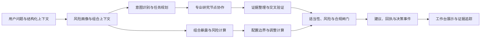
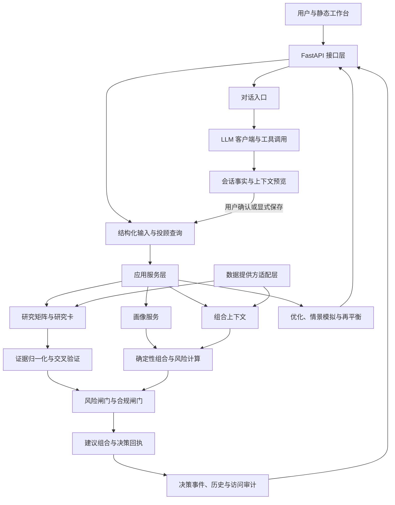
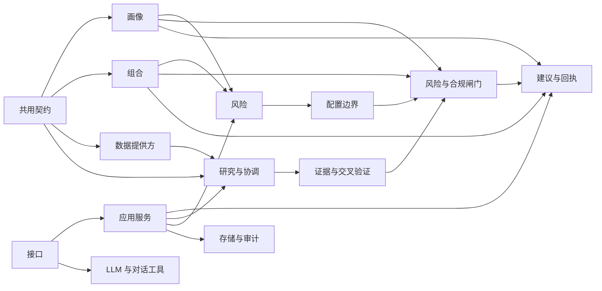
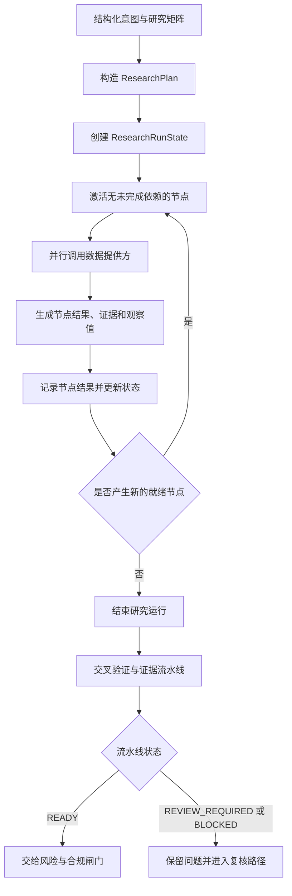

# Prism 技术设计文档

> 文档阶段：第一轮骨架与大纲
>
> 结构基线：基于 arc42 精简版，并结合 Prism 的工程实现与比赛展示要求组织。
>
> 组织主线：个性化 → 证据 → 确定性风险与决策
>
> 内容范围：系统能力、架构结构、接口契约、运行流程、确定性计算和验证证据。

## 1. 项目概述与赛题理解

> 本章依据：[项目总规范](../../Prism.md)、[项目说明](../../README.md)、[赛题说明](../../competition_brief.txt)、[实施架构](../architecture.md)和[技术实现说明](../prd-integration-guide.md)。

### 1.1 项目背景与赛题理解

Prism 面向同花顺 A18“基于同花顺问财 SkillHub 的个性化证券投顾智能体系统设计”赛题，提供面向证券研究与组合决策的个性化工作台。系统以用户风险画像、投资组合上下文和投资问题为输入，组织专业研究、证据校验、组合分析、风险合规检查和结果解释。

赛题要求系统具备以下技术能力：

* 通过问卷、自然语言交互和持仓信息形成用户画像，识别风险偏好、投资期限、收益预期等结构化信息；
* 支持大盘研判、行业配置、个股分析、ETF 与基金筛选、可转债分析、资产组合优化等研究场景；
* 通过宏观、行业、个股、基金等专业研究节点完成多任务协作、结果聚合和交叉验证；
* 接入行情、财务、新闻和研究报告等金融数据，保留数据来源与投资逻辑；
* 通过多轮对话、上下文记忆和可视化界面展示分析过程、风险提示和组合建议；
* 通过风控与合规审核流程支持稳定、可解释的投顾决策服务。

### 1.2 核心问题

证券投顾系统需要同时处理用户差异、研究场景差异、金融数据质量和组合约束。Prism 将问题拆分为以下技术问题：

| 技术问题 | 系统需要处理的对象 | Prism 的处理方向 |
| --- | --- | --- |
| 用户需求差异 | 风险承受能力、投资期限、流动性需求、收益预期、持仓结构 | 形成结构化风险画像和投资组合上下文，并将其传入后续计算链路 |
| 研究任务差异 | 大盘、行业、个股、基金、ETF、可转债等研究主题 | 通过中央协调模块和专业研究节点分解任务并聚合结果 |
| 金融数据质量 | 来源、时间、单位、报告期、数据完整性和来源一致性 | 通过数据提供方协议、证据对象、字段校验和交叉验证组织数据 |
| 组合决策计算 | 资产暴露、集中度、风险预算、配置边界和再平衡 | 由确定性计算模块完成金额、权重、风险和调整结果计算 |
| 建议可追溯性 | 研究结论、风险判断、建议动作和数据来源之间的关联 | 建立 `Recommendation → Finding → Fact → Evidence` 追踪链 |
| 风险控制 | 适当性、风险约束、合规规则和建议生成条件 | 通过独立闸门完成建议资格判定和结果审计 |

### 1.3 Prism 的解决方案

Prism 将投顾任务组织为结构化处理链路：



系统提供以下能力组合：

1. 用户通过风险测评、画像确认和组合上下文确认形成可计算的投资者上下文；
2. 中央协调模块将结构化投资意图映射为研究任务计划；研究执行器按照节点依赖调度专业研究节点并聚合结果；
3. 研究节点输出带有来源和状态的结构化研究结果，证据模块完成证据、事实与发现的校验和关联；建议模块在风险与合规闸门通过后将发现关联到建议并生成决策回执；
4. 组合分析模块计算持仓暴露、基金与 ETF 穿透、集中度、风险预算、配置边界、目标结构、情景影响和再平衡方案；
5. 风险与合规闸门检查研究结果、画像约束、组合风险和建议条件；
6. 工作台通过接口、决策回执、历史事件和证据展开呈现结果。

### 1.4 核心设计原则

| 原则 | 技术含义 |
| --- | --- |
| 证据优先 | 研究结论、事实、发现和建议均保留来源、时间、状态及关联标识，建议沿 `Recommendation → Finding → Fact → Evidence` 追踪。 |
| 确定性计算优先 | 金额、权重、组合暴露、集中度、风险预算、配置边界和调整动作由确定性程序计算；大语言模型（LLM）承担意图理解、任务协作和自然语言解释。 |
| 个性化约束驱动 | 风险画像和投资组合上下文进入风险预算、配置边界和建议组合计算；结构化投资意图决定研究任务范围，形成用户相关的结果。 |
| 结构化协作 | 中央协调模块、专业研究节点和任务有向无环图（DAG）通过明确输入、输出和状态协作，关键数据使用结构化契约传递。 |
| 独立风险与合规 | 适当性、风险和合规规则独立运行，建议资格由闸门结果决定。 |
| 状态与来源明确 | 数据状态、来源身份、观察时间、检索时间和验证结果随结果返回，支持工作台展示和后续审计。 |

### 1.5 系统目标与设计范围

本报告围绕 Prism 的实际工程结构说明以下系统能力：

| 能力范围 | 系统能力 | 主要代码与资料依据 |
| --- | --- | --- |
| 用户上下文 | 风险问卷、投资者画像、画像提案与确认、投资组合导入和上下文确认 | `app/profile/`、`app/portfolio/`、`app/api/main.py` |
| 研究协作 | 研究任务计划、研究节点矩阵、有限拓扑执行、研究场景和专业研究卡 | `app/orchestration/`、`app/research/`、`app/stock/`、`app/fund/`、`app/convertible_bond/` |
| 证据链路 | 证据、事实、发现、建议、交叉验证、决策回执和决策事件之间的关联 | `app/contracts/`、`app/gates/`、`app/recommendation/`、`app/store/` |
| 组合计算 | 组合暴露、基金与 ETF 穿透、集中度、风险预算、配置边界、组合优化、情景模拟和再平衡 | `app/portfolio/`、`app/risk/`、`app/allocation/`、`app/optimization/`、`app/scenarios/`、`app/rebalancing/` |
| 风险与合规 | 适当性检查、风险闸门、合规闸门、建议资格判定和结果审计 | `app/gates/`、`app/recommendation/`、`app/explainability/`、`app/history/` |
| 数据与接口 | 数据提供方适配、缓存与回退、数据状态、HTTP/SSE 接口和静态工作台 | `app/providers/`、`app/api/`、`app/api/static/` |
| 工程验证 | 契约校验、领域单元测试、接口集成测试、浏览器验证、确定性回放和本地负载测试 | `tests/`、`tools/`、`README.md` |
## 2. 需求与系统约束

> 本章依据：[项目总规范](../../Prism.md)、[赛题说明](../../competition_brief.txt)、[技术实现说明](../prd-integration-guide.md)、[画像与组合导入契约](../archive/profile-portfolio-contracts.md)、[数据提供方协议](../archive/provider-protocol.md)和[风险与合规闸门](../archive/risk-compliance-gates.md)。

本章将业务目标转换为系统输入、处理、输出和可验证约束。功能需求说明系统提供的处理能力，系统约束说明数据、计算、风险、接口和运行环境必须遵循的规则。

### 2.1 系统功能需求

`Advisor`、研究、组合和审查接口接收带有用户归属与版本信息的结构化上下文；对话入口接收自然语言请求，并在会话事实锁定后引用画像和持仓。各服务根据结构化投资意图组织研究、计算与审查，并返回带状态和关联标识的结果对象。

| 需求域 | 主要输入 | 核心处理 | 可验证输出 |
| --- | --- | --- | --- |
| 用户上下文 | 风险问卷、画像提案、行为事件、持仓和组合导入包 | 校验字段、计算风险画像、处理冲突、确认组合上下文 | 问卷快照、风险画像、行为画像、持仓快照和上下文记录 |
| 研究任务 | 结构化投资意图、研究场景、标的或主题 | 生成任务计划，按节点依赖执行四类研究矩阵，并通过个股、基金、可转债研究卡提供对应场景分析 | 研究计划、研究运行记录、节点状态和研究结果 |
| 证据处理 | 数据提供方结果、来源标识、观察时间和报告期 | 归一化证据，校验字段和数据状态，执行交叉验证，建立事实与发现关联 | `Evidence`、`Fact`、`Finding`、`DecisionTrace` |
| 组合分析 | 已确认风险画像、持仓快照、基金或 ETF 穿透快照 | 计算组合暴露、集中度、风险预算、配置边界和调整前后影响 | 暴露报告、风险预算评估、配置边界、情景结果和再平衡行动计划 |
| 建议与审查 | 研究发现、组合计算结果、风险结果和合规候选文本 | 执行风险闸门和合规闸门，组合建议并生成回执 | 建议对象、闸门结果、决策回执和决策事件 |
| 交互与审计 | 查询请求、会话上下文、历史事件和用户操作 | 提供 HTTP、SSE 和静态工作台接口，保存结构化上下文与决策记录 | 研究工作台、证据展开、历史查询、状态回执和访问审计 |

上述功能通过 `app/api/main.py` 暴露接口，通过 `app/service/` 连接画像、研究、组合、闸门、建议和存储模块。各接口按自身契约返回适用的 `schema_version`、归属标识、状态和关联标识，前端按对应契约渲染结果。

### 2.2 个性化投顾需求

个性化投顾的计算基础由正式风险测评、结构化画像和当前投资组合共同构成；系统另行接收用户行为证据，用于计算行为画像和画像复核结果。系统将自然语言中明确表达的投资期限、流动性、投资经验、收益预期和最大回撤容忍度提取为带原文引用的类型化候选字段；候选需与正式问卷比对并经用户确认后进入确定性计算链路。

| 个性化维度 | 结构化输入 | 影响的系统处理 | 主要结果 |
| --- | --- | --- | --- |
| 风险承受能力 | 损失承受评分、风险问卷答案、适当性等级 | 计算风险分数、风险等级和风险预算 | 风险画像、适当性结果、资产与行业约束 |
| 投资期限与收益预期 | 投资期限、收益预期和最大回撤容忍度 | 选择风险预算，计算配置边界和失效条件 | 配置区间、风险解释和重新评估条件 |
| 流动性需求 | 流动性等级、近期资金需求和现金下限 | 约束资产配置、调仓金额和交易后现金 | 流动性风险结果、调整行动和现金校验 |
| 资产偏好 | 资产类别偏好、行业偏好和排除项 | 保存结构化偏好，供上下文展示和显式买入排除校验使用；风险预算与配置边界按风险等级和组合暴露计算 | 偏好记录、超限提示和排除项校验 |
| 当前组合 | 标的、资产类型、数量、市值、币种、来源和观察时间 | 计算直接暴露、基金与 ETF 穿透、集中度和调仓影响 | 组合暴露、集中度风险、目标结构和再平衡方案 |
| 投资行为 | 已确认行为事件、历史交易特征和组合变化 | 计算行为画像、识别画像与实际行为偏差，并提供独立的画像复核结果 | 行为证据、风险提示和画像复核入口 |
| 交互偏好 | 关注场景、解释深度、追问内容和研究意图 | 生成研究任务范围，调整结果展示方式 | 研究计划、解释内容和上下文记忆 |

个性化输入遵循以下契约：

1. 正式风险问卷包含 19 道题、8 个评估维度、问卷版本和规则版本；答案经过完整性、题目顺序、选项范围和重复标识校验后生成问卷快照。
2. 风险分数和适当性等级由确定性规则计算，最大回撤容忍度作为独立约束保留。风险画像携带 `owner_id`、`profile_id`、版本、时间和偏好字段，供后续模块引用。
3. 自然语言画像提取输出类型化画像提案。提案与正式问卷出现维度冲突时生成冲突记录，用户明确选择后才能形成确认画像；画像确认结果可通过上下文记忆接口显式保存，保存内容携带画像版本和归属标识。
4. 投资组合采用归属明确的持仓快照和组合导入包。基金与 ETF 穿透数据带有父标的、成分、权重、覆盖率、来源和观察时间，组合分析基于已确认快照计算。
5. 结构化投资意图决定研究任务范围；风险画像和投资组合上下文进入风险预算、配置边界、组合分析和建议组合计算。每次建议均能回溯到所使用的画像版本和组合快照。

### 2.3 金融数据真实性要求

金融数据从提供方请求进入结果契约，再经过归一化和验证形成证据。系统同时记录数据内容、时间、来源和调用上下文，保证研究结论能够追踪到具体金融事实。

| 真实性要求 | 约束内容 | 工程落点 |
| --- | --- | --- |
| 来源可归属 | 每条记录需要来源、记录标识或血缘标识；每次调用需要请求标识和查询指纹 | `ProviderRequest`、`ProviderResult`、`ProviderRecord`、`request_fingerprint` |
| 时间与口径一致 | 时间戳字段使用带时区的时间，报告期按期间字段保留 | `as_of`、`observed_at`、`retrieved_at`、`period`、`units` |
| 必需字段可校验 | 研究任务声明 `required_fields`，提供方逐记录校验必需字段存在且值不为 `None` | 请求契约、结果契约和归一化校验 |
| 缺失语义稳定 | 缺失字段保持缺失，真实数值零与缺失状态分别编码 | `missing_fields`、问题对象和证据质量状态 |
| 查询状态可区分 | 成功、部分成功、明确无数据、执行失败分别处理 | `SUCCESS`、`PARTIAL`、`EMPTY`、`FAILED` |
| 证据来源可审计 | 提供方结果保留请求指纹；归一化后的证据通过稳定 `evidence_id` 绑定提供方、来源、期间、记录身份和请求指纹的编码结果，并保留质量状态与关联标识 | `Evidence`、`Fact`、`Finding`、`DecisionTrace` |
| 敏感信息可控 | 请求参数、诊断和日志执行敏感字段检测与脱敏 | 数据提供方契约、安全问题对象和日志处理 |

数据提供方结果采用四态语义：

| 状态 | 结果内容 | 证据处理 | 后续语义 |
| --- | --- | --- | --- |
| `SUCCESS` | 至少一条完整记录，无缺失字段和问题 | 字段归一化为 `VERIFIED` 证据 | 可进入事实和发现校验 |
| `PARTIAL` | 至少一条记录，同时存在缺失字段或结构化问题 | 生成带质量说明的 `PARTIAL` 证据 | 结果可展示，完整事实链等待补充或复核 |
| `EMPTY` | 查询范围明确且记录数为零，无错误问题 | 不生成证据 | 返回明确的空结果和查询范围 |
| `FAILED` | 没有记录，包含超时、鉴权、网络或解析等问题 | 不生成证据 | 返回可重试性和安全问题信息 |

直接请求、新鲜缓存或备用提供方的结果分别归一化为 `VERIFIED` 或 `PARTIAL`；过期缓存回退归一化为 `STALE`。数据提供方四态与服务方式分开记录，服务方式不改写 `ProviderResult.status`。

证据进入研究结论前需要满足以下顺序：

1. 归一化器根据提供方、来源、记录标识（或血缘标识）、期间、字段和请求指纹生成稳定证据标识；
2. 交叉验证检查独立血缘、时间一致性、指标口径和实际结论冲突；
3. 仅由满足验证条件且引用闭合的证据形成可引用事实和发现；
4. 重要冲突、数据缺失和提供方失败保留原始状态及安全问题，进入复核或降级路径。

### 2.4 风险与合规约束

风险与合规检查位于研究和组合计算之后、建议组合之前，分别由风险闸门和合规闸门执行。两个闸门共享归属、画像、研究运行和引用标识，但各自独立计算状态。

| 约束域 | 校验对象 | 结果状态 | 系统动作 |
| --- | --- | --- | --- |
| 归属与完整性 | 用户、画像、组合、研究运行、闸门和建议候选的 `owner_id` 及关联标识 | 输入不一致或内容篡改为 `BLOCKED` | 返回安全问题，停止后续建议组合 |
| 研究证据 | 研究运行状态、证据链、事实、发现和引用闭合 | 可复核问题为 `REVIEW_REQUIRED`；未验证证据、引用断裂或研究运行阻断为 `BLOCKED` | 保留研究结果、证据质量和复核原因，停止后续建议组合 |
| 风险预算 | 暴露、集中度、风险预算评估、配置边界和超限项 | 完整风险超限可形成带处置项的通过结果；风险输入不完整为 `REVIEW_REQUIRED` | 生成风险降低方向、超限标识和配置边界 |
| 适当性 | 画像、风险等级、最大回撤容忍度、风险预算和配置边界的一致性 | 绑定不一致为 `BLOCKED`；风险输入不完整为 `REVIEW_REQUIRED` | 返回安全问题或复核原因，并停止或暂缓建议组合 |
| 合规文本 | 建议候选、所引用发现和强制披露 | 缺少披露为 `REVIEW_REQUIRED`，出现禁止表述为 `BLOCKED` | 校验必需披露码，并在通过后随建议结果附带披露；禁止表述保留为安全问题 |
| 建议资格 | 风险闸门与合规闸门的组合状态 | 只有两者均为 `PASS` 时具备建议生成资格 | `PASS` 时生成建议和决策回执；通过或拒绝结果均记录为决策事件 |

合规闸门要求建议候选包含以下机器可读披露：

* `NO_GUARANTEE`：收益和结果不作保证；
* `LOSS_RISK`：说明本金损失和波动风险；
* `EVIDENCE_SCOPE`：说明本次判断使用的证据范围；
* `INVALIDATION_CONDITIONS`：说明建议失效或需要重新评估的条件。

风险闸门和合规闸门的组合状态按 `BLOCKED`、`REVIEW_REQUIRED`、`PASS` 的顺序裁决。建议对象只能引用当前研究运行中的发现，发现必须闭合到经验证事实和证据。调仓模块提供确定性行动计划与交易后风险复核，执行边界保持为决策支持，真实交易由外部交易系统承接。

### 2.5 性能与工程约束

性能约束同时包含赛题质量目标和工程验证规则。赛题提出不少于 100 用户同时在线咨询、单次投顾响应不超过 3 秒、系统可用性达到 99.9% 以上；工程实现将这些目标拆解为可记录的并发、延迟、错误和服务状态指标。

| 约束项 | 目标或规则 | 工程实现与验证口径 |
| --- | --- | --- |
| 并发处理 | 支持不少于 100 个并发咨询用户的测试场景 | 研究节点采用有界并行；负载工具记录请求完成数、错误类别、归属隔离和存储副作用 |
| 响应时延 | 单次投顾响应目标不超过 3 秒；数据提供方请求默认超时预算为 3000 毫秒 | 异步任务、有界超时；注入 `ProviderExecutionPolicy` 时使用缓存和提供方回退；分别记录端到端时延与提供方时延 |
| 可用性 | 以 99.9% 作为系统质量目标 | 健康检查、超时、重试、缓存、备用提供方和可控降级共同提供运行状态；验证记录区分应用、存储和外部数据服务 |
| 计算精度 | 金额、权重、分数和金融指标使用十进制定点计算 | 领域计算使用 `Decimal`，组合守恒、边界、舍入和调整后复核由测试验证 |
| 契约稳定 | 公共对象按适用契约携带版本、归属和关联标识；字段保持明确、不可变和可校验 | Pydantic 契约、`schema_version`、时区校验、未知字段拒绝和引用闭包校验 |
| 运行可回放 | 相同输入、规则版本和固定生成时间产生稳定结果标识 | 语义指纹、确定性排序、幂等决策事件、内容哈希和固定时间回放 |
| 数据隔离 | 用户画像、持仓、上下文、建议和事件按用户归属隔离；含用户语义的 Provider 请求不进入公共缓存 | 归属协议标识（`X-Owner-ID`）、服务端归属校验、存储索引、访问审计和缓存策略 |
| 故障处理 | 超时、取消、鉴权失败、限流、无数据和解析错误保持不同的结构化状态 | 统一问题编码、可重试标识、安全诊断、缓存服务方式和四态结果协议 |
| 部署适配 | 应用、存储和外部提供方可以通过应用工厂和依赖注入替换 | `create_app()`、SQLite 决策事件存储、PostgreSQL 存储适配和 Provider 接口 |

性能结果需要保存测试场景、传输方式、样本数量、请求总数、分位数时延、错误类别和副作用检查；运行环境信息由执行记录另行保存。固定数据、进程内接口或合成提供方的测量结果作为对应环境的基线记录，外部数据服务的响应与可用性单独核验。

这些约束共同形成建议生成的前置条件：用户上下文可归属，金融数据状态明确，确定性计算完成，证据引用闭合，风险闸门和合规闸门通过，随后进入建议组合；通过或拒绝结果均进入决策事件记录。

## 3. 系统总体架构

> 本章依据：[实施架构](../architecture.md)、[模块化单体架构决策](../adr/0001-modular-monolith.md)、[技术实现说明](../prd-integration-guide.md)、[项目说明](../../README.md)、[`create_app()`](../../app/api/main.py)和[当前代码目录](../../app/)。

Prism 采用模块化单体结构。各领域模块在同一 Python 应用进程内通过明确的契约和服务接口协作，接口层、应用服务、确定性计算、研究证据、数据提供方和存储分别承担不同职责。主投顾纵切与研究卡、组合优化、情景模拟、再平衡、评测和可解释性服务共享领域契约，但通过各自接口独立调用。

### 3.1 总体架构视图

系统的逻辑依赖关系如下。语言交互产生结构化意图、工具结果或解释文本；经过显式提取、确认和接口契约校验的结构化输入，才进入相应应用服务。对话工具结果单独返回，不自动写入研究证据、闸门、回执或决策事件。



主投顾服务在 `app/service/advisor_query.py` 中形成一条可回放的端到端调用链：请求经过契约重校验后生成风险画像，计算持仓暴露、集中度、风险预算和配置边界，执行研究运行并构造证据流水线，再生成建议候选，执行双闸门，最后组合建议结果。`app/api/main.py` 在得到结果后构造并保存 `DecisionEvent`，由接口返回决策结果和事件状态。

### 3.2 系统分层

| 层级 | 主要目录 | 主要职责 | 对外输出或依赖 |
| --- | --- | --- | --- |
| 交互表现层 | `app/api/static/` | 提供投顾对话、画像、组合、研究、审计和工作流页面，展示状态标签、证据链和风险提示 | 调用 HTTP、SSE 接口；不直接执行金融计算 |
| 接口与协议层 | `app/api/` | 定义 FastAPI 路由、请求响应模型、归属校验、异常映射、数据模式切换和依赖注入 | 向页面和外部调用方提供按路由定义的 JSON 或 SSE 响应 |
| 语言交互层 | `app/llm/`、`app/service/natural_profile.py` | 调用兼容 OpenAI 接口的模型，完成对话、工具调用、自然语言画像槽位提取和解释生成 | 输出结构化提案、工具结果或文本；结构化对象进入确定性契约校验 |
| 应用服务层 | `app/service/` | 组合画像、持仓、研究、计算、闸门、建议和存储服务，承载各类运行请求 | 向接口层返回完整领域响应；调用下层模块 |
| 协调与证据层 | `app/orchestration/`、`app/research/` | 构造研究计划和研究运行，执行有界拓扑，管理节点状态、交叉验证和证据流水线 | 读取数据提供方结果，输出研究状态和证据；研究运行满足要求时形成事实、发现和追踪关系 |
| 确定性领域层 | `app/profile/`、`app/portfolio/`、`app/risk/`、`app/allocation/`、`app/gates/`、`app/recommendation/`；组合优化、情景模拟和再平衡服务位于 `app/service/` | 计算画像分数、组合暴露、集中度、风险预算、配置边界、优化结果、情景影响、再平衡和建议资格 | 通过领域契约返回数值、状态、风险问题、闸门结果和回执 |
| 数据提供方层 | `app/providers/` | 统一请求、结果、指纹、超时、缓存、备用提供方、回退和证据归一化协议，连接合成和外部数据源 | 向研究与行情服务提供带来源、时间和状态的结果 |
| 持久化与审计层 | `app/store/`、`app/history/` | 保存决策事件、结构化上下文、问卷快照、组合报告、行为画像、访问审计和用户偏好 | 向应用服务提供按用户归属的查询与幂等写入 |
| 契约基础层 | `app/contracts/` | 提供不可变领域模型、字段校验、版本标识、证据对象和跨模块引用规则 | 被各层复用，约束数据结构和引用闭包 |

各层的依赖方向遵循“接口调用应用服务，应用服务组合领域模块，领域模块通过数据提供方取得外部数据，应用服务或接口写入存储”。语言交互层可以生成输入提案和解释内容，但金融事实、金额、权重、风险和建议资格沿确定性领域层流转。

### 3.3 模块职责与依赖

模块之间以领域对象和应用服务作为边界。主要依赖关系如下：



| 模块 | 职责 | 主要依赖与边界 |
| --- | --- | --- |
| `app/contracts/` | 定义通用模型基类、证据、事实、发现、建议和追踪对象 | 被各领域模块引用；只负责结构和引用校验，不决定具体业务算法 |
| `app/profile/` | 提供风险问卷、确定性评分、风险画像、行为画像和展示模型 | 依赖契约；输出画像和行为结果，风险分数由规则计算 |
| `app/portfolio/` | 接收持仓快照、组合导入包、基金穿透快照，计算直接与间接暴露 | 依赖契约和持仓数据；为风险、配置、优化、模拟和再平衡提供组合输入 |
| `app/providers/` | 实现数据提供方协议、请求指纹、四态结果、缓存回退、实时数据适配和证据归一化 | 依赖契约；保留来源和状态，不执行组合或风险计算 |
| `app/research/` 与 `app/orchestration/` | 定义研究节点、研究计划、运行状态、有限拓扑、交叉验证和证据桥接 | 调用数据提供方；输出研究对象，研究流水线与建议组合保持分层 |
| `app/risk/` 与 `app/allocation/` | 计算集中度、风险预算、超限项和配置边界 | 消费画像与暴露结果；输出约束和风险结果，不直接执行交易 |
| `app/service/portfolio_optimization.py`、`app/service/scenario_simulation.py`、`app/service/portfolio_rebalancing.py` | 提供组合目标结构、情景模拟、费用与整手约束、交易后风险复核 | 消费已确认画像和组合上下文；作为独立服务返回对应结果 |
| `app/gates/` 与 `app/recommendation/` | 执行风险、合规和建议资格判断，组合建议并生成 `DecisionReceipt` | 消费已校验的研究、画像、组合和风险对象；建议引用发现和闸门结果 |
| `app/service/` | 负责投顾查询、研究卡、画像提案与确认、优化、模拟、调仓、评测、解释和历史等应用流程 | 编排领域模块，不重新实现底层金融规则 |
| `app/store/` 与 `app/history/` | 持久化决策事件、上下文、报告、审计记录和历史回执 | 由应用服务和接口调用；写入按用户归属、内容哈希和事件标识校验 |
| `app/api/` 与 `app/llm/` | 暴露接口、管理运行模式和会话交互，连接模型与结构化服务 | `app/api/` 负责边界校验和异常映射；`app/llm/` 负责语言交互，不替代领域计算 |

主投顾链路的关键依赖闭合为：`RiskProfile` 与 `PortfolioImportBundle` 产生暴露和风险预算，`READY` 研究运行在证据引用闭合后形成证据和发现，配置边界与研究结果共同进入双闸门，闸门结果进入建议组合和 `DecisionReceipt`，事件存储保存最终可回放关系。研究卡、优化、模拟和再平衡沿相同契约独立运行，其结果由各自接口返回。

### 3.4 外部系统、数据源与接口

Prism 将外部能力分为金融数据、语言模型、持久化和用户交互四类。所有需要进入研究或计算链路的数据，先经过对应的适配和契约校验。

| 外部能力或接口组 | 当前接入位置 | 主要用途 | 交互边界 |
| --- | --- | --- | --- |
| 同花顺问财 SkillHub | `WencaiSkillHubProvider`、`app/providers/iwencai_skills.json` | 提供公告、新闻、研报、行情、财务、行业、宏观、基金和可转债查询技能 | 依据版本化技能清单选择路由；配置凭据且运行模式允许时发起请求，请求携带调用标识，结果映射为四态数据提供方结果 |
| 扶摇金融数据服务 | `FuyaoFinanceProvider` | 获取 A 股行情快照和披露的基金穿透数据 | 凭据保留在服务端；响应按业务状态、时间戳和字段进行校验 |
| 东方财富行业资料 | `EastmoneyIndustryProvider` | 获取证券行业分类和标准化行业标识 | 作为行业元数据服务，结果带检索时间；行业资料时间不等于行情时间 |
| 海外行情数据服务 | `YahooFinanceProvider`、`EtNetProvider`、兼容的 `IFindQuantProvider` 注入点 | 作为可选的辅助海外指数行情和历史序列数据源 | 当前实现提供可注入接口，由接口层按标的能力选择已配置的数据提供方，并保留查询失败状态；外部服务质量按实际请求核验 |
| 合成数据与离线回放 | `FixtureFinancialProvider`、各类 `Fixture*Service` | 驱动契约测试、研究运行、固定评测和确定性回放 | 使用严格校验的本地数据；结果带离线来源标识，不与实时来源混用 |
| 兼容 OpenAI 接口的模型服务 | `app/llm/`、用户模型配置和对话路由 | 对话生成、工具调用、自然语言画像候选和解释内容 | 模型输出先进入结构化提案或工具契约；模型配置可通过注入的 `secret_store` 保护，具体安全存储由运行入口配置决定 |
| 本地与关系型存储 | `SQLiteDecisionEventStore`、`PostgresDecisionEventStore` | 保存决策事件、画像快照、组合报告、上下文记忆和访问审计 | 通过 `create_app()` 注入；事件按用户归属和内容哈希执行幂等校验；PostgreSQL 需显式提供 `database_url` 并安装对应依赖 |
| 浏览器与调用方 | `GET /`、`/api/docs`、`/api/health`、`/api/v1/*` | 提供工作台、接口文档、健康检查、研究、组合、投顾、审计和运行配置入口 | 结构化接口按自身契约返回 JSON；`/api/v1/copilot/chat` 使用 SSE 流式返回对话事件 |

接口按用途分为以下几组：

| 接口组 | 代表路径 | 处理对象 |
| --- | --- | --- |
| 身份与访问 | `/api/v1/auth/*`、`/api/v1/access-audit` | 本地账户、会话、访问审计和用户归属 |
| 画像与上下文 | `/api/v1/advisor/profile/*`、`/api/v1/advisor/profile-proposals*`、`/api/v1/advisor/context/portfolio`、`/api/v1/advisor/context/profile`、`/api/v1/advisor/context-memory*`、`/api/v1/advisor/session-truth*`、`/api/v1/advisor/profile-extractions` | 问卷、画像提案、行为画像、组合上下文、会话事实和记忆 |
| 投顾主链路 | `/api/v1/advisor/query-template`、`/api/v1/advisor/queries`、`/api/v1/decision-events` | 投顾请求、画像、组合、研究、证据、双闸门、建议和决策事件 |
| 专项分析 | `/api/v1/advisor/*-research-runs`、`/api/v1/advisor/portfolio-optimization-runs`、`/api/v1/advisor/scenario-simulation-runs`、`/api/v1/advisor/rebalancing-runs` | 研究卡、组合优化、情景模拟和再平衡 |
| 对话与实时数据 | `/api/v1/copilot/chat`、`/api/v1/copilot/live-quote`、`/api/v1/copilot/live-fund` | 流式对话、工具调用、行情和基金数据展示 |
| 市场与运行配置 | `/api/v1/market/*`、`/api/v1/market-assessments/*`、`/api/v1/runtime/*` | 市场目录、指数分析、数据模式、问财配置和数据提供方查询 |
| 历史与评测 | `/api/v1/decision-events`、`/api/v1/advisor/recommendation-history`、`/api/v1/advisor/evaluation-dashboard-*` | 决策事件、建议回溯、回执对比和评测汇总 |

使用用户归属的接口通过服务端归属依赖校验请求、上下文和结果之间的 `owner_id`；本地账户认证启用时由访问中间件建立会话和审计记录。数据提供方、模型服务和存储的故障均转换为结构化状态，沿接口返回可解释的结果。

## 4. 智能体协作与任务执行

### 4.1 中央协调模块

Prism 的任务执行由结构化意图、研究专员矩阵和有界运行器共同完成。当前任务协调职责分布在多个服务中：`intent_planning.py` 处理结构化意图计划，`advisor_query.py` 编排投顾查询，`specialist_matrix.py` 执行四轨研究矩阵并构造证据流水线。规划过程不执行数据查询，也不生成事实、发现或建议。

任务协调职责的主要实现位于 `app/service/intent_planning.py`、`app/service/advisor_query.py` 和 `app/service/specialist_matrix.py`。其中，`intent_planning.py` 将明确的投顾意图映射为只读投顾计划摘要；`advisor_query.py` 编排投顾查询；`specialist_matrix.py` 将研究矩阵转换为可执行研究计划，调用有向无环图运行器并构造研究证据流水线。

| 输入或输出 | 主要字段 | 处理职责 | 结果边界 |
| --- | --- | --- | --- |
| 投顾意图 | `intent_id`、`owner_id`、`intent_type` | 校验归属、时间、意图类型和必要上下文 | 形成可追踪的计划输入 |
| 投顾上下文 | `portfolio_bundle_id`、`position_snapshot_id`、`questionnaire_id` | 绑定组合、持仓快照和问卷结果 | 保持投资者画像与组合数据的归属一致 |
| 研究计划 | `plan_id`、四类研究角色、`node_count` | 根据现有研究矩阵确定研究范围 | 只描述任务，不携带研究结果 |
| 运行结果 | 运行状态、节点状态、证据、观察值 | 汇总提供方结果并执行状态收敛 | 交给证据流水线判断可用性 |

`AdvisorIntentRequest` 要求意图、组合、持仓和问卷均具有明确标识，且 `generated_at` 必须带时区。`build_intent_plan` 校验意图与矩阵的所有者一致，并根据已校验矩阵返回覆盖宏观、行业、个股和基金四类角色的投顾计划。返回的 `AdvisorPlanResponse` 包含稳定的计划标识、研究范围和节点数量，不包含事实数值、证据记录、风险结论或建议组合。

`build_intent_plan` 接收结构化的 `AdvisorIntentRequest` 并生成只读计划；该过程不执行数据查询，也不写入证据、风险闸门、合规闸门或决策事件。

### 4.2 专业研究节点

研究矩阵定义四类有边界的专业研究节点，每个节点对应一个数据提供方请求和一个明确的研究主张。节点由 `ResearchSpecialistNode` 表示，包含节点标识、投资者归属、研究角色、节点类型、数据操作、研究对象、必需字段、依赖节点、超时、主张标识、来源、记录和血缘标识。

| 研究角色 | 节点类型 | 允许的数据操作 | 当前研究对象示例 |
| --- | --- | --- | --- |
| 宏观研究 | `MACRO` | `MACRO_DATA` | 政策利率 |
| 行业研究 | `INDUSTRY` | `INDUSTRY_DATA` | 科技行业增长 |
| 个股研究 | `STOCK` | `COMPANY_DATA`、`MARKET_DATA` | 报告期收入、市场数据 |
| 基金研究 | `ETF_FUND` | `FUND_DATA` | 基金科技行业权重 |

节点的角色、节点类型和数据操作由契约校验相互约束。主张指标必须属于必需字段，依赖列表必须唯一且按稳定顺序排列，节点超时不能超过矩阵预算。矩阵还要求覆盖四种必要节点类型，校验节点、请求、来源、记录和血缘标识的唯一性，并拒绝依赖环。

同一 `claim_id` 可以由多个节点提供。矩阵要求同一主张至少具有两个来源和两个独立血缘，同时要求研究角色、对象、指标、单位、期间、期望值和发现元数据一致。该约束为交叉验证提供明确的来源集合，避免把重复记录当作独立来源。

研究专员节点承担数据获取和结构化观察职责。当前四轨研究矩阵覆盖宏观、行业、个股和基金四类研究角色。`SpecialistMatrixOutput` 包含矩阵、运行结果和证据流水线结果，并校验节点、研究主张及证据流水线之间的标识一致性；该输出不包含建议、交易动作或决策回执。

### 4.3 任务有向无环图（DAG）

`app/orchestration/contracts.py` 定义研究计划、节点规格、运行状态和节点运行状态；`app/orchestration/state_machine.py` 负责状态转移；`app/orchestration/executor.py` 定义节点请求，并在预算内调用数据提供方、归一化结果。计划建立时会计算稳定的拓扑顺序，拒绝重复节点、未知依赖、自依赖和循环依赖。

一次研究运行包含运行预算、截止时间和节点集合。节点初始为 `PENDING`，没有未完成依赖的节点进入 `RUNNING`。当前一轮的可运行节点通过 `asyncio.gather` 并行调用提供方；只有依赖节点全部为 `COMPLETE`，下游节点才会在下一轮进入运行状态。每个节点的请求同时受节点超时和运行剩余预算约束。



运行器按节点标识稳定排序结果，合并证据和观察值时检查全局标识唯一性。状态机负责收敛依赖关系：必需节点无法完成时，运行转为失败并关闭其余活跃节点；依赖未完成时，状态机会关闭受影响的下游节点；可选节点异常时，运行可以保留部分结果并进入部分完成状态。研究运行结束后，结果由证据流水线统一判断是否形成可用的证据闭包。

### 4.4 关键运行时流程

当前存在两条相关执行路径：结构化意图经 `build_intent_plan` 生成只读计划；研究矩阵经 `build_research_plan`、`create_research_run`、`execute_research_run` 和 `build_research_evidence_pipeline` 完成研究执行与证据校验。`execute_research_run` 接收调用方传入的 `FinancialProvider`；矩阵服务和投顾查询服务当前默认使用 `FixtureFinancialProvider`，矩阵服务还支持注入 `ProviderExecutionPolicy`。

| 阶段 | 主要实现 | 关键处理 | 可观察结果 |
| --- | --- | --- | --- |
| 请求校验 | `AdvisorIntentRequest`、`ResearchSpecialistMatrixRequest` | 校验归属、时区、场景和敏感字段 | 结构化请求或安全拒绝 |
| 意图计划 | `build_intent_plan` | 将结构化意图映射到四类研究角色，绑定所有者和研究矩阵 | 计划标识、研究范围和节点数量 |
| 研究计划 | `build_research_plan` | 规范化节点顺序，校验所有者、依赖关系和循环依赖 | `ResearchPlan` 及稳定拓扑顺序 |
| 运行初始化 | `create_research_run`、`start_research_run` | 建立运行预算、截止时间和节点状态 | `PENDING` 转为 `RUNNING` |
| 节点执行 | `execute_research_run` | 并行调用提供方，执行单节点及全局预算约束 | 节点结果、证据和观察值 |
| 状态收敛 | `record_node_result`、结束或取消函数 | 激活下游节点，关闭受影响节点，更新运行状态 | `COMPLETED`、`PARTIAL`、`FAILED` 或 `CANCELLED` |
| 证据处理 | `build_research_evidence_pipeline` | 交叉验证主张，建立证据、事实和发现关系 | `READY`、`REVIEW_REQUIRED` 或 `BLOCKED` |

在单个节点内，提供方结果先通过统一归一化逻辑转换为节点结果、证据和研究观察值。成功结果可以参与主张验证；部分结果保留可见记录和缺失字段；空结果保留查询范围和空状态；失败结果保留安全问题类别。原始提供方响应、异常文本、认证信息和密钥不会进入运行结果。

研究运行的 `COMPLETED` 状态只描述节点状态机已经完成；证据流水线还要检查每个主张的证据数量、独立血缘、元数据一致性和桥接结果。只有运行完整、所有主张通过交叉验证且每个桥接结果均为 `READY` 时，流水线才会形成包含证据、事实和发现的 `DecisionTrace`。投顾查询服务随后调用风险闸门和合规闸门，并将闸门结果传入建议组合器。

### 4.5 异常处理与可控降级

异常处理由提供方状态、节点运行状态、研究运行状态和证据流水线状态共同表达。各层保留失败原因的安全类别与可审计标识，避免把不可用数据转换为正常数值。

| 异常场景 | 节点或运行处理 | 证据流水线处理 | 用户可见结果 |
| --- | --- | --- | --- |
| 提供方超时、取消或内部失败 | 转换为安全的失败结果，节点进入 `FAILED` | 运行降级并进入复核或阻断 | 显示数据源不可用及影响范围 |
| 运行级显式取消 | 活跃节点进入 `CANCELLED`，运行进入 `CANCELLED` | 不形成就绪证据闭包 | 显示取消原因及未完成节点 |
| 提供方返回 `EMPTY` | 节点保留空结果和查询范围 | 不把空结果升级为事实，通常进入复核 | 显示范围内无记录 |
| 提供方返回 `PARTIAL` | 节点保留已有记录、缺失字段和问题 | 使相关主张降为未解决状态 | 显示可用字段与缺失项 |
| 必需节点未完成 | 运行转为 `FAILED`，关闭其余活跃节点 | 禁止形成事实和发现 | 显示研究运行失败及受影响范围 |
| 可选节点未完成 | 运行可以转为 `PARTIAL` | 运行降级，支持主张需要复核 | 显示部分完成状态 |
| 运行超过截止时间 | 未完成节点关闭，运行记录截止时间问题 | 进入 `REVIEW_REQUIRED` | 显示超时与未完成节点 |
| 来源分歧或证据不足 | 保留各来源观察值 | 进入 `REVIEW_REQUIRED` | 显示来源及复核原因 |
| 归属、标识或证据闭包无效 | 拒绝不一致输入或输出 | 进入 `BLOCKED` | 显示安全拒绝和问题类别 |

当前研究服务提供五个可回放场景：`BASELINE_READY`、`SOURCE_DISAGREEMENT`、`SOURCE_PARTIAL`、`SOURCE_EMPTY` 和 `SOURCE_FAILED`。这些场景通过夹具提供方重现来源一致、来源冲突、字段缺失、范围无结果和来源失败，并验证运行状态、证据状态、流水线状态及安全错误信息的一致性。

降级策略保持三项边界：异常节点不会被默认为成功，空结果不会被默认为零值，非就绪流水线不会生成事实、发现或建议。执行器通过调用方传入的 `FinancialProvider` 保持提供方接口边界；矩阵服务的默认路径使用 `FixtureFinancialProvider`，策略注入只改变执行策略，不改变研究节点、证据、血缘和流水线契约。

## 5. 证据架构

### 5.1 证据优先原则

Prism 将每条可行动建议组织为可复核的闭合链：

```text
Recommendation（建议）
        ↓
Finding（发现）
        ↓
Fact（事实）
        ↓
Evidence（证据）
```

证据是由数据提供方结果归一化得到的标准化观测。系统记录来源、字段、数值、单位、期间、观测时间、获取时间、质量状态和血缘标识，再允许后续模块消费。单独保存一个链接、新闻标题或自然语言结论，不足以形成可验证的金融事实。

| 环节 | 主要输入 | 确定性处理 | 形成条件 |
| --- | --- | --- | --- |
| 数据结果 | 数据提供方响应 | 校验状态、字段、时间、来源和归属 | 获得结构化结果或安全失败状态 |
| 证据 | 归一化记录 | 生成稳定标识，保留质量和血缘 | 记录可追踪的标准化观测 |
| 事实 | 已注册证据 | 校验值、期间、证据引用和事实状态 | 证据闭合且事实字段一致 |
| 发现 | 一个或多个事实 | 按明确方法计算或归纳判断 | 事实引用、严重程度、置信度和方法完整 |
| 建议 | 发现、画像和约束 | 执行闸门、配置边界和失效条件校验 | 建议资格通过并形成回执 |

证据优先原则由契约和服务共同执行。数据提供方负责结果状态与字段完整性，研究模块负责观察值和主张验证，证据桥接模块负责将通过验证的主张转换为事实和发现，风险与合规模块负责建议资格。语言模型输出不直接进入金融事实、主张验证、风险计算或建议资格判定；这些结果由确定性契约和服务生成。

### 5.2 证据、事实、发现与建议

共享对象定义在 `app/contracts/evidence.py`，研究流水线和建议组合服务通过这些对象传递结果。这些契约继承严格的不可变模型基类并拒绝未声明字段。决策事件在存储写入和读取时重新构造并校验嵌套契约对象。

| 对象 | 核心字段 | 状态或校验规则 | 下游用途 |
| --- | --- | --- | --- |
| `Evidence`（证据） | `evidence_id`、提供方、来源、字段、值、单位、期间、获取时间、质量、血缘 | `VERIFIED` 必须有值且不带质量说明；其他质量状态必须有质量说明 | 支持研究观察和事实闭合 |
| `Fact`（事实） | `fact_id`、主体、指标、值、单位、期间、状态、`evidence_ids` | `VERIFIED` 必须有值和至少一个证据；其他状态必须为空值并说明原因 | 为发现和风险计算提供标准事实 |
| `Finding`（发现） | `finding_id`、类型、严重程度、陈述、`fact_ids`、置信度、方法 | 至少引用一个事实，引用标识不得重复 | 表达研究或风险判断 |
| `Recommendation`（建议） | 动作、标的、配置区间、理由、`finding_ids`、合规状态、失效条件 | 至少引用一个发现，并携带独立合规状态和失效条件 | 形成建议组合和决策回执 |
| `DecisionTrace`（决策追踪） | 证据、事实、发现、建议集合 | 校验标识唯一、引用存在、值和期间一致 | 提供完整审计和结果回放对象 |

证据质量状态包括 `VERIFIED`、`STALE`、`PARTIAL`、`CONFLICTING` 和 `INVALID`。`STALE` 表示数据仍可读取但超过新鲜度窗口；`PARTIAL` 表示字段或来源覆盖不完整；`CONFLICTING` 表示独立来源存在尚未解决的口径或数值冲突；`INVALID` 表示解析、范围、口径或完整性校验失败。质量状态之外，系统要求非 `VERIFIED` 证据携带 `quality_note`。

事实状态包括 `VERIFIED`、`UNAVAILABLE`、`INVALID` 和 `NOT_APPLICABLE`。不可用、无效和不适用事实保持空值，并通过 `reason` 说明状态原因。提供方超时、无记录或解析失败不会写入零值；真实零值必须具有相应的已验证证据。

研究证据流水线 `build_research_evidence_pipeline` 消费一次研究执行结果和一组带发现元数据的主张，并根据运行状态执行交叉验证和证据桥接。当主张集合和证据闭包校验通过时，运行状态非 `COMPLETED` 会将支持主张重标为 `UNRESOLVED`，流水线进入 `REVIEW_REQUIRED`，不生成事实和发现；若同时存在主张、输入或证据闭包错误，流水线进入 `BLOCKED`。流水线状态为 `READY` 时，为每条已支持主张建立事实、发现和闭合追踪；研究证据流水线不创建建议，建议由后续画像、组合、风险和合规处理共同形成。

`DecisionTrace` 在对象创建时校验标识唯一、引用存在，以及已验证事实与证据之间的值和期间关系。`REVIEW_REQUIRED` 建议同样不能引用非 `VERIFIED` 事实；`PASSED` 建议还不能引用非 `VERIFIED` 证据。决策事件存储在写入和读取时重新校验完整结果。

### 5.3 数据血缘、追踪与审计

数据血缘由来源标识、记录标识、请求标识、血缘标识和时间字段共同表达。提供方请求通过 `request_id` 标识，系统依据操作、主体、截止时间 `as_of`、必需字段和参数计算请求指纹；提供方结果同时保存 `request_id` 和 `request_fingerprint`。提供方记录保存来源、记录标识、字段、值、单位、期间、观测时间和血缘标识。归一化 `Evidence` 保存证据标识、提供方、来源、字段、值、单位、期间、观测时间、获取时间、质量状态和血缘标识；研究观察保存用户归属、证据标识、主体、指标、单位、期间和血缘标识。

| 追踪层级 | 关键标识 | 保存内容 | 主要校验 |
| --- | --- | --- | --- |
| 提供方请求 | `request_id` | 操作、主体、截止时间 `as_of`、必需字段、参数、超时 | 请求字段和敏感信息校验 |
| 提供方结果 | `request_id`、`request_fingerprint` | 提供方、状态、记录、缺失字段、问题、获取时间 | 请求指纹、结果状态和记录结构校验 |
| 提供方记录 | `record_id`、`lineage_id` | 来源、字段、值、单位、期间和观测时间 | 记录字段和时间校验 |
| 证据与观察 | `evidence_id`、`observation_id`、`lineage_id` | 标准化值、字段、单位、期间、质量和归属 | 标识唯一、数值可解析、来源一致 |
| 主张验证 | `claim_id`、`validation_id` | 期望值、支持证据、反对证据、独立血缘和问题 | 主体、指标、单位、期间和血缘规则 |
| 决策追踪与事件 | `fact_id`、`finding_id`、`recommendation_id`、`event_id` | 对象引用和完整结果 | `DecisionTrace` 校验引用闭合；`DecisionEvent` 校验事件归属、身份、时间和 `content_hash` |

同一上游记录产生的多条观测会共享血缘标识。交叉验证按血缘分组，并将同一血缘内的重复观测记录为重复项，只计算一次独立来源。不同血缘可以分别支持或反对同一主张；没有血缘的观测仍可展示，但不能证明独立支持。

运行结果、证据流水线和决策事件均使用稳定标识与确定性排序。研究运行合并节点结果时检查证据标识和观察标识的全局唯一性；证据流水线按主张标识稳定排序；决策事件存储在写入和读取时重新构造契约对象，核对事件标识、状态、时间、内容哈希和追踪对象。用户归属由 `owner_id` 贯穿意图、研究、观察、画像、组合、闸门和事件。

审计结果保留可供复核的安全问题码和对象标识，过滤原始异常文本、认证信息、密钥和未经归一化的提供方载荷。决策事件详情保留已归一化证据、事实、发现、建议及其状态；研究流水线保留问题码、证据标识、血缘和复核原因，供工作台展示和结果复核。

### 5.4 交叉验证

交叉验证由 `app/research/cross_validation.py` 实现。`ValidationClaim` 固定主张主体、指标、单位、期间和期望值；`validate_claim` 只比较范围匹配且质量为 `VERIFIED` 的研究观察值，并按 `lineage_id` 统计独立来源。

| 验证状态 | 形成条件 | `confidence` 语义 | 后续处理 |
| --- | --- | --- | --- |
| `SUPPORTED` | 至少两个独立血缘支持期望值，且没有反对血缘；结果若携带未关联观测或其他问题标识，证据桥接仍会阻断事实生成 | 完整支持时为 `1.00` | 可以进入证据桥接 |
| `CONTRADICTED` | 至少两个独立血缘反对期望值，且没有支持血缘；未关联观测仍保留为复核证据 | 为 `0.00` | 进入人工复核 |
| `UNRESOLVED` | 支持与反对并存，或存在口径不匹配、非验证证据、血缘冲突或部分节点 | 支持血缘占独立血缘的比例 | 进入人工复核 |
| `INSUFFICIENT` | 可用独立血缘少于两个，包含空结果、失败节点和仅有未关联血缘的情况 | 为 `0.00` | 进入人工复核 |

验证过程按以下顺序处理：先检查用户归属与主张范围，再排除主体、指标、单位或期间不一致的观察值，随后排除非 `VERIFIED` 观察值，最后按血缘分组比较数值。一个血缘内部出现多个不同数值时，该血缘进入未解决状态；支持与反对血缘同时出现时，主张进入 `UNRESOLVED`。验证结果携带支持、反对、重复血缘、未关联和未解决证据标识，便于逐项复核。

`confidence` 对清晰支持固定为 `1.00`，对清晰反对和独立来源不足固定为 `0.00`；对未解决主张按支持血缘占可计数独立血缘的比例计算。研究运行非 `COMPLETED` 时，流水线将原支持结果改为 `UNRESOLVED`，并设置 `confidence=0.50`。该指标表示确定性的一致性和覆盖率，不表示收益概率、胜率或模型预测置信度。验证方法字段明确记录按血缘分组的标量相等规则，系统不使用智能体数量或重复文章数量进行投票。

证据桥接由 `app/research/evidence_bridge.py` 实现。只有状态为 `SUPPORTED`、问题列表为空、无反对证据、无重复血缘和未解决证据、支持证据对应至少两个独立血缘的验证结果，才进入事实生成。桥接模块随后检查证据和观察值是否存在，且逐一核对归属、主体、指标、单位、期间、数值、提供方、来源、血缘、观测时间和获取时间；任一条件不满足即生成 `BLOCKED` 结果。通过后生成 `VERIFIED` 事实和发现。

### 5.5 数据冲突与缺失处理

冲突与缺失均保留为显式状态，并沿提供方、研究节点、验证结果和证据流水线逐层传递。处理过程如下：

| 问题类型 | 识别依据 | 证据处理 | 用户可见结果 |
| --- | --- | --- | --- |
| 范围不匹配 | 主体、指标、单位或期间与主张不同 | 直接验证时列入 `unresolved_evidence_ids`；显式观测范围不闭合时生成 `CLAIM_INVALID` | 保留运行结果并说明排除原因；根据调用路径进入复核或阻断 |
| 非验证质量 | 研究观察质量为 `STALE`、`PARTIAL`、`CONFLICTING` 或 `INVALID` | 不参与支持或反对计数，保留质量说明；证据与观察值质量不一致时由桥接模块阻断 | 显示质量状态和补充要求 |
| 同一血缘重复 | 多条观测共享 `lineage_id` | 标记重复血缘，只计算一个来源 | 显示来源去重依据 |
| 缺少独立血缘 | 观测没有 `lineage_id` | 允许展示，不能证明独立支持 | 显示独立来源不足 |
| 单一血缘内部冲突 | 同一血缘含有不同数值 | 标记血缘冲突，主张为 `UNRESOLVED` | 显示血缘内数值分歧 |
| 独立来源间冲突 | 支持和反对血缘同时存在 | 保留双方证据，不生成已验证事实 | 交叉验证状态为 `UNRESOLVED`，桥接和流水线状态为 `REVIEW_REQUIRED` |
| 证据记录缺失或被篡改 | 引用不存在、值不一致、来源不一致或归属不一致 | 桥接拒绝并生成安全问题 | 状态为 `BLOCKED` |
| 提供方无结果或失败 | `EMPTY`、`FAILED` 或研究运行未完整结束 | 不将空或失败转换为数值 | 显示查询范围、失败类别和影响节点 |

证据流水线对运行状态进行二次判断。即使某条主张在部分运行中暂时具有支持观察值，只要研究运行没有完整结束，且主张与证据闭包校验通过，流水线就把该支持结果降为 `UNRESOLVED`，进入 `REVIEW_REQUIRED`，并且不生成事实和发现；若同时存在主张、输入或证据闭包错误，则进入 `BLOCKED`。`READY` 要求研究运行完整、所有主张验证通过、每个桥接结果均为就绪且追踪对象闭合。

问题处理保持原始语义：空值不替换为零，缺失字段不补写推断值，来源冲突不通过文字总结消除，桥接失败不降级为建议。问题码、影响主张、证据标识和安全说明会进入流水线结果，供研究工作台、风险闸门和决策事件使用。

## 6. 用户画像与个性化机制

### 6.1 风险测评

### 6.2 投资者画像

### 6.3 投资组合上下文

### 6.4 个性化约束生成

### 6.5 画像到建议的计算链路

## 7. 确定性金融计算与组合分析

### 7.1 组合暴露

### 7.2 基金 / ETF 穿透

### 7.3 集中度风险

### 7.4 风险预算

### 7.5 配置边界

### 7.6 目标结构计算与组合优化

### 7.7 情景模拟

### 7.8 再平衡

### 7.9 精度、守恒、舍入和计算边界

## 8. 风险控制与合规

### 8.1 适当性闸门

### 8.2 风险闸门

### 8.3 合规闸门

### 8.4 建议资格判定

### 8.5 安全与交易边界

## 9. 数据与外部能力

### 9.1 同花顺问财与 SkillHub

### 9.2 行情及其他数据提供方

### 9.3 数据提供方协议

### 9.4 数据状态与真实性标识

### 9.5 故障处理与可控降级

## 10. 工程实现与部署

### 10.1 技术栈

### 10.2 后端实现

### 10.3 前端实现

### 10.4 数据持久化

### 10.5 部署结构与运行环境

### 10.6 安全实现与密钥管理

## 11. 测试与评估

### 11.1 单元测试

### 11.2 契约测试

### 11.3 集成测试

### 11.4 浏览器端到端测试（E2E）

### 11.5 确定性回放

### 11.6 评测案例

### 11.7 本地负载测试

### 11.8 质量场景与验证证据

## 12. 架构决策、系统边界与未来工作

### 12.1 关键架构决策

### 12.2 系统边界与运行条件

### 12.3 已知技术问题

### 12.4 技术债务

### 12.5 后续工作

### 12.6 术语表、代码与接口索引
